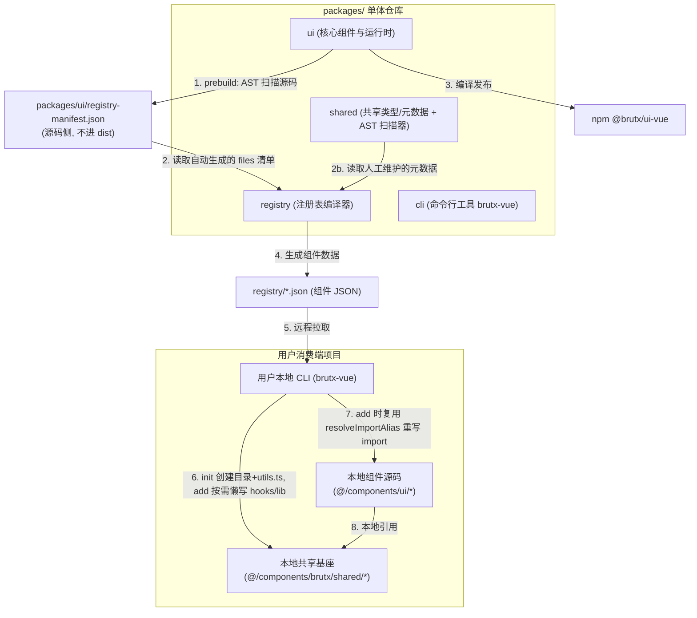

# BrutxUI (Vue 3) 项目架构优化方案

本方案针对 BrutxUI (Vue 3) Monorepo 的核心模块解耦、构建流程、CLI 源码分发机制、样式设计令牌治理以及质量保障体系，提出了一套可落地、高性能且低耦合的重构方案。

**目标 Tailwind 版本**：仅支持 Tailwind CSS v4+。v3 及更早版本不在兼容范围内，相关检测与降级逻辑应从 CLI 移除以降低维护成本。

---

## 架构总体设计

重构后的模块依赖与分发关系如下所示：



---

## 1. 模块解耦：组件文件清单自动化与 AST 静态扫描

### 现状痛点
组件物理文件映射表 `COMPONENT_FILES` 硬编码于 `packages/shared/src/component-files.ts`，包含 165+ 行手动维护的 `files`/`composables`/`directives` 字段。新增或修改组件时需要跨包同步，耦合度高且易遗漏。

> **注意**：AGENTS.md 中记载映射表位于 `packages/registry/scripts/component-files.ts`，与实际路径不符。实施前应先修正文档不一致。

### 落地方案：混合模式（AST 自动扫描 + 人工元数据维护）

**核心原则**：能用 AST 推导的字段自动化，无法推导的人工维护。完全不废弃人工元数据。

1. **复用现有 AST 提取能力**：
   `packages/registry/scripts/build-registry.ts` 已实现基于 TypeScript 编译器的 `extractModuleSpecifiers`（[build-registry.ts:335-367](file:///e:/project/brutxui-vue3/packages/registry/scripts/build-registry.ts#L335-L367)），支持静态 import、动态 `import()`、export 语句、Vue SFC `<script>` 块提取。将其抽取为 shared 包的独立工具函数，作为唯一的依赖发现入口，**禁止用正则替代**。

2. **新增 prebuild 扫描步骤**：
   在 `packages/ui` 的 `pnpm build` 流程前置 `prebuild:scan` 脚本：
   - 遍历 `packages/ui/src/components/` 的一级子目录作为组件名。
   - 对每个目录下的 `.vue`/`.ts` 文件，调用 `extractModuleSpecifiers` 解析依赖。
   - 将依赖按 `@/composables/*`、`@/lib/*`、`@/components/ui/{comp}/*` 分类，递归收集组件内部文件清单。
   - 输出 `packages/ui/registry-manifest.json`（**源码侧，不进 dist**），仅包含 AST 可推导的 `files`/`composables`/`directives` 字段。

3. **manifest 输出位置决策**：
   - ❌ 不输出到 `packages/ui/dist/`：`dist/` 是构建产物（被 gitignore），会导致 registry 构建强依赖 ui 构建，破坏当前 registry 直接读源码的松耦合架构。
   - ✅ 输出到 `packages/ui/registry-manifest.json`（源码侧），随源码提交，可被 registry 直接读取。

4. **人工元数据保留**：
   `COMPONENT_REGISTRY` 中的 `title`/`description`/`category`/`examples`/`status`/`replacement` 等字段无法从代码推导，继续在 `packages/shared` 人工维护。重构后 shared 包拆分为：
   - `component-metadata.ts`：人工维护的元数据（title/description/category 等）
   - `registry-manifest.types.ts`：AST 生成清单的类型定义
   - registry 构建时合并两者。

#### 扫描器实现要点

```typescript
// packages/shared/src/scan-component-files.ts
import { extractModuleSpecifiers } from './extract-module-specifiers.js'; // 从 registry 抽取
import { glob } from 'fast-glob';
import fs from 'node:fs';
import path from 'node:path';

interface ComponentFileManifest {
    files: string[];
    composables: string[];
    directives: string[];
    lib: string[];
}

export async function scanComponentFiles(componentsDir: string): Promise<Record<string, ComponentFileManifest>> {
    const manifest: Record<string, ComponentFileManifest> = {};
    const componentDirs = await glob('*', { cwd: componentsDir, onlyDirectories: true });

    for (const dir of componentDirs) {
        const fullDir = path.join(componentsDir, dir);
        const files = await glob('**/*', { cwd: fullDir, onlyFiles: true });

        const composables = new Set<string>();
        const lib = new Set<string>();
        const directives = new Set<string>();
        const internalFiles = new Set<string>(files);

        // 递归扫描（处理同组件内 .ts 文件间的相互引用）
        const queue = [...files];
        const visited = new Set<string>();
        while (queue.length > 0) {
            const file = queue.shift()!;
            if (visited.has(file)) continue;
            visited.add(file);
            const ext = path.extname(file);
            if (ext !== '.vue' && ext !== '.ts') continue;

            const content = fs.readFileSync(path.join(fullDir, file), 'utf-8');
            for (const specifier of extractModuleSpecifiers(content)) {
                if (specifier.startsWith('@/composables/')) {
                    composables.add(resolveExtension(specifier.slice('@/composables/'.length)));
                } else if (specifier.startsWith('@/lib/')) {
                    const name = specifier.slice('@/lib/'.length).split(/[?#]/)[0];
                    if (name !== 'utils') lib.add(resolveExtension(name));
                } else if (specifier.startsWith('@/directives/')) {
                    directives.add(specifier.slice('@/directives/'.length));
                } else if (specifier.startsWith(`@/components/ui/${dir}/`)) {
                    const rel = specifier.slice(`@/components/ui/${dir}/`.length).split(/[?#]/)[0];
                    const resolved = resolveExtension(rel);
                    if (!internalFiles.has(resolved)) {
                        internalFiles.add(resolved);
                        queue.push(resolved);
                    }
                }
            }
        }

        manifest[dir] = {
            files: Array.from(internalFiles).sort(),
            composables: Array.from(composables).sort(),
            directives: Array.from(directives).sort(),
            lib: Array.from(lib).sort(),
        };
    }
    return manifest;
}
```

---

## 2. 构建流水线：保留 preserveModules + 用 magic-string 替代正则重写

### 现状痛点
`packages/ui/vite.config.ts` 的 `flattenPreserveModulesPlugin` 用正则纠偏 `preserveModules` 输出的嵌套路径（`dist/packages/ui/src/...`），并处理 Vue 虚拟模块（`_virtual/_plugin-vue_export-helper`）。正则方案在打包工具升级、虚拟模块名变更时极易失效。

### 落地方案决策

**决策：保留 `preserveModules` 输出模式，用 magic-string 替代正则重写。**

放弃"改用多入口 bundle + exports 子路径代理"的方案，理由：
- 当前 100+ 组件，多入口 bundle 会导致构建时间爆炸（每个入口重复打包共享模块）。
- `preserveModules` 利于消费端 tree-shaking，是组件库的合理选择。
- 现有正则重写的真正问题不是"该不该重写"，而是"用正则不稳健"。改用 AST 级别的 magic-string 即可。

**不采用 `exports` 子路径代理的原因**：
- 100+ 组件 × 3 套（types/import/require）= 300+ 声明，维护成本高。
- `preserveModules` 输出按源码文件名（`Button.js` 而非 `index.js`），与 exports 期望的入口约定不匹配，强行对齐需大改输出结构。
- 主入口 `index.js` 已通过 `package.json` 的 `main`/`module`/`types` 暴露，子路径消费场景有限。

### 重写实现

用 `magic-string` 替代 [preserve-modules-paths.ts](file:///e:/project/brutxui-vue3/packages/ui/src/lib/preserve-modules-paths.ts) 的正则方案：

```typescript
// packages/ui/src/lib/flatten-preserve-modules.ts
import MagicString from 'magic-string';
import { parse } from 'acorn';
import { simple } from 'acorn-walk';

const SOURCE_PREFIX = './packages/ui/src/';
const JS_EXTENSIONS = new Set(['.js', '.cjs', '.mjs']);

export function rewriteFlattenedChunkImports(content: string, filePath: string, distDir: string): string {
    const s = new MagicString(content);

    // 1. 替换源码前缀引用
    s.replaceAll(SOURCE_PREFIX, './');

    // 2. 用 AST 精确定位 import/export 语句中的相对路径
    const ast = parse(content, { ecmaVersion: 'latest', sourceType: 'module' });
    const distRootPrefix = getDistRootPrefix(filePath, distDir);

    simple(ast, {
        ImportDeclaration(node) {
            rewriteSpecifier(s, node.source, distRootPrefix);
        },
        ExportNamedDeclaration(node) {
            if (node.source) rewriteSpecifier(s, node.source, distRootPrefix);
        },
        ExportAllDeclaration(node) {
            rewriteSpecifier(s, node.source, distRootPrefix);
        },
        ImportExpression(node) {
            if (node.source.type === 'Literal') {
                rewriteSpecifier(s, node.source, distRootPrefix);
            }
        },
    });

    return s.toString();
}

function rewriteSpecifier(s: MagicString, sourceNode: { type: string; value: string; start: number; end: number }, distRootPrefix: string): void {
    const value = sourceNode.value;
    // 处理 ../_virtual/ 和 ../node_modules/ 等跨目录引用
    if (/^(\.\.\/)+(_virtual|node_modules)\//.test(value)) {
        const rewritten = value.replace(/^(\.\.\/)+/, distRootPrefix);
        s.overwrite(sourceNode.start, sourceNode.end, `"${rewritten}"`);
    }
    // 处理 Vue export-helper 虚拟模块
    else if (/_virtual\/_plugin-vue_export-helper\.(js|cjs|mjs)$/.test(value)) {
        const prefix = distRootPrefix || '.';
        const rewritten = `${prefix}/_virtual/_plugin-vue_export-helper.${value.match(/\.(\w+)$/)![1]}`;
        s.overwrite(sourceNode.start, sourceNode.end, `"${rewritten}"`);
    }
}
```

**优势**：
- AST 精确定位 import/export，不会误伤字符串字面量、注释、模板字符串。
- magic-string 的 sourcemap 支持利于调试。
- 保留现有 `preserveModules` 输出结构，零破坏性变更。

---

## 3. 依赖分发：CLI 共享基座 + 扩展 resolveImportAlias

### 现状痛点
brutx 的 composables（`useLocale`/`useReducedMotion`/`useClipboard` 等）被写入用户项目的 `src/composables/`，**与用户自有 composables 混杂**，命名冲突风险高、归属不清、升级时难以区分。

虽然 CLI [add-service.ts:62-103](file:///e:/project/brutxui-vue3/packages/cli/src/lib/services/add-service.ts#L62-L103) 的 `resolveComponentFilePath` 已将 composables 解析到统一路径并去重写入（不存在磁盘冗余），但混杂问题依然存在。

### 落地方案：共享基座隔离 + 复用现有 resolveImportAlias

1. **CLI `init` 阶段（创建共享基座骨架）**：
   用户运行 `brutx-vue init` 时，仅创建隔离的共享目录骨架并写入通用依赖 `utils.ts`（几乎所有组件都引用 `cn()`），**不预写 hooks/lib 文件**：
   ```
   src/components/brutx/shared/
   └── utils.ts          ← init 时写入（通用依赖）
   ```
   `components.json` 新增 `sharedBase` 字段记录该路径，默认值 `@/components/brutx/shared`。

   **懒写策略**：hooks/ 和 lib/ 文件在 `add` 阶段按需写入——仅当用户添加的组件依赖某个 composable 或 lib 文件时，[add-service.ts](file:///e:/project/brutxui-vue3/packages/cli/src/lib/services/add-service.ts) 的 `resolveComponentFilePath` 才将该文件写入 `${sharedBase}/hooks/` 或 `${sharedBase}/lib/`。这避免了 init 时写入用户尚未使用的文件，保持共享目录精简。最终目录结构（添加多个组件后）：
   ```
   src/components/brutx/shared/
   ├── hooks/            ← add 时按需懒写
   │   ├── useLocale.ts
   │   ├── useReducedMotion.ts
   │   └── ... (见下方共享范围清单)
   ├── lib/              ← add 时按需懒写
   │   ├── env.ts
   │   └── brutal-interaction-variants.ts
   └── utils.ts          ← init 时写入
   ```

2. **CLI `add` 阶段（扩展 resolveImportAlias 重写 import）**：
   **复用现有 [resolveImportAlias](file:///e:/project/brutxui-vue3/packages/cli/src/lib/project.ts#L258)**（已用 AST `parseModuleImports` 精确重写 `@/` 别名），扩展其重写规则：
   - `@/composables/{name}` → `${sharedBase}/hooks/{name}`
   - `@/lib/{name}`（非 utils）→ `${sharedBase}/lib/{name}`
   - `@/lib/utils` → `${sharedBase}/utils`
   - `@/locales/*`、`@/directives/*` 保持现有行为（仍写入用户目录）

   **禁止新写正则方案**。现有 AST 实现已处理 Vue SFC、动态 import，是新方案的基础。

3. **共享范围清单**（明确标准，避免实施时反复）：
   以下 composables 归属共享基座（被 2+ 组件引用，或为通用 runtime 基础设施）：
   - `useLocale`（国际化，几乎所有交互组件引用）
   - `useReducedMotion`（A11y，动画组件引用）
   - `useClipboard`（剪贴板，复制类组件引用）
   - `useThrottle`（节流，Backtop 等引用）
   - `useMessage`、`useToast`（全局消息，跨组件共享状态）

   以下 composables **不纳入**共享基座（组件特有逻辑，保留在组件 JSON 内）：
   - `useDataTableSort`/`useDataTableFilter`/`useDataTableSelection`/`useDataTablePagination`（DataTable 专有）
   - `useColorHistory`（ColorPicker 专有）
   - `useAudioEngine`（HardcoreInput 专有）
   - `useCanvasInteraction`（ScratchCard 专有）
   - `useTransferPanelSelection`（Transfer 专有）

   判定标准：composable 是否被多个组件复用，或是否为项目级 runtime 基础设施。新增 composable 时由 PR review 决定归属。

#### resolveImportAlias 扩展要点

```typescript
// packages/cli/src/lib/project.ts (扩展现有函数)
export function resolveImportAlias(content: string, config: BrutalistConfig): string {
    const sharedBase = config.sharedBase ?? '@/components/brutx/shared';
    const composablesAlias = `${sharedBase}/hooks`;
    const libAlias = `${sharedBase}/lib`;
    const utilsAlias = `${sharedBase}/utils`;
    // ... 复用现有 parseModuleImports AST 遍历逻辑
    // 重写规则按上述映射执行
}
```

---

## 4. 样式体系：Tailwind v4 设计令牌治理

### 范围说明
本方案**仅支持 Tailwind CSS v4+**，不再讨论 v3 兼容。现有 CLI 中的 `detectTailwindVersion` 及 v3 分支应移除，简化为 v4-only 流程。

### 现状痛点
1. **@theme 变量与 CVA 类名一致性缺乏审计**：[styles.css](file:///e:/project/brutxui-vue3/packages/ui/src/styles.css) 定义了 `--border-width-3`、`--color-brutal-*` 等变量，但 CVA 中使用的 `border-3`、`border-brutal`、`shadow-brutal` 等类名是否与 @theme 完全对齐，无系统性校验。
2. **CSS 变量 fallback 覆盖率不明**：部分文件（如 [brutx-prism.css:95](file:///e:/project/brutxui-vue3/packages/ui/src/components/code-block/brutx-prism.css#L95)）已有 `var(--brutal-border-width, 3px)` fallback，但覆盖率未审计，存在遗漏点。
3. **设计令牌无单一数据源**：@theme 变量、CSS 变量 fallback 值、registry JSON 的 `cssVars` 字段三处分别维护，易不一致。

### 落地方案

1. **建立设计令牌单一数据源**：
   新增 `packages/shared/src/design-tokens.ts`（置于 shared 包以避免 registry → ui 的跨包依赖），作为所有设计令牌的唯一来源：
   ```typescript
   export const BASE_THEME: Record<ThemeMode, ThemeTokens> = {
       light: {
           borderWidth: '3px', borderColor: '#000000',
           shadowOffsetX: '4px', shadowOffsetY: '4px', shadowColor: '#000000',
           radius: '0px', pressedOffset: '2px',
           bg: '#ffffff', fg: '#000000', primary: '#FF6B6B',
           // ... 完整色板（light + dark 双模式）
       },
       dark: { /* ... */ },
   };
   ```
   - `styles.css` 的 `@theme`（含 fallback，取 `BASE_THEME.light`）与 `:root`/`.dark`（纯运行时值）均由 `packages/ui/scripts/generate-styles-tokens.ts` 在 `pnpm prebuild:tokens` 时构建时注入。
   - registry JSON 的 `cssVars` 字段从该文件生成。
   - `@theme` 中的 fallback 值与 CSS utility 中的 fallback 值均源自 `BASE_THEME.light`，消除硬编码漂移。

2. **fallback 覆盖率审计与补全**：
   编写审计脚本扫描所有 `.css`/`.vue` 文件中的 `var(--brutal-*)` 引用，校验是否带 fallback。CI 门禁：新增无 fallback 的 `var(--brutal-*)` 引用将报错。

3. **CVA 类名与 @theme 一致性校验**：
   编写测试，扫描所有 `*-variants.ts` 中使用的设计类名（如 `border-3`、`shadow-brutal`），校验对应的 @theme 变量是否存在。

4. **移除 v3 残留**：
   - 移除 [init-service.ts:114-118](file:///e:/project/brutxui-vue3/packages/cli/src/lib/services/init-service.ts#L114-L118) 的 v3 分支（`@tailwind base/components/utilities`），统一为 `@import "tailwindcss";`。
   - 移除 `detectTailwindVersion` 函数及相关调用。
   - 移除 [build-registry.ts](file:///e:/project/brutxui-vue3/packages/registry/scripts/build-registry.ts) 中 `TAILWIND_CONFIG` 的 v3 theme.extend 结构，仅保留 v4 @theme 变量。

---

## 5. 测试与质量体系：分层策略与 A11y 校验

### 现状痛点
传统单测运行在 HappyDOM 虚拟环境（[vitest.config.ts:15](file:///e:/project/brutxui-vue3/packages/ui/vitest.config.ts#L15)），无法对高视觉依赖的 Neo-Brutalist 风格进行样式、描边和阴影定位的回归校验。

### 落地方案：分层测试策略

**与 AGENTS.md 约定对齐**：[AGENTS.md](file:///e:/project/brutxui-vue3/AGENTS.md) 明确"禁止在开发机上运行重型测试"。因此采用分层策略：

| 层级 | 环境 | 运行时机 | 覆盖范围 |
|------|------|---------|---------|
| L1 单元测试 | happy-dom | 本地 `pnpm test` + CI | 组件逻辑、props、事件、a11y 属性 |
| L2 交互测试 | browser mode | **仅 CI**，本地不跑 | 关键交互（拖拽、键盘导航、滚动定位） |
| L3 视觉回归 | browser mode + image-snapshot | **仅 CI，可选** | Neo-Brutalist 样式（描边、阴影、抖动） |

1. **L1 单元测试（保持现状）**：
   继续用 happy-dom，覆盖组件逻辑、props、事件、a11y 属性。本地开发默认运行此层。

2. **L2 交互测试（新增，仅 CI）**：
   对关键交互组件（Cascader、DataTable、Transfer、TreeSelect 等复杂组件）新增 browser mode 测试，配置独立的 `vitest.browser.config.ts`，仅在 CI 流程中触发：
   ```bash
   # CI 中
   pnpm test              # L1
   pnpm test:browser      # L2，仅 CI
   ```
   本地 `pnpm test` 不触发 browser mode，避免资源消耗。

3. **L3 视觉回归（可选，需快照管理流程）**：
   使用 `vitest-image-snapshot` 对关键渲染状态截图比对。**实施前提**：
   - 明确快照更新流程（`--update-snapshots` 仅由维护者执行）。
   - 设置像素差异阈值（如 0.1%），避免抗锯齿差异导致 flaky。
   - 快照按操作系统分组（Windows/Linux/macOS 字体渲染差异）。
   - 仅对 5-10 个核心视觉组件（Button、Card、GlitchText、Spinner 等）启用，不全面铺开。

### A11y Reduced Motion 校验

基于项目已有的 [useReducedMotion](file:///e:/project/brutxui-vue3/packages/ui/src/composables/useReducedMotion.ts) composable，在 browser mode 下用 `emulateMedia` 真实触发媒体查询。**禁止用 mock `window.matchMedia` 的方式**——mock JS 不影响 CSS 媒体查询驱动的样式计算，会导致断言 `getComputedStyle().animationName` 失效。

```typescript
import { mount } from '@vue/test-utils';
import { page } from '@vitest/browser/context';
import GlitchText from './GlitchText.vue';

test('should disable animations when prefers-reduced-motion is active', async () => {
    // browser mode 下真实触发媒体查询，影响 CSS 引擎
    await page.emulateMedia({ reducedMotion: 'reduce' });

    const wrapper = mount(GlitchText, {
        props: { text: 'BrutxUI' },
    });

    const element = wrapper.find('.glitch-container').element;
    const computed = window.getComputedStyle(element);
    // 此时 CSS 媒体查询已生效，animation 会被覆写
    expect(computed.animationName).toBe('none');

    // 同时校验 useReducedMotion composable 的响应式返回值
    await page.emulateMedia({ reducedMotion: 'no-preference' });
    expect(computed.animationName).not.toBe('none');
});
```

**注意**：此测试属于 L2，仅 CI 运行。L1 单测中对 `useReducedMotion` 的逻辑测试可继续用 happy-dom + vi.mock。

---

## 6. 渐进式实施

按风险/收益排序，分三阶段：

**P0（低风险高收益，先行）**：
- 修正 AGENTS.md 中 component-files 路径不一致
- 移除 v3 兼容残留代码（detectTailwindVersion、v3 CSS 分支）
- 建立设计令牌单一数据源 `design-tokens.ts`
- fallback 覆盖率审计脚本 + CI 门禁
- 修正 L1 单测中 useReducedMotion 的测试方式

**P1（中风险，核心改造）**：
- 从 registry 抽取 `extractModuleSpecifiers` 到 shared 包
- 实现 prebuild AST 扫描，生成 `registry-manifest.json`
- `COMPONENT_FILES` 的 files/composables/directives 字段改为读取 manifest，人工元数据保留
- 实现 CLI 共享基座（init 创建目录+utils.ts，add 懒写 hooks/lib + resolveImportAlias 扩展）

**P2（较高风险，基础设施）**：
- 用 magic-string 替代正则重写 `flattenPreserveModulesPlugin`
- 新增 L2 交互测试（browser mode，仅 CI）
- 评估并按需引入 L3 视觉回归（快照管理流程就绪后）

**每个阶段独立验证、独立发布**，避免大爆炸式重构。P0 完成并稳定后再启动 P1，P1 完成后再启动 P2。

### 工时估算（粗略）

| 阶段 | 估算 | 说明 |
|------|------|------|
| P0 | 2-3 人日 | 文档修正 + v3 清理 + 令牌数据源 |
| P1 | 7-10 人日 | AST 扫描器 + 共享基座 |
| P2 | 5-8 人日 | magic-string 重写 + L2 测试基建 |
