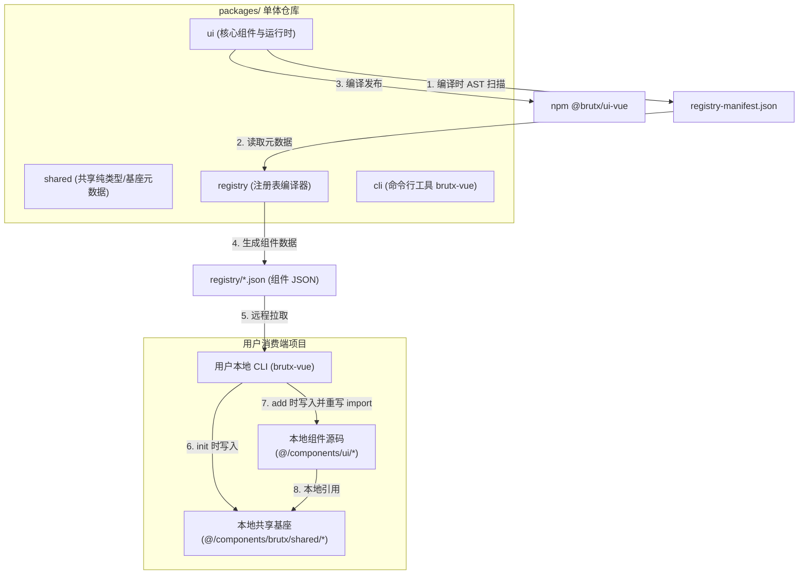

# BrutxUI (Vue 3) 项目架构优化方案

本方案针对 BrutxUI (Vue 3) Monorepo 的核心模块解耦、构建流程、CLI 源码分发机制、样式多版本兼容以及质量保障体系，提出了一套可落地、高性能且低耦合的重构方案。

---

## 架构总体设计

重构后的模块依赖与分发关系如下所示：



---

## 1. 模块解耦：组件元数据本地化与 AST 静态扫描

### 现状痛点
组件物理文件映射表 `COMPONENT_FILES` 硬编码于 `packages/shared/src/component-files.ts` 中，导致添加或修改组件时需要跨包修改，耦合度高。

### 落地方案
1. **废弃手动配置**：删除 `packages/shared/src/component-files.ts` 中的 `COMPONENT_FILES` 硬编码。
2. **自动扫描提取**：
   在 `packages/ui` 构建流程（`pnpm build`）中，引入 `prebuild` 静态扫描机制：
   - 遍历 `packages/ui/src/components/` 的一级子目录作为组件名。
   - 收集各组件目录下的所有 `.vue`、`.ts`、`.css` 文件。
   - 解析组件源文件中的 `import` 关系。若匹配到 `@/composables/*`、`@/lib/*` 或其他组件，自动将其标记为该组件的本地依赖项或注册表依赖。
   - 输出统一的静态元数据清单 `packages/ui/dist/registry-manifest.json`。
3. **注册表消费**：
   `packages/registry` 编译脚本直接读取 `packages/ui/dist/registry-manifest.json` 作为数据源，自动打包构建出各组件的 JSON。

#### AST 提取器伪代码
```typescript
import { parse } from '@vue/compiler-sfc';
import glob from 'fast-glob';
import fs from 'node:fs';
import path from 'node:path';

interface ComponentMeta {
    files: string[];
    composables: string[];
    lib: string[];
    dependencies: string[];
}

export async function generateManifest(componentsDir: string): Promise<Record<string, ComponentMeta>> {
    const manifest: Record<string, ComponentMeta> = {};
    const componentDirs = await glob('*', { cwd: componentsDir, onlyDirectories: true });

    for (const dir of componentDirs) {
        const fullDir = path.join(componentsDir, dir);
        const allFiles = await glob('**/*', { cwd: fullDir, onlyFiles: true });
        
        const composables = new Set<string>();
        const lib = new Set<string>();
        const dependencies = new Set<string>();

        for (const file of allFiles) {
            const ext = path.extname(file);
            if (ext === '.vue' || ext === '.ts') {
                const content = fs.readFileSync(path.join(fullDir, file), 'utf-8');
                let code = content;

                if (ext === '.vue') {
                    const { descriptor } = parse(content);
                    code = descriptor.scriptSetup?.content || descriptor.script?.content || '';
                }

                // 提取 "@/composables/useXXX"
                const composableMatches = code.matchAll(/@\/composables\/(use[A-Za-z0-9_]+)/g);
                for (const match of composableMatches) {
                    composables.add(`${match[1]}.ts`);
                }

                // 提取 "@/lib/XXX"
                const libMatches = code.matchAll(/@\/lib\/([A-Za-z0-9_-]+)/g);
                for (const match of libMatches) {
                    if (match[1] !== 'utils') { // 排除通用的 utils
                        lib.add(`${match[1]}.ts`);
                    }
                }
            }
        }

        manifest[dir] = {
            files: allFiles,
            composables: Array.from(composables),
            lib: Array.from(lib),
            dependencies: Array.from(dependencies)
        };
    }
    return manifest;
}
```

---

## 2. 构建流水线：采用 Exports 子路径代理与规范化打包

### 现状痛点
打包时使用自定义的正则匹配物理重写相对路径（如纠偏 `dist/packages/ui/src/...` 中的导入关系），极易因打包工具升级、虚拟模块变更或复杂引入逻辑导致正则失效。

### 落地方案
**废弃正则重写，完全利用 Node.js / Bundler 的 `exports` 特性实现子路径代理。**

1. **保持镜像结构**：打包输出时，保留 Rollup 原生的镜像输出目录结构，组件打包输出至 `dist/components/[component]/index.[js|cjs]`。
2. **声明代理导出**：
   在 `packages/ui/package.json` 中，通过 `exports` 细粒度声明外部引用的解析规则：
   ```json
   {
     "name": "@brutx/ui-vue",
     "exports": {
       "./button": {
         "types": "./dist/components/button/index.d.ts",
         "import": "./dist/components/button/index.js",
         "require": "./dist/components/button/index.cjs"
       },
       "./input": {
         "types": "./dist/components/input/index.d.ts",
         "import": "./dist/components/input/index.js",
         "require": "./dist/components/input/index.cjs"
       }
     }
   }
   ```
3. **优势**：
   - 依赖底座自带的相对引用在构建时直接由 Vite/Rollup 保持一致，无需人为篡改源码。
   - 保持与 Node.js 现代模块解析标准（ESM）的完全兼容。

---

## 3. 依赖分发：CLI 安装时路径重写（本地共享基座）

### 现状痛点
分发组件源码时，每个组件重复携带通用 runtime 依赖（如 `useLocale`、`useGlitchEffect` 等），造成本地项目代码冗余并引发升级冲突。

### 落地方案
采用 **“CLI 自动分发共享基座 + 写入时路径重写”** 方案，在消除代码冗余的同时，坚守零运行时第三方 npm 依赖的核心优势。

1. **CLI `init` 阶段（创建共享基座）**：
   - 用户运行 `brutx-vue init` 时，CLI 不仅写入 `lib/utils.ts`，还将公共 runtime 基础文件一并写入用户指定的共享目录（默认为 `@/components/brutx/shared/`）：
     - `hooks/useLocale.ts`
     - `hooks/useReducedMotion.ts`
     - `lib/env.ts`
2. **CLI `add` 阶段（动态重写 Import 路径）**：
   - 用户运行 `brutx-vue add button` 时，CLI 下载包含源码的 JSON 文件。
   - 在将组件源码写入到用户磁盘之前，CLI 自动遍历源文件代码，将通用的导入路径重写为用户本地配置的共享基座路径。
   
#### 写入时重写逻辑示例
```typescript
// 转换函数
export function rewriteImportsForClient(
    sourceCode: string, 
    sharedAliasPath: string // 例如 "@/components/brutx/shared"
): string {
    let code = sourceCode;
    // 1. 重写公共 composables
    code = code.replace(
        /@\/composables\/(use[A-Za-z0-9_]+)/g,
        `${sharedAliasPath}/hooks/$1`
    );
    // 2. 重写公共 lib
    code = code.replace(
        /@\/lib\/(?!utils)([A-Za-z0-9_-]+)/g,
        `${sharedAliasPath}/lib/$1`
    );
    return code;
}
```

---

## 4. 样式体系：Tailwind CSS v3 / v4 双向兼容设计

### 现状痛点
核心组件基于 Tailwind v4 标准设计，移除了 `tailwind.config.js`，完全依赖 `@theme` 变量。老旧 v3 项目无法直接兼容，导致引入后样式崩溃。

### 落地方案
1. **组件层：CVA 降级设计（Fallback Values）**：
   在编写组件或配置 `cva` 时，对关键的 Brutalist 样式设计默认的回退机制，确保在无变量声明的项目中组件外观不至于发生剧烈崩溃。
   ```css
   border: var(--brutal-border-width, 3px) solid var(--brutal-border-color, #000000);
   box-shadow: var(--brutal-shadow-offset, 4px) var(--brutal-shadow-offset, 4px) 0px var(--brutal-shadow-color, #000000);
   ```
2. **CLI 探测层（Tailwind 版本适配）**：
   当执行 `brutx-vue init` 时，读取项目依赖环境：
   - **若为 Tailwind v3**：
     检测 `tailwind.config.js`，通过 AST 修改或生成补充配置，将 `theme.extend` 扩充。例如：
     ```javascript
     // 注入到 tailwind.config.js 的配置垫片
     module.exports = {
       theme: {
         extend: {
           borderWidth: { 'brutal': '3px' },
           boxShadow: { 'brutal': '4px 4px 0px #000000' },
           colors: {
             'brutal-bg': '#ffffff',
             'brutal-muted': '#f4f4f5'
           }
         }
       }
     }
     ```
   - **若为 Tailwind v4**：
     向项目的主入口 CSS 文件中自动追加 `@theme` 变量扩展：
     ```css
     @theme {
       --color-brutal-bg: #ffffff;
       --color-brutal-muted: #f4f4f5;
       --border-width-brutal: 3px;
       --shadow-brutal: 4px 4px 0px #000000;
     }
     ```

---

## 5. 测试与质量体系：真浏览器快照与无障碍可访问性

### 现状痛点
传统单测运行在 HappyDOM / JSDOM 虚拟环境中，无法对高视觉依赖的 Neo-Brutalist 风格进行样式、描边和阴影定位的回归校验。

### 落地方案
1. **升级到 Vitest Browser Mode**：
   测试中涉及核心交互、阴影、定位的组件，切换至真浏览器环境中运行：
   - 依赖 `vitest-image-snapshot` 对关键渲染状态进行截图对比。
   - 在本地或 CI 流程中，自动与 `stable` 分支的预设基准快照图进行像素比对。
2. **Reduced Motion 自动化用例校验**：
   对含有强视觉抖动或动画的组件（如 `GlitchText`），针对 A11y 进行自动化门禁校验：
   ```typescript
   import { mount } from '@vue/test-utils';
   import GlitchText from './GlitchText.vue';

   test('should disable animations when prefers-reduced-motion is active', async () => {
       // 模拟 prefers-reduced-motion 媒体查询
       window.matchMedia = vi.fn().mockImplementation(query => ({
           matches: query === '(prefers-reduced-motion: reduce)',
           media: query,
           onchange: null,
           addListener: vi.fn(),
           removeListener: vi.fn(),
       }));

       const wrapper = mount(GlitchText, {
           props: { text: 'BrutxUI' }
       });

       const element = wrapper.find('.glitch-container');
       // 断言动画已被覆写或消除
       expect(window.getComputedStyle(element.element).animationName).toBe('none');
   });
   ```
