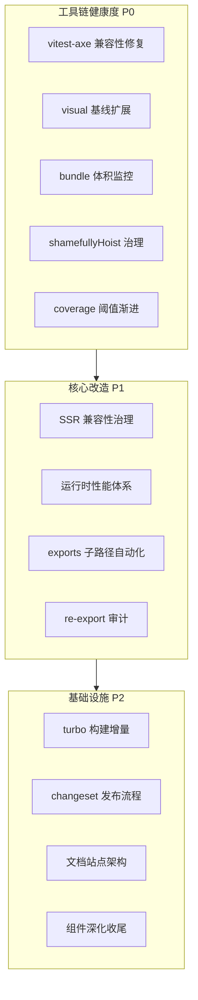

# BrutxUI (Vue 3) 项目架构优化方案 v2

本方案是 [v1 方案](./ARCHITECTURE_OPTIMIZATION_PLAN.md) 的延续，而非替代。v1 的 P0/P1/P2 几乎全部已落地（含 magic-string 重写、L2/L3 测试、CLI 共享基座、设计令牌单一数据源、fallback 审计 CI 门禁等），v2 基于对当前代码库的逐文件核实，识别 v1 未覆盖的新痛点，并提出下一阶段演进方向。

**目标 Tailwind 版本**：仅支持 Tailwind CSS v4+（与 v1 一致，已落地）。

---

## v1 落地核实

下表为对 v1 方案各章节的逐项核实结果，证据均来自直接读取源码：

| v1 章节 | v1 状态 | 落地证据 |
| --- | --- | --- |
| 1. AST 扫描器 | ✅ 已落地 | [prebuild-scan.ts](../packages/ui/scripts/prebuild-scan.ts) + [scan-component-files.ts](../packages/shared/src/scan-component-files.ts)，已接入 `pnpm build` 的 `prebuild:scan` |
| 2. magic-string 重写 | ✅ 已落地 | [preserve-modules-paths.ts](../packages/ui/src/lib/preserve-modules-paths.ts) 已使用 `MagicString` + `acorn` AST + `acorn-walk`，处理 ImportDeclaration/ExportNamedDeclaration/ExportAllDeclaration/ExportDefaultDeclaration/ImportExpression/`require()` CallExpression，处理 `_virtual/_plugin-vue_export-helper` 与 `../_virtual/`、`../node_modules/` 跨目录引用。仅文件名未改为 `flatten-preserve-modules.ts` |
| 3. CLI 共享基座 | ✅ 已落地 | [init-service.ts](../packages/cli/src/lib/services/init-service.ts) `ProjectInitializationSettings.sharedBase` + `components.json` 写入；[add-service.ts](../packages/cli/src/lib/services/add-service.ts) 懒写 hooks/lib；[project.ts](../packages/cli/src/lib/project.ts) `resolveImportAlias` 仍用 AST 重写 |
| 4. 设计令牌单一数据源 | ✅ 已落地 | [design-tokens.ts](../packages/shared/src/design-tokens.ts) `BASE_THEME` light/dark 双模式 28 字段；[styles.css](../packages/ui/src/styles.css) `@theme`（含 fallback，`@brutx:theme-tokens` 标记）+ `:root`/`.dark`（`@brutx:root-tokens` 标记）；[generate-styles-tokens.ts](../packages/ui/scripts/generate-styles-tokens.ts) 构建时注入 |
| 4. fallback 覆盖率审计 | ✅ 已落地 | [audit-brutal-fallback.ts](../packages/ui/scripts/audit-brutal-fallback.ts) 扫描所有 `.css`/`.vue` 的 `var(--brutal-*)`，支持 `--update-baseline`/`--check-baseline`，CI 门禁已接入 [ci.yml:67-68](../.github/workflows/ci.yml#L67-L68) |
| 4. 移除 v3 残留 | ✅ 已落地 | [styles.css:1](../packages/ui/src/styles.css#L1) `@import "tailwindcss";` v4 写法；[init-service.ts:116](../packages/cli/src/lib/services/init-service.ts#L116) 同样为 v4 写法；无 `@tailwind base/components/utilities`、无 `detectTailwindVersion` |
| 5. L1 单元测试 | ✅ 已落地 | [vitest.config.ts](../packages/ui/vitest.config.ts) happy-dom，coverage 阈值 lines/functions 60、branches 50 |
| 5. L2 交互测试 | ✅ 已落地 | [vitest.browser.config.ts](../packages/ui/vitest.browser.config.ts) playwright + chromium；`useReducedMotion.browser.test.ts`、`GlitchText.browser.test.ts` 等用例；CI 已接入 [ci.yml:82-83](../.github/workflows/ci.yml#L82-L83) |
| 5. L3 视觉回归 | ✅ 已落地 | [playwright.config.ts](../packages/ui/playwright.config.ts) + [visual/tests/core.spec.ts](../packages/ui/visual/tests/core.spec.ts) + `visual/baselines/` 6 张基线；CI 已接入 [ci.yml:85-86](../.github/workflows/ci.yml#L85-L86)；[update-visual-baselines.yml](../.github/workflows/update-visual-baselines.yml) 独立基线更新工作流 |
| 5. A11y 校验 | ✅ 已落地 | [test-utils/a11y.ts](../packages/ui/src/test-utils/a11y.ts) `expectNoA11yViolations` 基于 axe-core；[accessibility.test.ts](../packages/ui/src/components/accessibility.test.ts) |
| 6. P0/P1/P2 | ✅ 几乎全部落地 | 见上 |

**结论**：v1 方案已无实质未完成项。v2 不再重复 v1 内容，仅聚焦 v1 未覆盖的新方向。

---

## v2 架构总体设计

v2 聚焦"v1 之后的下一阶段张力"，按风险/收益分三层：



---

## 1. 工具链健康度：测试与产物基础设施修复

### 现状痛点

1. **vitest-axe 与 Vitest 4.x 类型不兼容**：[test-utils/a11y.ts:6-9](../packages/ui/src/test-utils/a11y.ts#L6-L9) FIXME 标注 `vitest-axe ^0.1.0` 的 4 个 module augmentation 无法覆盖 Vitest 4.x 的 `expect` 类型，导致 `toHaveNoViolations` matcher 在类型系统中不可见，下方 `expect(results) as unknown as { toHaveNoViolations: () => void }` 使用强转绕过。这是 v1 落地 L1 a11y 测试时遗留的技术债。

2. **visual 回归覆盖度有限**：[visual/tests/core.spec.ts:4](../packages/ui/visual/tests/core.spec.ts#L4) 仅 4 个 suite（`forms`/`overlays`/`feedback`/`containers`）× 2 主题 = 8 张截图，按类别分组截图。v1 方案第 5 章明确建议"仅对 5-10 个核心视觉组件（Button、Card、GlitchText、Spinner 等）启用"，当前是按类别分组而非核心组件单独基线，定位视觉漂移时粒度过粗。

3. **bundle 体积无监控**：[package.json](../packages/ui/package.json) `devDependencies` 无 `size-limit`/`bundlewatch`/`@size-limit/preset-small-lib` 等工具，无包体积基准与 CI 门禁。100+ 组件的库在主入口 `index.ts` 全量 re-export，体积漂移无感知。

4. **shamefullyHoist 历史遗留**：[pnpm-workspace.yaml:4](../pnpm-workspace.yaml#L4) `shamefullyHoist: true` 是为了兼容旧版工具的折衷，但会破坏 pnpm 的依赖隔离优势，导致 phantom dependency 风险（包意外访问未声明的依赖）。在 monorepo 中尤其危险——子包可能访问到兄弟包的依赖。

5. **coverage 阈值偏低**：[vitest.config.ts:42-46](../packages/ui/vitest.config.ts#L42-L46) lines/functions 60、branches 50。当前组件库已稳定，阈值可渐进提升。

### 落地方案

#### 1.1 vitest-axe 兼容性修复

**决策：升级或切换社区 fork，移除强转。**

```typescript
// packages/ui/src/test-utils/a11y.ts（修复后）
import { axe } from '../vitest.setup'

export async function expectNoA11yViolations(
    component: Component,
    options?: Record<string, unknown>,
) {
    vi.useRealTimers()
    const wrapper = mount(component, options as unknown as Parameters<typeof mount>[1])
    try {
        const results = await axe(wrapper.element)
        // 修复后：vitest-axe 升级到兼容 Vitest 4.x 的版本，
        // expect 类型 augmentation 生效，无需强转
        expect(results).toHaveNoViolations()
        return wrapper
    } finally {
        wrapper.unmount()
    }
}
```

**实施步骤**：
- 调研 `vitest-axe` 上游是否已发版支持 Vitest 4.x（检查 GitHub release）。
- 若已发版：升级 + 移除强转 + 删除 FIXME。
- 若未发版：评估切换到 `@vitest/browser` + `axe-core` 直接调用（绕过 vitest-axe 包装层），或临时 fork。
- **禁止**：长期保留强转，会掩盖未来 a11y matcher 的类型变化。

#### 1.2 visual 回归基线扩展

**决策：保留类别 suite 作为粗粒度回归，新增核心组件单独基线。**

```typescript
// packages/ui/visual/tests/core.spec.ts（扩展后）
const suites = ['forms', 'overlays', 'feedback', 'containers'] as const
const themes = ['light', 'dark'] as const
// 新增：核心组件单独基线（v1 建议的 5-10 个）
const coreComponents = ['button', 'card', 'glitch-text', 'spinner', 'badge'] as const

for (const component of coreComponents) {
    for (const theme of themes) {
        test(`core:${component} ${theme}`, async ({ page }) => {
            await page.goto(`${visualBaseUrl}/?component=${component}&theme=${theme}`)
            // ... 同现有逻辑
            await expect(page.locator('.visual-component')).toHaveScreenshot([`core-${component}-${theme}.png`])
        })
    }
}
```

**配套**：
- `visual/App.vue` 需支持 `?component=` query 参数渲染单个组件。
- 基线文件 `visual/baselines/core-{component}-{theme}.png` 由维护者通过 `pnpm test:visual:update` 生成。
- **不全面铺开**：仅核心视觉组件单独基线，避免维护成本爆炸。

#### 1.3 bundle 体积监控

**决策：引入 `size-limit` + CI 门禁。**

```json
// packages/ui/package.json（新增）
{
    "devDependencies": {
        "size-limit": "^11.0.0",
        "@size-limit/file": "^11.0.0",
        "@size-limit/webpack": "^11.0.0"
    },
    "size-limit": [
        {
            "name": "main entry (ESM, full)",
            "path": "dist/index.js",
            "limit": "150 KB",
            "import": "*"
        },
        {
            "name": "Button (tree-shaken)",
            "path": "dist/index.js",
            "limit": "20 KB",
            "import": "{ Button }"
        },
        {
            "name": "CSS",
            "path": "dist/styles.css",
            "limit": "50 KB"
        }
    ],
    "scripts": {
        "size": "size-limit",
        "size:why": "size-limit --why"
    }
}
```

**CI 集成**：在 [ci.yml](../.github/workflows/ci.yml) 的 `build` 之后新增 `pnpm --filter brutx-ui-vue size` 步骤，体积超限报错。

**禁止**：用 `bundlesize`（已停止维护）或自研脚本。

#### 1.4 shamefullyHoist 治理

**决策：先审计依赖，再评估移除。**

`shamefullyHoist: true` 不能直接删除——可能有包依赖此行为。落地步骤：

1. **审计阶段**：在 `shamefullyHoist: false` 下执行 `pnpm install` + `pnpm -r build` + `pnpm -r test`，收集失败点。
2. **修复阶段**：对每个失败点，要么在失败包的 `package.json` 显式声明缺失依赖，要么向 upstream 报 issue。
3. **移除阶段**：全绿后删除 `shamefullyHoist: true`。

**禁止**：直接删除而不审计——会破坏构建。

#### 1.5 coverage 阈值渐进提升

**决策：分阶段提升，每阶段 +5%。**

```typescript
// packages/ui/vitest.config.ts（分阶段）
// 阶段 1（当前）：lines 60, functions 60, branches 50, statements 60
// 阶段 2（P0 完成）：lines 65, functions 65, branches 55, statements 65
// 阶段 3（P1 完成）：lines 70, functions 70, branches 60, statements 70
```

每阶段提升前先补测试，避免阈值提升导致 CI 失败。

---

## 2. 产物治理：exports 子路径与 re-export 审计

### 现状痛点

1. **package.json exports 仅 17 个入口**：[package.json:9-99](../packages/ui/package.json#L9-L99) 仅暴露 `.`/`./calendar`/`./carousel`/`./code-block`/`./hooks`/`./devtools-plugin`/`./locales`/`./button`/`./input`/`./dialog`/`./toast`/`./form`/`./select`/`./dropdown-menu`/`./table`/`./card`/`./tabs`。100+ 组件中绝大多数仅能通过主入口 `.` 导入。虽然 `preserveModules` 缓解了 tree-shaking，但用户无法用 `import { Button } from 'brutx-ui-vue/button'` 子路径消费。

2. **主入口 re-export 第三方原语**：[index.ts:40](../packages/ui/src/index.ts#L40) `export { DialogRoot as Dialog, DialogTrigger, DialogPortal, DialogClose } from 'reka-ui'`。主入口直接 re-export reka-ui 原语，会导致用户即使只 import `Button` 也可能将 reka-ui 拉入 bundle（取决于 bundler 的 tree-shaking 能力）。

3. **v1 方案明确否决了"100+ 组件 × 3 套 exports"**：v1 第 2 章已论证手动维护 300+ exports 声明不可行。但 v1 未回答"如何自动化生成 exports"。

### 落地方案

#### 2.1 exports 子路径自动化生成

**决策：从 `registry-manifest.json` 自动生成 exports 子路径。**

v1 已落地 `packages/ui/registry-manifest.json`（AST 扫描生成），其中包含所有组件清单。复用该清单自动生成 `package.json` 的 `exports` 字段：

```typescript
// packages/ui/scripts/generate-exports.ts（新增）
import { readFileSync, writeFileSync } from 'node:fs'
import { resolve } from 'node:path'

interface Manifest {
    [component: string]: {
        files: string[]
        composables: string[]
        directives: string[]
        lib: string[]
    }
}

function generateExports(): void {
    const manifest: Manifest = JSON.parse(
        readFileSync(resolve(__dirname, '../registry-manifest.json'), 'utf-8'),
    )

    const exports: Record<string, { types: string; import: string; require: string }> = {
        '.': {
            types: './dist/index.d.ts',
            import: './dist/index.js',
            require: './dist/index.cjs',
        },
    }

    for (const component of Object.keys(manifest)) {
        // 仅为主入口文件存在的组件生成子路径
        // 例如 dist/components/button/index.js
        const entryName = component
        exports[`./${entryName}`] = {
            types: `./dist/components/${entryName}/index.d.ts`,
            import: `./dist/components/${entryName}/index.js`,
            require: `./dist/components/${entryName}/index.cjs`,
        }
    }

    // 保留 CSS 与静态资源子路径
    exports['./style.css'] = './dist/styles.css'
    exports['./index.css'] = './dist/styles.css'
    exports['./styles.css'] = './dist/styles.css'
    exports['./preflight.css'] = './dist/preflight.css'

    // 读取现有 package.json，合并 exports，写回
    const pkgPath = resolve(__dirname, '../package.json')
    const pkg = JSON.parse(readFileSync(pkgPath, 'utf-8'))
    pkg.exports = exports
    writeFileSync(pkgPath, JSON.stringify(pkg, null, 4) + '\n')
}

generateExports()
```

**接入 build 流程**：在 `pnpm prebuild:scan` 之后、`vite build` 之前执行 `pnpm prebuild:exports`。

**约束**：
- **禁止**手动编辑 `package.json` 的 `exports` 字段（CI 校验：`pnpm check:exports` 比对生成结果与现有 exports，不一致则报错）。
- 子路径入口文件必须存在（vite build 需为每个组件生成 `dist/components/{comp}/index.{js,cjs,d.ts}`）。

#### 2.2 re-export 审计

**决策：评估是否将 reka-ui re-export 拆分到独立子路径。**

```typescript
// packages/ui/src/index.ts（现状）
export { DialogRoot as Dialog, DialogTrigger, DialogPortal, DialogClose } from 'reka-ui'
// ... 其他 reka-ui re-export

// 方案 A（推荐）：保留 re-export，但文档明确告知用户
// 用户若担心 tree-shaking，应直接从 'reka-ui' 导入

// 方案 B：拆分到独立子路径
// packages/ui/src/primitives.ts
export { DialogRoot as Dialog, DialogTrigger, DialogPortal, DialogClose } from 'reka-ui'
// package.json exports 新增 "./primitives"
```

**实施前提**：先用 `size-limit --why` 量化 re-export 对主入口体积的影响。若影响 <5%，方案 A；若 >5%，方案 B。

---

## 3. SSR 兼容性：DOM 全局安全治理

### 现状痛点

项目当前**未声明支持 SSR**，但作为 Vue 3 组件库，Nuxt/SSR 用户会尝试使用。审计发现 349 处 `window.`/`document.`/`navigator.` 直接访问，分布在 30 个文件，生产代码主要集中在：

| 文件 | 引用数 | 风险点 |
| --- | --- | --- |
| [lib/env.ts](../packages/ui/src/lib/env.ts) | 10 | 已是封装层，可作为 SSR-safe 基础 |
| [lib/theme-variables.ts](../packages/ui/src/lib/theme-variables.ts) | 8 | 主题变量读写直接访问 document |
| [lib/theme-editor.ts](../packages/ui/src/lib/theme-editor.ts) | 2 | 主题编辑器 |
| [lib/render-imperative.ts](../packages/ui/src/lib/render-imperative.ts) | 2 | 命令式渲染 |
| [composables/useDialogEnhanced.ts](../packages/ui/src/composables/useDialogEnhanced.ts) | 12 | 增强对话框 |
| [composables/useClipboard.ts](../packages/ui/src/composables/useClipboard.ts) | 2 | 剪贴板 |
| [composables/useTheme.ts](../packages/ui/src/composables/useTheme.ts) | 6 | 主题切换 |
| [composables/useToast.ts](../packages/ui/src/composables/useToast.ts) | 3 | Toast |
| [composables/useReducedMotion.ts](../packages/ui/src/composables/useReducedMotion.ts) | 1 | matchMedia |
| [components/backtop/Backtop.vue](../packages/ui/src/components/backtop/Backtop.vue) | 5 | 滚动监听 |
| [directives/loading.ts](../packages/ui/src/directives/loading.ts) | 6 | v-loading 指令 |
| [components/dialog/functional.ts](../packages/ui/src/components/dialog/functional.ts) | 4 | 函数式 Dialog |

**根本问题**：无统一的 SSR-safe 工具层，每个 composable/组件各自判断 `typeof window !== 'undefined'`，遗漏点必然存在。

### 落地方案

#### 3.1 SSR-safe 工具层

**决策：扩展 `lib/env.ts` 作为唯一 SSR-safe 入口，所有 DOM 访问必须经过该层。**

```typescript
// packages/ui/src/lib/env.ts（扩展）
export const isClient = typeof window !== 'undefined'
export const isServer = !isClient

export function getWindow(): Window | undefined {
    return isClient ? window : undefined
}

export function getDocument(): Document | undefined {
    return isClient ? document : undefined
}

export function getNavigator(): Navigator | undefined {
    return isClient ? navigator : undefined
}

// matchMedia SSR-safe 封装
export function matchMedia(query: string): MediaQueryList | undefined {
    return isClient ? window.matchMedia(query) : undefined
}
```

**约束**：
- **禁止**在生产代码中直接访问 `window`/`document`/`navigator`（lint 规则强制）。
- 所有访问必须经 `getWindow()`/`getDocument()`/`getNavigator()`，返回 `undefined` 时由调用方处理。
- 测试文件豁免（测试环境始终是 client）。

#### 3.2 lint 规则强制

```javascript
// eslint.config.js（新增规则）
{
    rules: {
        'no-restricted-globals': ['error', {
            name: 'window',
            message: 'Use getWindow() from "@/lib/env" for SSR safety.',
        }, {
            name: 'document',
            message: 'Use getDocument() from "@/lib/env" for SSR safety.',
        }, {
            name: 'navigator',
            message: 'Use getNavigator() from "@/lib/env" for SSR safety.',
        }],
    },
}
```

**实施策略**：
- 先以 `warn` 级别引入，收集所有违规点。
- 逐文件迁移到 `getWindow()`/`getDocument()`/`getNavigator()`。
- 全部迁移后改为 `error`。

#### 3.3 SSR 测试

**决策：新增 SSR smoke 测试，确保组件在服务端渲染不报错。**

```typescript
// packages/ui/src/ssr/ssr-smoke.test.ts（新增）
import { describe, it, expect } from 'vitest'
import { renderToString } from '@vue/server-renderer'
import { createSSRApp, h } from 'vue'
import { Button, Badge, Card, Input } from '../index'

describe('SSR smoke', () => {
    const components = { Button, Badge, Card, Input }
    for (const [name, component] of Object.entries(components)) {
        it(`${name} renders without error on SSR`, async () => {
            const app = createSSRApp({
                render: () => h(component),
            })
            const html = await renderToString(app)
            expect(html).toBeTruthy()
        })
    }
})
```

**接入 CI**：在 `pnpm test` 后新增 `pnpm test:ssr` 步骤。

**范围**：仅对核心组件做 SSR smoke，不全面铺开。

---

## 4. 运行时性能：基准与关键组件优化

### 现状痛点

1. **性能优化特性使用稀疏**：仅 31 处 `v-memo`/`shallowRef`/`markRaw`/`shallowReactive`，分布在 10 个文件：
   - [DataTable.vue](../packages/ui/src/components/data-table/DataTable.vue)（5 次）
   - [useGlitchEffect.ts](../packages/ui/src/composables/useGlitchEffect.ts)（4 次）
   - [InfiniteScroll.vue](../packages/ui/src/components/infinite-scroll/InfiniteScroll.vue)（4 次）
   - [GlitchText.vue](../packages/ui/src/components/glitch-text/GlitchText.vue)、[TreeSelect.vue](../packages/ui/src/components/tree-select/TreeSelect.vue)、[TreeView.vue](../packages/ui/src/components/tree-view/TreeView.vue)、[TypewriterText.vue](../packages/ui/src/components/typewriter-text/TypewriterText.vue) 等

2. **无性能基准**：无 `benchmark.js`/`tinybench` 等工具，组件渲染性能无量化基线。大列表（DataTable、TreeView、VirtualScroll）在数据量增长时的性能表现无回归监控。

3. **v-memo 使用缺失**：`v-memo` 是 Vue 3 性能优化的关键指令，但项目仅 31 处使用（含 shallowRef/markRaw），`v-memo` 本身可能更少。大列表 `v-for` 未配套 `v-memo` 是常见性能陷阱。

### 落地方案

#### 4.1 性能基准建立

**决策：引入 `tinybench` 建立关键组件渲染基准。**

```typescript
// packages/ui/perf/render.bench.ts（新增）
import { Bench } from 'tinybench'
import { mount } from '@vue/test-utils'
import DataTable from '../src/components/data-table/DataTable.vue'

const bench = new Bench({ time: 1000 })

bench
    .add('DataTable render 100 rows', () => {
        const wrapper = mount(DataTable, {
            props: {
                data: Array.from({ length: 100 }, (_, i) => ({ id: i, name: `Row ${i}` })),
                columns: [{ key: 'id', title: 'ID' }, { key: 'name', title: 'Name' }],
            },
        })
        wrapper.unmount()
    })
    .add('DataTable render 1000 rows', () => {
        // ... 1000 行
    })

await bench.run()
console.table(bench.tasks.map(t => ({ name: t.name, hz: t.result.hz, p99: t.result.p99 })))
```

**接入 CI**：性能基准不作为门禁（避免 flaky），但每次 PR 输出对比报告（与 main 分支基线对比）。

#### 4.2 关键组件优化审计

**决策：对大列表组件审计 `v-memo`/`shallowRef`/`markRaw` 使用。**

审计范围：
- [DataTable.vue](../packages/ui/src/components/data-table/DataTable.vue)：行渲染是否用 `v-memo`
- [TreeView.vue](../packages/ui/src/components/tree-view/TreeView.vue)：节点渲染是否用 `v-memo`
- [VirtualScroll.vue](../packages/ui/src/components/virtual-scroll/VirtualScroll.vue)：可见项是否 `shallowRef`
- [Cascader.vue](../packages/ui/src/components/cascader/Cascader.vue)：选项列表是否 `markRaw`

**约束**：
- **禁止**盲目添加 `v-memo`——`v-memo` 的依赖数组若不正确会导致渲染错误。
- 每个优化必须有 bench 数据支撑（优化前后对比）。

#### 4.3 性能文档

更新 [docs/guide/best-practices/performance.md](../apps/docs/guide/best-practices/performance.md)，补充：
- 何时使用 `v-memo`/`shallowRef`/`markRaw`
- 大数据量场景的推荐组件（VirtualScroll/DataTable 虚拟滚动）
- 性能基准数据

---

## 5. Monorepo 治理：构建增量与发布流程

### 现状痛点

1. **无构建增量编排**：[package.json](../package.json) `scripts` 用 `pnpm -r` 串行执行 `build`/`typecheck`/`lint`/`test`，无 `turbo`/`nx`。100+ 组件 + 5 包的 monorepo，全量构建耗时随组件数线性增长。CI 无远程缓存，相同 PR 重复构建。

2. **发布流程未自动化**：[scripts/release/check-release.mjs](../scripts/release/check-release.mjs) 是自研门禁脚本，[scripts/release/generate-changelog.mjs](../scripts/release/generate-changelog.mjs) 自研 changelog 生成。版本号手动维护（[packages/ui/package.json:3](../packages/ui/package.json#L3) `"version": "0.9.4"`），无 `changeset`/`semantic-release`。多包版本同步靠人工。

3. **包间依赖未显式化**：`shamefullyHoist: true`（见 1.4）导致包可能访问兄弟包依赖而未声明。

### 落地方案

#### 5.1 turbo 引入评估

**决策：先评估收益，再决定是否引入。**

```yaml
# turbo.json（评估方案）
{
    "$schema": "https://turbo.build/schema.json",
    "tasks": {
        "build": {
            "dependsOn": ["^build"],
            "outputs": ["dist/**"],
            "inputs": ["src/**", "package.json", "tsconfig.json"],
        },
        "test": {
            "dependsOn": ["build"],
            "inputs": ["src/**", "tests/**"],
        },
        "typecheck": {
            "inputs": ["src/**", "tsconfig.json"],
        },
        "lint": {
            "inputs": ["src/**", "eslint.config.js"],
        },
    },
}
```

**收益**：
- `dependsOn: ["^build"]` 自动按依赖图编排，避免串行。
- `outputs` + `inputs` 启用本地缓存，未变更的包跳过重建。
- 远程缓存（Vercel Remote Cache）让 CI 复用历史构建。

**风险**：
- turbo 引入后需重构 `pnpm -r` 脚本为 `turbo run`。
- 远程缓存需配置 Vercel 账号（或自建 cache server）。
- Windows 路径兼容性需验证。

**实施前提**：先量化当前 `pnpm -r build`/`pnpm -r typecheck` 耗时，若 <60s 则收益有限，可不引入。

#### 5.2 changeset 引入评估

**决策：评估引入 `@changesets/cli`，但保留自研 changelog 作为参考。**

```json
// package.json（新增）
{
    "devDependencies": {
        "@changesets/cli": "^2.27.0"
    },
    "scripts": {
        "changeset": "changeset",
        "version-packages": "changeset version",
        "release": "changeset publish"
    }
}
```

**收益**：
- PR 时通过 `pnpm changeset` 声明变更，自动累积。
- `changeset version` 自动 bump 版本号 + 生成 CHANGELOG。
- `changeset publish` 自动发布到 npm。
- 多包版本同步由 changeset 编排。

**风险**：
- 现有自研 changelog 生成器已工作良好，切换有迁移成本。
- changeset 强制约定式提交风格，团队需适应。

**实施前提**：与维护者确认是否愿意切换到 changeset 工作流。

#### 5.3 包间依赖显式化

**决策：在 1.4 `shamefullyHoist` 移除的同时，强制每个包显式声明依赖。**

```bash
# 审计阶段
pnpm why <dep-name> --recursive
# 对每个未声明但被访问的依赖，补充到对应 package.json
```

---

## 6. 文档站点与组件深化（轻量级）

### 6.1 文档站点架构

**现状**：[apps/docs](../apps/docs) VitePress 站点已完整覆盖 100+ 组件双语文档，含 [best-practices/accessibility.md](../apps/docs/guide/best-practices/accessibility.md)、[performance.md](../apps/docs/guide/best-practices/performance.md)、[styling.md](../apps/docs/guide/best-practices/styling.md)。

**改进点**：
- **组件 sandbox**：当前组件 demo 是静态 Vue 文件，用户无法在线编辑 props。评估引入 `@vue/repl` 或类似方案。
- **搜索**：VitePress 内置本地搜索，但中文分词不佳。评估接入 Algolia DocSearch。
- **i18n 治理**：中英双语完全镜像，翻译滞后无感知。评估用 i18n 工具检测未翻译文件。

### 6.2 组件深化收尾

**现状**：[deepening.md](./deepening.md) v2.0 列出 Tree 拖拽/懒加载等 P2 项未完成。

**决策**：按用户需求推进，不强制纳入 v2 架构方案。架构方案与组件深化是正交方向。

---

## 7. 渐进式实施

按风险/收益排序，分三阶段：

### P0（低风险高收益，先行）

- **vitest-axe 兼容性修复**（第 1.1 节）：移除 FIXME 强转
- **visual 回归基线扩展**（第 1.2 节）：5-10 个核心组件单独基线
- **bundle 体积监控**（第 1.3 节）：size-limit + CI 门禁
- **shamefullyHoist 审计**（第 1.4 节）：评估移除可行性
- **coverage 阈值提升阶段 2**（第 1.5 节）：60 → 65

### P1（中风险，核心改造）

- **SSR 兼容性治理**（第 3 节）：env.ts 工具层 + lint 规则 + SSR smoke 测试
- **运行时性能体系**（第 4 节）：tinybench 基准 + 关键组件优化审计
- **exports 子路径自动化**（第 2.1 节）：从 registry-manifest 自动生成
- **re-export 审计**（第 2.2 节）：size-limit --why 量化后决策
- **coverage 阈值提升阶段 3**（第 1.5 节）：65 → 70

### P2（较高风险，基础设施）

- **turbo 引入**（第 5.1 节）：需量化收益后决策
- **changeset 引入**（第 5.2 节）：需维护者确认工作流切换
- **shamefullyHoist 实际移除**（第 1.4 节 + 第 5.3 节）：在 P0 审计通过后执行
- **文档站点架构升级**（第 6.1 节）：sandbox + 搜索 + i18n 治理

**每个阶段独立验证、独立发布**，避免大爆炸式重构。P0 完成并稳定后再启动 P1，P1 完成后再启动 P2。

### 工时估算（粗略）

| 阶段 | 估算 | 说明 |
| --- | --- | --- |
| P0 | 3-5 人日 | vitest-axe + visual 扩展 + size-limit + shamefullyHoist 审计 |
| P1 | 8-12 人日 | SSR 治理（最大头）+ 性能基准 + exports 自动化 |
| P2 | 6-10 人日 | turbo/changeset 评估与落地 + shamefullyHoist 移除 + 文档站点 |

---

## 附录 A：v2 方案与 v1 的关系

| 维度 | v1 方案 | v2 方案 |
| --- | --- | --- |
| 核心方向 | 模块解耦 + 构建重写 + CLI 共享基座 + 设计令牌 + 测试分层 | 工具链健康度 + 产物治理 + SSR + 性能 + monorepo |
| 痛点来源 | v1 时项目的架构缺陷 | v1 落地后发现的下一层痛点 |
| 实施风险 | 高（重写构建、重构 CLI） | 中（多为新增，少破坏性） |
| 与 v1 的依赖 | 无 | 依赖 v1 落地成果（registry-manifest、design-tokens、a11y 测试体系） |

## 附录 B：审计方法论说明

本方案的痛点均基于直接读取源码核实，未采用子代理的泛化结论。关键核实点：
- [preserve-modules-paths.ts](../packages/ui/src/lib/preserve-modules-paths.ts) 实际已用 magic-string（v1 第 2 章已落地）
- [styles.css](../packages/ui/src/styles.css) 无 v3 残留（v1 第 4 章已落地）
- [ci.yml](../.github/workflows/ci.yml) 已集成 test:browser + test:visual（v1 第 5 章 L2/L3 已落地）
- [test-utils/a11y.ts](../packages/ui/src/test-utils/a11y.ts) FIXME 标注 vitest-axe 兼容性问题（v2 第 1.1 节痛点）
- 349 处 `window.`/`document.`/`navigator.` 引用（v2 第 3 节痛点，来自 Grep count）
- 31 处 `v-memo`/`shallowRef`/`markRaw`（v2 第 4 节痛点，来自 Grep count）

凡是在 v1 方案中已落地的内容，v2 不再重复，仅标注落地证据。
