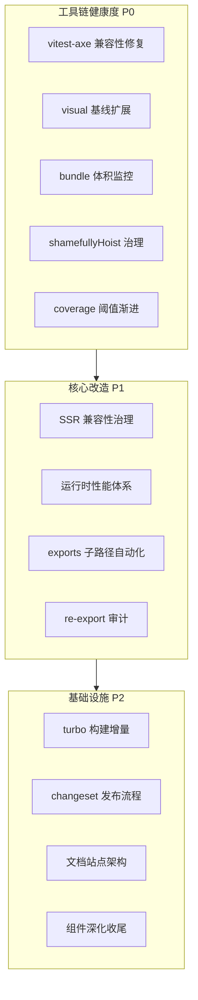

# BrutxUI (Vue 3) 项目架构优化方案 v2

本方案是 [v1 方案](./ARCHITECTURE_OPTIMIZATION_PLAN.md) 的延续，而非替代。v1 的 P0/P1/P2 几乎全部已落地（含 magic-string 重写、L2/L3 测试、CLI 共享基座、设计令牌单一数据源、fallback 审计 CI 门禁等），v2 基于对当前代码库的逐文件核实，识别 v1 未覆盖的新痛点，并提出下一阶段演进方向。

**目标 Tailwind 版本**：仅支持 Tailwind CSS v4+（与 v1 一致，已落地）。

---

## v1 落地核实

下表为对 v1 方案各章节的逐项核实结果，证据均来自直接读取源码：

| v1 章节 | v1 状态 | 落地证据 |
| --- | --- | --- |
| 1. AST 扫描器 | ✅ 已落地 | [prebuild-scan.ts](../packages/ui/scripts/prebuild-scan.ts) + [scan-component-files.ts](../packages/shared/src/scan-component-files.ts)，已接入 `pnpm build` 的 `prebuild:scan` |
| 2. magic-string 重写 | ✅ 已落地 | [preserve-modules-paths.ts](../packages/ui/src/lib/preserve-modules-paths.ts) 已使用 `MagicString` + `acorn` AST + `acorn-walk`，处理 ImportDeclaration/ExportNamedDeclaration/ExportAllDeclaration/ExportDefaultDeclaration/ImportExpression/`require()` CallExpression，处理 `_virtual/_plugin-vue_export-helper` 与 `../_virtual/`、`../node_modules/` 跨目录引用。仅文件名未改为 `flatten-preserve-modules.ts` |
| 3. CLI 共享基座 | ✅ 已落地 | [init-service.ts](../packages/cli/src/lib/services/init-service.ts) `ProjectInitializationSettings.sharedBase` + `components.json` 写入；[add-service.ts](../packages/cli/src/lib/services/add-service.ts) 懒写 hooks/lib；[project.ts](../packages/cli/src/lib/project.ts) `resolveImportAlias` 仍用 AST 重写 |
| 4. 设计令牌单一数据源 | ✅ 已落地 | [design-tokens.ts](../packages/shared/src/design-tokens.ts) `BASE_THEME` light/dark 双模式 28 字段；[styles.css](../packages/ui/src/styles.css) `@theme`（含 fallback，`@brutx:theme-tokens` 标记）+ `:root`/`.dark`（`@brutx:root-tokens` 标记）；[generate-styles-tokens.ts](../packages/ui/scripts/generate-styles-tokens.ts) 构建时注入 |
| 4. fallback 覆盖率审计 | ✅ 已落地 | [audit-brutal-fallback.ts](../packages/ui/scripts/audit-brutal-fallback.ts) 扫描所有 `.css`/`.vue` 的 `var(--brutal-*)`，支持 `--update-baseline`/`--check-baseline`，CI 门禁已接入 [ci.yml:67-68](../.github/workflows/ci.yml#L67-L68) |
| 4. 移除 v3 残留 | ✅ 已落地 | [styles.css:1](../packages/ui/src/styles.css#L1) `@import "tailwindcss";` v4 写法；[init-service.ts:116](../packages/cli/src/lib/services/init-service.ts#L116) 同样为 v4 写法；无 `@tailwind base/components/utilities`、无 `detectTailwindVersion` |
| 5. L1 单元测试 | ✅ 已落地 | [vitest.config.ts](../packages/ui/vitest.config.ts) happy-dom，coverage 阈值 lines/functions 60、branches 50 |
| 5. L2 交互测试 | ✅ 已落地 | [vitest.browser.config.ts](../packages/ui/vitest.browser.config.ts) playwright + chromium；`useReducedMotion.browser.test.ts`、`GlitchText.browser.test.ts` 等用例；CI 已接入 [ci.yml:82-83](../.github/workflows/ci.yml#L82-L83) |
| 5. L3 视觉回归 | ✅ 已落地 | [playwright.config.ts](../packages/ui/playwright.config.ts) + [visual/tests/core.spec.ts](../packages/ui/visual/tests/core.spec.ts) + `visual/baselines/` 6 张基线；CI 已接入 [ci.yml:85-86](../.github/workflows/ci.yml#L85-L86)；[update-visual-baselines.yml](../.github/workflows/update-visual-baselines.yml) 独立基线更新工作流 |
| 5. A11y 校验 | ✅ 已落地 | [test-utils/a11y.ts](../packages/ui/src/test-utils/a11y.ts) `expectNoA11yViolations` 基于 axe-core；[accessibility.test.ts](../packages/ui/src/components/accessibility.test.ts) |
| 6. P0/P1/P2 | ✅ 几乎全部落地 | 见上 |

**结论**：v1 方案已无实质未完成项。v2 不再重复 v1 内容，仅聚焦 v1 未覆盖的新方向。

---

## v2 架构总体设计

v2 聚焦"v1 之后的下一阶段张力"，按风险/收益分三层：



---

## 1. 工具链健康度：测试与产物基础设施修复

### 现状痛点

1. **vitest-axe 与 Vitest 4.x 类型不兼容**：[test-utils/a11y.ts:6-9](../packages/ui/src/test-utils/a11y.ts#L6-L9) FIXME 标注 `vitest-axe ^0.1.0` 的 4 个 module augmentation 无法覆盖 Vitest 4.x 的 `expect` 类型，导致 `toHaveNoViolations` matcher 在类型系统中不可见，下方 `expect(results) as unknown as { toHaveNoViolations: () => void }` 使用强转绕过。这是 v1 落地 L1 a11y 测试时遗留的技术债。

2. **visual 回归覆盖度有限**：[visual/tests/core.spec.ts:4](../packages/ui/visual/tests/core.spec.ts#L4) 仅 4 个 suite（`forms`/`overlays`/`feedback`/`containers`）× 2 主题 = 8 张截图，按类别分组截图。v1 方案第 5 章明确建议"仅对 5-10 个核心视觉组件（Button、Card、GlitchText、Spinner 等）启用"，当前是按类别分组而非核心组件单独基线，定位视觉漂移时粒度过粗。

3. **bundle 体积无监控**：[package.json](../packages/ui/package.json) `devDependencies` 无 `size-limit`/`bundlewatch`/`@size-limit/preset-small-lib` 等工具，无包体积基准与 CI 门禁。100+ 组件的库在主入口 `index.ts` 全量 re-export，体积漂移无感知。

4. **shamefullyHoist 历史遗留**：[pnpm-workspace.yaml:4](../pnpm-workspace.yaml#L4) `shamefullyHoist: true` 是为了兼容旧版工具的折衷，但会破坏 pnpm 的依赖隔离优势，导致 phantom dependency 风险（包意外访问未声明的依赖）。在 monorepo 中尤其危险——子包可能访问到兄弟包的依赖。

5. **coverage 阈值偏低**：[vitest.config.ts:42-46](../packages/ui/vitest.config.ts#L42-L46) lines/functions 60、branches 50。当前组件库已稳定，阈值可渐进提升。

### 落地方案

#### 1.1 vitest-axe 兼容性修复

**决策：直接移除 `vitest-axe` 依赖，改用 `axe-core` 原生 API + 自定义断言，一刀切。**

不再等待 `vitest-axe` 上游发版、不做临时 fork、不保留强转。`axe-core` 是 `vitest-axe` 的底层依赖，直接调用即可获得完全相同的能力，且无需 matcher 类型 augmentation。

```typescript
// packages/ui/src/test-utils/a11y.ts（重写后）
import { axe, type AxeResults } from 'axe-core'
import { mount, type Component } from '@vue/test-utils'
import { vi } from 'vitest'

export async function expectNoA11yViolations(
    component: Component,
    options?: Record<string, unknown>,
) {
    vi.useRealTimers()
    const wrapper = mount(component, options as unknown as Parameters<typeof mount>[1])
    try {
        const results: AxeResults = await axe(wrapper.element)
        // 自定义失败信息：仅 toHaveLength(0) 失败时只输出数量，不显示违规详情
        // 需格式化输出 rule id / help / 涉及元素，便于定位
        if (results.violations.length > 0) {
            const detail = results.violations
                .map(v => `  - ${v.id} (${v.help}): ${v.nodes.map(n => n.html).join(', ')}`)
                .join('\n')
            throw new Error(`a11y violations (${results.violations.length}):\n${detail}`)
        }
        return wrapper
    } finally {
        wrapper.unmount()
    }
}
```

> 上述实现用 `throw new Error` 而非 `expect(...).toHaveLength(0)`——后者失败时仅输出「expected 0, received N」，不显示哪些规则违反、在哪个元素上违反，调试无方向。自定义错误信息输出 `rule id` + `help` + 涉及元素 HTML，与原 `vitest-axe` 的 `toHaveNoViolations` 输出粒度对齐。

**实施步骤**（一次性完成，无渐进）：
1. `pnpm --filter brutx-ui-vue remove vitest-axe` + `pnpm --filter brutx-ui-vue add -D axe-core`。
2. 重写 [test-utils/a11y.ts](../packages/ui/src/test-utils/a11y.ts) 为上述实现，删除 FIXME 注释与强转。
3. 先 Grep `vitest-axe` 确认 `vitest.setup` 中是否有 import 与 `toHaveNoViolations` 注册，有则删除；无则跳过此步（不臆测存在）。
4. 跑 `pnpm --filter brutx-ui-vue test` 验证全部 a11y 用例通过。

**禁止**：
- 保留 `vitest-axe` 依赖（哪怕作为过渡）。
- 保留 `as unknown as { toHaveNoViolations: () => void }` 强转。
- 引入临时 fork 或 vendored 副本。

#### 1.2 visual 回归基线扩展

**决策：保留类别 suite 作为粗粒度回归，新增核心组件单独基线。**

```typescript
// packages/ui/visual/tests/core.spec.ts（扩展后）
const suites = ['forms', 'overlays', 'feedback', 'containers'] as const
const themes = ['light', 'dark'] as const
// 核心组件单独基线：选取视觉表现力强、样式复杂度高、回归风险大的组件
// button=交互基础, card=容器布局, glitch-text=动画特效, spinner=多形态, badge=变体多
const coreComponents = ['button', 'card', 'glitch-text', 'spinner', 'badge'] as const

for (const component of coreComponents) {
    for (const theme of themes) {
        test(`core:${component} ${theme}`, async ({ page }) => {
            await page.goto(`${visualBaseUrl}/?component=${component}&theme=${theme}`)
            await page.locator('.visual-component').waitFor({ state: 'visible' })
            await page.evaluate(() => document.fonts.ready)
            await expect(page.locator('.visual-component')).toHaveScreenshot([
                `core-${component}-${theme}.png`,
            ])
        })
    }
}
```

**配套（`visual/App.vue` harness 改造——本节主要工作量）**：

当前 [visual/App.vue](../packages/ui/visual/App.vue) 仅按类别分组渲染，不支持单组件路由。需扩展为基于 query 的路由分发。**决策：使用 `URLSearchParams` 自研轻量 query parser，不引入 `vue-router`**——visual harness 仅需解析 `?component=xxx&theme=dark`，无需路由守卫/嵌套路由/历史栈等完整路由能力，引入 vue-router 是过度设计。

```vue
<!-- packages/ui/visual/App.vue（扩展后结构示意） -->
<script setup lang="ts">
import { computed } from 'vue'
import { Button } from '../src/components/button'
import { Card } from '../src/components/card'
import { GlitchText } from '../src/components/glitch-text'
// ... 其他核心组件

const componentMap = {
    button: Button,
    card: Card,
    'glitch-text': GlitchText,
    // ...
} as const

// 轻量 query parser：直接读 window.location.search，无路由依赖
const query = computed(() => {
    const params = new URLSearchParams(window.location.search)
    return {
        component: params.get('component') as keyof typeof componentMap | null,
        theme: params.get('theme'),
    }
})
const activeComponent = computed(() => {
    const name = query.value.component
    return name ? componentMap[name] : null
})
</script>

<template>
    <div class="visual-root" :class="{ dark: query.theme === 'dark' }">
        <component :is="activeComponent" v-if="activeComponent" class="visual-component" />
        <!-- 保留原有按类别分组渲染逻辑，作为 ?component 缺省时的回退 -->
        <CategorySuites v-else />
    </div>
</template>
```

**改造范围**：
- 使用 `URLSearchParams` 解析 query，**不引入 `vue-router`**（visual harness 仅需 query 解析，无需完整路由能力）。
- 在 [playwright.config.ts](../packages/ui/playwright.config.ts) 的 `webServer` 启动参数中确保 dev server 支持 history fallback。
- 单组件渲染容器需固定尺寸（避免视口变化导致基线漂移），通过 `.visual-component` 的固定 `width`/`min-height` 约束。尺寸取值规则：以组件默认尺寸为基准，`width` 取组件自然宽度（如 Button 取 `auto` + `min-width: 8rem` 保证内容居中），`min-height` 取 `6rem`（覆盖多数单行组件的自然高度，留出 padding 余量），避免凭空设定导致裁剪或大片空白。

- 基线文件 `visual/baselines/core-{component}-{theme}.png` 由维护者通过 `pnpm test:visual:update` 生成。
- **不全面铺开**：仅核心视觉组件单独基线，避免维护成本爆炸。

#### 1.3 bundle 体积监控

**决策：引入 `size-limit` + CI 门禁，阈值采用「基线 × headroom」推导而非凭经验设定。**

**步骤 1：建立基线**（在引入 CI 门禁之前）

先执行 `pnpm --filter brutx-ui-vue build` 产物，跑一次 `size-limit --why` 获取当前真实体积，作为基线值 `B`。

**步骤 2：设定阈值**

阈值 `L = B × 1.25`（25% headroom）。headroom 取值依据：组件库单次 PR 的合理体积增长通常 < 10%（新增组件 prop/变体），25% 留出 2-3 次 PR 的累积空间，避免每次 PR 都触发阈值调整；同时 < 30% 保证对异常膨胀（如误引入大依赖）仍敏感。向下取整到 5 KB 整数倍以便维护（5 KB 是 size-limit 报告的常见粒度，便于人脑比对）。例如：

| 测量项 | 含义 | 阈值推导 |
| --- | --- | --- |
| main entry (ESM, full) | `import *` 全量入口 | `B_main × 1.25` |
| Button (tree-shaken) | `import { Button }` 单组件 | `B_button × 1.25` |
| CSS | `dist/styles.css` | `B_css × 1.25` |

**步骤 3：写入配置**（阈值字段在基线测量后填充，下方为示意结构）

```json
// packages/ui/package.json（新增；limit 值由步骤 1/2 测量后填入）
{
    "devDependencies": {
        "size-limit": "^11.0.0",
        "@size-limit/file": "^11.0.0",
        "@size-limit/esbuild": "^11.0.0"
    },
    "size-limit": [
        {
            "name": "main entry (ESM, full)",
            "path": "dist/index.js",
            "limit": "<B_main × 1.25>",
            "import": "*"
        },
        {
            "name": "Button (tree-shaken)",
            "path": "dist/index.js",
            "limit": "<B_button × 1.25>",
            "import": "{ Button }"
        },
        {
            "name": "CSS",
            "path": "dist/styles.css",
            "limit": "<B_css × 1.25>"
        }
    ],
    "scripts": {
        "size": "size-limit",
        "size:why": "size-limit --why"
    }
}
```

**CI 集成**：在 [ci.yml](../.github/workflows/ci.yml) 的 `build` 之后新增 `pnpm --filter brutx-ui-vue size` 步骤，体积超限报错。

**说明**：
- 选 `@size-limit/esbuild` 而非 `@size-limit/webpack`：项目主构建用 Vite（底层 esbuild），esbuild 的 tree-shaking 行为比 webpack 更接近 Vite，减少 CI 报警时的「工具差异误报」。`size-limit --why` 仍可用于定位体积来源。
- 阈值每次发版后可重新测量并下调（向基线收敛），形成「阈值单调下降」的渐进收紧机制。

**禁止**：
- 用 `bundlesize`（已停止维护）或自研脚本。
- 在未跑基线的情况下凭经验填阈值（必然要么过松要么过紧）。

#### 1.4 shamefullyHoist 治理

**决策：先审计依赖，再评估移除。**

`shamefullyHoist: true` 不能直接删除——可能有包依赖此行为。落地步骤：

1. **审计阶段**：
   - 先在 `shamefullyHoist: true`（当前状态）下对每个直接依赖输出依赖图快照，保存为 `docs/audit/hoist-deps-baseline.json`，作为修复前的基线证据。直接依赖列表从根 `package.json` + 各子包 `package.json` 的 `dependencies`/`devDependencies` 聚合去重得到：
     ```bash
     # 提取所有包声明的直接依赖并去重，作为 pnpm why 的输入列表
     node -e "const fs=require('fs'),path=require('path');const pkgs=['package.json',...fs.readdirSync('packages').map(p=>\`packages/\${p}/package.json\`)];const deps=new Set();for(const p of pkgs){if(!fs.existsSync(p))continue;const j=JSON.parse(fs.readFileSync(p));[...Object.keys(j.dependencies||{}),...Object.keys(j.devDependencies||{})].forEach(d=>deps.add(d))};console.log([...deps].join('\n'))" > docs/audit/hoist-deps-list.txt
     # 对列表中每个依赖执行 pnpm why
     while IFS= read -r dep; do pnpm why "$dep" --recursive -r; done < docs/audit/hoist-deps-list.txt > docs/audit/hoist-deps-baseline.json
     ```
   - 再切换到 `shamefullyHoist: false` 下执行 `pnpm install` + `pnpm -r build` + `pnpm -r test`，收集失败点。
   - 失败点汇总到 `docs/audit/hoist-failures.md`，每条记录：失败包 / 缺失依赖 / 触发文件。
2. **修复阶段**：对每个失败点，要么在失败包的 `package.json` 显式声明缺失依赖，要么向 upstream 报 issue。修复后重跑 `pnpm -r build` + `pnpm -r test` 验证。
3. **移除阶段**：全绿后删除 `shamefullyHoist: true`，并在 PR 描述中附审计前后的依赖图 diff 证据。

**禁止**：直接删除而不审计——会破坏构建。

#### 1.5 coverage 阈值渐进提升

**决策：阈值基于实际覆盖率测量值推导，而非固定 +5% 步进。**

**步骤 1：测量当前实际覆盖率**

```bash
pnpm --filter brutx-ui-vue test -- --coverage
```

读取 `coverage/coverage-summary.json`，记 `actual = { lines, functions, branches, statements }`。

**步骤 2：设定阈值**

阈值 `T = max(当前配置值, actual - 2%)`，即取「当前阈值」与「实际值减 2% 缓冲」中的较大者。`2%` 缓冲的依据：vitest coverage 在 happy-dom 环境下因 mock/异步边界条件有 1-3% 的 run-to-run 波动，2% 缓冲覆盖此波动避免 flaky。向下取整到 5% 整数倍以便维护（5% 是 coverage 报告的常见粒度，便于人脑比对与阶段目标设定）。

```typescript
// packages/ui/vitest.config.ts（阈值字段由步骤 1/2 测量后填入）
// 阶段 1（当前）：lines 60, functions 60, branches 50, statements 60（v1 现状）
// 阶段 2（P0 完成）：T2 = max(60, actual_lines - 2)，向下取整到 5 的倍数
// 阶段 3（P1 完成）：T3 = max(T2, actual_lines' - 2)，向下取整到 5 的倍数
//
// 仅当 T_{n+1} > T_n 时才执行提升；若实际值未上涨则不提升，避免无意义改动。
```

**约束**：
- 阈值上限为 95%（剩余 5% 留给真正不可达的 defensive code，由 `/* istanbul ignore */` 显式标注）。不允许超过 95%——超过后 defensive code 会被迫删除或加 ignore 标注，得不偿失。
- 不接受「实际值已高就维持阈值」——每阶段必须实测并取 `max(当前阈值, actual - 2%)`，强制向实际值收敛。
- 单次 PR 不允许降低阈值；只能持平或提升。

---

## 2. 产物治理：exports 子路径与 re-export 审计

### 现状痛点

1. **package.json exports 仅 17 个入口**：[package.json:9-99](../packages/ui/package.json#L9-L99) 仅暴露 `.`/`./calendar`/`./carousel`/`./code-block`/`./hooks`/`./devtools-plugin`/`./locales`/`./button`/`./input`/`./dialog`/`./toast`/`./form`/`./select`/`./dropdown-menu`/`./table`/`./card`/`./tabs`。100+ 组件中绝大多数仅能通过主入口 `.` 导入。虽然 `preserveModules` 缓解了 tree-shaking，但用户无法用 `import { Button } from 'brutx-ui-vue/button'` 子路径消费。

2. **主入口 re-export 第三方原语**：[index.ts:40](../packages/ui/src/index.ts#L40) `export { DialogRoot as Dialog, DialogTrigger, DialogPortal, DialogClose } from 'reka-ui'`。主入口直接 re-export reka-ui 原语，会导致用户即使只 import `Button` 也可能将 reka-ui 拉入 bundle（取决于 bundler 的 tree-shaking 能力）。

3. **v1 方案明确否决了"100+ 组件 × 3 套 exports"**：v1 第 2 章已论证手动维护 300+ exports 声明不可行。但 v1 未回答"如何自动化生成 exports"。

### 落地方案

#### 2.1 exports 子路径自动化生成

**决策：从 `registry-manifest.json` 自动生成全量 exports（组件 + composables + directives），仅 ESM（移除 CJS），CSS 仅保留单一 canonical 名，移除所有历史别名。**

v1 已落地 `packages/ui/registry-manifest.json`（AST 扫描生成）。需扩展 [prebuild-scan.ts](../packages/ui/scripts/prebuild-scan.ts) 额外输出 `composables` 与 `directives` 的独立清单（当前 manifest 仅记录组件→依赖文件映射，不含独立导出项）。脚本基于扩展后的 manifest 生成 exports。

```typescript
// packages/ui/scripts/generate-exports.ts（新增）
import { readFileSync, writeFileSync, existsSync } from 'node:fs'
import { resolve } from 'node:path'

interface Manifest {
    components: string[]
    composables: string[]
    directives: string[]
}

// 仅保留的 manual 子路径：主入口 + CSS canonical 名 + preflight 独立产物 + i18n 数据入口
// i18n 是聚合数据（所有语言包打平），性质不同于组件/composable，保留聚合入口
// ./preflight.css 指向独立的 dist/preflight.css 产物（由 build:preflight 脚本生成），
// 并非 styles.css 的别名，必须保留
const MANUAL_EXPORTS_KEYS = [
    '.',
    './style.css',      // CSS 唯一 canonical 名，移除 ./index.css / ./styles.css 别名
    './preflight.css',  // 独立 preflight 产物，非 styles.css 别名
    './locales',        // i18n 聚合数据入口
] as const

function buildEntry(distRel: string): { types: string; import: string } {
    return {
        types: `./dist/${distRel}.d.ts`,
        import: `./dist/${distRel}.js`,
    }
}

function generateExports(): void {
    const manifest: Manifest = JSON.parse(
        readFileSync(resolve(__dirname, '../registry-manifest.json'), 'utf-8'),
    )

    const autoExports: Record<string, { types: string; import: string }> = {}

    // 1. 组件级子路径：./button → dist/components/button/index
    for (const component of manifest.components) {
        autoExports[`./${component}`] = buildEntry(`components/${component}/index`)
    }

    // 2. composable 级子路径：./useToast → dist/composables/useToast
    //    移除 ./hooks 聚合入口，每个 composable 独立导出
    for (const composable of manifest.composables) {
        // composable 文件名形如 useToast.ts → 子路径 ./useToast
        const name = composable.replace(/\.ts$/, '')
        autoExports[`./${name}`] = buildEntry(`composables/${name}`)
    }

    // 3. directive 级子路径：./loading → dist/directives/loading
    for (const directive of manifest.directives) {
        const name = directive.replace(/\.ts$/, '')
        autoExports[`./${name}`] = buildEntry(`directives/${name}`)
    }

    // 4. 校验产物存在性（仅 postbuild 阶段）
    if (process.env.BRUTX_VERIFY_EXPORTS === '1') {
        for (const [, entry] of Object.entries(autoExports)) {
            const importAbs = resolve(__dirname, '..', entry.import)
            if (!existsSync(importAbs)) {
                throw new Error(`exports 产物缺失：${entry.import}`)
            }
        }
    }

    // 5. 读取现有 package.json，合并而非覆盖
    const pkgPath = resolve(__dirname, '../package.json')
    const pkg = JSON.parse(readFileSync(pkgPath, 'utf-8'))
    const existingExports: Record<string, unknown> = pkg.exports ?? {}

    const merged: Record<string, unknown> = {}
    for (const key of MANUAL_EXPORTS_KEYS) {
        if (key in existingExports) {
            merged[key] = existingExports[key]
        }
    }
    for (const [key, value] of Object.entries(autoExports)) {
        merged[key] = value
    }

    // 6. 遗留键检测：直接报错而非保留
    //    抛弃兼容性——任何不在 MANUAL 也不在 auto 的键都是应清理的历史包袱
    const knownKeys = new Set([...MANUAL_EXPORTS_KEYS, ...Object.keys(autoExports)])
    const staleKeys = Object.keys(existingExports).filter(k => !knownKeys.has(k))
    if (staleKeys.length > 0) {
        throw new Error(
            `exports 存在遗留子路径，必须清理：\n${staleKeys.map(k => `  - ${k}`).join('\n')}\n` +
            `这些子路径已废弃，不应保留。若确有保留价值，加入 MANUAL_EXPORTS_KEYS 并说明理由。`,
        )
    }

    pkg.exports = merged
    writeFileSync(pkgPath, JSON.stringify(pkg, null, 4) + '\n')
}

generateExports()
```

**接入 build 流程**：在 `pnpm prebuild:scan` 之后、`vite build` 之前执行 `pnpm prebuild:exports`（生成声明但不校验产物）；`vite build` 之后执行 `pnpm postbuild:exports`（设 `BRUTX_VERIFY_EXPORTS=1` 校验产物存在性）。

**vite build 改造（直接方案，不另行评估）**：

当前 vite build 使用 `preserveModules`，产物路径由源码相对路径决定（如 `src/components/button/Button.vue` → `dist/components/button/Button.js`），无法保证每个组件/composable/directive 目录下都有 `index.js` 入口。`preserveModules` 与多入口 `input` **不能并用**——`preserveModules` 下产物路径由源码结构决定，忽略 `input` 的 key 命名；多入口下产物路径由 `input` key 决定，二者冲突会导致 `postbuild:exports` 校验大面积失败。

因此改造方案为：**移除 `preserveModules`，改用纯多入口**，产物路径由 `input` key 完全控制，与 `buildEntry()` 生成的 exports 声明一一对应。原有的 [preserve-modules-paths.ts](../packages/ui/src/lib/preserve-modules-paths.ts) 路径重写插件随 `preserveModules` 一并移除——该插件的存在前提是 `preserveModules`，移除后 Rollup 按标准多入口解析 import，无需手动重写路径。

```typescript
// packages/ui/vite.config.ts（build.rollupOptions.input 改造）
import { readFileSync } from 'node:fs'
import { resolve } from 'node:path'

function buildInputs(): Record<string, string> {
    const manifest = JSON.parse(
        readFileSync(resolve(__dirname, 'registry-manifest.json'), 'utf-8'),
    )
    const inputs: Record<string, string> = {
        index: resolve(__dirname, 'src/index.ts'),
    }
    for (const component of manifest.components) {
        // input key 决定产物路径：components/button/index → dist/components/button/index.js
        inputs[`components/${component}/index`] = resolve(__dirname, `src/components/${component}/index.ts`)
    }
    for (const composable of manifest.composables) {
        const name = composable.replace(/\.ts$/, '')
        inputs[`composables/${name}`] = resolve(__dirname, `src/composables/${name}.ts`)
    }
    for (const directive of manifest.directives) {
        const name = directive.replace(/\.ts$/, '')
        inputs[`directives/${name}`] = resolve(__dirname, `src/directives/${name}.ts`)
    }
    return inputs
}

export default defineConfig({
    build: {
        rollupOptions: {
            input: buildInputs(),
            output: {
                // 不使用 preserveModules——多入口下产物路径由 input key 决定，
                // 与 generateExports.ts 的 buildEntry() 声明一一对应
                // 仅输出 ESM，移除 CJS
                format: 'es',
                // 保留入口 chunk 文件名（避免 hash 后缀导致 exports 路径失配）
                entryFileNames: '[name].js',
            },
        },
    },
})
```

**连带改动**：
- 移除 [preserve-modules-paths.ts](../packages/ui/src/lib/preserve-modules-paths.ts) 插件及其在 vite 配置中的注册。
- `entryFileNames: '[name].js'` 确保 `input` key 直接作为产物文件名，无 hash 后缀，与 exports 声明一致。

**移除 CJS 的连带改动**：
- `package.json` 删除 `"main"` 字段与 `"require"` 条件，仅保留 `"module"`/`"import"`/`"types"`。
- 删除 `dist/**/*.cjs` 产物与生成 CJS 的 rollup 配置。
- 用户须使用支持 ESM 的打包工具（Vite/webpack 5+/Rollup/esbuild）；Node.js 直接 `require()` 不再支持（组件库面向 bundler 消费，非 Node 直接运行）。

**`check:exports` 校验脚本**：

```typescript
// packages/ui/scripts/check-exports.ts（新增，接入 CI）
// 比对「重新生成的 exports」与「package.json 当前 exports」
// 1. 重新跑 generateExports 但写入临时文件
// 2. diff 临时文件与 package.json 的 exports 字段
// 3. 不一致则报错并输出 diff，提示运行 pnpm prebuild:exports
```

**约束**：
- **禁止**手动编辑 `package.json` 的 `exports` 字段中由脚本生成的子路径（CI `pnpm check:exports` 比对，不一致则报错）。
- **禁止**保留任何历史别名（`./index.css`/`./styles.css`/`./hooks`/`./devtools-plugin` 等）——遗留键检测直接报错，不 warning、不保留。
- **例外**：`./preflight.css` 指向独立的 `dist/preflight.css` 产物（由 `build:preflight` 脚本生成），**不是** `styles.css` 的别名，已加入 `MANUAL_EXPORTS_KEYS` 保留。若决定废弃 preflight，需同步删除 `build:preflight` 脚本并在 PR 中说明理由。
- **禁止**生成 CJS 产物与 `require` 字段——仅 ESM。
- `MANUAL_EXPORTS_KEYS` 仅允许 `.`/`./style.css`/`./preflight.css`/`./locales`，新增项须在 PR 中说明不可自动生成的理由。
- 子路径入口文件必须存在（`postbuild:exports` 阶段校验）。

#### 2.2 re-export 审计

**决策：直接移除主入口对 reka-ui 的 re-export，不拆分到 `./primitives`，不做 size-limit 量化评估。**

组件库的职责是提供自己的组件实现，不应充当第三方原语的代理入口。用户若需要 reka-ui 原语，应直接 `from 'reka-ui'` 导入。re-export 无论是保留在主入口还是拆分到 `./primitives`，本质都是在为 reka-ui 做不必要的「转发」，增加维护成本与潜在的 tree-shaking 风险。

> **⚠️ Breaking Change**：[index.ts](../packages/ui/src/index.ts) 当前有 **8 处** reka-ui re-export（`Dialog`/`AlertDialog`/`Sheet`/`Popover`/`Tooltip`/`SelectGroup`/`SelectValue`/`DropdownMenu`/`TabsRoot` 等）。移除后 `import { Dialog, Popover, Tooltip, ... } from 'brutx-ui-vue'` 的用户代码会编译失败。当前版本 `0.9.4`（0.x 阶段），此变更须在下一个 minor 版本执行，CHANGELOG 标注 `BREAKING`，并在发版说明中给出迁移示例（`- import { Dialog } from 'brutx-ui-vue'` → `+ import { Dialog } from 'brutx-ui-vue'`（项目自有组件）或 `+ import { DialogRoot as Dialog } from 'reka-ui'`（原语））。进入 1.x 后此类破坏性变更须 major bump。

```typescript
// packages/ui/src/index.ts（改造后）
// 移除全部 reka-ui re-export：
// export { DialogRoot as Dialog, DialogTrigger, DialogPortal, DialogClose } from 'reka-ui'  ← 删除
// export { ... } from 'reka-ui'  ← 全部删除（共 8 处）

// 仅保留项目自身组件/composable/directive 的导出
export { Button } from './components/button'
export { Dialog } from './components/dialog'  // 项目自己的 Dialog.vue，非 reka-ui 的 DialogRoot
// ...
```

**实施步骤**（一次性，无评估阶段）：
1. Grep `from 'reka-ui'` in [src/index.ts](../packages/ui/src/index.ts)，列出全部 re-export 行（当前 8 处）。
2. 删除所有 reka-ui 值 re-export 行。
3. **审计类型 re-export**：Grep `export type { .* } from 'reka-ui'` 与 `export { type .* } from 'reka-ui'`，检查是否透传了 reka-ui 的类型（如 `DialogRootProps`/`PopoverRootProps`）。若组件 props 类型引用 reka-ui 类型，需在组件内部 `import type` 并由组件自身导出该类型（如 `export type DialogProps = ...`），而非主入口透传 reka-ui 类型。
4. 检查项目自身组件是否依赖这些 re-export（如 `Dialog.vue` 内部 `import { DialogRoot } from 'reka-ui'`）——这些内部导入不受影响，仅移除「对外 re-export」。
5. 检查测试与文档 demo 是否依赖从 `brutx-ui-vue` 导入 reka-ui 原语或类型——若有，改为直接 `from 'reka-ui'`。
6. 跑 `pnpm --filter brutx-ui-vue build` + `pnpm test` 验证。
7. 在 [apps/docs](../apps/docs) 的迁移指南中标注：`brutx-ui-vue` 不再导出 reka-ui 原语与类型，用户须直接安装 `reka-ui` 并从中导入。

**约束**：
- **禁止**以任何形式保留 reka-ui 值或类型 re-export（主入口、`./primitives` 子路径、`./reka` 别名、`export type` 透传等均禁止）。
- **禁止**为「移除 re-export」做 size-limit 量化评估来决定是否移除——这是架构原则问题，不是体积优化问题。
- `reka-ui` 仍作为 `peerDependencies` 保留（项目组件内部使用），但不出现在公共 API 表面。
- 破坏性变更须遵循版本策略：0.x 阶段在 minor 发版、CHANGELOG 标注 `BREAKING`；1.x+ 阶段须 major bump。

---

## 3. SSR 兼容性：DOM 全局安全治理

### 现状痛点

项目当前**未声明支持 SSR**，但作为 Vue 3 组件库，Nuxt/SSR 用户会尝试使用。审计发现 349 处 `window.`/`document.`/`navigator.` 直接访问，分布在 30 个文件，生产代码主要集中在：

| 文件 | 引用数 | 风险点 |
| --- | --- | --- |
| [lib/env.ts](../packages/ui/src/lib/env.ts) | 10 | 已是封装层，可作为 SSR-safe 基础 |
| [lib/theme-variables.ts](../packages/ui/src/lib/theme-variables.ts) | 8 | 主题变量读写直接访问 document |
| [lib/theme-editor.ts](../packages/ui/src/lib/theme-editor.ts) | 2 | 主题编辑器 |
| [lib/render-imperative.ts](../packages/ui/src/lib/render-imperative.ts) | 2 | 命令式渲染 |
| [composables/useDialogEnhanced.ts](../packages/ui/src/composables/useDialogEnhanced.ts) | 12 | 增强对话框 |
| [composables/useClipboard.ts](../packages/ui/src/composables/useClipboard.ts) | 2 | 剪贴板 |
| [composables/useTheme.ts](../packages/ui/src/composables/useTheme.ts) | 6 | 主题切换 |
| [composables/useToast.ts](../packages/ui/src/composables/useToast.ts) | 3 | Toast |
| [composables/useReducedMotion.ts](../packages/ui/src/composables/useReducedMotion.ts) | 1 | matchMedia |
| [components/backtop/Backtop.vue](../packages/ui/src/components/backtop/Backtop.vue) | 5 | 滚动监听 |
| [directives/loading.ts](../packages/ui/src/directives/loading.ts) | 6 | v-loading 指令 |
| [components/dialog/functional.ts](../packages/ui/src/components/dialog/functional.ts) | 4 | 函数式 Dialog |

**根本问题**：无统一的 SSR-safe 工具层，每个 composable/组件各自判断 `typeof window !== 'undefined'`，遗漏点必然存在。

### 落地方案

#### 3.1 SSR-safe 工具层

**决策：扩展 `lib/env.ts` 作为唯一 SSR-safe 入口，所有 DOM/BOM 访问必须经过该层。**

[env.ts](../packages/ui/src/lib/env.ts) 已有部分封装（`isClient`/`hasDocument`/`hasLocalStorage`/`canUseDocumentBody()`/`hasIntersectionObserver`/`getAudioContextCtor()`/`getResizeObserverCtor()`/`getMutationObserverCtor()`/`getDevicePixelRatio()`/`getViewportSize()`/`createCanvasElement()`/`getCanvas2DContext()`/`safeGetStorageItem()`/`safeSetStorageItem()`）。本节在此基础上**补齐缺失的 API**，命名遵循现有约定（Observer 构造函数用 `getCtor` 后缀，Storage 值级操作用 `safe*` 前缀），不另起炉灶。

```typescript
// packages/ui/src/lib/env.ts（在现有基础上扩展）
// 已有：isClient / hasDocument / hasLocalStorage / canUseDocumentBody / hasIntersectionObserver
//       getAudioContextCtor / getResizeObserverCtor / getMutationObserverCtor
//       getDevicePixelRatio / getViewportSize / createCanvasElement / getCanvas2DContext
//       safeGetStorageItem / safeSetStorageItem
// 以下为新增：

export const isServer = !isClient

// —— 基础全局 getter（现有 isClient/hasDocument 是 boolean 探测，新增对象级 getter 供需要对象引用的场景）——
export function getWindow(): Window | undefined {
    return isClient ? window : undefined
}

export function getDocument(): Document | undefined {
    return isClient ? document : undefined
}

export function getNavigator(): Navigator | undefined {
    return isClient ? navigator : undefined
}

// —— matchMedia ——
export function matchMedia(query: string): MediaQueryList | undefined {
    return isClient ? window.matchMedia(query) : undefined
}

// —— Storage 对象级 getter（与现有 safeGetStorageItem/safeSetStorageItem 互补）——
// 现有 safe* 系列是值级封装（get/set 单个 key），此处提供对象级 getter 供需要直接操作 Storage 的场景
export function getLocalStorage(): Storage | undefined {
    return isClient ? window.localStorage : undefined
}

export function getSessionStorage(): Storage | undefined {
    return isClient ? window.sessionStorage : undefined
}

// —— requestAnimationFrame / cancelAnimationFrame ——
// SSR 下返回 no-op，调用方无需判空
export function requestAnimationFrame(cb: FrameRequestCallback): number {
    return isClient ? window.requestAnimationFrame(cb) : 0
}

export function cancelAnimationFrame(handle: number): void {
    if (isClient) window.cancelAnimationFrame(handle)
}

// —— Observer 系列（沿用现有 getCtor 命名后缀，补齐 IntersectionObserver 已有的 hasIntersectionObserver 探测外的对象级 getter）——
export function getIntersectionObserverCtor(): typeof IntersectionObserver | undefined {
    return isClient ? window.IntersectionObserver : undefined
}

export function getPerformanceObserverCtor(): typeof PerformanceObserver | undefined {
    return isClient ? window.PerformanceObserver : undefined
}

// —— getComputedStyle ——
export function getComputedStyle(elt: Element, pseudoElt?: string | null): CSSStyleDeclaration | undefined {
    return isClient ? window.getComputedStyle(elt, pseudoElt ?? undefined) : undefined
}

// —— history / location（只读访问；写操作需调用方自行判空）——
export function getHistory(): History | undefined {
    return isClient ? window.history : undefined
}

export function getLocation(): Location | undefined {
    return isClient ? window.location : undefined
}

// —— scrollTo / scrollIntoView（通过 getWindow/getDocument 派生，不直接访问 window）——
export function scrollTo(x: number, y: number): void {
    if (isClient) window.scrollTo(x, y)
}

export function scrollIntoView(elt: Element, options?: ScrollIntoViewOptions): void {
    if (isClient) elt.scrollIntoView(options)
}
```

**API 覆盖范围说明**：

工具层一次性覆盖组件库可能用到的全部 SSR-unsafe DOM/BOM API，而非仅痛点表中当前出现的 API。不做 YAGNI 取舍——工具层是基础设施，预先覆盖完整 API 集可避免后续新增组件时反复补丁。当前覆盖列表（按类别，标注现有/新增）：

| 类别 | API | 状态 |
| --- | --- | --- |
| 基础全局 | `isClient` `hasDocument` `getWindow()` `getDocument()` `getNavigator()` | 现有 + 新增 getter |
| 媒体查询 | `matchMedia()` | 新增 |
| 存储 | `safeGetStorageItem()` `safeSetStorageItem()` `getLocalStorage()` `getSessionStorage()` | 现有值级 + 新增对象级 |
| 动画帧 | `requestAnimationFrame()` `cancelAnimationFrame()` | 新增（no-op 封装） |
| Observer | `getMutationObserverCtor()` `getResizeObserverCtor()` `getIntersectionObserverCtor()` `getPerformanceObserverCtor()` | 现有 + 新增 |
| 样式 | `getComputedStyle()` | 新增 |
| 路由 | `getHistory()` `getLocation()` | 新增 |
| 滚动 | `scrollTo()` `scrollIntoView()` | 新增 |
| 其他 | `getAudioContextCtor()` `getDevicePixelRatio()` `getViewportSize()` `createCanvasElement()` `getCanvas2DContext()` | 现有 |

> `alert`/`confirm`/`prompt` 不纳入工具层——组件库不应调用这些阻塞式 API，若有需求应由消费方自行处理。

若后续发现遗漏的 API，直接补到工具层 + lint 黑名单，不需评估「是否值得加」。

**约束**：
- **禁止**在生产代码中直接访问上述任何 SSR-unsafe 全局（lint 规则强制，见 §3.2，直接 `error` 不走 `warn`）。
- 所有访问必须经工具层封装函数，返回 `undefined` 时由调用方处理（Observer 系列需判空后再 `new`）。
- `requestAnimationFrame`/`cancelAnimationFrame` 采用 no-op 封装（返回 0 / 空操作），调用方无需判空，简化使用。
- Observer 构造函数统一用 `getCtor` 后缀命名（与现有 `getMutationObserverCtor` 一致），不使用 `getMutationObserver` 等无后缀命名。
- 测试文件与 `lib/env.ts` 自身豁免（通过 eslint flat config 的独立 config 对象配置，见 §3.2）。

#### 3.2 lint 规则强制

`no-restricted-globals` 仅能拦截**裸引用**（如 `document`），无法拦截以下形态：
- `window.foo`（成员访问）
- `globalThis.localStorage`
- 解构赋值 `const { matchMedia } = window` 后的裸使用

因此需用 `no-restricted-globals` + `no-restricted-syntax` 双重拦截。项目 [eslint.config.js](../packages/ui/eslint.config.js) 使用 **flat config**（`tseslint.config(...)`，多 config 对象数组），新增规则以独立 config 对象追加到数组末尾，不使用 legacy `.eslintrc` 的 `overrides` 字段：

```javascript
// eslint.config.js（在现有 tseslint.config(...) 参数末尾追加）

const SSR_UNSAFE_GLOBALS = [
    'window', 'document', 'navigator',
    'localStorage', 'sessionStorage',
    'MutationObserver', 'IntersectionObserver', 'ResizeObserver',
    'getComputedStyle', 'history', 'location',
    // requestAnimationFrame / cancelAnimationFrame 虽采用 no-op 封装，
    // 仍需统一经工具层，避免绕过 SSR-safe 入口。
    'requestAnimationFrame', 'cancelAnimationFrame',
]

// 精确匹配 window.xxx / globalThis.xxx / self.xxx 中 object 位置的标识符
// 不用 MemberExpression > Identifier[name="window"]（会误匹配 foo.window 等 property 位置）
const SSR_UNSAFE_MEMBER_SELECTORS = [
    'MemberExpression[object.type="Identifier"][object.name="window"]',
    'MemberExpression[object.type="Identifier"][object.name="globalThis"]',
    'MemberExpression[object.type="Identifier"][object.name="self"]',
]

// 1. 生产代码：启用 SSR-safe 规则
{
    files: ['src/**/*.ts', 'src/**/*.vue', 'src/**/*.tsx'],
    ignores: ['src/lib/env.ts', 'src/test-utils/**'],
    rules: {
        // 拦截裸引用：document / localStorage / ...
        'no-restricted-globals': ['error', ...SSR_UNSAFE_GLOBALS.map(name => ({
            name,
            message: `Use the corresponding getter from "@/lib/env" for SSR safety (e.g. getDocument(), getLocalStorage()).`,
        }))],
        // 拦截成员访问：window.xxx / globalThis.xxx / self.xxx
        'no-restricted-syntax': ['error', ...SSR_UNSAFE_MEMBER_SELECTORS.map(selector => ({
            selector,
            message: 'Use getXxx() from "@/lib/env" for SSR safety. Do not access window/globalThis/self directly.',
        }))],
    },
},
// 2. 测试文件 + env.ts 自身：豁免（测试环境始终是 client；env.ts 是工具层实现，必须直接访问 window）
{
    files: ['**/*.test.ts', '**/*.spec.ts', 'src/test-utils/**', 'src/lib/env.ts'],
    rules: {
        'no-restricted-globals': 'off',
        'no-restricted-syntax': 'off',
    },
},
```

**实施策略**（一刀切，无 warn 过渡）：
- 规则直接以 `error` 级别引入并接入 CI 门禁，不走 `warn` 过渡阶段。
- 落地 PR 必须一次性完成全部 30 个文件的迁移（`getWindow()`/`getDocument()`/`getLocalStorage()` 等），CI 不允许存在 lint error。
- `lib/env.ts` 自身豁免（它是工具层的实现，必须直接访问 `window`）——通过独立 config 对象的 `files: ['src/lib/env.ts']` 关闭规则。
- 测试文件豁免（测试环境始终是 client），同上通过独立 config 对象配置。

#### 3.3 SSR 测试

**决策：新增 SSR smoke 测试，覆盖「纯渲染组件」+「DOM 重依赖 composable」双层，确保 SSR 不报错。**

**依赖新增**：`@vue/server-renderer` 需加入 `packages/ui/devDependencies`（Vue 核心已自带 `vue` 依赖，`@vue/server-renderer` 是独立子包）。

痛点表中 DOM 引用重灾区的 composable（`useDialogEnhanced`/`useToast`/`useTheme`/`useClipboard`/`useReducedMotion`）才是 SSR 真正会炸的地方，纯渲染组件（`Button`/`Badge`/`Card`/`Input`）几乎无 DOM 访问，仅测后者会漏掉风险。因此 smoke 测试分两层：

```typescript
// packages/ui/src/ssr/ssr-smoke.test.ts（新增）
import { describe, it, expect } from 'vitest'
import { renderToString } from '@vue/server-renderer'
import { createSSRApp, h, defineComponent, type Component } from 'vue'
import { Button, Badge, Card, Input } from '../index'
import { useDialogEnhanced } from '../composables/useDialogEnhanced'
import { useToast } from '../composables/useToast'
import { useTheme } from '../composables/useTheme'
import { useClipboard } from '../composables/useClipboard'
import { useReducedMotion } from '../composables/useReducedMotion'
// 若 composable 依赖 Provider（如 useToast 依赖 ToastProvider 提供的 inject key）
import { ToastContainer } from '../components/toast/ToastContainer.vue'

// —— 第 1 层：纯渲染组件 smoke（校验 HTML 关键内容，非仅 toBeTruthy）——
describe('SSR smoke: components', () => {
    // 每个组件配一个「HTML 应包含的关键片段」，避免渲染空字符串的静默失败
    const cases: Array<{ name: string; comp: Component; expectContains: string }> = [
        { name: 'Button', comp: Button, expectContains: '<button' },
        { name: 'Badge', comp: Badge, expectContains: '<span' },
        { name: 'Card', comp: Card, expectContains: 'card' },
        { name: 'Input', comp: Input, expectContains: '<input' },
    ]
    for (const { name, comp, expectContains } of cases) {
        it(`${name} renders expected HTML on SSR`, async () => {
            const app = createSSRApp({ render: () => h(comp) })
            const html = await renderToString(app)
            expect(html).toContain(expectContains)
        })
    }
})

// —— 第 2 层：DOM 重依赖 composable smoke ——
// 关键：需为依赖 inject 上下文的 composable 提供 Provider 祖先组件，
// 否则 inject 返回 undefined 抛错是「测试 setup 错误」而非「SSR 不兼容」，误导排查
describe('SSR smoke: composables', () => {
    // 每个用例可指定一个 providerWrap：用 Provider 组件包裹 Wrapper，注入所需 inject 上下文
    const composableCases: Array<{
        name: string
        fn: () => unknown
        providerWrap?: (child: Component) => Component
    }> = [
        { name: 'useDialogEnhanced', fn: () => useDialogEnhanced() },
        {
            name: 'useToast',
            fn: () => useToast(),
            // useToast 依赖 ToastProvider/ToastContainer 提供的 inject key
            providerWrap: (child) => defineComponent({
                setup() { return () => h('div', [h(ToastContainer), h(child)]) },
            }),
        },
        { name: 'useTheme', fn: () => useTheme() },
        { name: 'useClipboard', fn: () => useClipboard() },
        { name: 'useReducedMotion', fn: () => useReducedMotion() },
    ]

    for (const { name, fn, providerWrap } of composableCases) {
        it(`${name} does not throw on SSR setup`, async () => {
            const Wrapper = defineComponent({
                setup() {
                    fn()  // 调用 composable，若 SSR 下访问未封装的 DOM 应抛错
                    return () => h('div')
                },
            })
            const Root = providerWrap ? providerWrap(Wrapper) : Wrapper
            const app = createSSRApp(Root)
            // renderToString 触发 setup；若 composable 直接访问 window 会抛
            const html = await renderToString(app)
            expect(html).toBeTruthy()
        })
    }
})
```

> **Provider 上下文提示**：每个 composable 的 SSR smoke 用例须先确认其是否依赖 inject 上下文（如 `useToast` 需要 `ToastProvider`、`useDialogEnhanced` 可能需要 Dialog context）。缺少 Provider 时 inject 返回 undefined 抛错属于「测试 setup 缺陷」而非「SSR 不兼容」，会误导排查。实施时逐个 composable 审计其 inject 依赖，在 `providerWrap` 中注入对应 Provider；对无 inject 依赖的 composable 留空 `providerWrap`。

**接入 CI**：在 `pnpm test` 后新增 `pnpm test:ssr` 步骤（`vitest --config vitest.ssr.config.ts`，SSR 配置使用 node 环境）。

**范围**：
- 第 1 层覆盖全部公共导出组件（非仅核心 4 个），每个组件至少有一个 SSR 渲染用例。
- 第 2 层覆盖 `src/composables/` 下全部 composable（非仅 DOM 引用数 ≥2 的 5 个），无 DOM 引用的 composable 也要测（验证其在 SSR setup 上下文中能正常初始化）。
- 第 1 层用例须校验 SSR 输出 HTML 包含预期关键内容（如 `Button` 渲染出 `<button` 标签、`Card` 渲染出预期 class），而非仅 `toBeTruthy()`——仅校验「不抛错」会漏掉渲染出空字符串的静默失败。
- 第 2 层用例须为依赖 inject 上下文的 composable 提供对应 Provider 祖先组件，避免 inject 缺失导致的非 SSR 相关失败。

---

## 4. 运行时性能：基准与关键组件优化

### 现状痛点

1. **性能优化特性使用稀疏**：仅 31 处 `v-memo`/`shallowRef`/`markRaw`/`shallowReactive`，分布在 10 个文件：
   - [DataTable.vue](../packages/ui/src/components/data-table/DataTable.vue)（5 次）
   - [useGlitchEffect.ts](../packages/ui/src/composables/useGlitchEffect.ts)（4 次）
   - [InfiniteScroll.vue](../packages/ui/src/components/infinite-scroll/InfiniteScroll.vue)（4 次）
   - [GlitchText.vue](../packages/ui/src/components/glitch-text/GlitchText.vue)、[TreeSelect.vue](../packages/ui/src/components/tree-select/TreeSelect.vue)、[TreeView.vue](../packages/ui/src/components/tree-view/TreeView.vue)、[TypewriterText.vue](../packages/ui/src/components/typewriter-text/TypewriterText.vue) 等

2. **无性能基准**：无 `benchmark.js`/`tinybench` 等工具，组件渲染性能无量化基线。大列表（DataTable、TreeView、VirtualScroll）在数据量增长时的性能表现无回归监控。

3. **v-memo 使用缺失**：`v-memo` 是 Vue 3 性能优化的关键指令，但项目仅 31 处使用（含 shallowRef/markRaw），`v-memo` 本身可能更少。大列表 `v-for` 未配套 `v-memo` 是常见性能陷阱。

### 落地方案

#### 4.1 性能基准建立

**决策：使用 Vitest 4+ 内置的 bench 能力（`vitest bench`）建立关键组件渲染基准，PR 对比报告通过 CI 并行跑 main + PR 两次 bench 实现。**

Vitest 4+ 内置 bench 支持（底层基于 tinybench），与现有测试体系一致，`--reporter=json` 开箱即用，无需独立脚本手动 `new Bench()` + `console.table`。bench 文件用 `*.bench.ts` 命名，`bench()` API 与 `it()` 用法对齐。

```typescript
// packages/ui/perf/render.bench.ts（新增）
import { bench, describe } from 'vitest'
import { mount } from '@vue/test-utils'
import DataTable from '../src/components/data-table/DataTable.vue'

interface Row {
    id: number
    name: string
}

function makeRows(n: number): Row[] {
    return Array.from({ length: n }, (_, i) => ({ id: i, name: `Row ${i}` }))
}

const columns = [
    { key: 'id', title: 'ID' },
    { key: 'name', title: 'Name' },
]

describe('DataTable render', () => {
    // 采样时长 1000ms（vitest bench 默认值）：兼顾统计稳定性与 CI 总耗时
    // 1000 rows 是大列表性能回归的典型观测点，100 rows 作为小列表基线对照
    bench('100 rows', () => {
        const wrapper = mount(DataTable, { props: { data: makeRows(100), columns } })
        wrapper.unmount()
    }, { time: 1000 })

    bench('1000 rows', () => {
        const wrapper = mount(DataTable, { props: { data: makeRows(1000), columns } })
        wrapper.unmount()
    }, { time: 1000 })
})
```

**package.json 新增脚本**：

```json
{
    "scripts": {
        "bench": "vitest bench",
        "bench:json": "vitest bench --reporter=json"
    }
}
```

> vitest bench 默认输出 markdown 表格（含 hz / p75 / p99 / rme 等字段）；`--reporter=json` 输出机器可读 JSON，供 CI 对比脚本消费。无需手动 `console.table`。

**接入 CI（PR 对比报告实施方案）**：

性能基准不作为门禁（避免 flaky），但每次 PR 输出与 main 分支的对比报告。CI 实施步骤：

1. **基线采集 job**（`bench-baseline`）：
   - `actions/checkout` 拉取 `main` 分支。
   - `pnpm install` + `pnpm --filter brutx-ui-vue build`。
   - `pnpm --filter brutx-ui-vue bench:json > bench-main.json`。
   - 通过 `actions/upload-artifact` 上传 `bench-main.json`。

2. **PR 采集 job**（`bench-pr`）：
   - `actions/checkout` 拉取 PR 分支。
   - `pnpm install` + `pnpm --filter brutx-ui-vue build`。
   - `pnpm --filter brutx-ui-vue bench:json > bench-pr.json`。
   - `actions/download-artifact` 下载 `bench-main.json`。
   - 运行对比脚本 `node scripts/bench-diff.mjs bench-main.json bench-pr.json`，输出 markdown 表格（task name / main hz / pr hz / 变化%）。
   - 通过 `actions/github-script` 把对比表作为 PR comment 发布（若已存在则更新）。

3. **对比脚本**（`scripts/bench-diff.mjs`）：
   - 读取两份 JSON，按 task name 对齐。
   - 变化率 `delta = (pr_hz - main_hz) / main_hz * 100%`。
   - 阈值说明：`5%` 为 GitHub-hosted runner 上 bench 的典型噪声带（基于 tinybench 在共享 runner 上的 rme 经验值，通常 3–8%），`|delta| < 5%` 标记为「噪声范围内」；`delta < -5%` 标记为「疑似回归」；`delta > 5%` 标记为「改善」。
   - 输出 markdown 表格 + 结论摘要。

4. **flaky 缓解**：
   - bench job 跑在固定规格的 GitHub-hosted runner（`ubuntu-latest`）上，不与门禁 job 抢资源。
   - `time: 1000`（vitest bench 默认采样时长）兼顾统计稳定性与 CI 总耗时；若噪声仍大（rme > 10%），可调至 `time: 3000`。
   - 不因 bench 结果 fail CI——仅作为 PR 评论的信息性输出。

**约束**：
- bench 结果不作为 CI 门禁，仅作信息性对比。
- 若 PR 评论中「疑似回归」项超过 2 个（2 为经验阈值：单个回归可能是噪声，2 个以上一致性回归更可能反映真实性能退化），维护者需人工复核后再合并。

#### 4.2 关键组件优化审计

**决策：对大列表组件审计 `v-memo`/`shallowRef`/`markRaw` 使用。**

审计范围：
- [DataTable.vue](../packages/ui/src/components/data-table/DataTable.vue)：行渲染是否用 `v-memo`
- [TreeView.vue](../packages/ui/src/components/tree-view/TreeView.vue)：节点渲染是否用 `v-memo`
- [VirtualScroll.vue](../packages/ui/src/components/virtual-scroll/VirtualScroll.vue)：可见项是否 `shallowRef`
- [Cascader.vue](../packages/ui/src/components/cascader/Cascader.vue)：选项列表是否 `markRaw`

**审计输出物格式**（每组件一份，汇总到 `docs/audit/perf-audit.md`）：

```markdown
## DataTable.vue 性能审计

### 现状
- v-memo 使用：无 / 有（覆盖行渲染）
- shallowRef 使用：无 / 有（列出字段）
- markRaw 使用：无 / 有（列出对象）
- bench 基线：100 rows = X hz, 1000 rows = Y hz

### 优化候选
1. 候选项：为 `<tr v-for>` 添加 `v-memo="[row.id, selected[row.id]]"`
   - 预期收益：1000 rows 渲染 hz 提升 Z%
   - 风险：依赖数组遗漏会导致选中态不更新
   - bench 验证：优化后 1000 rows = Y' hz，实际提升 W%

### 结论
- 采纳 / 不采纳（理由）
- 若采纳，附 PR 链接
```

**约束**：
- **禁止**盲目添加 `v-memo`——`v-memo` 的依赖数组若不正确会导致渲染错误。
- 每个优化必须有 bench 数据支撑（优化前后对比），数据写入审计输出物。
- 审计完成后，`docs/audit/perf-audit.md` 作为存档，后续回归可对照。

#### 4.3 性能文档

更新 [docs/guide/best-practices/performance.md](../apps/docs/guide/best-practices/performance.md)，建议目录结构：

```markdown
# 性能最佳实践

## 1. 渲染优化
### 1.1 何时使用 v-memo
- 适用场景：大列表 v-for 且行数据独立
- 依赖数组编写规则
- 反例：行内联动状态

### 1.2 何时使用 shallowRef / shallowReactive
- 适用场景：大对象仅顶层引用变化
- 与 ref 的取舍

### 1.3 何时使用 markRaw
- 适用场景：不需要响应式的第三方实例（如 map/chart 实例）

## 2. 大数据量场景
### 2.1 推荐组件
- VirtualScroll：>500 项的列表
- DataTable 虚拟滚动：>1000 行的表格

### 2.2 分页 vs 虚拟滚动 选型

## 3. 性能基准
- 当前基线数据（DataTable 100/1000 rows 的 hz）
- bench 复现方法（`pnpm --filter brutx-ui-vue bench`）
- 回归判定标准（见 §4.1 CI 对比报告）
```

补充内容要点：
- 何时使用 `v-memo`/`shallowRef`/`markRaw`（含正例/反例）
- 大数据量场景的推荐组件（VirtualScroll/DataTable 虚拟滚动）
- 性能基准数据（引用 §4.1 bench 结果，每次发版后同步）

---

## 5. Monorepo 治理：构建增量与发布流程

### 现状痛点

1. **无构建增量编排**：[package.json](../package.json) `scripts` 用 `pnpm -r` 串行执行 `build`/`typecheck`/`lint`/`test`，无 `turbo`/`nx`。100+ 组件 + 5 包的 monorepo，全量构建耗时随组件数线性增长。CI 无远程缓存，相同 PR 重复构建。

2. **发布流程未自动化**：[scripts/release/check-release.mjs](../scripts/release/check-release.mjs) 是自研门禁脚本，[scripts/release/generate-changelog.mjs](../scripts/release/generate-changelog.mjs) 自研 changelog 生成。版本号手动维护（[packages/ui/package.json:3](../packages/ui/package.json#L3) `"version": "0.9.4"`），无 `changeset`/`semantic-release`。多包版本同步靠人工。

3. **包间依赖未显式化**：`shamefullyHoist: true`（见 1.4）导致包可能访问兄弟包依赖而未声明。

### 落地方案

#### 5.1 turbo 引入

**决策：直接引入 turbo，不做收益评估——monorepo 标配工具，缓存与依赖图编排是刚需。**

```json
// turbo.json
{
    "$schema": "https://turbo.build/schema.json",
    "tasks": {
        "build": {
            "dependsOn": ["^build"],
            "outputs": ["dist/**"],
            "inputs": [
                "src/**",
                "scripts/**",
                "package.json",
                "tsconfig.json",
                "vite.config.ts",
                "tailwind.config.*",
                "postcss.config.*"
            ]
        },
        "test": {
            "dependsOn": ["build"],
            "inputs": ["src/**", "tests/**", "vitest.config.ts", "vitest.browser.config.ts"]
        },
        "typecheck": {
            "inputs": ["src/**", "tsconfig.json", "tsconfig.*.json"]
        },
        "lint": {
            "inputs": ["src/**", "eslint.config.js", ".eslintrc.*"]
        }
    }
}
```

**实施步骤**（一次性落地，无评估阶段）：
1. `pnpm -w add -Dw turbo`。
2. 新增 `turbo.json`（上述配置）。
3. 根 `package.json` 的 `scripts` 全部从 `pnpm -r <task>` 改为 `turbo run <task>`。
4. CI 中 `turbo run build test typecheck lint --filter=...` 替换原有串行命令。
5. 远程缓存：配置 Vercel Remote Cache（`TURBO_TOKEN` + `TURBO_TEAM` 环境变量），CI 与本地共享缓存。
6. Windows 路径兼容性：turbo 原生支持 Windows，无需额外处理。

**约束**：
- **禁止**保留 `pnpm -r` 串行脚本与 `turbo run` 并存——迁移完成后删除旧的 `pnpm -r` 脚本。
- **禁止**不配置远程缓存就上线 turbo——本地缓存仅对单机有效，CI 不配置远程缓存等于没缓存。

#### 5.2 changeset 引入

**决策：直接引入 `@changesets/cli` 替换自研发布脚本，删除 `generate-changelog.mjs`，不做并行对比过渡。**

```json
// package.json（新增）
{
    "devDependencies": {
        "@changesets/cli": "^2.27.0"
    },
    "scripts": {
        "changeset": "changeset",
        "version-packages": "changeset version",
        "release": "turbo run build test typecheck lint && changeset publish"
    }
}
```

**收益**：
- PR 时通过 `pnpm changeset` 声明变更，自动累积。
- `changeset version` 自动 bump 版本号 + 生成 CHANGELOG。
- `changeset publish` 自动发布到 npm。
- 多包版本同步由 changeset 编排。

**与现有自研发布脚本的处理**：

当前仓库有 [scripts/release/check-release.mjs](../scripts/release/check-release.mjs)（发布前门禁）与 [scripts/release/generate-changelog.mjs](../scripts/release/generate-changelog.mjs)（changelog 生成）。引入 changeset 后直接删除，不保留、不并行：

| 现有脚本 | 处理方式 | 理由 |
| --- | --- | --- |
| `check-release.mjs`（门禁：测试/类型/lint/构建） | **删除**，门禁改为 `turbo run build test typecheck lint` | turbo 已负责编排这些任务，自研门禁脚本职责重叠 |
| `generate-changelog.mjs`（从 commit 生成 changelog） | **删除** | `changeset version` 从 `.changeset/*.md` 累积变更，完全替代 |
| `pnpm release:check` | **删除**，改为 `pnpm release`（含门禁 + publish） | 一步到位 |

**实施步骤**（一次性，无并行过渡）：
1. `pnpm -w add -Dw @changesets/cli`。
2. `pnpm changeset init`，配置 `.changeset/config.json`（`changelog: '@changesets/cli/changelog'`，`access: 'public'`）。
3. 删除 `scripts/release/check-release.mjs` 与 `scripts/release/generate-changelog.mjs`。
4. 根 `package.json` 的 `scripts.release:check` 删除，新增 `scripts.release` = `turbo run build test typecheck lint && changeset publish`。
5. 在 PR 模板中新增「是否包含 changeset」检查项，无 changeset 的 PR 不予合并（CI 用 `changeset status` 校验）。

**约束**：
- **禁止**保留自研 changelog 脚本作为「参考」或「回退方案」——双轨制是技术债。
- **禁止**跳过 changeset 直接手动改 `package.json` 版本号——版本号完全由 `changeset version` 管理。

#### 5.3 包间依赖显式化

**决策：在 1.4 `shamefullyHoist` 移除的同时，强制每个包显式声明依赖。**

**审计阶段**：

`pnpm why` / `pnpm list` 只能列出**已声明**的依赖，无法发现「代码里 `import` 了但 package.json 没声明」的 phantom dependency——而这正是 `shamefullyHoist` 移除后会 break 的根因。因此审计使用 `depcheck`（AST 扫描 import + 与 package.json diff）：

```bash
# 1. 对每个子包跑 depcheck，输出「被 import 但未在 package.json 声明」的依赖
#    --skip-missing 用于跳过 depcheck 无法解析的缺失文件（非依赖缺失）
pnpm --filter brutx-ui-vue exec depcheck --skip-missing > docs/audit/deps-missing-ui.txt
pnpm --filter brutx-cli exec depcheck --skip-missing > docs/audit/deps-missing-cli.txt
# 其余包同理

# 2. pnpm list 作为辅助对照，确认「已声明但未被 import」的冗余依赖
pnpm -r list --depth 0 --json > docs/audit/deps-declared.json
```

**审计输出物**（`docs/audit/missing-deps.md`）：

```markdown
# 未声明但被访问的依赖（depcheck 输出 + 人工标注触发文件）

| 包名 | 缺失依赖 | 触发文件 | 处理方式 |
| --- | --- | --- | --- |
| brutx-ui-vue | reka-ui | src/components/dialog/Dialog.vue | 补充到 dependencies |
| brutx-cli | magic-string | src/lib/registry.ts | 补充到 dependencies |
| ... | ... | ... | ... |
```

> depcheck 输出依赖名但不定位触发文件，需人工 Grep `import .* from '<dep>'` 补全「触发文件」列。

**修复阶段**：
- 对每条缺失依赖，补充到对应 `package.json` 的 `dependencies`（运行时依赖）或 `devDependencies`（构建/测试依赖）。
- 修复后重跑 `pnpm -r build` + `pnpm -r test` 验证。

**约束**：
- 审计与 §1.4 的 `shamefullyHoist` 移除联动：本节的缺失依赖修复必须在 §1.4 移除 `shamefullyHoist` 之前完成，否则移除后构建会直接 break。
- **禁止**仅用 `pnpm list` 审计——它无法发现 phantom dependency，必须用 depcheck（或等价 AST 扫描工具）。

---

## 6. 文档站点与组件深化（轻量级）

### 6.1 文档站点架构

**现状**：[apps/docs](../apps/docs) VitePress 站点已完整覆盖 100+ 组件双语文档，含 [best-practices/accessibility.md](../apps/docs/guide/best-practices/accessibility.md)、[performance.md](../apps/docs/guide/best-practices/performance.md)、[styling.md](../apps/docs/guide/best-practices/styling.md)。

**改进点**：

- **组件 sandbox**：当前组件 demo 是静态 Vue 文件，用户无法在线编辑 props。评估引入 `@vue/repl` 或类似方案。

- **搜索（直接落地，非评估）**：VitePress 原生支持 Algolia DocSearch，仅需配置 `themeConfig.search.provider = 'algolia'` 并申请 DocSearch 配额（开源项目免费）。无需"评估"，直接落地：
  ```typescript
  // apps/docs/.vitepress/config.ts
  export default defineConfig({
      themeConfig: {
          search: {
              provider: 'algolia',
              options: {
                  appId: '<申请到的 appId>',
                  apiKey: '<申请到的 apiKey>',
                  indexName: 'brutxui-vue3',
              },
          },
      },
  })
  ```
  申请步骤：在 [docsearch.algolia.com](https://docsearch.algolia.com/apply) 提交申请（需公开文档站点 URL），通常 1~3 个工作日审批。

- **i18n 治理**：中英双语完全镜像，翻译滞后无感知。采用自研 diff 脚本 `scripts/check-i18n.mjs`——比对中文目录 `apps/docs/`（根，无 `zh` 前缀）与英文目录 `apps/docs/en/` 下的文件名集合，输出「中英文件名不匹配清单」。轻量、零依赖，适合纯 markdown 双语站点。接入 CI：`pnpm check:i18n` 输出未翻译文件清单，作为 PR 评论提示。

### 6.2 组件深化收尾

**现状**：[deepening.md](./deepening.md) v2.0 列出 Tree 拖拽/懒加载等 P2 项未完成。

**决策**：按用户需求推进，不强制纳入 v2 架构方案。架构方案与组件深化是正交方向。

---

## 7. 渐进式实施

按风险/收益排序，分三阶段：

### P0（低风险高收益，先行）

- **vitest-axe 兼容性修复**（第 1.1 节）：移除 FIXME 强转
- **visual 回归基线扩展**（第 1.2 节）：5 个核心组件单独基线 + harness 改造
- **bundle 体积监控**（第 1.3 节）：size-limit + CI 门禁
- **shamefullyHoist 审计**（第 1.4 节）：评估移除可行性
- **coverage 阈值提升阶段 2**（第 1.5 节，仅阶段 2 部分）：基于实际值推导，`T2 = max(60, actual - 2%)`

### P1（中风险，核心改造）

- **SSR 兼容性治理**（第 3 节）：env.ts 工具层 + lint 规则 + SSR smoke 测试
- **运行时性能体系**（第 4 节）：vitest bench 基准 + 关键组件优化审计
- **exports 子路径自动化**（第 2.1 节）：从 registry-manifest 自动生成
- **re-export 审计**（第 2.2 节）：直接移除 reka-ui re-export
- **coverage 阈值提升阶段 3**（第 1.5 节，仅阶段 3 部分）：基于实际值推导，`T3 = max(T2, actual' - 2%)`

> **注**：§1.5「coverage 阈值渐进提升」整节位于 §1 工具链健康度（P0）下，但其「阶段 2」属 P0、「阶段 3」属 P1，分两次执行。

### P2（较高风险，基础设施）

- **turbo 引入**（第 5.1 节）：直接引入，配置远程缓存
- **changeset 引入**（第 5.2 节）：直接替换自研脚本，删除 check-release.mjs/generate-changelog.mjs
- **shamefullyHoist 实际移除**（第 1.4 节 + 第 5.3 节）：在 P0 审计通过后执行
- **文档站点架构升级**（第 6.1 节）：sandbox + 搜索 + i18n 治理

**每个阶段独立验证、独立发布**，避免大爆炸式重构。P0 完成并稳定后再启动 P1，P1 完成后再启动 P2。

### 工时估算（粗略）

| 阶段 | 估算 | 说明 |
| --- | --- | --- |
| P0 | 3-5 人日 | vitest-axe + visual 扩展 + size-limit + shamefullyHoist 审计 |
| P1 | 8-12 人日 | SSR 治理（最大头）+ 性能基准 + exports 自动化 |
| P2 | 6-10 人日 | turbo/changeset 落地 + shamefullyHoist 移除 + 文档站点 |

**表注**：以上估算为粗略量级判断，非承诺工期。估算基于「单人独立执行、无外部阻塞」的假设；实际工期受 SSR 迁移的文件数（§3 痛点表 30 个文件）、vite build 改造复杂度（§2.1）、CJS 移除的下游影响（§2.1）等因素影响，存在 ±30% 浮动。每个阶段开始前应基于实际探查结果重新估算。

---

## 附录 A：v2 方案与 v1 的关系

| 维度 | v1 方案 | v2 方案 |
| --- | --- | --- |
| 核心方向 | 模块解耦 + 构建重写 + CLI 共享基座 + 设计令牌 + 测试分层 | 工具链健康度 + 产物治理 + SSR + 性能 + monorepo |
| 痛点来源 | v1 时项目的架构缺陷 | v1 落地后发现的下一层痛点 |
| 实施风险 | 高（重写构建、重构 CLI） | 中（多为新增，少破坏性） |
| 与 v1 的依赖 | 无 | 依赖 v1 落地成果（registry-manifest、design-tokens、a11y 测试体系） |

## 附录 B：审计方法论说明

本方案的痛点均基于直接读取源码核实，未采用子代理的泛化结论。关键核实点：
- [preserve-modules-paths.ts](../packages/ui/src/lib/preserve-modules-paths.ts) 实际已用 magic-string（v1 第 2 章已落地）
- [styles.css](../packages/ui/src/styles.css) 无 v3 残留（v1 第 4 章已落地）
- [ci.yml](../.github/workflows/ci.yml) 已集成 test:browser + test:visual（v1 第 5 章 L2/L3 已落地）
- [test-utils/a11y.ts](../packages/ui/src/test-utils/a11y.ts) FIXME 标注 vitest-axe 兼容性问题（v2 第 1.1 节痛点）
- 349 处 `window.`/`document.`/`navigator.` 引用（v2 第 3 节痛点，来自 Grep count）。复现命令：`rg -c 'window\.|document\.|navigator\.' packages/ui/src --type ts --type vue | awk -F: '{s+=$2} END {print s}'`
- 31 处 `v-memo`/`shallowRef`/`markRaw`/`shallowReactive`（v2 第 4 节痛点，来自 Grep count）。复现命令：`rg -c 'v-memo|shallowRef|markRaw|shallowReactive' packages/ui/src --type ts --type vue | awk -F: '{s+=$2} END {print s}'`

凡是在 v1 方案中已落地的内容，v2 不再重复，仅标注落地证据。
