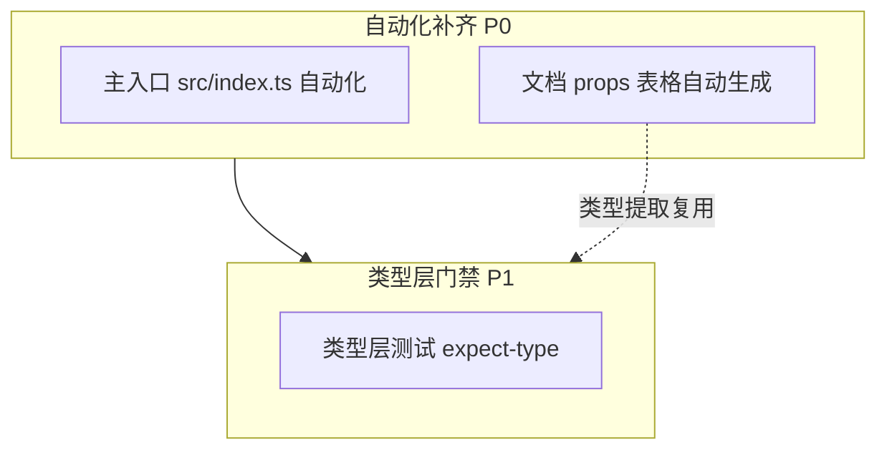

# BrutxUI (Vue 3) 项目架构优化方案 v3

本方案是 [v2 方案](./ARCHITECTURE_OPTIMIZATION_PLAN_V2.md) 的延续，而非替代。v2 的 P0/P1/P2 已几乎全部落地（含 SSR 治理、性能基准、exports 自动化、turbo/changeset、shamefullyHoist 移除、辅助包 v2 全 P0/P1 项等），v3 基于 v2 落地后的剩余张力，聚焦 ROI 最高的三个方向。

**目标**：消除主入口人工同步、补齐类型层测试门禁、自动化文档 props 表格生成。

---

## v2 落地核实

下表为对 v2 方案各章节的逐项核实结果：

| v2 章节 | v2 状态 | 落地证据 |
| --- | --- | --- |
| 1.1 vitest-axe 修复 | ✅ | [a11y.ts](../packages/ui/src/test-utils/a11y.ts) 重写为 axe-core 原生 |
| 1.2 visual 基线扩展 | ✅ | [App.vue](../packages/ui/visual/App.vue) URLSearchParams query parser + 5 核心组件单基线 |
| 1.3 bundle 体积监控 | ✅ | [package.json](../packages/ui/package.json#L529-L533) size-limit + @size-limit/esbuild + CI `pnpm size` |
| 1.4 shamefullyHoist 移除 | ✅ | 已移除（与 §5.3 联动） |
| 1.5 coverage 阶段 2/3 | ✅ | [vitest.config.ts](../packages/ui/vitest.config.ts#L48-L51) 75/75/65；阶段 3 实测与阶段 2 持平，未提升 |
| 2.1 exports 自动化 | ✅ | [generate-exports.ts](../packages/ui/scripts/generate-exports.ts) + [check-exports.ts](../packages/ui/scripts/check-exports.ts) |
| 2.2 re-export 审计 | ✅ | [src/index.ts](../packages/ui/src/index.ts) 无 `from 'reka-ui'` 对外 re-export |
| 3 SSR 兼容性 | ✅ | [env.ts](../packages/ui/src/lib/env.ts) + [eslint SSR 规则](../packages/ui/eslint.config.js) + [ssr-smoke.test.ts](../packages/ui/src/ssr/ssr-smoke.test.ts) |
| 4 性能基准 | ✅ | [render.bench.ts](../packages/ui/perf/render.bench.ts) + [bench.yml](../.github/workflows/bench.yml) |
| 5.1 turbo | ✅ | [turbo.json](../turbo.json) + CI turbo parallel |
| 5.2 changeset | ✅ | [.changeset/config.json](../.changeset/config.json) + CI changeset 检查 |
| 5.3 包间依赖显式化 | ✅ | 与 §1.4 联动 |
| 6.1 i18n 治理 | ✅ | CI `check:i18n` |
| 6.1 Algolia DocSearch | ⚠️ | 改用 VitePress `local` search，未走 Algolia 申请 |
| 6.1 @vue/repl sandbox | ❌ | 未实施（v3 不再覆盖，作为独立功能需求按需推进） |

**结论**：v2 已无实质未完成项（除 `@vue/repl` sandbox 与 Algolia 申请两项外部依赖型任务）。v3 聚焦 v2 之后的下一层张力。

---

## v3 架构总体设计

v3 聚焦"v2 之后的三个 ROI 最高方向"，按风险/收益分两层：



三方向的依赖关系：主入口自动化与文档 props 自动化都依赖 `registry-manifest.json` + `vue-tsc` 类型提取能力，类型层测试是独立的横向门禁，但可与文档自动化的类型提取共用基础设施。

---

## 1. 主入口自动化：消除人工 re-export 同步

### 现状痛点

1. **主入口仍人工维护**：[src/index.ts](../packages/ui/src/index.ts) 共 494 行，几乎全是 re-export。100+ 组件 + 30+ composable + 工具函数 + 类型 + locale 全打在一个入口。
2. **基础设施已就位但未贯通**：
   - [prebuild-scan.ts](../packages/ui/scripts/prebuild-scan.ts) 已生成 `registry-manifest.json` + `exports-manifest.json`
   - [generate-component-index.ts](../packages/ui/scripts/generate-component-index.ts) 已从 manifest 自动生成每个组件的 `index.ts`（[示例](../packages/ui/src/components/button/index.ts)，标注 `AUTO-GENERATED — DO NOT EDIT`），多组件目录（如 [spinner](../packages/ui/src/components/spinner/index.ts) 的 4 个组件）和 variants 工具函数均已包含
   - [generate-exports.ts](../packages/ui/scripts/generate-exports.ts) 已从 manifest 自动生成 `package.json` 的 `exports` 字段，支持 `--check` CI 模式
   - [composables/index.ts](../packages/ui/src/composables/index.ts) 已存在，含全部 composable 显式命名导出与别名（`destroyFallback as destroyToastFallback` / `destroyFallback as destroyThemeFallback`）
   - **但主入口 `src/index.ts` 仍是人工维护**，是 manifest → 消费侧链条上最后一处未自动化的环节
3. **漂移风险**：新增组件时需手动在 `src/index.ts` 添加 re-export，易遗漏。当前无 CI 校验主入口与 manifest 的一致性。
4. **导出分组人工维护**：[src/index.ts](../packages/ui/src/index.ts) 中导出顺序、分组（组件 / composable / 类型 / locale）全靠人工维护，无规范约束。
5. **composables 聚合点与主入口不一致**：[composables/index.ts](../packages/ui/src/composables/index.ts) 未导出 `UseClearableReturn`/`UseClipboardReturn`/`UseToastReturn`/`UseThemeReturn` 等 Return 类型，但主入口 [src/index.ts:481-484](../packages/ui/src/index.ts#L481-L484) 单独导出。若主入口改为透传 `composables/index.ts`，会丢失这 4 个类型——需先补全聚合点。
6. **directives 无聚合点**：[directives/](../packages/ui/src/directives/) 目录目前只有 `loading.ts`，无 `index.ts`。主入口 [src/index.ts:31](../packages/ui/src/index.ts#L31) 显式导出 `vLoading`。

### 落地方案

#### 1.1 主入口拆分

**决策：将 `src/index.ts` 拆为「人工维护的静态头部」+「脚本生成的自动尾部」两部分，用 sentinel 注释分割，脚本只重写 sentinel 之后的内容。**

不能完全自动化的原因：主入口包含大量非组件导出，这些导出有人工编写的注释、分组、顺序考量，不应被脚本覆盖。具体分类：

| 类别 | 来源 | 处理方式 |
| --- | --- | --- |
| 组件 re-export | `registry-manifest.json` components | **自动生成**（透传组件 `index.ts`） |
| composable re-export | `composables/index.ts` 聚合点 | **自动生成**（透传 `./composables`） |
| directive re-export | `directives/index.ts` 聚合点（需新增） | **自动生成**（透传 `./directives`） |
| lib 工具函数（cn/renderImperative/color/date 等） | 人工挑选 | **人工维护**（哪些 lib 函数需要公开是设计决策，不应自动暴露所有 lib） |
| 类型 re-export（Size/Variant/ComponentProps 等） | 人工挑选 | **人工维护**（同上） |
| plugin / devtools | 人工 | **人工维护** |
| locales 聚合 | 人工 | **人工维护** |
| 主题预设 | 人工 | **人工维护** |
| `import './styles.css'` 副作用导入 | 人工 | **人工维护**（必须在入口顶部执行） |

```typescript
// packages/ui/src/index.ts（改造后结构示意）

// ===== MANUAL SECTION — 脚本不触碰此处 =====
import './styles.css'

// lib 公开工具函数（人工挑选，不自动暴露所有 lib）
export { cn, FOCUS_RING_CLASSES } from './lib/utils'
export { renderImperative } from './lib/render-imperative'
export type { RenderImperativeOptions, RenderImperativeReturn } from './lib/render-imperative'
// ... 其余 lib 工具函数

// 类型 re-export
export type { Size, Variant, /* ... */ } from './types'

// plugin / devtools / locales / 主题预设
export { BrutxUIPlugin } from './plugin'
export { devtoolsPlugin, setupDevtools, useDevtools } from './lib/devtools-plugin'
export { useLocale, provideLocale } from './composables/useLocale'
export { zhCN, en, mergeLocale } from './locales'
export { themes, defaultTheme, /* ... */ } from './themes'

// ===== AUTO-GENERATED BELOW — 由 generate-component-index.ts 维护，请勿手动编辑 =====
// sentinel: BRUTX_AUTO_INDEX_BEGIN

// 组件：透传每个组件目录的 index.ts（含 default + variants + 多组件）
export * from './components/button'
export * from './components/badge'
// ... 其余组件按字典序透传

// composables：透传聚合点（含别名导出，由 composables/index.ts 维护）
export * from './composables'

// directives：透传聚合点（需先新增 directives/index.ts）
export * from './directives'
// sentinel: BRUTX_AUTO_INDEX_END
```

**sentinel 机制说明**：
- sentinel 是脚本与人工的契约边界，使用稳定字符串 `BRUTX_AUTO_INDEX_BEGIN` / `BRUTX_AUTO_INDEX_END`
- 脚本读取 `src/index.ts`，保留 BEGIN 之前的内容（含 sentinel 行），重写 BEGIN 与 END 之间的内容，保留 END 之后的内容（如有）
- sentinel 行本身使用 `// ` 注释前缀，不影响运行时
- 若文件中找不到 sentinel，脚本报错退出（防止误操作覆盖人工头部）

**透传策略说明**：
- 组件用 `export * from './components/${name}'` 而非 `export { default as ${Name} }`——因为 [组件 index.ts](../packages/ui/src/components/button/index.ts) 已包含 `export { default as Button }` + `export type *` + `export * from './button-variants'`，透传即可拿到全部公开 API，且能正确处理多组件目录（如 [spinner](../packages/ui/src/components/spinner/index.ts) 的 4 个 Spinner）
- composable 用 `export * from './composables'` 透传聚合点——[composables/index.ts](../packages/ui/src/composables/index.ts) 已用显式命名导出 + 别名（`destroyFallback as destroyToastFallback`）处理命名冲突，透传即可保留全部公共 API
- directive 同理透传 `./directives` 聚合点

#### 1.2 生成脚本扩展

**决策：扩展已有 `generate-component-index.ts`，新增 `buildAutoIndexSection()` + `updateMainIndex()`，不新建脚本。**

当前 [generate-component-index.ts](../packages/ui/scripts/generate-component-index.ts) 只生成 `src/components/${name}/index.ts`。本节扩展其职责，额外生成 `src/index.ts` 的 AUTO-GENERATED 段。**不新建脚本**——已有脚本已是 manifest → 文件的生成器，新建脚本会引入职责重叠。

```typescript
// packages/ui/scripts/generate-component-index.ts（扩展后）

const INDEX_SENTINEL_BEGIN = '// sentinel: BRUTX_AUTO_INDEX_BEGIN'
const INDEX_SENTINEL_END = '// sentinel: BRUTX_AUTO_INDEX_END'

function buildAutoIndexSection(manifest: RegistryManifest): string {
    const lines: string[] = []

    // 1. 组件 re-export：透传每个组件目录的 index.ts
    //    组件 index.ts 已由 buildComponentIndexContent 生成，包含：
    //      - export { default as Button } from './Button.vue'
    //      - export type * from './Button.vue'
    //      - export * from './button-variants'
    //    多组件目录（如 spinner 的 4 个 Spinner）也已正确处理
    //    主入口用 export * 透传即可，无需 PascalCase 转换
    const componentNames = Object.keys(manifest).sort()
    for (const name of componentNames) {
        lines.push(`export * from './components/${name}'`)
    }

    // 2. composable re-export：透传 composables/index.ts 聚合点
    //    composables/index.ts 用显式命名导出 + 别名处理命名冲突
    //    （destroyFallback as destroyToastFallback / destroyThemeFallback）
    //    不能用 export * from './composables/${name}' —— 会引发同名 destroyFallback 冲突
    lines.push(`export * from './composables'`)

    // 3. directive re-export：透传 directives/index.ts 聚合点
    //    需先新增 directives/index.ts（当前只有 loading.ts，无聚合点）
    lines.push(`export * from './directives'`)

    return lines.join('\n')
}

function updateMainIndex(autoSection: string): void {
    const indexPath = path.resolve(UI_SRC_DIR, 'index.ts')
    const existing = fs.readFileSync(indexPath, 'utf-8')

    const beginIdx = existing.indexOf(INDEX_SENTINEL_BEGIN)
    const endIdx = existing.indexOf(INDEX_SENTINEL_END)
    if (beginIdx === -1 || endIdx === -1 || beginIdx > endIdx) {
        throw new Error(
            `src/index.ts 缺少 sentinel 注释（${INDEX_SENTINEL_BEGIN} / ${INDEX_SENTINEL_END}）。\n` +
            '请手动在 index.ts 中需要开始自动生成的位置插入 sentinel 注释。',
        )
    }

    const before = existing.slice(0, beginIdx + INDEX_SENTINEL_BEGIN.length)
    const after = existing.slice(endIdx)
    const updated = `${before}\n${autoSection}\n${after}`
    if (updated !== existing) {
        fs.writeFileSync(indexPath, updated, 'utf-8')
    }
}
```

**`--check` 模式扩展**：与 [generate-exports.ts](../packages/ui/scripts/generate-exports.ts) 的 `--check` flag 一致，`generate-component-index.ts` 应新增 `--check` flag，生成 expected 内容后与 `src/index.ts` 的 AUTO-GENERATED 段比对，不一致则报错并输出 diff，不写文件。这样 [check-index.ts](../packages/ui/scripts/check-index.ts) 可以像 [check-exports.ts](../packages/ui/scripts/check-exports.ts) 一样做薄包装。

**无需 PascalCase 工具**：原方案曾考虑用 PascalCase 转换组件目录名生成 `export { default as ${Name} }`，但透传策略下不需要——组件 index.ts 已含 `export { default as Button }`，主入口 `export *` 即可。这也避免了"shared 包无 pascalCase 工具，需新增"的副作用。

#### 1.3 CI 校验

**决策：新增 `check-index.ts` 作为薄包装，调用 `generate-component-index.ts --check`，与 [check-exports.ts](../packages/ui/scripts/check-exports.ts) 的设计完全一致。**

[check-exports.ts](../packages/ui/scripts/check-exports.ts) 通过 `spawnSync` 调用 `generate-exports.ts --check` 实现 CI diff 模式，本身只有 ~30 行薄包装。`check-index.ts` 遵循同样模式：

```typescript
// packages/ui/scripts/check-index.ts（新增，接入 CI）
// 薄包装：调用 generate-component-index.ts --check
// 与 check-exports.ts 结构对称，便于维护
import { spawnSync } from 'node:child_process'
import { resolve, dirname } from 'node:path'
import { fileURLToPath } from 'node:url'

const __filename = fileURLToPath(import.meta.url)
const __dirname = dirname(__filename)

const tsxBin = resolve(__dirname, '..', 'node_modules', '.bin', 'tsx')

const result = spawnSync(
    tsxBin,
    [resolve(__dirname, 'generate-component-index.ts'), '--check'],
    {
        stdio: 'inherit',
        shell: process.platform === 'win32',
    },
)

process.exit(result.status ?? 1)
```

**CI 接入**：在 [ci.yml](../.github/workflows/ci.yml) 的 `quality` job 中，`Verify exports field consistency` 之后新增 `Check main index consistency` 步骤。

**package.json 新增脚本**：
```json
{
    "scripts": {
        "check:index": "tsx scripts/check-index.ts"
    }
}
```

#### 1.4 实施步骤

1. **前置：补全 [composables/index.ts](../packages/ui/src/composables/index.ts)** —— 将主入口 [src/index.ts:481-494](../packages/ui/src/index.ts#L481-L494) 中单独导出的 Return 类型（`UseClearableReturn`/`UseClipboardReturn`/`UseToastReturn`/`UseThemeReturn` 等）补充到 `composables/index.ts`，确保聚合点与主入口的 composable 公共 API 完全一致。
2. **前置：新增 `directives/index.ts`** —— 当前 [directives/](../packages/ui/src/directives/) 只有 `loading.ts`，无聚合点。新增 `directives/index.ts`，内容为 `export { vLoading } from './loading'`（显式命名导出，避免暴露未来可能加入的内部辅助文件）。
3. 在 `src/index.ts` 中插入 sentinel 注释，将所有"应自动生成"的 re-export 移到 sentinel 之后，"应人工维护"的导出移到 sentinel 之前。
4. 扩展 `generate-component-index.ts`，新增 `buildAutoIndexSection()` + `updateMainIndex()` + `--check` flag。
5. 跑 `pnpm prebuild:component-index`，验证 `src/index.ts` 的 AUTO-GENERATED 段被正确重写。
6. **审计公共 API 扩大**：跑 `pnpm --filter brutx-ui-vue build` 后，对比 `dist/index.d.ts` 与改造前的导出符号集合，确认 `export *` 透传未意外暴露内部模块（如 `shared-button-variants` 中的 `buttonVariantOptions`/`baseButtonVariants` 等）。若发现不应公开的符号被暴露，需在组件 `index.ts` 生成逻辑（`buildComponentIndexContent`）中排除，或在源文件中拆分公共/内部模块。
7. 跑 `pnpm --filter brutx-ui-vue build` + `pnpm test`，验证产物与测试不受影响。
8. 新增 `check-index.ts`，接入 CI。
9. 在 [AGENTS.md](../AGENTS.md) 的"目录结构"章节中标注 `src/index.ts` 的 sentinel 机制，说明哪些导出由脚本管理。

### 风险与取舍

- **公共 API 扩大风险（核心风险）**：`export * from './components/${name}'` 会透传组件 `index.ts` 中的全部导出，包括 `export * from './shared-button-variants'` 这类辅助模块。例如 [shared-button-variants.ts](../packages/ui/src/components/button/shared-button-variants.ts) 中的 `buttonVariantOptions`/`buttonSizeOptions`/`ButtonVariant`/`ButtonSize`/`baseButtonVariants` 会被暴露到主入口——而现状主入口 [src/index.ts:3-4](../packages/ui/src/index.ts#L3-L4) 只导出 `Button` + `buttonVariants`。**缓解**：实施步骤 6 强制审计 `dist/index.d.ts` 的导出符号集合，发现不应公开的符号需在 `buildComponentIndexContent` 中排除，或在源文件中拆分公共/内部模块。这是显式取舍：透传策略换取自动化，代价是需要审计公共 API 边界。
- **composables 聚合点依赖**：主入口透传 `./composables` 后，`composables/index.ts` 成为公共 API 的唯一来源。若新增 composable 时忘记更新 `composables/index.ts`，该 composable 不会进入主入口——但这正是聚合点模式的设计意图（显式控制公共 API），与现状"主入口逐个添加"的漂移风险等价。
- **导出顺序稳定性**：sentinel 之后的内容按字典序生成，避免 PR diff 噪音。若 IDE 自动导入依赖特定顺序，需在生成时保留稳定排序。
- **类型 re-export 的 `export type *`**：是 TypeScript 5.0+ 特性，项目已使用 TypeScript 6.0+（见 [AGENTS.md](../AGENTS.md) 技术栈），且现状 [button/index.ts](../packages/ui/src/components/button/index.ts) 已使用 `export type *`，vue-tsc 兼容性已验证。
- **不引入主入口 split**：曾评估拆分主入口为 `index.ts`（仅组件）+ `index-utils.ts`（lib/类型）等，但会破坏 `import { Button, cn } from 'brutx-ui-vue'` 的单入口体验。当前 sentinel 方案保留单入口，仅自动化内部生成。

### 禁止

- **禁止**手动编辑 `src/index.ts` 中 sentinel 之间的内容（CI `check:index` 比对，不一致则报错）。
- **禁止**在 sentinel 之后保留任何"应自动生成"的人工导出——这些会被脚本覆盖。
- **禁止**把 lib 工具函数也自动生成——哪些 lib 函数需要公开是设计决策，由人工挑选。
- **禁止**为 sentinel 机制引入配置文件——sentinel 字符串硬编码在脚本中即可，配置文件是过度设计。

---

## 2. 类型层测试：补齐类型回归门禁

### 现状痛点

1. **测试金字塔缺一角**：现有测试体系覆盖运行时行为（L1 单测 / L2 浏览器 / L3 视觉 / a11y / SSR / bench），但**类型层无任何测试**。
2. **类型回归无门禁**：refactor 时容易意外破坏公共类型 API。例如：
   - 把 `ButtonProps['variant']` 从联合类型 `'default' | 'primary' | ...` 收窄为 `string`
   - 把 `ButtonProps['loading']` 从 `boolean | undefined` 改为 `boolean`（破坏可选性）
   - 删除某个 prop（消费侧 `:loading="true"` 编译失败）
   - 修改 emits 类型（消费侧 `@click` 类型不匹配）
3. **同类项目惯例**：shadcn/ui、Radix UI、Vuetify 等均用类型层断言保障公共 API 稳定性。Vitest 4+ 内置 `expectTypeOf` API，与现有测试体系一致，无新增依赖。

### 落地方案

#### 2.1 工具选型

**决策：使用 Vitest 4+ 内置的 `expectTypeOf` API，不引入 `tsd` 或 `expect-type` 独立包。**

| 选项 | 优势 | 劣势 | 决策 |
| --- | --- | --- | --- |
| Vitest `expectTypeOf` | 零新增依赖；与现有 vitest 体系一致；同一测试文件可混用运行时与类型断言 | 表达力略弱于 `tsd`（无 `@ts-expect-error` 标签） | **采纳** |
| `tsd` | 表达力强；独立运行不与 vitest 耦合 | 多年未活跃维护；对 Vue 3 + script setup 支持有限；需独立 test runner | 否决 |
| `expect-type` | 独立包，体积小 | 与 vitest `expectTypeOf` 底层相同，重复引入无收益 | 否决 |
| 纯 `// @ts-expect-error` | 零依赖 | 表达力弱；无法断言类型相等；散落在源码中难维护 | 否决 |

`expectTypeOf` 是 Vitest 内置 API（自 v0.x 起，v4+ 已稳定），底层基于 [`expect-type`](https://github.com/mmkal/expect-type) 包（Vitest 内嵌），通过 TypeScript 条件类型在编译期触发错误——**类型断言失败 = `vue-tsc --noEmit` 编译失败**，是硬门禁。

#### 2.2 测试范围

**决策：仅覆盖公共 API 的关键类型，不追求 100% 类型覆盖。**

类型层测试的 ROI 曲线陡峭——覆盖关键联合类型（variants/sizes/emits）能捕获 80% 的回归，剩余 20%（如 `class` prop 透传、`style` 透传）的边际收益过低。具体范围：

| 测试对象 | 覆盖内容 | 优先级 |
| --- | --- | --- |
| 组件 Props 联合类型 | `variant`/`size`/`orientation` 等字面量联合类型 | P0 |
| 组件 Props 可选性 | 必填 vs 可选（`?:` 是否被意外移除） | P0 |
| 组件 Emits 类型 | 事件名 + payload 类型 | P0 |
| 组件 Slot 类型 | slot name + slot props 类型 | P1 |
| composable 返回类型 | `useToast()`/`useTheme()` 等的返回值类型 | P1 |
| VariantProps 派生 | `ButtonVariantProps['variant']` 是否能正确推导 | P1 |
| 泛型组件 | `DataTable<T>` 的泛型参数透传 | P2（按需） |

**不覆盖**：
- `class`/`style` 透传类型（Vue 内建，非组件库职责）
- `ref`/`$el` 类型（依赖运行时 DOM，类型层断言收益低）
- 内部类型（非公共导出）

#### 2.3 测试文件组织

**决策：与运行时测试同目录，使用 `.types.test.ts` 后缀，与现有 `*.test.ts` 命名约定一致。**

```
packages/ui/src/components/button/
├── Button.vue
├── Button.test.ts            # 运行时测试（已有）
├── Button.types.test.ts      # 类型层测试（新增）
├── button-variants.ts
└── index.ts
```

`.types.test.ts` 后缀与 vitest 默认 include 模式 `src/**/*.{test,spec}.{ts,tsx}` 匹配，无需修改 [vitest.config.ts](../packages/ui/vitest.config.ts)。

#### 2.4 测试用例范式

```typescript
// packages/ui/src/components/button/Button.types.test.ts
import { describe, it, expectTypeOf } from 'vitest'
import type { ComponentProps } from 'vue'
import { Button } from './Button.vue'
import type { ButtonVariantProps } from './button-variants'

// 通过 ComponentProps<typeof Button> 推导 Props 类型，避免在组件内 export ButtonProps
// （若 export ButtonProps，§1.2 的 export * 透传会把它暴露到主入口，违反"不通过主入口导出内部类型"原则）
type ButtonProps = ComponentProps<typeof Button>

describe('Button types', () => {
    // P0：Props 联合类型
    describe('Props variant', () => {
        it('variant should be a union of literal strings (with undefined for optionality)', () => {
            // ButtonProps['variant'] 实际类型为 NonNullable<ButtonVariantProps['variant']> | undefined
            // 因为 interface ButtonProps 中 variant?: 是可选的
            expectTypeOf<ButtonProps['variant']>().toEqualTypeOf<
                'default' | 'primary' | 'secondary' | 'accent' | 'danger' | 'success' | 'outline' | 'ghost' | 'link' | undefined
            >()
        })

        it('size should be a union of literal strings including icon', () => {
            // size 包含 'icon'（见 button-variants.ts 与 button.md）
            expectTypeOf<ButtonProps['size']>().toEqualTypeOf<
                'sm' | 'default' | 'lg' | 'xl' | 'icon' | undefined
            >()
        })
    })

    // P0：Props 可选性
    describe('Props optionality', () => {
        it('loading should be optional boolean', () => {
            expectTypeOf<ButtonProps['loading']>().toEqualTypeOf<boolean | undefined>()
        })

        it('asChild should be optional boolean', () => {
            expectTypeOf<ButtonProps['asChild']>().toEqualTypeOf<boolean | undefined>()
        })
    })

    // P0：组件实例类型
    describe('Component instance', () => {
        it('Button should be a Vue component', () => {
            expectTypeOf(Button).toBeComponent()
        })
    })
})
```

**ButtonProps 导出策略**：**不在组件内 `export interface ButtonProps`**，而是通过 `ComponentProps<typeof Button>`（Vue 3.3+ 内建工具类型）从组件实例推导 Props 类型。原因：
- 若在 `Button.vue` 中 `export ButtonProps`，§1.2 主入口的 `export * from './components/button'` 透传会把它暴露到主入口——违反"不通过主入口导出内部类型"原则。
- `ComponentProps<typeof Button>` 是 Vue 官方推荐的推导方式，无需修改源码，零侵入。
- 该方式依赖 `vue` 包的 `ComponentProps` 类型（Vue 3.3+ 引入），项目 Vue 3.5+ 已支持。

#### 2.5 CI 集成

**决策：类型层测试随现有 `pnpm typecheck` 一起跑，不新增独立 CI 步骤；同时从 vitest 运行时 exclude，避免无意义的运行时执行。**

`expectTypeOf` 的类型断言通过 TypeScript 条件类型在编译期触发错误，`vue-tsc --noEmit` 解析到该测试文件时即生效。当前 [ci.yml](../.github/workflows/ci.yml) 的 `quality` job 已有 `turbo run typecheck`，类型层测试自动被覆盖，无需额外步骤。

**但需调整 [vitest.config.ts](../packages/ui/vitest.config.ts) 的 `exclude`**：现状 `include: ['src/**/*.{test,spec}.{ts,tsx}']` 会让 `.types.test.ts` 也被 vitest 当作运行时测试执行。`expectTypeOf` 在运行时并非纯 noop（它返回带断言方法的对象，且 `import { Button } from './Button.vue'` 会触发 .vue 文件解析），虽无运行时副作用但有开销，且若测试文件本身有运行时 error（如 import 失败）会污染测试结果。**决策：在 `exclude` 中新增 `src/**/*.types.test.ts`**，让类型测试只走 `vue-tsc`，不被 vitest 运行时执行：

```typescript
// packages/ui/vitest.config.ts（调整后）
test: {
    include: ['src/**/*.{test,spec}.{ts,tsx}'],
    exclude: [
        'src/**/*.browser.test.ts',
        'src/**/*.types.test.ts',  // 新增：类型测试只走 vue-tsc，不跑运行时
        ...defaultExclude,
    ],
    // ...
}
```

**注意**：`.types.test.ts` 仍需被 `vue-tsc` 的 `include` 覆盖（tsconfig.json 的 `include` 通常是 `src/**/*`），否则类型断言不会触发。项目当前 [tsconfig.json](../packages/ui/tsconfig.json) 已覆盖 `src` 全部文件，无需调整。

#### 2.6 实施步骤

1. 在 [packages/ui/package.json](../packages/ui/package.json) 的 `dependencies` 或 `devDependencies` 确认 `vitest` 版本 ≥ 4.0（已是 v4+，无需升级）。
2. 在 [vitest.config.ts](../packages/ui/vitest.config.ts) 的 `exclude` 中新增 `src/**/*.types.test.ts`（见 §2.5）。
3. 选择 P0 优先级组件（含联合类型 props 的）：
   - `Button`（variant/size/effect/glitchSpeed/glitchDirection）
   - `Badge`（variant/size）
   - `Card`（variant）
   - `Input`（variant）
   - `Alert`（variant）
   - `Spinner`（variant/size）
   - `Tabs`（orientation）
   - `Accordion`（orientation）
4. 为每个 P0 组件新增 `Xxx.types.test.ts`，使用 `ComponentProps<typeof Xxx>` 推导 Props 类型，覆盖 Props 联合类型 + 可选性 + 组件实例类型。**不修改组件源码**（不导出 `XxxProps`）。
5. 跑 `pnpm --filter brutx-ui-vue typecheck` 验证全部类型断言通过。
6. P1 组件（Slot 类型、composable 返回类型）按需推进，不强制全部覆盖。

### 风险与取舍

- **测试文件本身可能含类型错误**：`.types.test.ts` 也是 TypeScript 文件，`vue-tsc` 会同时校验测试文件与被测代码。若测试文件本身有类型错误，会污染 typecheck 结果。**缓解**：测试文件用 `expectTypeOf` 的链式 API，类型错误通常很明确，易定位。
- **类型断言的脆性**：refactor 公共类型时需同步更新类型测试。**这是预期行为**——类型测试的存在正是为了强制 refactor 时显式思考公共 API 变更。
- **`expectTypeOf` 的 `.toEqualTypeOf` 与 `.toMatchTypeOf` 差异**：前者要求类型严格相等，后者允许子类型。**约定**：联合类型用 `toEqualTypeOf`（严格），可选性用 `toEqualTypeOf<X | undefined>`（明确可选）。
- **不覆盖运行时行为**：类型层测试只验证类型推导正确，不验证运行时行为。运行时回归由现有 L1/L2 测试覆盖，二者互补。

### 禁止

- **禁止**为追求 100% 类型覆盖而给每个 prop 都写断言——只覆盖联合类型、可选性、emits 等关键 API。
- **禁止**在类型测试中调用 `mount()` 或任何运行时 API——类型测试是纯编译期检查，不应有运行时副作用。
- **禁止**在组件源码中 `export interface XxxProps` 仅为类型测试使用——应通过 `ComponentProps<typeof Xxx>` 推导，避免 §1.2 主入口 `export *` 透传把内部类型暴露到公共 API。
- **禁止**使用 `// @ts-expect-error` 作为主要断言手段——它只能验证"此处有类型错误"，无法验证"类型等于 X"。仅用于验证"不应接受的类型确实被拒绝"。

---

## 3. 文档 props 表格自动化

### 现状痛点

1. **文档 props 表格覆盖率不均**：实测 `apps/docs/components/` 下 77 个组件文档已有手工 `## Props` 表格（如 [button.md:166-196](../apps/docs/components/button.md#L166-L196)、[badge.md:207-230](../apps/docs/components/badge.md#L207-L230)），但仍有约 25 个组件文档缺表格。手工补齐剩余组件成本高，且现有表格无机制校验与代码的一致性。
2. **手工维护易漂移**：组件 props 变更后文档表格易与代码脱节。当前无 CI 校验文档表格与组件实际 props 的一致性，漂移只能靠人工 review 发现。
3. **已有基础设施未利用**：
   - [vue-tsc](../packages/ui/package.json) 已在 CI 跑 typecheck，具备类型提取能力
   - [COMPONENT_METADATA](../packages/shared/src/component-metadata.ts) 已提供组件元数据（title/description/category）
   - [generateComponentsSidebar](../apps/docs/.vitepress/theme/lib/sidebar-generator.ts) 已自动生成 sidebar
   - 但 props 表格仍无自动化
4. **组件 props 已有 JSDoc 注释**：如 [Button.vue:24](../packages/ui/src/components/button/Button.vue#L24) 的 `pendingText` 已有 `/** 加载中显示的等待文本... */` 注释，这些注释应自动出现在文档表格中。

**价值重新定位**：本方案的核心价值不是"补齐缺失表格"（剩余 25 个可手工补），而是"建立文档表格与代码的一致性校验机制"——通过自动生成 + CI 比对，让任何 props 变更都能被检测到。手工表格保留作为"权威内容"，自动生成片段作为"校验基线"。

### 落地方案

#### 3.1 工具选型

**决策：使用 [`vue-component-meta`](https://www.npmjs.com/package/vue-component-meta) 提取组件类型，自研脚本生成 VitePress 兼容的 markdown 表格。**

| 选项 | 优势 | 劣势 | 决策 |
| --- | --- | --- | --- |
| `vue-component-meta` | vuejs/language-tools 团队维护（Volar 工具链）；对 Vue 3 + script setup 原生支持；可提取 props/emits/slots/events 及 JSDoc | 需正确配置 tsconfig；输出是结构化对象，需自研 markdown 渲染 | **采纳** |
| `vue-docgen-cli` | 开箱即用，直接输出 markdown | 对 Vue 3 + script setup 支持有限；维护活跃度低；输出格式定制难 | 否决 |
| 自研 AST 提取 | 完全可控 | 重复造轮子；Vue SFC 解析复杂；JSDoc 提取需额外工作 | 否决 |
| 手工维护 | 零工具成本 | 100+ 组件手工成本爆炸；漂移无门禁 | 否决（现状） |

`vue-component-meta` 是 Volar 工具链的一部分（npm 包名 `vue-component-meta`，无 `@vue` scope），已在 Vue 生态广泛使用。它接受 `tsconfig.json` 路径，通过 `createChecker()` 返回 checker 实例，调用 `checker.getComponentMeta(filePath)` 返回 `ComponentMeta`（props/emits/slots/events + 类型 + JSDoc + 默认值）。

#### 3.2 脚本设计

**决策：新增 `scripts/generate-props-docs.ts`，从 `exports-manifest.json` 遍历组件，输出 markdown 片段文件。**

```typescript
// packages/ui/scripts/generate-props-docs.ts（新增）
import { createChecker, type ComponentMeta } from 'vue-component-meta'
import { readFileSync, writeFileSync, mkdirSync } from 'node:fs'
import { resolve, dirname } from 'node:path'
import { fileURLToPath } from 'node:url'

const __filename = fileURLToPath(import.meta.url)
const __dirname = dirname(__filename)

interface ExportsManifest {
    components: string[]
    composables: string[]
    directives: string[]
}

const PACKAGE_ROOT = resolve(__dirname, '..')
const TSCONFIG_PATH = resolve(PACKAGE_ROOT, 'tsconfig.json')
const EXPORTS_MANIFEST_PATH = resolve(PACKAGE_ROOT, 'exports-manifest.json')
// 输出到 docs 目录的 _props 子目录（下划线前缀，配合 srcExclude 排除路由）
const OUTPUT_DIR = resolve(PACKAGE_ROOT, '..', '..', 'apps', 'docs', 'components', '_props')

function escapeMarkdownTable(text: string): string {
    return text.replace(/\|/g, '\\|').replace(/\n/g, ' ')
}

function renderPropsTable(meta: ComponentMeta): string {
    if (meta.props.length === 0) return '_无 props_\n'
    const rows = meta.props.map(prop => {
        const name = `\`${prop.name}\``
        const type = `\`${escapeMarkdownTable(prop.type)}\``
        const required = prop.required ? '是' : '否'
        const default = prop.default !== undefined ? `\`${prop.default}\`` : '-'
        const description = escapeMarkdownTable(prop.description || '')
        return `| ${name} | ${type} | ${required} | ${default} | ${description} |`
    })
    return [
        '| 名称 | 类型 | 必填 | 默认值 | 说明 |',
        '| --- | --- | --- | --- | --- |',
        ...rows,
    ].join('\n')
}

function renderEmitsTable(meta: ComponentMeta): string {
    if (meta.events.length === 0) return '_无事件_\n'
    const rows = meta.events.map(event => {
        const name = `\`${event.name}\``
        const type = `\`${escapeMarkdownTable(event.type)}\``
        const description = escapeMarkdownTable(event.description || '')
        return `| ${name} | ${type} | ${description} |`
    })
    return [
        '| 名称 | 类型 | 说明 |',
        '| --- | --- | --- |',
        ...rows,
    ].join('\n')
}

function renderSlotsTable(meta: ComponentMeta): string {
    if (meta.slots.length === 0) return '_无插槽_\n'
    const rows = meta.slots.map(slot => {
        const name = `\`${slot.name}\``
        const type = `\`${escapeMarkdownTable(slot.type)}\``
        const description = escapeMarkdownTable(slot.description || '')
        return `| ${name} | ${type} | ${description} |`
    })
    return [
        '| 名称 | 作用域 | 说明 |',
        '| --- | --- | --- |',
        ...rows,
    ].join('\n')
}

function main(): void {
    const manifest: ExportsManifest = JSON.parse(
        readFileSync(EXPORTS_MANIFEST_PATH, 'utf-8'),
    )

    const checker = createChecker(TSCONFIG_PATH, {
        forceUseTs: true,
        schema: { ignore: ['HTMLElement'] },
    })

    mkdirSync(OUTPUT_DIR, { recursive: true })

    for (const component of manifest.components) {
        // 组件入口：src/components/${component}/index.ts
        // 对多组件目录（如 spinner），index.ts re-export 了多个 .vue，
        // vue-component-meta 的 getComponentMeta 默认取 default 导出，
        // 多组件目录需遍历 getExportNames 逐个提取（此处简化为单组件示例）
        const entryPath = resolve(PACKAGE_ROOT, 'src', 'components', component, 'index.ts')
        const meta = checker.getComponentMeta(entryPath)

        const content = [
            `<!-- AUTO-GENERATED by scripts/generate-props-docs.ts — DO NOT EDIT -->`,
            `<!-- Source: src/components/${component}/ -->`,
            ``,
            `## Props`,
            ``,
            renderPropsTable(meta),
            ``,
            `## Emits`,
            ``,
            renderEmitsTable(meta),
            ``,
            `## Slots`,
            ``,
            renderSlotsTable(meta),
        ].join('\n')

        writeFileSync(resolve(OUTPUT_DIR, `${component}.md`), content, 'utf-8')
    }
}

main()
```

**多组件目录处理**：[spinner/index.ts](../packages/ui/src/components/spinner/index.ts) 含 4 个 .vue 组件（Spinner/BlockSpinner/DotsSpinner/BarsSpinner），`getComponentMeta` 默认取 default 导出。完整实现需调用 `checker.getExportNames(entryPath)` 遍历每个命名导出，分别 `getComponentMeta(filePath, exportName)` 提取——P0 试点可先只处理单组件目录，多组件目录留待 P1 完善。

#### 3.3 文档集成

**决策：对已有手工表格的组件文档，用 `include` 引用自动生成片段作为"参考"小节，不替换手工表格；对缺表格的组件文档，直接 `include` 作为正式表格。**

VitePress 支持在 markdown 中通过 `@[include](path)` 语法引入其他 markdown 文件的内容。此语法在 VitePress 1.x 已稳定。

```markdown
<!-- apps/docs/components/button.md（已有手工表格的组件） -->

## Props

<!-- 手工维护的权威表格（含中文说明、特殊行为说明） -->
| 名称 | 类型 | 必填 | 默认值 | 说明 |
| --- | --- | --- | --- | --- |
| variant | 'default' \| 'primary' \| ... | 否 | 'default' | 按钮视觉样式 |
...

## 参考（自动生成，与代码同步）

<!-- 引用自动生成片段，仅用于校验一致性，不作为主要阅读内容 -->
@[include](_props/button.md)
```

```markdown
<!-- apps/docs/components/some-component.md（缺表格的组件） -->

## Props

@[include](_props/some-component.md)
```

**为何保留手工表格**：实测 [button.md:166-196](../apps/docs/components/button.md#L166-L196) 等已有手工表格包含精心编写的中文说明（如 `pendingText` 的"加载中显示的等待文本，作为默认插槽的回退内容；仅在 type=submit 且 loading 时生效"），这种说明远超 JSDoc 能表达的信息。自动生成片段作为"参考"小节，既保留人工价值，又提供校验基线。

**已有手工表格与自动生成片段冲突时的处理**：CI 校验（§3.4）会比对两者的 props 名称、类型、必填性、默认值四个字段（不含 description，因为手工描述更详尽）。若不一致，CI 报错并提示"手工表格与代码脱节，请检查"。

**`_props/` 目录约定**：
- 整个目录 gitignored（自动生成，不入库）
- CI 在 `pnpm docs:build` 前自动跑 `pnpm generate:props-docs` 生成
- VitePress 的下划线前缀忽略约定**仅适用于 srcDir 顶层文件/目录**，子目录中 `_` 前缀的目录不会自动忽略——`apps/docs/components/_props/` 下的 `.md` 默认会被渲染为 `/components/_props/button` 路由页面。需在 [.vitepress/config.ts](../apps/docs/.vitepress/config.ts) 显式配置 `srcExclude`：

```typescript
// apps/docs/.vitepress/config.ts（新增 srcExclude）
export default defineConfig({
    // ... 现有配置
    srcExclude: ['**/_props/**'],  // 新增：排除自动生成片段的路由
    // ...
})
```

#### 3.4 CI 校验

**决策：`_props/` gitignored 不入库，CI 不做"已提交版本比对"；改为做"手工表格与自动生成片段的一致性校验"——读取手工表格的 props 名称/类型/必填性/默认值，与自动生成的对比，不一致则报错。**

`_props/` 是 gitignored 的自动生成产物，无法做"与已提交版本比对"。但 §3.3 提到已有手工表格的组件文档会同时存在手工表格 + include 自动片段，两者必须一致才有意义。因此 CI 校验的核心是"手工表格与代码一致性"，而非"自动片段与已提交版本一致性"。

| 校验项 | 实现方式 | CI 行为 |
| --- | --- | --- |
| 自动片段可生成 | `pnpm generate:props-docs` 不报错（组件类型提取无异常） | docs build 前置步骤，失败则 docs build fail |
| 手工表格与代码一致 | 新增 `check:props-docs` 脚本：解析组件文档中的手工 `## Props` 表格，提取 props 名称/类型/必填性/默认值四字段，与自动生成的 `_props/${component}.md` 比对 | 不一致则报错并输出 diff，提示"手工表格与代码脱节" |
| 缺表格组件的 include 存在性 | 同一脚本检查：若组件文档无手工 `## Props` 表格，则必须含 `@[include](_props/${component}.md)` | 缺失则报错，提示"缺表格的组件必须 include 自动片段" |

**`check:props-docs` 脚本设计**：

```typescript
// packages/ui/scripts/check-props-docs.ts（新增）
// 1. 跑 generate-props-docs 生成 _props/ 到临时目录
// 2. 遍历 apps/docs/components/*.md，解析手工 ## Props 表格
// 3. 对每个组件，比对手工表格与自动生成的 props 名称/类型/必填性/默认值
// 4. 不一致则报错并输出 diff
// 5. 对缺手工表格的组件，检查是否含 @[include](_props/${component}.md)
```

**CI 接入**：在 [ci.yml](../.github/workflows/ci.yml) 的 `quality` job 中，`Check main index consistency` 之后新增 `Check props docs consistency` 步骤。

**package.json 新增脚本**：
```json
{
    "scripts": {
        "check:props-docs": "tsx scripts/check-props-docs.ts"
    }
}
```

**显式取舍**：放弃"自动片段入库比对"，换取零 PR diff 噪音；保留"手工表格与代码一致性校验"，确保漂移可被 CI 捕获。这是 §3.3 "保留手工表格作为权威内容 + 自动片段作为校验基线"策略的配套门禁。

#### 3.5 实施步骤

1. `pnpm --filter brutx-ui-vue add -D vue-component-meta`。
2. 新增 [packages/ui/scripts/generate-props-docs.ts](../packages/ui/scripts/generate-props-docs.ts)。
3. 在 `apps/docs/components/` 下创建 `_props/` 目录，添加 `.gitignore`（忽略整个目录）。
4. 在 [.vitepress/config.ts](../apps/docs/.vitepress/config.ts) 新增 `srcExclude: ['**/_props/**']`，排除 `_props/` 子目录的路由渲染。
5. 在 `packages/ui/package.json` 新增脚本：
   ```json
   {
       "scripts": {
           "generate:props-docs": "tsx scripts/generate-props-docs.ts",
           "check:props-docs": "tsx scripts/check-props-docs.ts"
       }
   }
   ```
6. 新增 [packages/ui/scripts/check-props-docs.ts](../packages/ui/scripts/check-props-docs.ts)，实现手工表格与自动片段的一致性校验。
7. 在 `apps/docs/package.json` 的 `build` 脚本前加 `pnpm --filter brutx-ui-vue generate:props-docs &&`，确保 docs build 前先生成。
8. 选择 3-5 个组件（Button/Card/Input/Alert/Badge）试点：
   - 已有手工表格的（Button/Badge/Card/Alert）：在手工表格后新增 `## 参考（自动生成，与代码同步）` 小节，加 `@[include](_props/${component}.md)`
   - 缺手工表格的（Input 等）：直接 `## Props` 下加 `@[include](_props/${component}.md)`
9. 跑 `pnpm --filter brutx-ui-vue generate:props-docs` + `pnpm --filter docs build`，验证 VitePress 渲染无异常，且 `_props/` 未生成路由页面。
10. 跑 `pnpm --filter brutx-ui-vue check:props-docs`，验证一致性校验通过。
11. 试点通过后，为全部 100+ 组件文档加 include（按步骤 8 的两种策略分类处理）。
12. 在 [AGENTS.md](../AGENTS.md) 的"目录结构"章节中标注 `_props/` 目录的自动生成机制与 `check:props-docs` 门禁。

### 风险与取舍

- **`vue-component-meta` 的 tsconfig 依赖**：需正确的 `tsconfig.json` 配置（paths/extends 等）。项目已有 [tsconfig.json](../packages/ui/tsconfig.json) 用于 vue-tsc，可直接复用。若 component-meta 与 vue-tsc 的类型推导结果不一致，需调试配置。
- **JSDoc 注释覆盖率**：当前组件 props 的 JSDoc 注释覆盖率不全（如 Button 的 `pendingText` 有注释，但 `variant`/`size` 等无注释）。生成的表格"说明"列会为空。**缓解**：在实施过程中逐步补全 JSDoc 注释，但不作为本方案的阻塞项——表格本身已比现状（无表格）有显著改进。
- **复杂类型的 markdown 渲染**：如 `DataTableColumn<T>` 泛型类型在 markdown 表格中可能显示为 `DataTableColumn<T>`，需确保泛型符号不被 markdown 误解析。`escapeMarkdownTable` 中的 `replace(/\|/g, '\\|')` 已转义管道符，泛型尖括号 `<` `>` 在 markdown 表格中无需转义。
- **include 语法的相对路径**：`@[include](_props/button.md)` 是相对于当前 markdown 文件的路径。需确保所有组件文档的 include 路径一致（`_props/` 始终在 `apps/docs/components/_props/`）。
- **多组件目录的提取复杂度**：[spinner/index.ts](../packages/ui/src/components/spinner/index.ts) 等多组件目录需遍历 `getExportNames` 逐个提取，P0 试点先跳过这类目录，P1 完善。
- **不生成"用法示例"**：用法示例涉及人工挑选场景，不自动生成。仅生成 Props/Emits/Slots 表格。

### 禁止

- **禁止**直接覆盖人工编写的组件文档——`_props/` 片段通过 include 引用，保留人工内容。
- **禁止**为每个 prop 都强制要求 JSDoc 注释——JSDoc 覆盖率提升是独立改进方向，不作为本方案的阻塞项。
- **禁止**把 `_props/` 目录入库——会引入 PR diff 噪音，违反"自动生成产物不入库"原则。
- **禁止**用 `vue-docgen-cli` 等替代方案——`vue-component-meta` 已满足需求，多工具并存是技术债。
- **禁止**自动生成"用法示例"或"迁移指南"——这些是人工内容，自动化只会产出低质量文本。

---

## 4. 渐进式实施

按风险/收益排序，分两阶段：

### P0（低风险高收益，先行）

- **主入口自动化**（§1）：sentinel 机制 + 生成脚本扩展 + CI 校验
- **文档 props 表格自动化**（§3）：component-meta 提取 + include 集成

### P1（中风险，核心门禁）

- **类型层测试**（§2）：expect-type 覆盖 P0 组件 Props 联合类型 + 可选性

> **说明**：§2（类型层测试）虽标记为 P1，但与 §3（文档 props 自动化）有依赖关系：§2 的 `expectTypeOf` 断言依赖 `vue-tsc` 类型推导，§3 的 `vue-component-meta` 也依赖 `vue-tsc` 的类型解析能力——二者共用 `tsconfig.json` 配置与 Vue SFC 类型基础设施。建议在 P0 实施 §3 时验证 `vue-component-meta` 与 `vue-tsc` 的类型推导一致性，P1 时复用该验证结果补充类型断言。§1（主入口自动化）独立于二者，只需 manifest 文件清单，不依赖类型提取。

---

## 附录 A：v3 方案与 v1/v2 的关系

| 维度 | v1 方案 | v2 方案 | v3 方案 |
| --- | --- | --- | --- |
| 核心方向 | 模块解耦 + 构建重写 + CLI 共享基座 + 设计令牌 + 测试分层 | 工具链健康度 + 产物治理 + SSR + 性能 + monorepo | 主入口自动化 + 类型层测试 + 文档 props 自动化 |
| 痛点来源 | v1 时项目的架构缺陷 | v1 落地后发现的下一层痛点 | v2 落地后剩余的"最后一公里"张力 |
| 实施风险 | 高（重写构建、重构 CLI） | 中（多为新增，少破坏性） | 低（sentinel 机制保留人工内容；类型测试零运行时影响；文档自动化仅新增不覆盖） |
| 与前序的依赖 | 无 | 依赖 v1 落地成果 | 依赖 v2 落地成果（registry-manifest、exports-manifest、generate-component-index） |

## 附录 B：审计方法论说明

本方案的痛点均基于直接读取源码核实：

- [generate-component-index.ts](../packages/ui/scripts/generate-component-index.ts) 已存在并接入 `pnpm prebuild:component-index`，生成每个组件的 `index.ts`（[示例](../packages/ui/src/components/button/index.ts)），但主入口 `src/index.ts` 仍人工维护——v3 §1 痛点
- [src/index.ts](../packages/ui/src/index.ts) 共 494 行 re-export，无 CI 校验与 manifest 的一致性——v3 §1 痛点
- [vitest.config.ts](../packages/ui/vitest.config.ts) 测试体系无类型层断言；[Button.vue](../packages/ui/src/components/button/Button.vue) 的 `ButtonProps` interface 未导出——v3 §2 痛点
- `apps/docs/components/` 下 77 个组件文档已有手工 `## Props` 表格（如 [button.md:166-196](../apps/docs/components/button.md#L166-L196)），但仍有约 25 个缺表格，且无机制校验手工表格与代码一致性——v3 §3 痛点
- [sidebar-generator.ts](../apps/docs/.vitepress/theme/lib/sidebar-generator.ts) 已自动生成 sidebar，是文档自动化的既有基础设施——v3 §3 落地依据

凡是在 v1/v2 方案中已落地的内容，v3 不再重复，仅标注落地证据。
