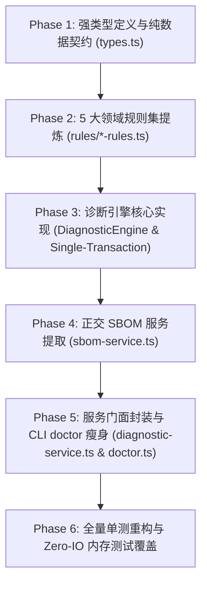

# CLI声明式诊断巡检与自愈引擎方案

> 方案类型：底层架构重构与深模块封装
> 状态：**draft**
> 日期：2026-08-19
> 关联文档：[CLI项目上下文与路径解析引擎封装方案](CLI项目上下文与路径解析引擎封装方案.md)；[架构优化方案-v3](架构优化方案-v3.md)；[CONTEXT.md](../../CONTEXT.md)
> 修订记录：
> - 2026-08-19：初稿定稿。确立声明式 DiagnosticEngine 架构、5 大领域规则集（env/config/tailwind/structure/integrity）、基于 ProjectContext 与 FileSystemAdapter 的无 IO 纯数据巡检与原子自愈事务契约，正交剥离 CycloneDX SBOM 导出至 sbom-service。
> - 2026-08-19：架构审查与契约完善。消除 DiagnosticRepairContext 配置双源分叉风险（绑定 ProjectContext.bindConfig），CheckResult 补齐 ruleId，RuleFixResult 确立三态枚举（applied/skipped/failed），确立确定性拓扑规则调度与单事务原子自愈边界，补充非 TTY/CI 交互安全防御契约与深模块外部命令复用范式。

---

## 一、 背景与第一性原理

### 1. 现状痛点分析

在 BrutxUI Vue 3 CLI（`packages/cli`）当前的代码实现中，`packages/cli/src/commands/doctor.ts` 呈现为典型的**千行单体过程式脚本（1158 lines）**，存在严重的**职责糅杂（Fat Command）**与**UI 交互强耦合（Hardwired UI Coupling）**问题：

```text
┌─────────────────────────────────────────────────────────────────────────────┐
│                       当前 doctor.ts (1158 lines) 架构现状                   │
├─────────────────────────────────────────────────────────────────────────────┤
│ 1. 20+ 个健康检查函数过程式内联 (逻辑杂糅，无法跨命令复用)                     │
│    ├─ checkNodeVersion, checkWorkspaceHint, checkConfigExists, checkSchema  │
│    ├─ checkConfigVersion, checkStyle, checkTailwindCss, checkAliases        │
│    ├─ checkDependencies, checkUtilsFunction, checkComponentIntegrity...     │
│    └─ init / add / update 等命令出错时无法精准调用特定检查规则做环境诊断     │
│                                                                             │
│ 2. 诊断、命令行交互与终端渲染深度耦合 (缺少纯数据 Seam)                     │
│    ├─ 规则内部直接交织 chalk 高亮、ora 旋转动画与 inquirer 交互式确认        │
│    ├─ 无法以无副作用、无 IO 污染的纯数据方式在编程式 API / CI 中运行         │
│    └─ 单元测试被迫 mock stdout 与 inquirer，无法做轻量 headless 断言         │
│                                                                             │
│ 3. 修复逻辑 (applyFixes) 采用单体 switch-case 硬编码                         │
│    ├─ 9 种 FixId 的修复逻辑与写回操作全部堆在一个巨大函数中                 │
│    ├─ 缺少精准的执行状态反馈 (无法清晰界定 applied / skipped / failed)       │
│    └─ 修复规则无法独立进行单元测试与扩展                                    │
│                                                                             │
│ 4. 正交职责严重越界 (SBOM 供应链生成与健康巡检混为一谈)                      │
│    ├─ generateProjectSbom (CycloneDX 1.5 JSON 序列化) 硬塞在 doctor.ts       │
│    └─ 使诊断命令承担了资产盘点与供应链安全导出的异构职责                    │
│                                                                             │
│ 5. 磁盘与上下文抽象渗透未完全闭环                                            │
│    ├─ 虽已有 ProjectContext 与 FileSystemAdapter，但 doctor.ts 内部多处     │
│    │  仍直接引入 node:fs/fs-extra，测试依赖真实的 temp 磁盘目录              │
│    └─ 未能充分利用 MemoryFileSystemAdapter 达成零 IO 毫秒级测试              │
└─────────────────────────────────────────────────────────────────────────────┘
```

1. **接口暴露过窄、能力被锁死在 CLI 层（Locked Capability）**：
   20+ 项涉及配置规范、CSS 令牌注入、别名有效性、组件完整性与哈希漂移的高价值诊断规则，全部锁死在 `doctor.ts` 闭包内。`init` 在初始化完成后无法直接运行后置自检；`add` / `update` 在环境损坏（如缺少 `cn()` 或 CSS 令牌丢失）时无法调用诊断自愈能力。
2. **缺乏声明式规则抽象（Imperative Coupling）**：
   新增一项检查需在 `doctor.ts` 中手写 `check*` 函数、在 `collectChecks` 中手动插入调用、在 `applyFixes` 的巨大 `switch-case` 中追加分支，容易遗漏且破坏开闭原则。
3. **副作用与纯数据未解耦（Side-effect Leakage）**：
   巡检、修复交互、终端输出耦合在一起，缺少一个输入 `(cwd, context)` 并纯净返回结构化 `DiagnosticReport` 的深模块接口。
4. **正交职责混合（Domain Pollution）**：
   CycloneDX 1.5 项目 SBOM 导出（`--sbom`）属于供应链安全物料清单生成，与项目健康诊断正交，混入 `doctor.ts` 使得模块内聚性严重下降。

---

## 二、 架构设计与核心契约

### 1. 深度上下文契约与单数据源：`DiagnosticContext`

诊断引擎全面依托已有的 `ProjectContext` 与 `FileSystemAdapter`（VFS），消除对物理磁盘的直接依赖，支持生产磁盘与零 IO 内存沙箱无缝切换。

#### 配置单一真实数据源（Single Source of Truth）
为避免在自愈过程中 `DiagnosticRepairContext.mutableConfig` 与 `ProjectContext.config` 产生分叉（Split-Brain），在进入修复会话时，必须通过 `projectContext.bindConfig(mutableConfig)` 完成绑定，确保所有规则与上下文辅助方法访问的始终为同一内存对象引用。

```typescript
import type { BrutalistConfig, BrutxManifest, FileSystemAdapter, ProjectContext } from '../index.js';
import type { FileTransaction } from '../file-transaction.js';

export interface DiagnosticContext {
    /** 当前执行上下文的工作目录绝对路径 */
    readonly cwd: string;
    /** 项目上下文聚合根（内置路径解析引擎与 VFS） */
    readonly projectContext: ProjectContext;
    /** 文件系统适配器（DiskFS 或 MemoryFS） */
    readonly fs: FileSystemAdapter;
    /** 解析到的项目配置；未初始化或无效时为 null */
    readonly config: BrutalistConfig | null;
    /** 解析到的组件清单；无清单时为 null */
    readonly manifest: BrutxManifest | null;
    /** 是否处于离线模式（--offline 或 BRUTX_OFFLINE=1） */
    readonly offline: boolean;
}

export interface DiagnosticRepairContext extends DiagnosticContext {
    /** 当前自愈会话绑定的统一事务实例（确保原子写回与回滚） */
    readonly transaction: FileTransaction;
    /** 当前可变的内存配置引用（与 projectContext.config 保持同源绑定） */
    readonly mutableConfig: BrutalistConfig;
    /** 标记配置对象是否被修复规则修改（引擎据此在事务中写回 components.json） */
    markConfigDirty: () => void;
}
```

---

### 2. 声明式规则模型与双向追踪：`DiagnosticRule`

将所有检查项抽象为强类型的声明式规则对象，支持元数据过滤、智能短路、规则双向溯源与自愈能力绑定：

```typescript
import type { FixId } from '../types.js';

export type DiagnosticCategory = 'env' | 'config' | 'tailwind' | 'structure' | 'integrity';

export type CheckStatus = 'pass' | 'warn' | 'error';

export type RuleFixStatus = 'applied' | 'skipped' | 'failed';

export interface CheckResult {
    /** 所属规则的唯一标识，如 'structure.utils-cn' */
    readonly ruleId: string;
    /** 检查项人类可读名称 */
    readonly name: string;
    /** 状态判定 */
    readonly status: CheckStatus;
    /** 详细描述信息 */
    readonly message: string;
    /** 修复标识枚举 */
    readonly fixId?: FixId;
    /** 修复操作简述 */
    readonly fixDescription?: string;
    /** 关联的特定组件名称（如存在） */
    readonly componentName?: string;
    /** 领域分类 */
    readonly category?: DiagnosticCategory;
}

export interface RuleFixResult {
    /** 修复执行状态：已应用修改 | 无需修改跳过 | 遇到阻碍失败 */
    status: RuleFixStatus;
    /** 状态附带的详细说明或失败原因 */
    message?: string;
}

export interface DiagnosticRule {
    /** 规则唯一标识，如 'config.schema', 'tailwind.tokens', 'integrity.hash-drift' */
    readonly id: string;
    /** 规则所属领域分类 */
    readonly category: DiagnosticCategory;
    /** 人类可读名称 */
    readonly name: string;
    /** 是否需要有效的 components.json 配置（为 true 且 config 为 null 时引擎自动短路跳过） */
    readonly requiresConfig?: boolean;
    /** 是否涉及远端网络请求（离线模式下引擎注入 offline 状态由规则优雅降级） */
    readonly network?: boolean;
    /** 巡检函数：纯只读、无副作用 */
    check(ctx: DiagnosticContext): Promise<CheckResult | CheckResult[]>;
    /** 可选的修复算子：通过 DiagnosticRepairContext 执行原子写操作 */
    fix?(ctx: DiagnosticRepairContext, result: CheckResult): Promise<RuleFixResult>;
}
```

#### 5 大领域规则集划分（`src/lib/diagnostics/rules/`）

```text
┌─────────────────────────────────────────────────────────────────────────────┐
│                         5 大领域声明式规则集                                │
├─────────────────────────────────────────────────────────────────────────────┤
│ 1. env-rules.ts                                                             │
│    ├─ env.node-version: 校验 Node.js 是否满足 >= 22.5.0                     │
│    └─ env.workspace-hint: 探测 Monorepo 子包并输出独立 init/add 指引         │
│                                                                             │
│ 2. config-rules.ts                                                          │
│    ├─ config.exists: components.json 存在性校验                             │
│    ├─ config.schema: $schema 字段检查与自动补齐 (FixId.AddSchema)            │
│    ├─ config.version: $version 字段检查与升级 (FixId.AddConfigVersion)      │
│    ├─ config.style: style 字段规范检查 (FixId.SetStyle)                     │
│    └─ config.deprecated-plugin: 弃用 brutalism 插件扫描                     │
│                                                                             │
│ 3. tailwind-rules.ts                                                        │
│    ├─ tailwind.css-exists: 样式文件路径可达性检查                            │
│    └─ tailwind.tokens: BrutxUI CSS 令牌与 marker 闭环注入 (FixId.InjectCss) │
│                                                                             │
│ 4. structure-rules.ts                                                       │
│    ├─ structure.aliases: components 目录与 utils 路径解析 (FixId.CreateDir) │
│    ├─ structure.utils-file: utils.ts 文件创建与补齐 (FixId.CreateUtilsFile) │
│    ├─ structure.utils-cn: utils.ts 与 cn() 存在性与安全补齐 (FixId.AddCn)    │
│    └─ structure.dependencies: vue / clsx / twMerge / reka-ui 基础依赖检查   │
│                                                                             │
│ 5. integrity-rules.ts                                                       │
│    ├─ integrity.manifest-files: 组件文件完整性与缺失恢复 (FixId.Restore)    │
│    ├─ integrity.orphans: 未纳管孤儿文件检测与清理 (FixId.RemoveOrphans)     │
│    ├─ integrity.hash-drift: installedContentHash 漂移检测与自愈             │
│    ├─ integrity.registry-deps: registryDependencies 闭环校验                │
│    ├─ integrity.registry-reachability: 远端 Registry 源连通性与时延探测      │
│    ├─ integrity.cache-health: 本地缓存条目与容量可观测性统计                │
│    └─ integrity.audit-log: .brutx/audit.log 历史失败记录回溯                │
└─────────────────────────────────────────────────────────────────────────────┘
```

---

### 3. 核心引擎、确定性拓扑与结构化报告：`DiagnosticEngine`

`DiagnosticEngine` 封装规则调度、元数据短路过滤、拓扑顺序自愈、单事务提交与报告聚合：

```typescript
export interface DiagnosticSummary {
    total: number;
    passed: number;
    warnings: number;
    errors: number;
    fixable: number;
}

export interface DiagnosticReport {
    checks: CheckResult[];
    summary: DiagnosticSummary;
    hasErrors: boolean;
    hasWarnings: boolean;
    fixableCount: number;
    /** 按分类获取结果子集 */
    getByCategory(category: DiagnosticCategory): CheckResult[];
    /** 按状态获取结果子集 */
    getByStatus(status: CheckStatus): CheckResult[];
    /** 按规则 ID 获取结果 */
    getByRuleId(ruleId: string): CheckResult[];
}

export interface DiagnoseOptions {
    cwd?: string;
    offline?: boolean;
    categories?: DiagnosticCategory[];
    ruleIds?: string[];
    context?: ProjectContext;
    fs?: FileSystemAdapter;
}

export interface RepairOptions extends DiagnoseOptions {
    fixOnly?: FixId | string;
    /** 是否以演练模式运行（不持久化写入） */
    dryRun?: boolean;
}

export interface RepairItemReport {
    ruleId: string;
    checkName: string;
    fixId: FixId;
    status: RuleFixStatus;
    message?: string;
}

export interface RepairReport {
    applied: RepairItemReport[];
    skipped: RepairItemReport[];
    failed: RepairItemReport[];
    totalAttempted: number;
    configUpdated: boolean;
    freshReport: DiagnosticReport;
}
```

#### 规则拓扑调度与自愈顺序保证（Deterministic Ordering）
自愈规则必须严格遵守领域分层与基础设施就绪顺序：
1. **领域分层顺序**：`env` $\to$ `config` $\to$ `tailwind` $\to$ `structure` $\to$ `integrity`。
2. **规则内拓扑约束**：
   - 基础设施创建（如 `structure.aliases` 创建目录、`structure.utils-file` 创建文件）优先于内容追加（如 `structure.utils-cn` 追加 `cn()` 函数）；
   - 确保 `AddCnFunction` 执行时 `utils.ts` 一定已经由前序规则创建完成，彻底避免旧版中出现的因文件不存在导致修复失败的竞态。

#### 故障边界界定（Failure Boundaries）
- **业务级自愈受阻（Business Failure）**：例如远端 Registry 探测超时或特定组件源 404。规则返回 `{ status: 'failed', message: '...' }`，引擎将其归入 `RepairReport.failed`，不阻断其他独立规则的执行与事务提交。
- **事务级系统异常（Transactional Failure）**：例如磁盘写保护、物理 IO 崩溃或 `transaction.commit()` 异常。引擎触发 `await transaction.rollback()` 并向上抛出 `CliError`，保证 100% 无中间态脏文件。

```text
┌─────────────────────────────────────────────────────────────────────────────┐
│                      DiagnosticEngine 执行流程与生命周期                     │
├─────────────────────────────────────────────────────────────────────────────┤
│                                                                             │
│  [调用 diagnose(options)]                                                   │
│      │                                                                      │
│      ▼                                                                      │
│  1. 加载 ProjectContext (loadUninitialized 支持缺省 config)                  │
│      │                                                                      │
│      ▼                                                                      │
│  2. 调度过滤规则 (Filter Rules by Category / RuleId / Offline)              │
│      │                                                                      │
│      ▼                                                                      │
│  3. 前置条件判定 (若 !config，自动短路跳过标记 requiresConfig 的规则)        │
│      │                                                                      │
│      ▼                                                                      │
│  4. 拓扑有序执行 check(ctx) 收集 CheckResult[] (离线时网络规则优雅提示)      │
│      │                                                                      │
│      ▼                                                                      │
│  5. 构造纯数据 DiagnosticReport 并返回                                      │
│                                                                             │
│  [调用 repair(options)]                                                     │
│      │                                                                      │
│      ▼                                                                      │
│  1. 运行 diagnose() 获取待修复列表 (status !== 'pass' && fixId)             │
│      │                                                                      │
│      ▼                                                                      │
│  2. 创建单事务并绑定单一真实配置:                                           │
│         const transaction = context.createTransaction()                     │
│         const mutableConfig = cloneDeep(config)                             │
│         context.bindConfig(mutableConfig)                                   │
│      │                                                                      │
│      ▼                                                                      │
│  3. 拓扑串行执行 rule.fix(repairContext, check):                             │
│      ├─ 磁盘写入动作交由 transaction 托管                                   │
│      ├─ 内存配置变更由 mutableConfig 承载并通过 markConfigDirty() 标记      │
│      └─ 记录 applied / skipped / failed 至修复项明细                        │
│      │                                                                      │
│      ▼                                                                      │
│  4. 若 configDirty，将 components.json 写入事务                              │
│      │                                                                      │
│      ▼                                                                      │
│  5. 提交事务: await transaction.commit()                                    │
│      └─ 致命 IO 异常时触发 await transaction.rollback() 并抛出 CliError     │
│      │                                                                      │
│      ▼                                                                      │
│  6. 重新执行 diagnose() 获取最新报告，组装 RepairReport 返回                │
└─────────────────────────────────────────────────────────────────────────────┘
```

---

### 4. 正交职责解耦：`sbom-service.ts`

将 CycloneDX 1.5 SBOM 物料清单生成逻辑从 `doctor.ts` 彻底剥离为独立服务，全面接入 VFS 抽象：

```typescript
export interface ProjectSbomOptions {
    cwd?: string;
    outputPath?: string;
    context?: ProjectContext;
    fs?: FileSystemAdapter;
}

export interface ProjectSbomResult {
    targetPath: string;
    componentCount: number;
    specVersion: string;
}

/**
 * 读取 .brutx/manifest.json，生成 CycloneDX 1.5 格式的项目级 SBOM 清单。
 * 基于 ProjectContext 与 FileSystemAdapter，支持真实磁盘与内存沙箱。
 */
export async function generateProjectSbom(options: ProjectSbomOptions = {}): Promise<ProjectSbomResult>;
```

- **哈希规范**：CycloneDX 1.5 要求 `hashes[].content` 为十六进制编码；manifest 中的 SRI 格式（`sha256-` 前缀 + base64）统一由 `sbom-service` 解码并安全转换为 HEX 字符串。
- **VFS 沙箱写出**：生成的 SBOM JSON 文件通过 `context.fs.writeFile` 写出，在单测中使用 `MemoryFileSystemAdapter` 即可全量断言生成的物料清单结构与依赖闭环。

---

### 5. 极简 UI 层、CI 交互防御与外部命令复用

#### `commands/doctor.ts` 极简重构（~150 lines）与 CI 安全防御

`doctor.ts` 蜕变为纯 UI 驱动器，仅处理命令行参数、Spinner 旋转、终端色彩打印与 Inquirer 用户交互。同时固化 **CI / 非 TTY 环境安全防御契约**：

```typescript
export async function doctor(options: DoctorOptions): Promise<void> {
    const cwd = options.cwd ?? process.cwd();

    // 1. SBOM 模式分流
    if (options.sbom) {
        const result = await generateProjectSbom({ cwd, outputPath: options.sbomOutput });
        logger.success(`Generated SBOM: ${result.targetPath} (${result.componentCount} components)`);
        return;
    }

    // 2. 纯数据诊断
    const report = await diagnose({ cwd, offline: options.offline });

    // 3. 修复流程与 CI 安全防御
    if (options.fix || options.fixOnly) {
        const isInteractive = !options.yes && !options.silent && !!process.stdin.isTTY;
        const autoApply = options.yes || options.silent;

        // 非交互且未显式指定 --yes / --silent 时，严禁静默写回磁盘
        if (!isInteractive && !autoApply) {
            logger.warn('Non-interactive mode: pass --yes to apply fixes without confirmation.');
        } else {
            let targetFixOnly = options.fixOnly;
            if (isInteractive && !targetFixOnly) {
                // 弹出交互式多选/单选确认
            }
            const repairReport = await repair({ cwd, fixOnly: targetFixOnly, offline: options.offline });
            renderRepairSummary(repairReport);
        }
    }

    // 4. 格式化输出
    if (options.json) {
        process.stdout.write(JSON.stringify(report.checks, null, 2) + '\n');
    } else {
        renderDoctorReport(report);
    }

    if (report.hasErrors) {
        throw new CliError('Doctor check failed with errors');
    }
}
```

#### 深模块外部命令复用范式（Deep Module Integration）

诊断引擎作为深模块，天然支持其他命令在轻量无 IO 污染的情况下进行前置/后置自检：

```typescript
// 场景 1: init 命令完成初始化后，直接进行后置环境校验
const initReport = await diagnose({
    cwd,
    context: projectContext,
    categories: ['config', 'tailwind', 'structure'],
});

// 场景 2: add 命令在执行前，快速确认基础结构（如 utils.ts 与 cn() 是否健康）
const structureChecks = await diagnose({
    context: projectContext,
    ruleIds: ['structure.utils-file', 'structure.utils-cn'],
});
if (structureChecks.hasErrors) {
    // 触发自动修复或提示自愈指导
}
```

#### 公开 API 导出（`packages/cli/src/api.ts` 与 `lib/services/index.ts`）

```typescript
export {
    diagnose,
    repair,
    DiagnosticEngine,
} from './lib/services/diagnostic-service.js';

export {
    generateProjectSbom,
} from './lib/services/sbom-service.js';

export type {
    DiagnosticReport,
    DiagnosticSummary,
    DiagnoseOptions,
    RepairOptions,
    RepairReport,
    RepairItemReport,
    RuleFixStatus,
    DiagnosticRule,
    DiagnosticCategory,
    CheckResult,
    CheckStatus,
    ProjectSbomOptions,
    ProjectSbomResult,
} from './lib/services/index.js';
```

---

## 三、 实施阶段划分与任务拆解



### Phase 1: 诊断与自愈专属类型定义
- [ ] 创建 `packages/cli/src/lib/diagnostics/types.ts`。
- [ ] 定义 `DiagnosticContext`、`DiagnosticRepairContext`、`DiagnosticRule`、`CheckResult`（含 `ruleId`）、`RuleFixStatus`、`DiagnosticReport`、`RepairReport`。
- [ ] 在 `packages/cli/src/lib/types.ts` 中保持 `FixId` 与公共类型兼容。

### Phase 2: 声明式规则集提炼
- [ ] 实现 `src/lib/diagnostics/rules/env-rules.ts`（Node 版本、Workspace 提示）。
- [ ] 实现 `src/lib/diagnostics/rules/config-rules.ts`（配置文件存在、`$schema`、`$version`、`style`、弃用插件）。
- [ ] 实现 `src/lib/diagnostics/rules/tailwind-rules.ts`（CSS 文件路径、BrutxUI 令牌 Marker 注入与判定）。
- [ ] 实现 `src/lib/diagnostics/rules/structure-rules.ts`（别名目录、`utils.ts` 文件与 `cn()` 函数创建与补齐、基础/可选依赖）。
- [ ] 实现 `src/lib/diagnostics/rules/integrity-rules.ts`（Manifest 文件存在性/孤儿文件、哈希漂移、依赖闭环、Registry 连通性、缓存容量、审计日志）。
- [ ] 创建 `src/lib/diagnostics/rules/index.ts` 导出按拓扑排序的 `BUILTIN_RULES`。

### Phase 3: 诊断引擎核心构建
- [ ] 实现 `src/lib/diagnostics/engine.ts`：
  - 构建 `DiagnosticEngine` 类，内聚规则注册表、智能调度与短路执行逻辑。
  - 实现单一数据源绑定 `context.bindConfig(mutableConfig)`。
  - 实现基于 `FileTransaction` 的确定性拓扑自愈执行与故障边界隔离。
  - 实现 `DiagnosticReport` 聚合生成器（支持 `getByRuleId` / `getByCategory` / `getByStatus`）。

### Phase 4: SBOM 独立服务提炼
- [ ] 实现 `src/lib/services/sbom-service.ts`（`generateProjectSbom`）。
- [ ] 接入 `ProjectContext` 与 `FileSystemAdapter`，解耦对物理磁盘的直接依赖，统一 SRI 到 HEX 的哈希转换。

### Phase 5: 服务门面与命令层接入
- [ ] 实现 `src/lib/services/diagnostic-service.ts`，暴露 `diagnose`、`repair`、`DiagnosticEngine`。
- [ ] 重构 `src/commands/doctor.ts`：剥离检查与修复细节，收敛为 ~150 行纯 UI 与 CLI 参数分发层，固化 CI/非 TTY 安全防御。
- [ ] 在 `src/lib/services/index.ts` 与 `src/api.ts` 中补齐导出。

### Phase 6: 单元测试重构与内存夹具适配
- [ ] 新增 `packages/cli/tests/diagnostic-service.test.ts`：基于 `MemoryFileSystemAdapter` 进行零 IO 规则、拓扑顺序自愈及三态修复状态断言。
- [ ] 新增 `packages/cli/tests/sbom-service.test.ts`：基于内存 VFS 验证 CycloneDX 1.5 格式生成与哈希解析。
- [ ] 重构现有 `packages/cli/tests/doctor.test.ts`：确保原有 CLI 命令行为、CI 安全防御与边缘用例 100% 保持兼容。
- [ ] 运行 `pnpm --filter brutx-vue typecheck` 与 `pnpm --filter brutx-vue test`，确保 0 报错全绿。

---

## 四、 质量门禁与验收标准

1. **代码体量与内聚性**：`doctor.ts` 从 1158 行单体脚本收敛至 200 行以内纯展示层，千行代码拆分为 5 个高内聚领域规则文件。
2. **纯数据零副作用契约**：`diagnose()` 在不产生任何 stdout/stderr 污染的情况下，纯净返回包含 `summary`、`hasErrors`、`fixableCount` 的 `DiagnosticReport`。
3. **原子自愈事务与数据一致性**：`repair()` 统一绑定 `mutableConfig` 与 `projectContext`，所有写入统一由单次 `FileTransaction` 托管，失败时 100% 自动回滚，无中间态脏文件。
4. **精确修复状态可观测性**：每个自愈项精准报告 `'applied' | 'skipped' | 'failed'`，杜绝将业务阻碍误判为“无需修复”。
5. **VFS 适配与零 IO 测试**：所有诊断规则与 SBOM 服务均通过 `ProjectContext.fs` 进行 IO，测试套件主要基于 `MemoryFileSystemAdapter` 运行，无需真实物理磁盘读写。
6. **门禁校验**：`pnpm --filter brutx-vue typecheck` 0 错误，`packages/cli/tests` 单元测试全部通过。

