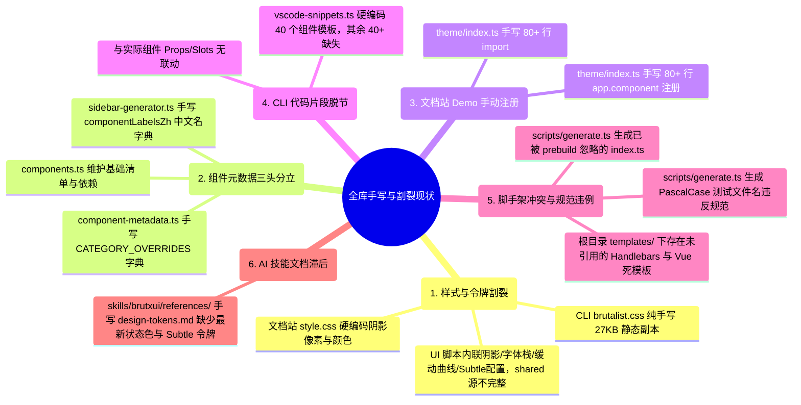
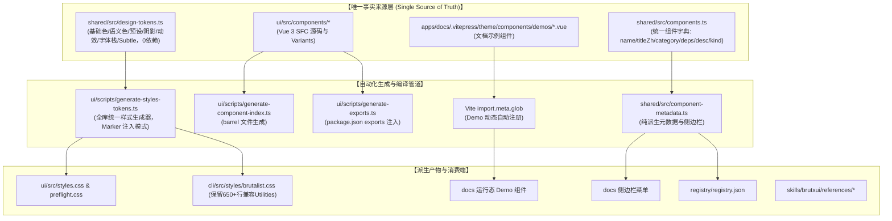

# 全库单一信源治理与样式元数据自动生成方案

## 一、 背景与第一性原理推导

### 1. 核心理念：单一事实来源（Single Source of Truth, SSOT）与 DRY 原则
在 BrutxUI 粗野主义设计系统与单体仓库（Monorepo）架构中，任何设计规则、组件元数据、样式派生与模板定义，都应当有且仅有一个明确的权威定义源。所有下游消费端（UI 组件库、CLI 工具、文档站点、注册表构建器、AI 技能知识库）都应当通过**代码生成、类型推导或自动扫描**直接派生，坚决杜绝任何形式的**手工复制、静态副本或多处重复声明**。

### 2. 全库现存 6 大手写与割裂反模式排查

经过对全库架构的深度审计，发现目前存在以下 6 处违反 SSOT 与第一性原理的手写/割裂问题：



#### 反模式 1：CLI brutalist.css 纯手写副本与 CI 频繁假红
- `packages/cli/src/styles/brutalist.css` 维护了一份 27KB（973 行）的 CSS 文件。其中前 315 行为 `@theme`、`:root`、`.dark` 与主题预设，后 650+ 行为面向非 Tailwind v4 环境的静态兼容性工具类。由于前 315 行属纯手写副本，每次 `shared/src/design-tokens.ts` 变更（如新增 Subtle 浅色背景、动效曲线、阴影公式调整），极易遗漏同步，导致 CI 在 `check:tokens` 门禁被拦截；同时生成管道必须采用**标记注入**而非全量覆盖，以防后 650+ 行静态工具类丢失。

#### 反模式 2：Design Tokens SSOT 缺失核心设计量（脚本内隐性手写）
- `FONT_STACK_PARTS`（字体栈）、`SUBTLE_COLOR_DEFS`（6 种 Subtle 浅色混合率）、`EASING_ENTRIES`（机械弹性动效曲线）、`SHADOW_ENTRIES`（7 种阴影计算公式）均内联定义在 `packages/ui/scripts/generate-styles-tokens.ts` 内部，而不是声明在 `packages/shared/src/design-tokens.ts`。导致 `shared` 包名义上是 SSOT，实际上令牌定义残缺。

#### 反模式 3：组件元数据“三头分立”（新增组件需改 3 处）
- 目前新增一个组件必须在 `shared` 的 3 个文件中分别手写登记：
  1. `packages/shared/src/components.ts`：登记组件名、`dependencies`、`description` 等；
  2. `packages/shared/src/component-metadata.ts`：在 `CATEGORY_OVERRIDES` 手写映射组件到分类；
  3. `packages/shared/src/sidebar-generator.ts`：在 `componentLabelsZh` 手写映射组件的中文名称。

#### 反模式 4：文档站 Demo 80+ 处手动 import 与注册
- `apps/docs/.vitepress/theme/index.ts` 中手写了 80+ 行 `import AlertDemo from './components/demos/AlertDemo.vue'` 以及 80+ 行 `app.component('AlertDemo', AlertDemo)`。纯手工维护，新增组件极易漏配。

#### 反模式 5：脚手架逻辑冲突、规范违例与根目录死模板残留
- `scripts/generate.ts` 在创建组件时会生成 `index.ts`，但实际上组件目录下的 `index.ts` 已经由 `packages/ui/scripts/generate-component-index.ts` 在 prebuild 阶段全自动生成并被 Git 忽略；
- `scripts/generate.ts` 在创建组件时生成了 PascalCase 命名的测试文件（如 `Button.test.ts`），直接违反了 `AGENTS.md` 规定的 `*.test.ts 一律 kebab-case` 规范；
- 根目录 `templates/component/*.hbs` 与 `templates/vue-app/` 没有任何脚本引用，属于历史遗留死代码。

#### 反模式 6：AI 技能知识库参考文档漂移
- `skills/brutxui/references/design-tokens.md` 与 `components-dictionary.md` 均为手写文档，目前已漏掉 `status*` 状态色、`overlaySubtle`、Subtle 衍生令牌与 Easing 曲线，与代码库实际契约脱节。

---

## 二、 架构全景与治理矩阵

### 1. 全库单一信源架构全景图



### 2. 全库单一信源治理矩阵

| 治理领域 | 现状（手写 / 割裂处） | 治理后单一事实来源（SSOT） | 派生 / 注入机制 | 门禁与防护防线 |
| :--- | :--- | :--- | :--- | :--- |
| **设计系统与样式** | `cli/src/styles/brutalist.css` 手写前 315 行；`generate-styles-tokens.ts` 内联阴影与字体栈 | `packages/shared/src/design-tokens.ts`（包含主题、预设、阴影公式、动效曲线、字体栈、Subtle 配置，0 外部依赖） | `packages/ui/scripts/generate-styles-tokens.ts` 采用 Marker 注入机制同步刷新 `ui` 与 `cli` 样式（保护 650+ 行静态工具类） | `prebuild:tokens --check` 与 `check-brutalist-tokens.ts` 门禁 |
| **组件元数据** | `components.ts`、`component-metadata.ts`、`sidebar-generator.ts` 3 处分散手写 | `packages/shared/src/components.ts` 的 `COMPONENTS` 核心字典 | `component-metadata.ts` 与 `sidebar-generator.ts` 100% 自动派生，0 手写映射 | TypeScript 严格类型检查 + 开发期孤儿告警 |
| **文档站 Demo 注册** | `apps/docs/.vitepress/theme/index.ts` 手写 80+ 行 import 和 80+ 行注册 | `apps/docs/.vitepress/theme/components/demos/*.vue` 物理文件 | `import.meta.glob('./components/demos/*.vue', { eager: true })` 自动加载并注册 | Vite 编译期自动闭环，新增 Demo 零配置 |
| **组件导出与脚手架** | `scripts/generate.ts` 手写生成 `index.ts`，且测试文件使用 PascalCase 违例 | 各组件目录下的 `.vue` / `.ts` 实际源文件 | `packages/ui/scripts/generate-component-index.ts` prebuild 阶段全自动生成；`generate.ts` 修正测试文件为 kebab-case | `.gitignore` 忽略 barrel 文件，脚手架产物符合规范 |
| **模板与脚手架** | 根目录 `templates/` 遗留废弃 `.hbs` 模板 | `scripts/generate.ts` 内置代码模板 | 统一使用 `pnpm generate:*` 脚本，清理无用目录 | 移除非法与冗余模板，保持最小集 |
| **AI 技能知识库** | `skills/brutxui/references/` 手写文档落后代码库 | `packages/shared/src/design-tokens.ts` 与 `components.ts` | 依据 SSOT 格式化对齐 Markdown 参考文档 | 纳入代码审查与文档规范校验 |

---

## 三、 详细技术方案设计

### 1. 模块 1：设计令牌 SSOT 补全与样式多端协同生成

#### 1.1 补全 `packages/shared/src/design-tokens.ts`
将目前手写在生成脚本内部的常量全部收拢至 `design-tokens.ts`，严格保持 **0 外部 import 依赖**，便于全库任意子包消费：

```typescript
// 1. 全局默认字体栈（单一事实来源）
export const FONT_STACK_PARTS = [
    '"Inter"', 'system-ui', '-apple-system', 'BlinkMacSystemFont',
    '"Segoe UI"', 'Roboto', '"Helvetica Neue"', 'Arial', '"Noto Sans"', 'sans-serif'
] as const;
export const FONT_STACK = FONT_STACK_PARTS.join(', ');

// 2. 机械动效曲线
export const EASING_TOKENS = {
    snap: 'cubic-bezier(0.16, 1, 0.3, 1)',
    bounce: 'cubic-bezier(0.34, 1.56, 0.64, 1)',
} as const;

// 3. 浅色衍生背景 Subtle 混合配置
export interface SubtleColorDef {
    key: keyof ThemeTokens;
    lightPct: number;
    darkPct: number;
}
export const SUBTLE_COLOR_DEFS: readonly SubtleColorDef[] = [
    { key: 'primary', lightPct: 12, darkPct: 20 },
    { key: 'secondary', lightPct: 12, darkPct: 20 },
    { key: 'accent', lightPct: 20, darkPct: 20 },
    { key: 'destructive', lightPct: 12, darkPct: 20 },
    { key: 'success', lightPct: 12, darkPct: 20 },
    { key: 'info', lightPct: 12, darkPct: 20 },
] as const;

// 4. 阴影计算公式定义
export interface ShadowTokenDefinition {
    themeVar: string;
    build: (tokens: ThemeTokens) => string;
}
export const SHADOW_DEFINITIONS: readonly ShadowTokenDefinition[] = [
    {
        themeVar: '--shadow-brutal',
        build: l => `var(--brutal-shadow-offset-x, ${l.shadowOffsetX}) var(--brutal-shadow-offset-y, ${l.shadowOffsetY}) 0px 0px var(--brutal-shadow-color, ${l.shadowColor})`,
    },
    // ... 其余 6 种阴影派生公式
];
```

#### 1.2 升级 `packages/ui/scripts/generate-styles-tokens.ts`
统一负责 3 个目标的生成与**标记注入（Marker Injection）**：
1. **目标 1**：`packages/ui/src/styles.css`（标记注入：`@theme`、`:root`、`.dark`、`.theme-*`）；
2. **目标 2**：`packages/ui/src/preflight.css`（标记注入：`font-stack`）；
3. **目标 3**：`packages/cli/src/styles/brutalist.css`（**标记注入模式**：在 `brutalist.css` 头部配置 `/* @brutx:theme-tokens:start */`、`/* @brutx:root-tokens:start */`、`/* @brutx:theme-presets:start */` 等标记区间，仅注入并更新前 315 行主题与预设，**完整保留 316~973 行的 650+ 行静态兼容性工具类**，杜绝覆写破坏）。

#### 1.3 CLI 构建生命周期与门禁闭环
在 `packages/cli/package.json` 中配置：
```json
{
  "scripts": {
    "prebuild": "pnpm --filter brutx-ui-vue prebuild:tokens",
    "build": "tsup",
    "check:tokens": "tsx scripts/check-brutalist-tokens.ts"
  }
}
```

---

### 2. 模块 2：组件元数据“三合一”归一化治理

#### 2.1 重构 `packages/shared/src/components.ts`
将 `category` 与 `titleZh` 提升为组件核心元数据**必需属性**，利用 TypeScript 严格模式进行编译期 100% 覆盖约束：

```typescript
export interface RegistryComponentMeta {
    title?: string;
    /** 组件中文名称（作为全库单一事实来源，供文档侧边栏、CLI 与 AI 技能消费） */
    titleZh: string;
    description: string;
    /** 组件所属分类（单一事实来源，废除外部 CATEGORY_OVERRIDES） */
    category: ComponentCategory;
    dependencies: string[];
    kind?: ComponentKind;
    sidebarGroup?: SidebarGroup;
    docsSlug?: string;
    docsHidden?: boolean;
    examples?: string[];
    status?: 'stable' | 'legacy' | 'deprecated';
    replacement?: string;
}

export const COMPONENTS: Record<string, RegistryComponentMeta> = {
    button: {
        titleZh: '按钮',
        category: 'action',
        dependencies: ['reka-ui', '@lucide/vue'],
        description: 'Interactive button with loading state, icon support, and multiple style variants.'
    },
    // ... 全部 98 个组件一次性完整声明 category 与 titleZh
};
```

#### 2.2 重构 `packages/shared/src/component-metadata.ts`
- **彻底删除 `CATEGORY_OVERRIDES`**；
- `inferCategory` 直接读取 `meta.category`，无需任何手写映射与后缀推断兜底。

#### 2.3 重构 `packages/shared/src/sidebar-generator.ts`
- **彻底删除 `componentLabelsZh` 手写字典**；
- `getItemText` 中文标签直接取自 `entry.titleZh`：
```typescript
function getItemText(entry: ComponentMetadataEntry, locale: SidebarLocale): string {
    if (locale === 'en') return entry.title;
    return entry.titleZh ? `${entry.title} ${entry.titleZh}` : entry.title;
}
```

---

### 3. 模块 3：文档站 Demo 自动扫描注册（`import.meta.glob`）

#### 3.1 重构 `apps/docs/.vitepress/theme/index.ts`
移除 80+ 行手动 `import xxxDemo` 与 80+ 行 `app.component('xxxDemo', ...)`，使用 Vite 原生机制：

```typescript
import DefaultTheme from 'vitepress/theme';
import type { Theme } from 'vitepress';
import Layout from './Layout.vue';
import type { Component } from 'vue';

// 批量扫描注册 demo 组件（Vite 静态分析，完全支持 SSR 构建与开发态）
const demoModules = import.meta.glob<{ default: Component }>(
    './components/demos/*.vue',
    { eager: true }
);

export default {
    extends: DefaultTheme,
    Layout,
    enhanceApp({ app }) {
        // 显式注册全局框架组件 (ComponentPreview, CopyButton, ThemeToggle 等)
        // ...
        
        // 自动注册全部 Demo 组件（按文件名作为组件名，如 AlertDemo.vue -> AlertDemo）
        for (const [path, mod] of Object.entries(demoModules)) {
            const componentName = path.split('/').pop()?.replace(/\.vue$/, '');
            if (componentName && mod.default) {
                app.component(componentName, mod.default);
            }
        }
    },
} satisfies Theme;
```

---

### 4. 模块 4：脚手架逻辑统一与废弃模板清理

#### 4.1 修复 `scripts/generate.ts`
- 移除 `getComponentIndexTemplate` 生成逻辑，禁止脚手架在创建组件目录时手动生成 `index.ts`；
- **修正测试文件命名规范**：将 `${vars.PascalName}.test.ts` 修改为 `${vars.kebabName}.test.ts`，严格遵循 `AGENTS.md` 的 kebab-case 规范；
- 在脚手架执行完成后，自动调用 `pnpm prebuild:scan` 与 `generate-component-index.ts`，实现 barrel 文件的自动化派生。

#### 4.2 清理根目录废弃模板
- 按照用户全局规则要求，**逐一删除** `templates/component/*.hbs` 与 `templates/vue-app/*`，消除无引用的历史僵尸文件。

---

### 5. 模块 5：AI 技能知识库同步与文档对齐

- 同步刷新 `skills/brutxui/references/design-tokens.md`，补齐所有缺失的状态色、`overlaySubtle`、`black`、`yellow` 以及 6 种 Subtle 混合规则和机械动效曲线；
- 刷新 `skills/brutxui/references/components-dictionary.md`，保持与 `COMPONENTS` 单一事实来源 100% 同步。

---

## 四、 实施步骤与分阶段执行计划

```text
┌────────────────────────────────────────────────────────────────────────┐
│                        实施阶段与执行清单                              │
├──────────┬─────────────────────────────────────────────────────────────┤
│ 阶段 1   │ 设计令牌 SSOT 下沉与全库样式生成管道 (P0):                  │
│ (Tokens) │ 1. shared/src/design-tokens.ts 补充字体栈/动效/Subtle/阴影  │
│          │ 2. cli/src/styles/brutalist.css 添加 Marker 注入标记        │
│          │ 3. 升级 ui/scripts/generate-styles-tokens.ts 标记注入 CLI   │
│          │ 4. 配置 CLI package.json prebuild 钩子与 CI 对齐门禁        │
├──────────┼─────────────────────────────────────────────────────────────┤
│ 阶段 2   │ 组件元数据“三合一”归一化 (P1):                              │
│ (Meta)   │ 1. shared/src/components.ts 统一补齐 category 与 titleZh    │
│          │ 2. 删除 component-metadata.ts 中的 CATEGORY_OVERRIDES       │
│          │ 3. 删除 sidebar-generator.ts 中的 componentLabelsZh 字典    │
├──────────┼─────────────────────────────────────────────────────────────┤
│ 阶段 3   │ 文档站 Demo 自动注册改造 (P1):                              │
│ (Docs)   │ 1. docs/theme/index.ts 改用 import.meta.glob 批量注册       │
│          │ 2. 移除 160+ 行无意义手写 import 与 app.component 样板代码 │
├──────────┼─────────────────────────────────────────────────────────────┤
│ 阶段 4   │ 脚手架归一与废弃模板清理 (P2):                              │
│ (Clean)  │ 1. scripts/generate.ts 移除冗余 index.ts 生成               │
│          │ 2. scripts/generate.ts 修正测试文件命名为 kebab-case        │
│          │ 3. 逐一清理根目录 templates/ 废弃目录                       │
├──────────┼─────────────────────────────────────────────────────────────┤
│ 阶段 5   │ AI 技能参考文档刷新与全库门禁验收 (P2):                     │
│ (Verify) │ 1. 刷新 skills/brutxui/references/ 设计令牌与组件词典       │
│          │ 2. 运行 prebuild:tokens, build, typecheck, test 全量验证    │
└──────────┴─────────────────────────────────────────────────────────────┘
```

---

## 五、 收益与验收标准

1. **样式单一信源闭环**：修改 `packages/shared/src/design-tokens.ts` 后，运行 `pnpm prebuild:tokens` 即可通过 Marker 注入同时刷新 `ui` 与 `cli` 样式，既消灭了手写副本与 CI 假红，又完整保全了 CLI 的 650+ 行静态兼容工具类。
2. **元数据单点维护**：新增或重命名组件，仅需在 `packages/shared/src/components.ts` 1 处维护，元数据、分类与中文文档侧边栏全量自动派生。
3. **零样板代码负担**：文档站 Demo 随文件建立自动生效，消除 160+ 行冗余注册代码。
4. **仓库整洁规范**：清理历史遗留模板，脚手架测试命名合规化，自动化流水线彻底统一。
5. **门禁全面守门**：`pnpm prebuild:tokens -- --check`、`pnpm check:i18n` 与 `pnpm typecheck` 均 0 报错通过。
