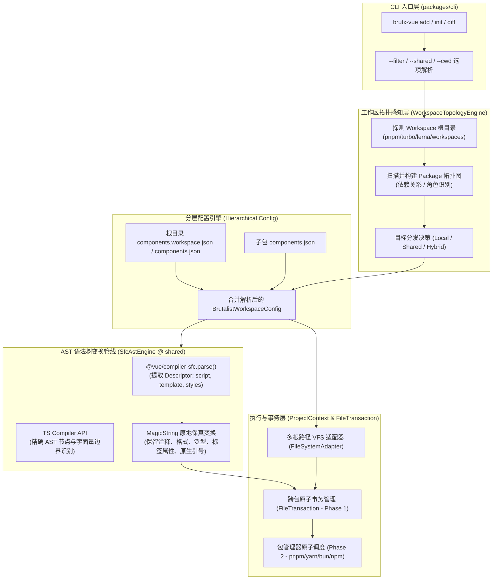
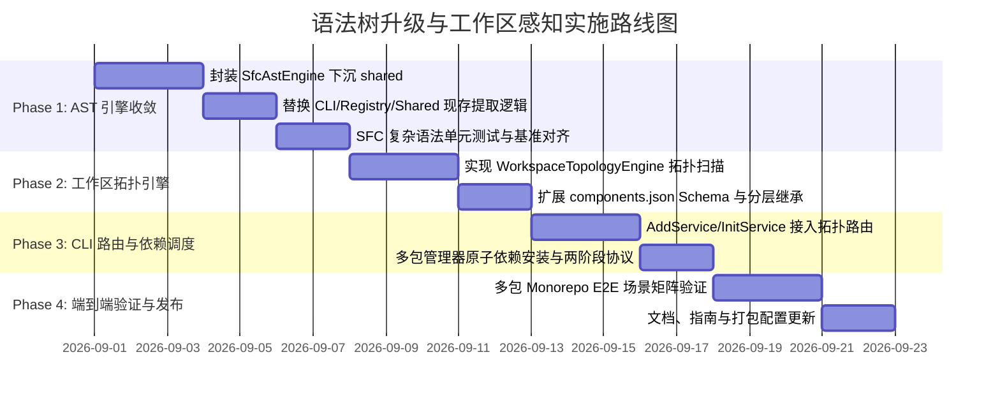

# CLI语法树解析升级与Monorepo工作区感知方案

> 方案类型：底层编译管线升级与工作区架构演进
> 状态：**done**
> 日期：2026-08-27
> 关联文档：[CLI项目上下文与路径解析引擎封装方案](CLI项目上下文与路径解析引擎封装方案.md)；[注册表编译与AST静态转换管线模块化方案](注册表编译与AST静态转换管线模块化方案.md)；[全工程虚拟文件系统统一与持久化深模块重构方案](全工程虚拟文件系统统一与持久化深模块重构方案.md)；[架构优化方案-v3](架构优化方案-v3.md)
> 修订记录：
> - 2026-08-27：方案定稿。建立基于 `@vue/compiler-sfc` + `MagicString` 的单一信源 AST 源码保真变换管线（`SfcAstEngine`），以及基于工作区拓扑图引擎（`WorkspaceTopologyEngine`）、分层配置继承与两阶段操作协议的 Monorepo 深度感知架构。

---

## 一、 背景与第一性原理

### 1. 现状痛点与问题本质

在 BrutxUI Vue 3 的当前架构中，CLI（`packages/cli`）、注册表编译器（`packages/registry`）以及共享扫描工具（`packages/shared`）在 **Vue SFC 语法解析** 和 **Monorepo 工作区感知** 两个核心领域存在明显的浅模块设计和结构性局限：

```text
┌─────────────────────────────────────────────────────────────────────────────┐
│                            现有 SFC 解析与工作区架构现状                      │
├─────────────────────────────────────────────────────────────────────────────┤
│ 1. SFC 脚本提取逻辑三轨分裂 (Dual/Triple Implementation Drift)              │
│    ├─ packages/cli/src/lib/project.ts (脆弱正则匹配)                         │
│    │  └─ /<script\b[^>]*>([\s\S]*?)<\/script\b[^>]*>/gi                      │
│    ├─ packages/shared/src/extract-module-specifiers.ts (手写单遍状态机)     │
│    │  └─ skipQuotedString / findScriptClose                                 │
│    └─ packages/registry/src/compiler/ast-rewriter.ts (带偏移量的单遍状态机) │
│       └─ 相同逻辑重复拷贝维护，违背单一事实来源 (Single Source of Truth)    │
│                                                                             │
│ 2. 正则与弱状态机在 Vue 现代语法下的边缘缺陷                                 │
│    ├─ 泛型标签歧义: <script setup lang="ts" generic="T extends Foo<Bar>">   │
│    │  属性值内部的尖括号可能被正则或简易解析误判为标签闭合                  │
│    ├─ HTML 注释伪代码: <!-- <script>const a = 1</script> --> 误捕获         │
│    ├─ 依赖维度狭窄: 仅提取 <script> 依赖，忽略 <style> / <template> 静态资源│
│    └─ 源码改写脆弱: 纯字符串 slice 替换易破坏原文件格式、注释与换行          │
│                                                                             │
│ 3. Monorepo / Workspaces 感知流于表面                                       │
│    ├─ detectWorkspaceRoot 仅用于向上探测并返回根目录路径，未建立拓扑图       │
│    ├─ components.json 假定单项目运行，无法声明跨包输出与共享 UI 库角色      │
│    ├─ 子应用无法直接通过 --filter 或上下文感知向 packages/ui 集中安装组件   │
│    └─ 跨包依赖安装缺失包管理器适配 (pnpm/yarn/bun/npm workspace 调度缺失)   │
└─────────────────────────────────────────────────────────────────────────────┘
```

#### (1) SFC 语法树解析的根本缺陷
1. **语法歧义与边缘断裂**：
   - 正则表达式无法有效识别复杂的 Vue 3.3+ 语法。例如在带有类型参数的 SFC 中（`<script setup lang="ts" generic="T extends Record<string, unknown>">`），属性值内部的 `>` 若被贪婪或非贪婪匹配截断，会导致整个脚本块提取失败。
   - 正则无法区分上下文环境，当 HTML 注释或字符串模板中包含伪 `<script>` 片段时，会产生误捕获。
2. **多实现漂移与重复造轮子**：
   - 仓库内部存在三套独立的 SFC 提取逻辑（CLI 中的正则、Shared 中的状态机、Registry 中的带偏移状态机）。这不仅增加了维护成本，也导致不同工具在处理同一 Vue 文件时可能产生不同的解析结果。
3. **仅关注脚本，丢失样式与模板依赖**：
   - SFC 是由 Template、Script、Style 以及 Custom Blocks 组成的多领域复合结构。仅正则提取 `<script>` 无法感知 `<style module>` 中的 `@import` 或 `<template>` 中的静态资源路径引用。

#### (2) Monorepo / Workspaces 深度感知的根本缺陷
1. **缺乏拓扑感知模型（Topology Blindness）**：
   - `ProjectContext.detectWorkspaceRoot` 仅检测顶层工作区标记文件（`pnpm-workspace.yaml`、`turbo.json`、`lerna.json`、`package.json#workspaces`），但并未解析工作区内的子包结构、依赖依赖图和物理路径映射。
2. **单仓组件库落地范式受阻**：
   - 在现代企业级 Monorepo 中，团队通常在 `packages/ui` 中维护统一的 BrutxUI 基础设计系统，而业务应用（`apps/web`、`apps/admin` 等）跨包消费该 UI 库。
   - 现有 CLI 强制在当前执行目录读取 `components.json` 并写入组件，导致开发者必须手动在 `packages/ui` 目录下执行命令，并且无法自动将运行时依赖（如 `@lucide/vue`、`reka-ui`、`cva`）精确安装到共享包、将应用特有配置联动到应用包。

---

## 二、 方案探索与架构突破

为了从根本上解决上述问题，我们超越“仅引入一个方法”或“增加一个配置字段”的浅层修补，从编译原理和工程架构的第一性原理出发，探索更优的解决路径：

### 1. SFC 解析升级探索：从单一正则升级为「源码保真变换管线（Source-Preserving Transformation Pipeline）」

| 维度 | 方案 A：手写状态机（现状 Shared/Registry） | 方案 B：仅调用 `@vue/compiler-sfc.parse` 提取字符串 | 方案 C（推荐）：`SfcAstEngine` 标准 AST + `MagicString` 变换管线 |
| :--- | :--- | :--- | :--- |
| **解析准确性** | 弱（难以穷举 Vue 复合语法与 HTML 实体） | 高（官方标准解析器） | **100% 官方标准**（基于 `@vue/compiler-sfc`） |
| **泛型与复杂属性** | 易在嵌套尖括号处误判 | 完全支持 | **完全支持**（正确解析 SFC 顶层 AST） |
| **代码重写机制** | 字符串 index 切片与拼接（易破坏排版） | 字符串拼接重组 SFC | **基于 `MagicString` 原地替换**，保留全部注释、空白、换行与标签属性 |
| **全块支持** | 仅支持 `<script>` | 暴露 descriptor 各 block 文本 | **完整支持** `script`, `scriptSetup`, `template`, `styles`, `customBlocks` |
| **架构归属** | 分散在各子包内部 | 作为 CLI 专用工具 | **下沉至 `brutx-shared-vue/ast` 单一信源**，供给 UI、CLI、Registry、Docs |

#### 方案 C 核心突破点：
1. **单一信源下沉**：在 `packages/shared` 中构建统一的 `SfcAstEngine` 模块，全仓库所有需要解析 Vue SFC 的场景（Registry 编译、CLI 依赖扫描、别名原地重写、Manifest 扫描）全部收敛调用此模块，彻底清除三轨漂移。
2. **保真变换与精准映射（Source-Preserving & Exact Mapping）**：
   - 利用 `@vue/compiler-sfc` 获取标准 `SFCDescriptor`，精准读取 `descriptor.script` 和 `descriptor.scriptSetup` 的绝对起止偏移量（`loc.start.offset`, `loc.end.offset`）。
   - 采用 `MagicString` 执行 import/export 别名重写，无需重新序列化组装整个 SFC，完全保留用户原有的代码排版、行尾序列（CRLF/LF）、特殊标签属性及非脚本内容。

---

### 2. Monorepo 感知升级探索：从静态标记升级为「工作区拓扑图引擎（WorkspaceTopologyEngine）」

| 维度 | 方案 A：仅增加 `workspaceMode` 字段 | 方案 B：手动切换目录脚本编排 | 方案 C（推荐）：`WorkspaceTopologyEngine` 拓扑感知与分层配置继承 |
| :--- | :--- | :--- | :--- |
| **拓扑感知** | 无，仅读取布尔值/枚举 | 无，依赖外部 CI/CD 或 Shell 编排 | **全自动解析** `pnpm-workspace.yaml` / `package.json#workspaces` / `turbo.json` |
| **命令灵活性** | 只能在当前目录固定执行 | 需要手动 `cd` 切换路径 | **支持任意目录执行**，提供 `--filter` / `-F`、`--shared` 参数与交互式选择器 |
| **依赖安装** | 始终安装在当前 cwd | 手动调用包管理器 | **自动路由包管理器**（`pnpm --filter <pkg>` / `bun --filter` / `yarn workspace` / `npm -w`） |
| **配置管理** | 每个子包必须独立维护完整配置 | 无统一配置 | **分层继承模型**：根目录全局策略 + 子包特异性覆盖 |
| **事务安全** | 单目录事务 | 无事务 | **两阶段操作协议（Two-Phase Protocol）**：文件原子事务 + 依赖安装故障自愈提示 |

#### 方案 C 核心突破点：
1. **工作区拓扑图构建**：CLI 自动探测并解析 Monorepo 全局拓扑，识别各个子 Package 的角色（如 `shared-ui`、`app`、`tooling`、`docs`）。
2. **分层配置模型（Hierarchical Configuration Cascade）**：
   - 根目录可通过 `components.workspace.json`（或根 `components.json`）声明 Monorepo 默认共享策略。
   - 子包可继承根配置，只需声明局部别名或特定覆盖项。
3. **跨包依赖拓扑原子同步**：在子应用中安装组件时，核心组件文件与通用依赖可自动路由落入 `packages/ui`，并精准调度底层包管理器将 npm 依赖安装到目标 package 的 `package.json` 中，确保 Monorepo 依赖关系完全符合幽灵依赖防御规范。

---

## 三、 核心架构设计

### 1. 系统总体架构流图



### 2. 核心架构决策确立

1. **目标分发决策优先级（Target Resolution Precedence）**：
   - `P1（最高）`：命令行显式指定参数（`--filter <pkg>` / `-F <pkg>` / `--cwd <dir>`）；
   - `P2`：配置文件显式声明（根 `components.json` 或 `components.workspace.json` 中的 `workspace.targetPackage`）；
   - `P3`：拓扑自动推断（拓扑引擎识别出唯一的 `shared-ui` 角色包，如 `packages/ui`）；
   - `P4`：终端交互式选择器（在 Monorepo 根目录下存在多个子包且无法唯一确定时弹出列表选择，支持 `--yes` 静默回退）；
   - `P5（最低）`：本地退化（当前工作目录，即 `standalone` 模式）。
2. **两阶段操作协议（Two-Phase Action Protocol）**：
   - **Phase 1（文件原子写入与别名转换）**：在 `FileTransaction` 内完成所有组件文件生成与源码别名重写，成功后执行 `transaction.commit()`；
   - **Phase 2（依赖调度与自愈提示）**：文件事务提交后调度包管理器执行依赖安装。若因网络波动或外部原因导致依赖安装失败，**保留已写入的组件文件**，并在终端输出黄色警告与一键自愈修复命令（如 `pnpm --filter @myrepo/ui add @lucide/vue reka-ui`），避免由于网络断开导致已生成的代码发生不可逆的破坏性回滚。
3. **CLI 自包含打包策略（Self-Contained Bundle）**：
   - `packages/cli` 构建时通过 `tsup` 将 `@vue/compiler-sfc`、`magic-string` 及 `brutx-shared-vue` 完整内联打包至 `dist/index.js`，确保最终分发的 npm 包在全局 `npx brutx-vue` 执行时零额外 peer 依赖安装负担。

---

## 四、 详细模块设计与契约规范

### 模块一：`SfcAstEngine` 统一语法树与保真变换引擎

该模块下沉至 `packages/shared/src/ast/`，作为整个仓库唯一的 SFC 解析与 AST 变换核心。

#### 1. 核心数据结构与契约定义

```typescript
// packages/shared/src/ast/types.ts

export interface SfcScriptBlock {
    readonly content: string;
    readonly lang?: string;
    readonly setup: boolean;
    readonly generic?: string;
    readonly startOffset: number; // 脚本内容在原 SFC 中的起始绝对字符偏移量
    readonly endOffset: number;   // 脚本内容在原 SFC 中的结束绝对字符偏移量
    readonly loc: {
        readonly start: { line: number; column: number; offset: number };
        readonly end: { line: number; column: number; offset: number };
    };
}

export interface SfcStyleBlock {
    readonly content: string;
    readonly lang?: string;
    readonly scoped: boolean;
    readonly module: boolean | string;
    readonly startOffset: number;
    readonly endOffset: number;
}

export interface ParsedSfcDescriptor {
    readonly filename: string;
    readonly rawSource: string;
    readonly isSfc: boolean; // 若为纯 TS/JS 文件，则为 false
    readonly script?: SfcScriptBlock;
    readonly scriptSetup?: SfcScriptBlock;
    readonly templateContent?: string;
    readonly styles: readonly SfcStyleBlock[];
    readonly customBlocks: ReadonlyArray<{ type: string; content: string }>;
}

export interface ImportRewriteContext {
    readonly specifier: string;
    readonly isTypeOnly: boolean;
    readonly isDynamic: boolean;
    readonly quoteChar: '\'' | '"' | '`';
    readonly startOffset: number; // 在整个原文件中的绝对起始偏移（含引号）
    readonly endOffset: number;   // 在整个原文件中的绝对结束偏移（含引号）
}

export interface ClassifiedModuleSpecifier {
    readonly specifier: string;
    readonly isTypeOnly: boolean;
    readonly isDynamic: boolean;
}

export type ImportRewriterFn = (ctx: ImportRewriteContext) => string | undefined | null;
```

#### 2. `SfcAstEngine` 核心实现逻辑

```typescript
// packages/shared/src/ast/sfc-ast-engine.ts
import { parse as parseSfcCompiler } from '@vue/compiler-sfc';
import MagicString from 'magic-string';
import ts from 'typescript';
import type {
    ParsedSfcDescriptor,
    SfcScriptBlock,
    ImportRewriterFn,
    ClassifiedModuleSpecifier,
    ImportRewriteContext,
} from './types.js';

export class SfcAstEngine {
    /**
     * 解析 Vue SFC 或纯 TS/JS 源码，构建标准化 Descriptor
     */
    static parse(rawSource: string, filename = 'component.vue'): ParsedSfcDescriptor {
        const isVueFile = filename.endsWith('.vue') || rawSource.includes('<template') || rawSource.includes('<script');

        if (!isVueFile) {
            return {
                filename,
                rawSource,
                isSfc: false,
                styles: [],
                customBlocks: [],
            };
        }

        const { descriptor, errors } = parseSfcCompiler(rawSource, {
            filename,
            sourceMap: false,
            ignoreEmpty: true,
        });

        if (errors.length > 0) {
            // 尽力而为（Best-effort），若严重语法错误记录警告但不崩溃
        }

        const mapScript = (
            block: typeof descriptor.script | typeof descriptor.scriptSetup,
            setup: boolean
        ): SfcScriptBlock | undefined => {
            if (!block) return undefined;
            return {
                content: block.content,
                lang: block.lang,
                setup,
                generic: typeof block.attrs?.['generic'] === 'string' ? block.attrs['generic'] : undefined,
                startOffset: block.loc.start.offset,
                endOffset: block.loc.end.offset,
                loc: block.loc,
            };
        };

        return {
            filename,
            rawSource,
            isSfc: true,
            script: mapScript(descriptor.script, false),
            scriptSetup: mapScript(descriptor.scriptSetup, true),
            templateContent: descriptor.template?.content,
            styles: descriptor.styles.map(style => ({
                content: style.content,
                lang: style.lang,
                scoped: style.scoped ?? false,
                module: style.module ?? false,
                startOffset: style.loc.start.offset,
                endOffset: style.loc.end.offset,
            })),
            customBlocks: descriptor.customBlocks.map(b => ({ type: b.type, content: b.content })),
        };
    }

    /**
     * 提取源文件中的全部模块导入（零歧义识别，支持 import type, export from, dynamic import）
     */
    static extractModuleSpecifiers(rawSource: string, filename = 'component.vue'): ClassifiedModuleSpecifier[] {
        const descriptor = SfcAstEngine.parse(rawSource, filename);
        const scriptBlocks: Array<{ content: string; offset: number }> = [];

        if (descriptor.isSfc) {
            if (descriptor.script) scriptBlocks.push({ content: descriptor.script.content, offset: descriptor.script.startOffset });
            if (descriptor.scriptSetup) scriptBlocks.push({ content: descriptor.scriptSetup.content, offset: descriptor.scriptSetup.startOffset });
        } else {
            scriptBlocks.push({ content: rawSource, offset: 0 });
        }

        const seen = new Map<string, ClassifiedModuleSpecifier>();

        for (const block of scriptBlocks) {
            const sourceFile = ts.createSourceFile(
                filename,
                block.content,
                ts.ScriptTarget.Latest,
                true,
                ts.ScriptKind.TSX
            );

            SfcAstEngine.walkModuleSpecifiers(sourceFile, (specifier, isTypeOnly, isDynamic) => {
                const existing = seen.get(specifier);
                if (!existing) {
                    seen.set(specifier, { specifier, isTypeOnly, isDynamic });
                } else {
                    if (!isTypeOnly || isDynamic) {
                        seen.set(specifier, { specifier, isTypeOnly: false, isDynamic: existing.isDynamic || isDynamic });
                    }
                }
            });
        }

        return Array.from(seen.values());
    }

    /**
     * 利用 MagicString 高保真、原地重写 Vue SFC / TS 文件的 import 别名
     */
    static transformImports(rawSource: string, rewriter: ImportRewriterFn, filename = 'component.vue'): string {
        const descriptor = SfcAstEngine.parse(rawSource, filename);
        const s = new MagicString(rawSource);

        const scriptBlocks: Array<{ content: string; baseOffset: number }> = [];
        if (descriptor.isSfc) {
            if (descriptor.script) scriptBlocks.push({ content: descriptor.script.content, baseOffset: descriptor.script.startOffset });
            if (descriptor.scriptSetup) scriptBlocks.push({ content: descriptor.scriptSetup.content, baseOffset: descriptor.scriptSetup.startOffset });
        } else {
            scriptBlocks.push({ content: rawSource, baseOffset: 0 });
        }

        for (const block of scriptBlocks) {
            const sourceFile = ts.createSourceFile(
                filename,
                block.content,
                ts.ScriptTarget.Latest,
                true,
                ts.ScriptKind.TSX
            );

            const handleLiteral = (
                literalNode: ts.StringLiteral | ts.NoSubstitutionTemplateLiteral,
                isTypeOnly: boolean,
                isDynamic: boolean
            ): void => {
                const originalSpecifier = literalNode.text;
                const nodeStartInScript = literalNode.getStart(sourceFile);
                const nodeEndInScript = literalNode.getEnd();

                // 计算在整个 SFC 源码中的绝对字符范围（含引号）
                const absStart = block.baseOffset + nodeStartInScript;
                const absEnd = block.baseOffset + nodeEndInScript;

                const firstChar = rawSource[absStart];
                const quoteChar: '\'' | '"' | '`' = firstChar === '\'' || firstChar === '"' || firstChar === '`' ? firstChar : '\'';

                const context: ImportRewriteContext = {
                    specifier: originalSpecifier,
                    isTypeOnly,
                    isDynamic,
                    quoteChar,
                    startOffset: absStart,
                    endOffset: absEnd,
                };

                const replacement = rewriter(context);
                if (replacement && replacement !== originalSpecifier) {
                    s.overwrite(absStart, absEnd, `${quoteChar}${replacement}${quoteChar}`);
                }
            };

            const visit = (node: ts.Node): void => {
                if (ts.isImportDeclaration(node) && ts.isStringLiteral(node.moduleSpecifier)) {
                    const isTypeOnly = node.importClause?.isTypeOnly === true || SfcAstEngine.isEntirelyTypeOnly(node.importClause?.namedBindings);
                    handleLiteral(node.moduleSpecifier, isTypeOnly, false);
                } else if (ts.isExportDeclaration(node) && node.moduleSpecifier && ts.isStringLiteral(node.moduleSpecifier)) {
                    const isTypeOnly = node.isTypeOnly === true || SfcAstEngine.isEntirelyTypeOnly(node.exportClause);
                    handleLiteral(node.moduleSpecifier, isTypeOnly, false);
                } else if (ts.isCallExpression(node) && node.expression.kind === ts.SyntaxKind.ImportKeyword) {
                    const arg = node.arguments[0];
                    if (arg && (ts.isStringLiteral(arg) || ts.isNoSubstitutionTemplateLiteral(arg))) {
                        handleLiteral(arg, false, true);
                    }
                }
                ts.forEachChild(node, visit);
            };

            for (const stmt of sourceFile.statements) {
                visit(stmt);
            }
        }

        return s.toString();
    }

    private static isEntirelyTypeOnly(bindings?: ts.NamedImportBindings | ts.NamedExportBindings): boolean {
        if (!bindings) return false;
        if (ts.isNamedImports(bindings) || ts.isNamedExports(bindings)) {
            return bindings.elements.length > 0 && bindings.elements.every(el => el.isTypeOnly);
        }
        return false;
    }

    private static walkModuleSpecifiers(
        sourceFile: ts.SourceFile,
        callback: (specifier: string, isTypeOnly: boolean, isDynamic: boolean) => void
    ): void {
        const visit = (node: ts.Node): void => {
            if (ts.isImportDeclaration(node) && ts.isStringLiteral(node.moduleSpecifier)) {
                const isTypeOnly = node.importClause?.isTypeOnly === true || SfcAstEngine.isEntirelyTypeOnly(node.importClause?.namedBindings);
                callback(node.moduleSpecifier.text, isTypeOnly, false);
            } else if (ts.isExportDeclaration(node) && node.moduleSpecifier && ts.isStringLiteral(node.moduleSpecifier)) {
                const isTypeOnly = node.isTypeOnly === true || SfcAstEngine.isEntirelyTypeOnly(node.exportClause);
                callback(node.moduleSpecifier.text, isTypeOnly, false);
            } else if (ts.isCallExpression(node) && node.expression.kind === ts.SyntaxKind.ImportKeyword) {
                const arg = node.arguments[0];
                if (arg && (ts.isStringLiteral(arg) || ts.isNoSubstitutionTemplateLiteral(arg))) {
                    callback(arg.text, false, true);
                }
            }
            ts.forEachChild(node, visit);
        };

        for (const stmt of sourceFile.statements) {
            visit(stmt);
        }
    }
}
```

---

### 模块二：`WorkspaceTopologyEngine` 工作区拓扑与共享安装引擎

该模块建立在 `packages/cli/src/lib/workspace/` 下，负责 Monorepo 深度拓扑解析、目标包路由与跨包依赖调度。

#### 1. 工作区领域模型与配置契约

扩展 `components.json` 契约，支持 `workspace` 顶级配置段：

```typescript
// packages/cli/src/lib/types.ts

export type WorkspaceMode = 'standalone' | 'shared-package' | 'app-local' | 'hybrid';

export interface WorkspacePackageInfo {
    readonly name: string;             // 包名，如 "@myrepo/ui" 或 "web"
    readonly rootDir: string;          // 绝对路径，如 "/repo/packages/ui"
    readonly relativeDir: string;      // 相对工作区根路径，如 "packages/ui"
    readonly isRoot: boolean;          // 是否为 Monorepo 根目录
    readonly role: 'shared-ui' | 'shared-utils' | 'app' | 'tooling' | 'unknown';
    readonly hasComponentsConfig: boolean;
    readonly packageJson: Record<string, unknown>;
}

export interface WorkspaceTopology {
    readonly isMonorepo: boolean;
    readonly workspaceRoot: string;
    readonly packageManager: 'pnpm' | 'yarn' | 'bun' | 'npm';
    readonly packages: ReadonlyMap<string, WorkspacePackageInfo>; // packageName / relativePath -> PackageInfo
    readonly sharedUiPackage?: WorkspacePackageInfo;
    readonly sharedUtilsPackage?: WorkspacePackageInfo;
}

export interface BrutalistWorkspaceConfig {
    readonly mode?: WorkspaceMode;
    readonly targetPackage?: string;          // 目标包名或路径（如 "@myrepo/ui" 或 "packages/ui"）
    readonly sharedUtilsPackage?: string;     // 共享工具包（如 "@myrepo/utils"）
    readonly installDependenciesTo?: 'targetPackage' | 'caller' | 'both';
}

export interface BrutalistConfig {
    $schema?: string;
    style: string;
    rsc?: boolean;
    tailwind?: Record<string, unknown>;
    aliases: {
        components: string;
        utils: string;
        composables?: string;
        locales?: string;
        directives?: string;
    };
    workspace?: BrutalistWorkspaceConfig;
    sharedBase?: string;
}
```

#### 2. 工作区拓扑探测器（WorkspaceTopologyEngine）

```typescript
// packages/cli/src/lib/workspace/topology-engine.ts
import path from 'node:path';
import type { FileSystemAdapter } from 'brutx-shared-vue/fs';
import type { WorkspaceTopology, WorkspacePackageInfo, PackageManager } from '../types.js';

interface TopologyCacheEntry {
    topology: WorkspaceTopology;
    mtimeMs: number;
}

const topologyCache = new Map<string, TopologyCacheEntry>();

export class WorkspaceTopologyEngine {
    /**
     * 从当前工作目录向上扫描并构建完备的工作区拓扑图（带轻量 mtime 缓存）
     */
    static async resolveTopology(
        cwd: string,
        fsAdapter: FileSystemAdapter
    ): Promise<WorkspaceTopology> {
        const workspaceRoot = await WorkspaceTopologyEngine.findWorkspaceRoot(cwd, fsAdapter);
        if (!workspaceRoot) {
            return {
                isMonorepo: false,
                workspaceRoot: cwd,
                packageManager: await WorkspaceTopologyEngine.detectPackageManager(cwd, fsAdapter),
                packages: new Map(),
            };
        }

        const cacheKey = workspaceRoot;
        const rootStat = await fsAdapter.stat(workspaceRoot).catch(() => null);
        const currentMtime = rootStat?.mtimeMs ?? 0;
        const cached = topologyCache.get(cacheKey);

        if (cached && cached.mtimeMs === currentMtime) {
            return cached.topology;
        }

        const packageManager = await WorkspaceTopologyEngine.detectPackageManager(workspaceRoot, fsAdapter);
        const packageGlobs = await WorkspaceTopologyEngine.getWorkspaceGlobs(workspaceRoot, packageManager, fsAdapter);
        const packageInfos = await WorkspaceTopologyEngine.scanPackages(workspaceRoot, packageGlobs, fsAdapter);

        const packagesMap = new Map<string, WorkspacePackageInfo>();
        let sharedUiPackage: WorkspacePackageInfo | undefined;
        let sharedUtilsPackage: WorkspacePackageInfo | undefined;

        for (const pkg of packageInfos) {
            packagesMap.set(pkg.name, pkg);
            packagesMap.set(pkg.relativeDir, pkg);

            if (pkg.role === 'shared-ui') sharedUiPackage = pkg;
            if (pkg.role === 'shared-utils') sharedUtilsPackage = pkg;
        }

        const topology: WorkspaceTopology = {
            isMonorepo: true,
            workspaceRoot,
            packageManager,
            packages: packagesMap,
            sharedUiPackage,
            sharedUtilsPackage,
        };

        topologyCache.set(cacheKey, { topology, mtimeMs: currentMtime });
        return topology;
    }

    /**
     * 判定子包的角色（Role Detection）
     */
    static inferPackageRole(pkgJson: Record<string, unknown>, relativePath: string): WorkspacePackageInfo['role'] {
        const name = String(pkgJson['name'] ?? '');
        if (relativePath.includes('packages/ui') || name.endsWith('/ui') || name.endsWith('-ui')) {
            return 'shared-ui';
        }
        if (relativePath.includes('packages/utils') || name.endsWith('/utils') || name.endsWith('/shared')) {
            return 'shared-utils';
        }
        if (relativePath.startsWith('apps/') || name.includes('app') || name.includes('web') || name.includes('admin')) {
            return 'app';
        }
        return 'unknown';
    }

    static async findWorkspaceRoot(cwd: string, fsAdapter: FileSystemAdapter): Promise<string | null> {
        let current = path.resolve(cwd);
        const root = path.parse(current).root;

        while (current !== root) {
            if (await fsAdapter.pathExists(path.join(current, 'pnpm-workspace.yaml'))) return current;
            if (await fsAdapter.pathExists(path.join(current, 'lerna.json'))) return current;
            if (await fsAdapter.pathExists(path.join(current, 'turbo.json'))) return current;

            const pkgPath = path.join(current, 'package.json');
            if (await fsAdapter.pathExists(pkgPath)) {
                try {
                    const pkg = await fsAdapter.readJson<Record<string, unknown>>(pkgPath);
                    if (pkg['workspaces']) return current;
                } catch { /* 忽略格式错误 */ }
            }

            const parent = path.dirname(current);
            if (parent === current) break;
            current = parent;
        }
        return null;
    }

    static async detectPackageManager(cwd: string, fsAdapter: FileSystemAdapter): Promise<PackageManager> {
        if (await fsAdapter.pathExists(path.join(cwd, 'pnpm-lock.yaml'))) return 'pnpm';
        if (await fsAdapter.pathExists(path.join(cwd, 'yarn.lock'))) return 'yarn';
        if (await fsAdapter.pathExists(path.join(cwd, 'bun.lockb')) || await fsAdapter.pathExists(path.join(cwd, 'bun.lock'))) return 'bun';
        return 'npm';
    }

    static async getWorkspaceGlobs(workspaceRoot: string, pm: PackageManager, fsAdapter: FileSystemAdapter): Promise<string[]> {
        if (pm === 'pnpm') {
            const pnpmYamlPath = path.join(workspaceRoot, 'pnpm-workspace.yaml');
            if (await fsAdapter.pathExists(pnpmYamlPath)) {
                const content = await fsAdapter.readFile(pnpmYamlPath, 'utf-8');
                const packagesMatch = content.match(/packages:\s*\n((?:\s*-\s*['"][^'"]+['"]\s*\n?|\s*-\s*[^\s\n]+\s*\n?)+)/);
                if (packagesMatch && packagesMatch[1]) {
                    return packagesMatch[1]
                        .split('\n')
                        .map(line => line.replace(/^\s*-\s*['"]?/, '').replace(/['"]?\s*$/, '').trim())
                        .filter(Boolean);
                }
            }
        }

        const rootPkgPath = path.join(workspaceRoot, 'package.json');
        if (await fsAdapter.pathExists(rootPkgPath)) {
            try {
                const rootPkg = await fsAdapter.readJson<{ workspaces?: string[] | { packages?: string[] } }>(rootPkgPath);
                if (Array.isArray(rootPkg.workspaces)) return rootPkg.workspaces;
                if (Array.isArray(rootPkg.workspaces?.packages)) return rootPkg.workspaces.packages;
            } catch { /* 忽略解析错误 */ }
        }

        return ['packages/*', 'apps/*'];
    }

    static async scanPackages(
        workspaceRoot: string,
        globs: string[],
        fsAdapter: FileSystemAdapter
    ): Promise<WorkspacePackageInfo[]> {
        const results: WorkspacePackageInfo[] = [];
        for (const pattern of globs) {
            const cleanBase = pattern.replace(/\/\*$/, '');
            const baseDir = path.join(workspaceRoot, cleanBase);
            if (!await fsAdapter.pathExists(baseDir)) continue;

            const entries = await fsAdapter.readdir(baseDir);
            for (const entry of entries) {
                const subPkgDir = path.join(baseDir, entry);
                const pkgJsonPath = path.join(subPkgDir, 'package.json');
                if (await fsAdapter.pathExists(pkgJsonPath)) {
                    try {
                        const pkgJson = await fsAdapter.readJson<Record<string, unknown>>(pkgJsonPath);
                        const relDir = path.relative(workspaceRoot, subPkgDir).replace(/\\/g, '/');
                        const hasComponentsConfig = await fsAdapter.pathExists(path.join(subPkgDir, 'components.json'));
                        results.push({
                            name: String(pkgJson['name'] ?? entry),
                            rootDir: subPkgDir,
                            relativeDir: relDir,
                            isRoot: false,
                            role: WorkspaceTopologyEngine.inferPackageRole(pkgJson, relDir),
                            hasComponentsConfig,
                            packageJson: pkgJson,
                        });
                    } catch { /* 忽略损坏的 package.json */ }
                }
            }
        }
        return results;
    }
}
```

#### 3. 目标包分发与依赖安装路由（Target Resolver & Dep Installer）

当执行 `brutx-vue add button` 时，路由系统按如下规则精确分发：

```typescript
// packages/cli/src/lib/workspace/target-resolver.ts
import path from 'node:path';
import type { WorkspaceTopology, WorkspacePackageInfo, BrutalistConfig } from '../types.js';

export interface ResolvedInstallationPlan {
    readonly targetDir: string;                  // 组件写入的物理目标目录 (例如 /repo/packages/ui/src/components/ui)
    readonly targetPackageRoot: string;          // 目标包 package.json 所在的根目录
    readonly targetPackageName: string;          // 目标包名称
    readonly effectiveConfig: BrutalistConfig;   // 针对该目标包计算出的有效别名与配置
    readonly depInstallTarget: {
        readonly packageRoot: string;
        readonly packageName: string;
    };
}

export class TargetResolver {
    /**
     * 按优先级决策树计算组件安装目标与有效配置
     */
    static resolvePlan(
        callerCwd: string,
        filterArg: string | undefined,
        topology: WorkspaceTopology,
        rootConfig?: BrutalistConfig
    ): ResolvedInstallationPlan {
        if (!topology.isMonorepo) {
            const config = rootConfig ?? { style: 'default', aliases: { components: '@/components', utils: '@/lib/utils' } };
            return {
                targetDir: path.join(callerCwd, 'src/components/ui'),
                targetPackageRoot: callerCwd,
                targetPackageName: 'standalone',
                effectiveConfig: config,
                depInstallTarget: { packageRoot: callerCwd, packageName: '' },
            };
        }

        // 1. P1: 命令行显式指定 --filter
        if (filterArg) {
            const targetPkg = topology.packages.get(filterArg);
            if (!targetPkg) {
                throw new Error(`Workspace package '${filterArg}' not found in monorepo.`);
            }
            return TargetResolver.buildPlanForPackage(targetPkg, rootConfig);
        }

        // 2. P2: 配置文件显式声明 workspace.targetPackage
        if (rootConfig?.workspace?.targetPackage) {
            const targetPkg = topology.packages.get(rootConfig.workspace.targetPackage);
            if (targetPkg) {
                return TargetResolver.buildPlanForPackage(targetPkg, rootConfig);
            }
        }

        // 3. P3: 拓扑自动推断 sharedUiPackage (例如 packages/ui)
        if (topology.sharedUiPackage) {
            return TargetResolver.buildPlanForPackage(topology.sharedUiPackage, rootConfig);
        }

        // 4. P4 / P5: 回退到调用者当前目录
        const callerPkg = topology.packages.get(path.relative(topology.workspaceRoot, callerCwd).replace(/\\/g, '/'));
        if (callerPkg) {
            return TargetResolver.buildPlanForPackage(callerPkg, rootConfig);
        }

        throw new Error('Multiple packages found in monorepo. Please specify target with --filter <package-name>.');
    }

    private static buildPlanForPackage(pkg: WorkspacePackageInfo, rootConfig?: BrutalistConfig): ResolvedInstallationPlan {
        const effectiveConfig: BrutalistConfig = {
            style: rootConfig?.style ?? 'default',
            aliases: {
                components: rootConfig?.aliases.components ?? '@/components',
                utils: rootConfig?.aliases.utils ?? '@/lib/utils',
                composables: rootConfig?.aliases.composables,
                locales: rootConfig?.aliases.locales,
                directives: rootConfig?.aliases.directives,
            },
            workspace: rootConfig?.workspace,
        };

        return {
            targetDir: path.join(pkg.rootDir, 'src/components/ui'),
            targetPackageRoot: pkg.rootDir,
            targetPackageName: pkg.name,
            effectiveConfig,
            depInstallTarget: {
                packageRoot: pkg.rootDir,
                packageName: pkg.name,
            },
        };
    }
}
```

#### 4. 多包管理器原子依赖安装命令编排

```typescript
// packages/cli/src/lib/workspace/package-manager-adapter.ts
export class PackageManagerAdapter {
    /**
     * 生成跨包依赖安装的精准 shell 命令
     */
    static getAddDependencyCommand(
        pm: 'pnpm' | 'yarn' | 'bun' | 'npm',
        targetPackageName: string,
        dependencies: string[],
        isDev = false
    ): { command: string; args: string[] } {
        const depFlag = isDev ? '-D' : '';
        const deps = dependencies.filter(Boolean);

        switch (pm) {
            case 'pnpm':
                return {
                    command: 'pnpm',
                    args: ['--filter', targetPackageName, 'add', ...deps, ...(depFlag ? [depFlag] : [])],
                };
            case 'yarn':
                return {
                    command: 'yarn',
                    args: ['workspace', targetPackageName, 'add', ...deps, ...(depFlag ? [depFlag] : [])],
                };
            case 'bun':
                return {
                    command: 'bun',
                    args: ['--filter', targetPackageName, 'add', ...deps, ...(depFlag ? [depFlag] : [])],
                };
            case 'npm':
                return {
                    command: 'npm',
                    args: ['install', ...deps, `--workspace=${targetPackageName}`, ...(depFlag ? ['--save-dev'] : [])],
                };
        }
    }
}
```

---

## 五、 配置规范与使用场景示例

### 场景一：集中式共享 UI 库架构（推荐 Monorepo 范式）

Monorepo 结构如下：
```text
my-monorepo/
├── pnpm-workspace.yaml
├── package.json
├── components.json         <-- 根目录声明共享 UI 策略
├── packages/
│   └── ui/                 <-- BrutxUI 核心组件库 (@myrepo/ui)
│       ├── package.json
│       └── src/
│           ├── components/ui/
│           └── lib/utils.ts
└── apps/
    ├── web/                <-- 业务应用 1
    │   └── package.json    <-- dependencies: { "@myrepo/ui": "workspace:*" }
    └── admin/              <-- 业务应用 2
```

根目录 `components.json` 配置：
```json
{
  "$schema": "https://brutxui.com/schema.json",
  "style": "default",
  "workspace": {
    "mode": "shared-package",
    "targetPackage": "@myrepo/ui",
    "installDependenciesTo": "targetPackage"
  },
  "aliases": {
    "components": "@/components",
    "utils": "@/lib/utils"
  }
}
```

**操作体验**：
- 开发者在根目录执行：`brutx-vue add button`
  - 自动识别并安装至 `packages/ui/src/components/ui/button/`；
  - 自动运行 `pnpm --filter @myrepo/ui add @lucide/vue reka-ui class-variance-authority`；
  - 业务应用 `apps/web` 与 `apps/admin` 无缝通过 `import { Button } from '@myrepo/ui'` 引用。

---

### 场景二：多子应用独立安装模式（--filter 路由）

**操作体验**：
- 开发者在根目录执行：`brutx-vue add dialog --filter=apps/web`
  - 自动将组件源码安装到 `apps/web/src/components/ui/dialog/`；
  - 自动定位 `apps/web/tsconfig.json` 并计算其独立别名；
  - 自动运行 `pnpm --filter web add @lucide/vue reka-ui`。

---

## 六、 实施计划与迁移策略

实施分为四个递进阶段：



### Phase 1: AST 引擎收敛与保真重写（P0）
1. 在 `packages/shared` 引入 `@vue/compiler-sfc` 与 `magic-string`，实现 `SfcAstEngine`。
2. 彻底移除 `packages/cli` 中的正则 `extractScriptBlocks`，以及 `packages/shared` 和 `packages/registry` 中的手写状态机。
3. 单元测试全量覆盖：
   - 带有 `generic="T extends Foo<Bar>"` 泛型标签的 SFC。
   - 包含 HTML 注释伪 `<script>` 的 SFC。
   - 双 `<script>`（常规 `<script>` + `<script setup>`）并存的 SFC。
   - 保留注释、格式与空白字符的高保真重写断言。

### Phase 2: 工作区拓扑探测与分层配置（P1）
1. 在 `packages/cli` 中实现 `WorkspaceTopologyEngine`，自动解析 `pnpm-workspace.yaml`、`package.json#workspaces` 与 `turbo.json`。
2. 扩展 `components.json` 的 `workspace` 节点定义与 TypeScript 类型契约。
3. 实现分层配置加载器，支持根目录全局配置向子包级联继承。

### Phase 3: 命令路由与多包管理器调度（P1）
1. 重构 `add` 命令与 `AddService`，支持 `--filter` (`-F`) 与 `--shared` 选项。
2. 接入 `PackageManagerAdapter`，针对 pnpm / yarn / bun / npm 输出精准的原子跨包安装指令。
3. 落实两阶段操作协议，确保文件原子事务与外部依赖安装故障提示协同。

### Phase 4: E2E 验证与发布（P2）
1. 搭建虚拟 Monorepo 夹具（包含 pnpm workspace、turbo、apps/web + packages/ui）。
2. 执行全链路 E2E 自动化测试，验证跨包安装与别名重写的正确性。
3. 配置 `packages/cli` 的 `tsup.config.ts`，确保 `@vue/compiler-sfc`、`magic-string` 与 `brutx-shared-vue` 完整内联打包。
4. 更新 `docs/guides/` 中的 CLI 操作指南与 Monorepo 最佳实践。

---

## 七、 验证计划与测试矩阵

### 1. 自动化单元测试（Unit Tests）

```bash
# 验证 shared AST 引擎
pnpm --filter brutx-shared-vue test src/ast/sfc-ast-engine.test.ts

# 验证 CLI 拓扑解析与目标分发
pnpm --filter brutx-vue test src/lib/workspace/topology-engine.test.ts
pnpm --filter brutx-vue test src/lib/workspace/target-resolver.test.ts

# 验证 CLI 原地别名重写与多包管理器适配
pnpm --filter brutx-vue test src/lib/workspace/package-manager-adapter.test.ts
pnpm --filter brutx-vue test src/services/add-service.test.ts
```

### 2. 测试场景用例矩阵

| 测试维度 | 场景用例 | 预期结果 |
| :--- | :--- | :--- |
| **SFC 语法解析** | Vue 3.3+ 复杂泛型 `<script setup lang="ts" generic="T extends Record<string, any>">` | 正确捕获 scriptSetup 块起止 offset，泛型尖括号不产生标签截断 |
| **SFC 伪代码防御** | 模板 HTML 注释中包含 `<!-- <script>const x = 1;</script> -->` | 忽略注释内伪标签，仅提取真正的 SFC 脚本块 |
| **源码保真变换** | 组件内包含 JSDoc 注释、行内注释与自定义空行，重写 `@/components` 别名 | 别名精准替换，其余注释、空行、格式 100% 保持不变（字符级对齐） |
| **引号与字面量** | 包含单引号 `'`、双引号 `"` 与模板反引号 `` ` `` 的模块导入 | 精确识别并保留原引号类型，动态导入正常重写 |
| **Monorepo 拓扑** | 标准 pnpm workspace 结构（根目录 + `packages/ui` + `apps/web`） | 自动识别 `packages/ui` 为 `shared-ui` 角色，`apps/web` 为 `app` 角色 |
| **跨包分发与安装** | 在根目录执行 `brutx-vue add button`（声明 `workspace.mode = 'shared-package'`） | 组件文件写入 `packages/ui/src/components/ui/button/`，依赖命令调用 `pnpm --filter @myrepo/ui add ...` |
| **精确 Filter 路由** | 在根目录执行 `brutx-vue add button --filter=apps/web` | 组件文件写入 `apps/web/src/components/ui/button/`，依赖命令调用 `pnpm --filter web add ...` |
| **两阶段故障恢复** | 目标包文件写入成功后底层包管理器网络超时 | 文件事务成功提交保存代码，终端输出黄色警告与一键补全依赖安装命令 |

---

## 八、 总结与收益

本方案通过引入标准 `@vue/compiler-sfc` 与 `MagicString` 构建单一信源的 `SfcAstEngine`，彻底消除了 SFC 解析中的歧义与全仓三轨实现漂移；通过构建 `WorkspaceTopologyEngine`、分层配置继承模型与两阶段操作协议，使 BrutxUI CLI 具备了工业级的 Monorepo 拓扑感知与跨包协同能力。无论是单体应用还是复杂的 Monorepo 企业级工程，开发者均可享受零配置、智能路由与高保真的卓越脚手架体验。
