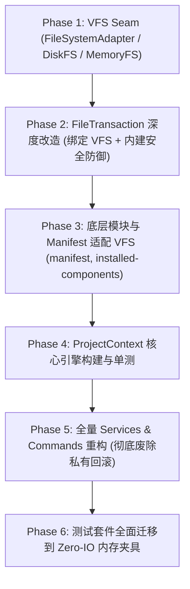

# CLI项目上下文与路径解析引擎封装方案

> 方案类型：底层架构重构与深模块封装
> 状态：**active**
> 日期：2026-08-18
> 关联文档：[架构优化方案-v3](架构优化方案-v3.md)；[CONTEXT.md](../../CONTEXT.md)
> 修订记录：
> - 2026-08-18：初稿定稿。确立 ProjectContext 深模块聚合实体、FileSystemAdapter 双适配器 Seam（Disk/Memory）、路径解析引擎全量收拢与测试零 IO 内存夹具。
> - 2026-08-18（v2）：基于第一性原理完成深度审查并修正。
>   1. 补齐 FileTransaction 内禀安全防御（写前边界检查 + 写后软链接劫持检测 verifyWrittenPath）；
>   2. 彻底收敛双重事务回滚机制，废除 add-service 内部私有 restoreSnapshot；
>   3. 完备 FileSystemAdapter 接口契约（readdir 重载支持、细粒度删除选项、跨平台 POSIX 规范化与软链接模拟）；
>   4. 消除 ProjectContext 未初始化状态（Uninitialized）的类型撒谎，新增 requireConfig() 强类型断言与派生缓存失效机制；
>   5. 将 manifest、installed-components、signature、vscode-snippets 等辅助模块纳入 VFS 依赖倒置改造，确保零 IO 内存隔离彻底闭环。

---

## 一、 背景与第一性原理

### 1. 现状痛点分析

在 BrutxUI Vue 3 CLI（`packages/cli`）当前的代码实现中，项目探测、路径解析与文件读写逻辑存在典型的**浅模块（Shallow Module）**散落与**高耦合（High Coupling）**问题：

```text
┌─────────────────────────────────────────────────────────────────────────────┐
│                            当前 CLI 路径与上下文架构现状                     │
├─────────────────────────────────────────────────────────────────────────────┤
│ 1. packages/cli/src/lib/project.ts (20+ 散装细粒度导出)                      │
│    ├─ detectProjectType, detectWorkspaceRoot, detectPackageManager         │
│    ├─ readTsConfig, getAliasFromTsConfig, resolveAliasPath, resolveUtils... │
│    └─ 上层命令必须手动按序编排 5-8 个函数才能解析出真实目标物理路径          │
│                                                                             │
│ 2. 路径解析与安全校验规则分散在各 Service (重复且脆弱)                      │
│    ├─ add-service.ts 独立实现 resolveComponentFilePath 处理 registry 前缀   │
│    ├─ init-service.ts 独立实现样式路径与 nuxt 配置路径处理                   │
│    └─ 各 service 重复手写 await assertSafePath(...) 防御遍历攻击，易遗漏   │
│                                                                             │
│ 3. 双重事务机制并存 (行为漂移)                                              │
│    ├─ init-service / remove-service 使用 FileTransaction 临时备份回滚       │
│    └─ add-service 独立手写 restoreSnapshot 内存字符串回滚，两套机制易产生漂移│
│                                                                             │
│ 4. 强绑定 Node 物理文件系统 (测试脆弱度高，IO 渗透)                          │
│    ├─ FileTransaction、project.ts、installed-components、manifest 直接依赖   │
│    └─ 单元测试需深层 mock 10+ 个 fs 方法，跨平台断言极易因路径格式/时序脆断  │
└─────────────────────────────────────────────────────────────────────────────┘
```

1. **接口暴露过宽、内聚不足（Shallow Interface）**：
   `project.ts` 导出了 20 余个细粒度工具函数，导致上层消费者（`add.ts`、`init.ts`、`doctor.ts`、`diff.ts` 等）必须知晓大量底层细节（如 `tsconfig` 如何一层层 `extends`、`baseUrl` 如何计算、`sharedBase` 与 `aliases` 如何拼接），并在函数间反复传递 `(cwd, config)`。
2. **安全守卫分散，未能形成内禀不变量（Invariant by Construction）**：
   路径遍历防御（`assertSafePath`）与写后软链接劫持检测（`verifyWrittenPath`）散落在多个 service 调用的各个角落，一旦新增 service 或命令漏写即形成安全漏洞。
3. **事务机制分裂（Dual Transaction Drift）**：
   `add-service.ts` 自建了基于内存字符串的 `restoreSnapshot`，而 `init-service.ts` 和 `remove-service.ts` 使用基于磁盘临时文件的 `FileTransaction`。两套机制在空目录清理、文件覆盖处理上存在隐蔽的行为不一致。
4. **缺少真正的 IO Seam（依赖倒置缺失）**：
   CLI 核心操作与 `node:fs` / `fs-extra` 强耦合。除 Services 之外，`manifest.ts`、`installed-components.ts`、`signature.ts`、`vscode-snippets.ts` 等辅助模块均直接引入物理 `fs`。缺少文件系统抽象层使得测试必须借助 `vi.mock('fs-extra')`，不仅使得测试代码难以维护，也无法真实测试并发隔离与跨平台路径行为。

---

## 二、 架构设计与核心契约

### 1. 双适配器 Seam：`FileSystemAdapter`

定义极简且完备的文件系统操作契约，隔离真实磁盘与内存模拟：

```typescript
export interface FileEntry {
    name: string;
    isDirectory(): boolean;
    isFile(): boolean;
    isSymbolicLink(): boolean;
}

export interface FileStat {
    isDirectory(): boolean;
    isFile(): boolean;
    isSymbolicLink(): boolean;
    mtimeMs: number;
    size: number;
}

export interface RemoveOptions {
    recursive?: boolean;
    force?: boolean;
}

export interface FileSystemAdapter {
    readFile(filePath: string, encoding?: BufferEncoding): Promise<string>;
    writeFile(filePath: string, content: string | Uint8Array, encoding?: BufferEncoding): Promise<void>;
    readJson<T = unknown>(filePath: string): Promise<T>;
    writeJson(filePath: string, data: unknown, options?: { spaces?: number }): Promise<void>;
    pathExists(filePath: string): Promise<boolean>;
    ensureDir(dirPath: string): Promise<void>;
    remove(targetPath: string, options?: RemoveOptions): Promise<void>;
    copy(src: string, dest: string): Promise<void>;
    stat(filePath: string): Promise<FileStat>;
    lstat?(filePath: string): Promise<FileStat>;
    
    // 函数重载分流，确保 TypeScript 严格模式下返回类型精准收窄
    readdir(dirPath: string, options: { withFileTypes: true }): Promise<FileEntry[]>;
    readdir(dirPath: string, options?: { withFileTypes?: false }): Promise<string[]>;
    readdir(dirPath: string, options?: { withFileTypes?: boolean }): Promise<FileEntry[] | string[]>;

    realpath(filePath: string): Promise<string>;
    mkdtemp(prefix: string): Promise<string>;
}
```

- **`DiskFileSystemAdapter`**：生产默认，直接基于 `fs-extra` 与 `node:fs/promises`。
- **`MemoryFileSystemAdapter`**：测试与 Dry-run 专用，内部采用统一 POSIX 规范化路径的 Map 树结构，内置符号链接表模拟 `realpath`/`symlink`，支持零磁盘 IO 的沙箱隔离。

---

### 2. 内禀安全文件事务：`FileTransaction`

`FileTransaction` 构造时接收 `FileSystemAdapter` 与项目根路径 `projectCwd`，将安全防御作为写操作的**内建不变量**：

```text
┌────────────────────────────────────────────────────────────────────────┐
│                   FileTransaction (Secure by Default)                  │
├────────────────────────────────────────────────────────────────────────┤
│  • writeFile(targetPath, content)                                      │
│    1. assertActive() (检查事务是否处于活动状态)                         │
│    2. assertSafePath(targetPath, projectCwd) (写前路径越界拦截)         │
│    3. snapshotMissingAncestors & snapshot(targetPath) (快照备份)       │
│    4. fs.writeFile(targetPath, content) (底层写入)                      │
│    5. verifyWrittenPath(targetPath, projectCwd) (写后软链接劫持检测)    │
│  • writeJson(targetPath, data, options)                                │
│  • remove(targetPath, options)                                         │
│  • commit() / rollback()                                               │
└────────────────────────────────────────────────────────────────────────┘
```

- **收敛所有写入与回滚**：彻底移除 `add-service.ts` 中的 `restoreSnapshot`，所有组件文件、辅助文件、配置文件的写入均通过 `FileTransaction`。
- **统一安全闭环**：上层业务代码无需显式编写防御代码，任何通过事务写入的文件均天然受防目录穿越与防符号链接劫持保护。

---

### 3. 深模块实体：`ProjectContext`

`ProjectContext` 作为一次 CLI 执行的核心聚合根（Aggregate Root），封装环境嗅探、配置生命周期、路径规则与安全守卫：

```text
┌────────────────────────────────────────────────────────────────────────┐
│                        CLI Commands & Services                         │
│       addService         initService        diffService     doctor     │
└────────────┬───────────────────┬───────────────────┬─────────────┬─────┘
             │                   │                   │             │
             ▼                   ▼                   ▼             ▼
┌────────────────────────────────────────────────────────────────────────┐
│                   ProjectContext (Deep Module Seam)                    │
│  • ProjectContext.load(cwd, options?) / loadUninitialized(cwd)         │
│  • resolveTargetPath(registryPath: string): Promise<string>            │
│  • resolveComponentsDir(): Promise<string>                             │
│  • resolveComponentDir(componentName: string): Promise<string>         │
│  • resolveUtilsFilePath(): Promise<string>                             │
│  • resolveStyleFilePath(): Promise<string>                             │
│  • resolveImportAlias(sourceCode: string): string                      │
│  • toRelativePosixPath(absolutePath: string): string                   │
│  • createTransaction(): FileTransaction                                │
│  • getEnvironmentInfo(): ProjectEnvironmentInfo                        │
└───────────────────────────────────┬────────────────────────────────────┘
                                    │
                         ┌──────────┴──────────┐
                         ▼                     ▼
              ┌─────────────────────┐┌─────────────────────┐
              │ DiskFileSystemAdapter││MemoryFileSystemAdapter│
              │  (Node.js Production)││  (Zero-IO Tests)   │
              └─────────────────────┘└─────────────────────┘
```

#### 核心 API 契约与强类型状态机

```typescript
export interface ProjectEnvironmentInfo {
    projectType: ProjectType;
    packageManager: PackageManager;
    workspaceRoot: string | null;
    hasSrc: boolean;
    isNuxt: boolean;
}

export interface ProjectContextOptions {
    fs?: FileSystemAdapter;
    configOverride?: BrutalistConfig;
    optionalConfig?: boolean;
}

export class ProjectContext {
    readonly cwd: string;
    readonly fs: FileSystemAdapter;
    readonly env: ProjectEnvironmentInfo;
    readonly tsConfig: TsConfig | null;

    /** 配置对象：在已初始化项目中非空；在 uninitialized 模式下可能为 undefined */
    get config(): BrutalistConfig | undefined;
    get isConfigured(): boolean;

    /** 强类型断言获取配置，未初始化时抛出语义化 CliError('CONFIG_NOT_FOUND') */
    requireConfig(): BrutalistConfig;

    /** 工厂方法：已初始化项目（add/diff/remove/doctor/info），若 components.json 缺失抛出异常 */
    static async load(cwd?: string, options?: ProjectContextOptions): Promise<ProjectContext>;

    /** 工厂方法：未初始化项目（init/create），允许无 components.json 启动 */
    static async loadUninitialized(cwd?: string, options?: ProjectContextOptions): Promise<ProjectContext>;

    /** 动态绑定/注入初始化配置（自动触发派生路径缓存与别名映射的失效与重算） */
    bindConfig(config: BrutalistConfig): void;

    /** 统一路径映射：将 registry 虚拟路径映射为本地物理绝对路径（内置路径安全校验） */
    resolveTargetPath(registryPath: string): Promise<string>;

    /** 组件安装目录物理路径解析（如 <cwd>/src/components/ui） */
    resolveComponentsDir(): Promise<string>;

    /** 单个组件物理目录解析（如 <cwd>/src/components/ui/button） */
    resolveComponentDir(componentName: string): Promise<string>;

    /** 工具函数物理路径解析（如 <cwd>/src/lib/utils.ts） */
    resolveUtilsFilePath(): Promise<string>;

    /** 全局样式物理路径解析（根据 tailwind.css 配置或项目特征探测） */
    resolveStyleFilePath(): Promise<string>;

    /** 源码 import 别名重写 */
    resolveImportAlias(content: string): string;

    /** 跨平台格式化为相对 cwd 的标准 POSIX 路径（用于日志与 manifest，消除 Windows 反斜杠） */
    toRelativePosixPath(absolutePath: string): string;

    /** 路径安全校验 */
    assertSafePath(targetPath: string): Promise<void>;
    isSafePath(targetPath: string): Promise<boolean>;

    /** 创建绑定当前上下文与文件系统的内禀安全事务控制器 */
    createTransaction(): FileTransaction;
}
```

---

## 三、 实施阶段划分与任务拆解



### Phase 1: 虚拟文件系统抽象层构建 (VFS Seam)
- [ ] 创建 `packages/cli/src/lib/fs/file-system-adapter.ts`，定义 `FileSystemAdapter`、`FileEntry`、`FileStat` 接口及函数重载。
- [ ] 实现 `packages/cli/src/lib/fs/disk-fs.ts`（生产封装 `fs-extra` 与 `node:fs/promises`）。
- [ ] 实现 `packages/cli/src/lib/fs/memory-fs.ts`（内存 Map 树，支持递归目录、文件写入、快照、符号链接模拟与 POSIX 路径规范化）。
- [ ] 编写 VFS 单元测试，验证内存文件系统在 Windows/Linux 路径语义下的行为一致性。

### Phase 2: `FileTransaction` 深度改造与安全不变量内建
- [ ] 重构 `packages/cli/src/lib/file-transaction.ts`：构造函数接收 `(fs: FileSystemAdapter, projectCwd: string)`。
- [ ] 将写前 `assertSafePath` 与写后 `verifyWrittenPath` 内置进 `writeFile` 与 `writeJson` 操作。
- [ ] 补齐细粒度空目录安全回滚清理机制。
- [ ] 编写事务单测，验证异常抛出时的自动回滚与内存沙箱完整性。

### Phase 3: 辅助模块与 Manifest 适配 VFS
- [ ] 改造 `packages/cli/src/lib/manifest.ts`：接收 `FileSystemAdapter`，解耦直连 `fs-extra`。
- [ ] 改造 `packages/cli/src/lib/installed-components.ts`：接收 `FileSystemAdapter` 或 `ProjectContext`，使用抽象 `readdir`/`readFile` 进行组件与 AST 依赖扫描。
- [ ] 改造 `packages/cli/src/lib/signature.ts` 与 `packages/cli/src/lib/vscode-snippets.ts`：支持通过 `FileSystemAdapter` 计算哈希与写出配置。

### Phase 4: `ProjectContext` 核心引擎实现
- [ ] 创建 `packages/cli/src/lib/project-context.ts`：
  - 实现 `ProjectContext.load` 与 `ProjectContext.loadUninitialized` 双工厂及 `requireConfig()` 强类型防护。
  - 内聚 `detectProjectType`、`detectPackageManager`、`detectWorkspaceRoot`、`readTsConfig`（展开 extends 链，在 VFS 环境下安全回退）。
  - 内聚 `resolveTargetPath`（统一处理 `components`、`composables`、`locales`、`directives`、`lib/utils`、`sharedBase` 等）。
  - 内聚 `resolveComponentsDir`、`resolveComponentDir`、`resolveUtilsFilePath`、`resolveStyleFilePath`、`toRelativePosixPath`。
  - 内聚 `resolveImportAlias` 与 `extractScriptBlocks`。
- [ ] 改造 `packages/cli/src/lib/project.ts`：作为内部子模块或完全由 `project-context.ts` 替代，收敛所有细粒度导出。

### Phase 5: Services 与 Commands 全量重构
- [ ] 重构 `packages/cli/src/lib/services/add-service.ts`：接收 `ProjectContext`，彻底废除私有 `restoreSnapshot`，全面改用 `context.createTransaction()`。
- [ ] 重构 `packages/cli/src/lib/services/init-service.ts`：接收 `ProjectContext`（uninitialized），调用 `context.createTransaction()` 与 `context.bindConfig()`。
- [ ] 重构 `packages/cli/src/lib/services/diff-service.ts`：接收 `ProjectContext` 进行组件比对与路径定位。
- [ ] 重构 `packages/cli/src/lib/services/remove-service.ts`：接收 `ProjectContext` 执行安全组件与孤儿文件清理。
- [ ] 适配 `commands/add.ts`、`commands/init.ts`、`commands/doctor.ts`、`commands/diff.ts`、`commands/remove.ts`、`commands/info.ts`，统一以 `ProjectContext.load` 为入口。
- [ ] 清理 `packages/cli/src/lib/index.ts` 导出面，消除 20+ 个散装函数泄漏。

### Phase 6: 测试套件全面迁移到内存夹具 (Zero-IO)
- [ ] 编写测试辅助函数 `createTestProjectContext(files: Record<string, string>, options?)`。
- [ ] 重构 `tests/project.test.ts`、`tests/security.test.ts`、`tests/add.test.ts`、`tests/init.test.ts`、`tests/diff.test.ts`、`tests/remove.test.ts`、`tests/doctor.test.ts`，全面移除脆弱的 `vi.mock('fs-extra')`，改为内存文件驱动。
- [ ] 运行 `pnpm --filter brutx-vue typecheck` 与 `pnpm --filter brutx-vue test` 验证全绿。

---

## 四、 质量门禁与验收标准

1. **类型安全性**：`pnpm --filter brutx-vue typecheck` 0 错误，严格禁止隐式 any 与非空断言 `!`，消除所有未初始化配置项的类型欺骗。
2. **测试覆盖率与速度**：所有 `packages/cli/tests/*.test.ts` 100% 通过，主要测试基于 `MemoryFileSystemAdapter` 运行，无物理磁盘文件残留，执行速度显著提升。
3. **架构正交性**：上层 Command / Service 中不再直接 import `fs-extra`，所有 IO 均通过 `ProjectContext.fs` 或 `ProjectContext.createTransaction()`。
4. **事务与安全闭环**：全库仅保留 `FileTransaction` 一套事务机制；所有写操作天然内置防路径穿越与防软链接劫持校验。

