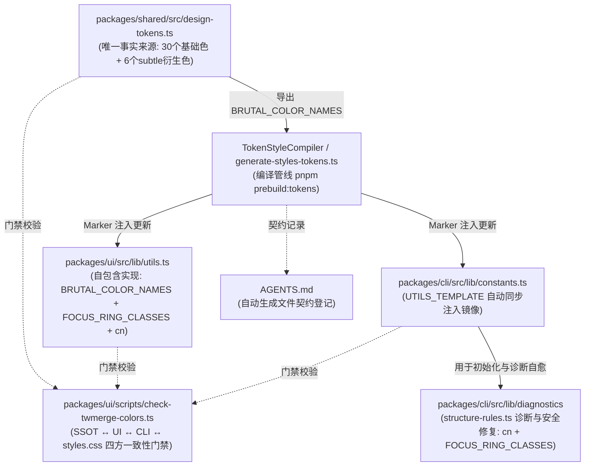

# Tailwind颜色双轨与工具函数单一信源治理方案

> 方案类型：重构 / 架构优化 / 单一信源治理
> 状态：**done**
> 日期：2026-08-20
> 关联文档：[TAILWIND_V4_MECHANISMS.md](../guides/TAILWIND_V4_MECHANISMS.md)、[CLI样式自动生成与单一信源治理方案.md](CLI样式自动生成与单一信源治理方案.md)
> 修订记录：
> - 2026-08-20：初始版本草案；根据审查意见补全 CLI constants 自动注入闭环、FOCUS_RING_CLASSES 诊断规则与 AGENTS.md 维护契约。
> - 2026-08-20：全部落地完成（M1~M7），通过 Issue #38、#39、#40、#41、#42 及 OCR 审查闭环，四端一致性门禁与全量测试 100% 通过。

## 1. 概述与背景

在 BrutxUI Vue 3 体系中，`cn()` 工具函数负责合并 Tailwind CSS 类名并处理冲突。
为了让外部传入的通用工具类（如 `bg-red-500`）能够正确覆盖组件内默认的粗野主义语义色（如 `bg-brutal-primary`），必须通过 `tailwind-merge` 的 `extendTailwindMerge` 扩展自定义颜色组。

但在现有实现中，存在明显的**双轨分发**与**硬编码信源断裂**问题：

1. **库内硬编码与信源断裂**：`packages/ui/src/lib/utils.ts` 中的 `BRUTAL_COLOR_NAMES` 是手动硬编码的 36 个字符串数组，未从唯一事实来源 `packages/shared/src/design-tokens.ts` 派生。
2. **CLI 分发双轨与能力丢失**：`packages/cli/src/lib/constants.ts` 中的 `UTILS_TEMPLATE`（CLI `init` / `add` 写入用户项目的 `utils.ts`）仅为基础的 `twMerge(clsx(inputs))`，未配置 `extendTailwindMerge`，导致生成到用户工程的组件完全丢失自定义颜色去重能力，类名覆盖优先级退化为取决于 CSS 声明顺序。
3. **关键导出缺失**：库内大量组件 variants（如 Button、Select、DropdownMenu 等）强依赖 `import { FOCUS_RING_CLASSES, cn } from '@/lib/utils'`，但 CLI 当前分发的 `UTILS_TEMPLATE` 缺少 `FOCUS_RING_CLASSES` 导出，导致用户通过 CLI 下载组件源码后编译报错。
4. **缺乏自动化闭环**：CLI 侧的模板目前与 UI 库源码分离维护，缺乏统一的构建期注入管线，极易在后续新增设计令牌时发生漂移。

本方案旨在将 `BRUTAL_COLOR_NAMES` 的派生逻辑收拢至 `packages/shared/src/design-tokens.ts`，并将 `packages/ui/src/lib/utils.ts` 与 `packages/cli/src/lib/constants.ts` 双双纳入 `prebuild:tokens` 自动化生成管线，实现 UI 库源码与 CLI 分发代码 100% 同源同构。

---

## 2. 核心架构设计

---

## 3. 详细实施计划

### 3.1 M1: `packages/shared/src/design-tokens.ts` 派生与导出 `BRUTAL_COLOR_NAMES`

- **非颜色令牌剥离**：在 `packages/shared/src/design-tokens.ts` 中定义并导出 `NON_COLOR_TOKEN_KEYS` 常量（`borderWidth`, `borderColor`, `shadowOffsetX`, `shadowOffsetY`, `shadowColor`, `radius`）。
- **纯函数式派生**：
  - 基础颜色名（30 个）：`(Object.keys(TOKEN_TO_CSS_VAR) as Array<keyof ThemeTokens>).filter(k => !NON_COLOR_TOKEN_KEYS.has(k)).map(k => TOKEN_TO_CSS_VAR[k])`
  - Subtle 衍生色名（6 个）：`SUBTLE_COLOR_DEFS.map(d => \`brutal-\${d.key}-subtle\`)`
  - 导出冻结并排序后的数组：`export const BRUTAL_COLOR_NAMES: readonly string[] = Object.freeze([...baseColors, ...subtleColors].sort())`
- **公共导出统一**：在 `packages/shared/src/index.ts` 中显式导出 `NON_COLOR_TOKEN_KEYS` 与 `BRUTAL_COLOR_NAMES`。
- **TokenStyleCompiler 复用**：移除 `packages/ui/scripts/compiler/token-style-compiler.ts` 中的私有 `NON_COLOR_TOKEN_KEYS` 声明，改为从 `brutx-shared-vue` 统一引入。
- **零依赖原则**：保持 `design-tokens.ts` 零第三方运行时 import。

### 3.2 M2: `TokenStyleCompiler` 编译器拓展与双端标记注入

- 在 `packages/ui/scripts/compiler/token-style-compiler.ts` 中增加：
  - 颜色常量标记：
    - `COLOR_NAMES_START = '/* @brutx:color-names:start */'`
    - `COLOR_NAMES_END = '/* @brutx:color-names:end */'`
  - CLI 模板标记：
    - `CLI_UTILS_START = '/* @brutx:cli-utils-template:start */'`
    - `CLI_UTILS_END = '/* @brutx:cli-utils-template:end */'`
  - `compileColorNamesBlock()`：生成格式化后的 `const BRUTAL_COLOR_NAMES = [\n    'brutal-accent',\n    ...\n] as const;`（严格遵循 4 空格缩进与单引号风格）。
  - `compileCliUtilsTemplate()`：生成 CLI 分发所需的完整 `UTILS_TEMPLATE` 字符串字面量代码。
  - `patchUtilsTs(content: string): PatchResult`：自动将生成的颜色名列表注入到 `packages/ui/src/lib/utils.ts` 中。
  - `patchCliConstants(content: string): PatchResult`：自动将同步后的 `UTILS_TEMPLATE` 注入到 `packages/cli/src/lib/constants.ts` 中。
- 在 `packages/ui/scripts/generate-styles-tokens.ts` 中：
  - 增加对 `packages/ui/src/lib/utils.ts` 与 `packages/cli/src/lib/constants.ts` 的自动更新。
  - 增加 `--check` 模式下的 diff 打印与拦截。

### 3.3 M3: `packages/ui/src/lib/utils.ts` 结构规范化

- 维持自包含格式，包含：
  1. `/* @brutx:color-names:start */` 注入块。
  2. `extendTailwindMerge` 实例化配置（使用 `customTwMerge` 命名以避免潜在标识符争用）。
  3. `FOCUS_RING_CLASSES` 焦点环标准类名导出。
  4. `cn()` 导出函数。

### 3.4 M4: CLI `constants.ts` 模板单源自动化同步

- 在 `packages/cli/src/lib/constants.ts` 中设置 `CLI_UTILS_START` / `CLI_UTILS_END` 标记。
- `UTILS_TEMPLATE` 通过生成脚本实现与 `packages/ui/src/lib/utils.ts` 的 100% 同构，包含完整的 `extendTailwindMerge`、`FOCUS_RING_CLASSES` 与 `cn()`。
- `CN_FUNCTION_TEMPLATE` 复用 `UTILS_TEMPLATE`。
- `CN_FUNCTION_BODY_TEMPLATE` 同步升级为包含粗野主义颜色扩展的安全实现。

### 3.5 M5: CLI 诊断自愈引擎升级（`structure-rules.ts`）

- **扩展诊断项**：
  - 检查 `utils.ts` 中是否包含 `extendTailwindMerge` 粗野主义颜色扩展注册。若仅有基础 `twMerge`，诊断返回 `warn`（提示颜色类冲突可能无法去重覆盖，附带修复建议）。
  - 检查 `utils.ts` 中是否导出 `FOCUS_RING_CLASSES`。若缺失，诊断返回 `error` / `warn`。
- **安全自愈修复（`fix`）**：
  - 若整个 `utils.ts` 缺失，直接写入完整的 `UTILS_TEMPLATE`。
  - 若已存在 `utils.ts` 但缺少 `FOCUS_RING_CLASSES`，安全追加 `FOCUS_RING_CLASSES` 导出声明。
  - 若已存在 `utils.ts` 但缺少 `cn` 或颜色扩展，处理已有的 `import` 语句，避免与既有 `twMerge` 标识符发生命名冲突。

### 3.6 M6: 四端一致性 CI 门禁（`check-twmerge-colors.ts`）

- 重构 `packages/ui/scripts/check-twmerge-colors.ts`：
  - 校验 1：`packages/shared` 的 `BRUTAL_COLOR_NAMES` ↔ `packages/ui/src/styles.css` 的 `--color-brutal-*`。
  - 校验 2：`packages/shared` 的 `BRUTAL_COLOR_NAMES` ↔ `packages/ui/src/lib/utils.ts`。
  - 校验 3：`packages/shared` 的 `BRUTAL_COLOR_NAMES` ↔ `packages/cli/src/lib/constants.ts` 的 `UTILS_TEMPLATE`。
  - 校验 4：`packages/ui/src/lib/utils.ts` ↔ `packages/cli/src/lib/constants.ts` 的 `FOCUS_RING_CLASSES` 声明一致性。
  - 任一端存在多余或缺失均报错并中断 `pnpm typecheck` / CI 流程。

### 3.7 M7: 项目开发契约同步（`AGENTS.md`）

- 在 `AGENTS.md` 的“自动生成文件（勿手动编辑）”表格中，补充登记：
  - `packages/ui/src/lib/utils.ts` 的颜色列表块（触发命令：`prebuild:tokens`）
  - `packages/cli/src/lib/constants.ts` 的 `UTILS_TEMPLATE` 块（触发命令：`prebuild:tokens`）

---

## 4. 验证与验收标准

1. **自动构建一致性**：
   - 运行 `pnpm prebuild:tokens`，`styles.css`、`preflight.css`、`brutalist.css`、`packages/ui/src/lib/utils.ts` 与 `packages/cli/src/lib/constants.ts` 全量自动更新无报错。
2. **生成检查与门禁拦截**：
   - 运行 `pnpm --filter brutx-ui-vue prebuild:tokens -- --check`，输出无 diff 且 pass。
   - 运行 `tsx packages/ui/scripts/check-twmerge-colors.ts`，四端校验全部 pass；故意删减任一颜色或 `FOCUS_RING_CLASSES` 时门禁精准报错。
3. **单元测试与类型检查**：
   - `pnpm --filter brutx-ui-vue test`
   - `pnpm --filter brutx-vue test`
   - `pnpm --filter brutx-shared-vue test`
   - `pnpm typecheck`
4. **文档与链接健康**：
   - 运行 `node scripts/docs/check-doc-links.mjs check`，0 死链、0 处 `file:///`。
