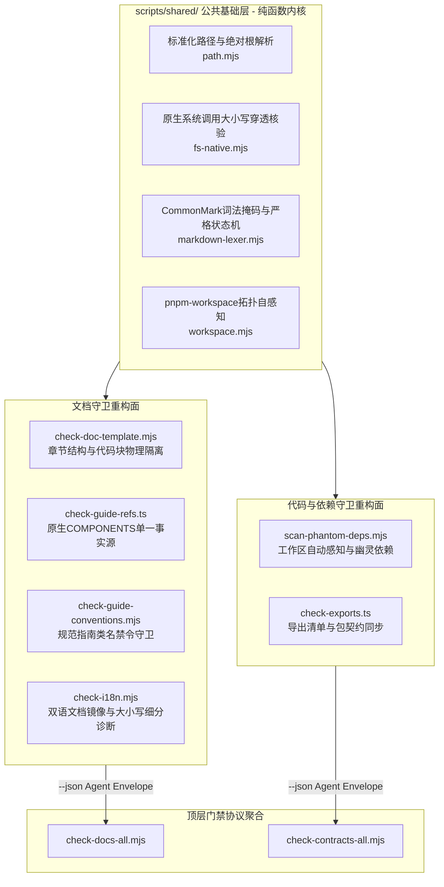

# 工程门禁与巡检脚本工具链重构方案

> 本方案针对 BrutxUI 工程内部全套门禁、巡检与契约守卫脚本（涵盖 `check-guide-refs.ts`、`check-doc-template.mjs`、`check-guide-conventions.mjs`、`scan-phantom-deps.mjs`、`check-i18n.mjs` 等）进行深模块化与工程治理重构。从第一性原理与终态无痕原则出发，废除脆弱缩进正则、消除 Markdown 围栏代码块穿透、根除 Windows 11 大小写敏感性盲区与 `process.cwd()` 依赖；建立“纯函数内核 + 命令式外壳（Functional Core, Imperative Shell）”架构，依托操作系统原生系统调用穿透（含 Win32 扩展路径剥离）与严格 CommonMark 围栏状态机；推动工作区包拓扑动态自感知，全面对齐 Agent Result Envelope 结构化输出契约，并依托独立测试套件建立微秒级单元测试防线。

---

## 一、 背景与第一性原理

在 BrutxUI Monorepo 体系中，`scripts/` 下的各类自检脚本构成了全工程的**“静态守卫层（Static Guardrails Layer）”**。与耗时的完整构建（`turbo build`）相比，这些脚本依托纯只读静态扫描，在毫秒级（`check:docs` ~0.3s，`check:contracts` ~1.6s）内提供极高频的质量反馈，作为 pre-commit 与 CI 的第一道硬门禁。

然而，审视现行脚本工具链，暴露出以下深层次的技术债务与设计断层：

### 1. 伪单一事实源与脆弱缩进正则
- **格式假定引发静默假绿**：[`scripts/check-guide-refs.mjs`](../../scripts/check-guide-refs.mjs) 提取 `packages/shared/src/components.ts` 的组件键时，使用了正则 `/^\s{4}(['"])([^'"]+)\1:\s*\{/gm`，强依赖源码必须正好为 4 个空格缩进。一旦代码格式化调整或样式改动，该正则匹配结果为 0，导致组件文档覆盖率检查发生**静默假绿**。
- **工作区拓扑硬编码**：[`scripts/scan-phantom-deps.mjs`](../../scripts/scan-phantom-deps.mjs) 手工维护 `PKG_ROOTS` 与 `PKG_JSON` 映射表，未能通过 `pnpm-workspace.yaml` 实现包结构自动发现，当新增包或调整目录时极易产生盲区与双源漂移。
- **历史废弃符号包袱**：`check-guide-refs.mjs` 内置硬编码黑名单 `REMOVED_SYMBOLS`，每次废弃组件均需手工维护负向清单，违反“终态无痕”与“0.x 不背负历史包袱”原则。

### 2. Markdown 围栏代码块盲区（Fence Blindness）与语法穿透
- **章节误判**：[`scripts/check-doc-template.mjs`](../../scripts/check-doc-template.mjs) 的 `headings()` 遍历全文所有以 `## ` 开头的行，未做代码块过滤。若文档在 Markdown 代码示例中包含了 `## 预览` 或在脚本示例中包含了以 `## ` 开头的注释，脚本会误判该章节已存在。
- **正文假阳性截断**：`extractSection` 寻找章节边界时同样忽略围栏，遇到代码块内的 `## ` 会提前截断正文，导致正文后续的 `<ComponentPreview>` 或 `<InstallationTabs>` 被误判为缺失，引发假阳性报错。
- **伪闭合围栏泄漏**：基于行的简易围栏状态机若未限定“闭合围栏禁止携带 info string”，在展示嵌套 Markdown 示例（如包含带语言标签的反引号行）时会提前闭合外层围栏，导致代码块内部内容逃逸为正文。

### 3. Windows 11 环境下的跨平台路径与大小写假阳性
- **大小写穿透盲区**：Windows 11（NTFS）文件系统默认大小写不敏感，常规 `existsSync` 或单层 `readdir` 无法检测中间祖先目录的大小写错位（如 `docs/Guides/...`）。本地检测全部通过，但推送到 Linux CI（大小写严格敏感）后将直接触发 404 构建崩溃。
- **系统调用扩展前缀盲区**：在 Windows 下调用 Node.js 底层 `fs.realpathSync.native` 时，长路径往往附带 Win32 扩展前缀（`\\?\`）。若未进行标准化剥离，直接比对会导致全路径大小写比对恒为 `false`，引发大面积误报拦截。
- **执行目录耦合与 URL 解码缺失**：
  - `check-guide-refs.mjs`、`check-i18n.mjs`、`scan-phantom-deps.mjs` 依赖 `process.cwd()`，当开发者在子目录（如 `packages/ui`）执行脚本时，相对路径直接错乱崩溃；
  - `check-guide-conventions.mjs` 采用手写正则截取 `import.meta.url`，未利用标准库 `fileURLToPath`，在路径包含空格或转义字符时存在解析风险。

### 4. 门禁契约脱节与结构化输出缺失
上层聚合门禁 [`scripts/docs/check-docs-all.mjs`](../../scripts/docs/check-docs-all.mjs) 与 [`scripts/check-contracts-all.mjs`](../../scripts/check-contracts-all.mjs) 已经实现了统一的 **Agent Result Envelope 协议**（支持 `--json`、五态状态机与建议自愈动作）。但底层子脚本均不支持 `--json` 参数，导致聚合器只能截取非结构化的控制台控制符文本塞进 JSON，AI Agent 与 CI 管道无法精准消费文件路径、行号与规则元数据。

---

## 二、 核心设计原则与架构拓扑



### 核心设计原则
1. **单一事实源驱动（Single Source of Truth）**：
   直接以 TypeScript 导出的原生常量对象 `COMPONENTS` 及 `pnpm-workspace.yaml` 为单一事实源，废除脆弱缩进正则与静态路径硬编码。
2. **严格 CommonMark 围栏边界与词法隔离**：
   引入符合 CommonMark 规范的多字符围栏状态机（闭合围栏禁止 info string）与行内代码掩码，严格隔离“正文”、“代码块”与“行内代码”。
3. **原生系统调用穿透与 Win32 扩展前缀归一化**：
   依托现代 Node.js 原生 `fs.realpathSync.native` 进行真实物理路径解析，自动剥离 Win32 `\\?\` 前缀，并限定比对作用域为仓库根以内的相对路径，彻底抹平 Windows NTFS 假阳性并规避宿主符号链接干扰。
4. **纯函数内核与命令式外壳（Functional Core, Imperative Shell）**：
   将文档语法分析、依赖提取、包拓扑解析抽象为纯函数，与物理 I/O 解耦。无须重型依赖注入容器即可在内存沙箱中进行微秒级单元测试。
5. **统一 Agent Result Envelope 契约与标准进程退出码**：
   所有子脚本标准化实现 `--json` 输出，仅在 stdout 输出结构化 `diagnostics`（含 `file`、`line`、`ruleId`、`message`、`severity`），排错信息走 stderr；违规时保持 `exit 1`，聚合层优先解析 stdout 中的 Envelope。
6. **Monorepo 包职责边界隔离**：
   测试套件严格落位于 `scripts/__tests__/`，绝不污染对外发布的业务子包（如 `packages/shared`）。

---

## 三、 脚本公共基础库设计（`scripts/shared/`）

抽取零依赖、轻量且高复用的公共基础模块，作为全仓脚本工具链的底座：

### 1. 标准跨平台路径工具（`scripts/shared/path.mjs`）
全面基于 Node.js 官方标准库 `fileURLToPath`，规避手写正则的跨平台风险：
```javascript
import { fileURLToPath } from 'node:url'
import path from 'node:path'

/**
 * 安全获取 Monorepo 仓库绝对根路径（支持 Windows 盘符、空格与 URL 转义符）
 */
export function getRepoRoot() {
  return path.resolve(fileURLToPath(new URL('../../', import.meta.url)))
}

/**
 * 统一转换为 Posix 格式路径
 * @param {string} p
 */
export function toPosixPath(p) {
  return p.split(path.sep).join('/')
}

/**
 * file:/// URL 或相对/绝对路径转标准绝对物理路径
 * @param {string} targetPathOrUrl
 */
export function normalizeAbsPath(targetPathOrUrl) {
  if (typeof targetPathOrUrl === 'string' && targetPathOrUrl.startsWith('file:')) {
    return path.resolve(fileURLToPath(targetPathOrUrl))
  }
  return path.resolve(targetPathOrUrl)
}
```

### 2. 原生真实大小写穿透守卫（`scripts/shared/fs-native.mjs`）
利用系统底层调用抹平 NTFS 大小写不敏感，穿透全部中间祖先目录，并处理 Win32 扩展前缀与软链接边界：
```javascript
import fs from 'node:fs'
import path from 'node:path'
import { getRepoRoot, toPosixPath } from './path.mjs'

/**
 * 标准化真实路径：剥离 Windows \\?\ 扩展长度前缀并规范为 Posix 斜杠
 * @param {string} p
 */
export function normalizeRealPath(p) {
  return path.normalize(p).replace(/^\\\\\?\\/, '').replace(/\\/g, '/')
}

/**
 * 跨平台大小写严格存在性核验（抹平 Windows 11 NTFS 假阳性，穿透全路径祖先层级）
 * @param {string} absPath 目标绝对路径
 * @param {string} [repoRoot] 仓库绝对根路径（用于隔离根外部软链接）
 * @returns {{ exists: boolean, exactCase: boolean, realPath: string | null }}
 */
export function verifyCaseSync(absPath, repoRoot = getRepoRoot()) {
  if (!fs.existsSync(absPath)) {
    return { exists: false, exactCase: false, realPath: null }
  }

  try {
    const rawReal = fs.realpathSync.native(absPath)
    const normReal = normalizeRealPath(rawReal)
    const normInput = normalizeRealPath(absPath)

    // 抹平 Windows 驱动器盘符大小写（如 E: 与 e:）
    const formatDrive = (p) => p.replace(/^[a-zA-Z]:/, (m) => m.toUpperCase())
    const driveNormInput = formatDrive(normInput)
    const driveNormReal = formatDrive(normReal)

    // 若目标位于仓库根内，仅校验相对仓库根部分的大小写，规避根目录本身包含 symlink 的假阳性
    const normRoot = formatDrive(normalizeRealPath(repoRoot))
    if (driveNormInput.startsWith(normRoot + '/') && driveNormReal.startsWith(normRoot + '/')) {
      const relInput = driveNormInput.slice(normRoot.length + 1)
      const relReal = driveNormReal.slice(normRoot.length + 1)
      return { exists: true, exactCase: relInput === relReal, realPath: normReal }
    }

    const exactCase = driveNormInput === driveNormReal
    return { exists: true, exactCase, realPath: normReal }
  } catch {
    return { exists: true, exactCase: true, realPath: absPath }
  }
}

/**
 * 便捷判断文件是否存在且路径大小写完全吻合
 */
export function existsExactCaseSync(absPath, repoRoot = getRepoRoot()) {
  const result = verifyCaseSync(absPath, repoRoot)
  return result.exists && result.exactCase
}
```

### 3. CommonMark 词法掩码与严格围栏状态机（`scripts/shared/markdown-lexer.mjs`）
纯函数词法分析，严格遵循 CommonMark 围栏闭合标准：
```javascript
/**
 * 遮蔽行内代码片段，保留原有字符长度与物理偏移
 */
export function maskInlineCodeSpans(line) {
  return line.replace(/(`+)([\s\S]*?)\1/g, (match) => ' '.repeat(match.length))
}

/**
 * 遍历 Markdown 源码，精确区分代码围栏、HTML 注释与正文行
 * @param {string} content
 * @param {(context: { line: number, raw: string, masked: string, inFence: boolean, inComment: boolean }) => void} callback
 */
export function traverseMarkdownLines(content, callback) {
  const lines = content.split('\n')
  let activeFence = null
  let inHtmlComment = false

  for (let i = 0; i < lines.length; i++) {
    const raw = lines[i]
    const trimmed = raw.trim()

    // 1. 处理 HTML 注释区间
    if (!activeFence) {
      if (trimmed.startsWith('<!--')) {
        if (!trimmed.endsWith('-->')) inHtmlComment = true
        callback({ line: i + 1, raw, masked: ' '.repeat(raw.length), inFence: false, inComment: true })
        continue
      }
      if (inHtmlComment) {
        if (trimmed.includes('-->')) inHtmlComment = false
        callback({ line: i + 1, raw, masked: ' '.repeat(raw.length), inFence: false, inComment: true })
        continue
      }
    }

    // 2. 匹配代码围栏
    // 闭合围栏判定：CommonMark 规定闭合标记后除空白外严禁包含任何 info string
    if (activeFence) {
      const closeMatch = trimmed.match(/^(`{3,}|~{3,})\s*$/)
      if (closeMatch && closeMatch[1][0] === activeFence.markerChar && closeMatch[1].length >= activeFence.markerLen) {
        activeFence = null
        callback({ line: i + 1, raw, masked: ' '.repeat(raw.length), inFence: true, inComment: false })
        continue
      }
      callback({ line: i + 1, raw, masked: ' '.repeat(raw.length), inFence: true, inComment: false })
      continue
    }

    // 起始围栏判定：至少 3 个反引号或波浪线，允许携带语言标签
    const openMatch = trimmed.match(/^(`{3,}|~{3,})/)
    if (openMatch) {
      activeFence = { markerChar: openMatch[1][0], markerLen: openMatch[1].length }
      callback({ line: i + 1, raw, masked: ' '.repeat(raw.length), inFence: true, inComment: false })
      continue
    }

    // 3. 正文行执行行内代码掩码遮蔽
    const masked = maskInlineCodeSpans(raw)
    callback({ line: i + 1, raw, masked, inFence: false, inComment: false })
  }
}
```

### 4. 工作区包拓扑解析器（`scripts/shared/workspace.mjs`）
动态解析 `pnpm-workspace.yaml` 中的 `packages:` 声明块，消除静态路径硬编码：
```javascript
import fs from 'node:fs'
import path from 'node:path'
import { getRepoRoot, toPosixPath } from './path.mjs'

/**
 * 从 pnpm-workspace.yaml 内容中提取 packages glob 清单（纯状态机解析，免疫其他 yaml 属性干扰）
 * @param {string} yamlContent
 */
export function parseWorkspaceGlobs(yamlContent) {
  const patterns = []
  let inPackagesBlock = false

  for (const rawLine of yamlContent.split('\n')) {
    const line = rawLine.trim()
    if (!line || line.startsWith('#')) continue

    if (/^packages:\s*$/.test(line)) {
      inPackagesBlock = true
      continue
    }

    if (inPackagesBlock) {
      // 遇到新的顶层键时退出 packages 块
      if (/^[a-zA-Z0-9_-]+:/.test(line)) {
        inPackagesBlock = false
        continue
      }
      const m = line.match(/^-\s*['"]?([^'"]+)['"]?/)
      if (m) patterns.push(m[1])
    }
  }
  return patterns
}

/**
 * 动态发现并解析工作区内所有包的元数据
 * @param {string} [root]
 */
export function discoverWorkspacePackages(root = getRepoRoot()) {
  const workspaceYamlPath = path.join(root, 'pnpm-workspace.yaml')
  if (!fs.existsSync(workspaceYamlPath)) return []

  const patterns = parseWorkspaceGlobs(fs.readFileSync(workspaceYamlPath, 'utf-8'))
  const packages = []

  for (const pattern of patterns) {
    const baseDir = pattern.replace(/\/\*$/, '')
    const absBase = path.join(root, baseDir)
    if (!fs.existsSync(absBase)) continue

    const entries = fs.readdirSync(absBase, { withFileTypes: true })
    for (const ent of entries) {
      if (!ent.isDirectory()) continue
      const pkgDir = path.join(absBase, ent.name)
      const pkgJsonPath = path.join(pkgDir, 'package.json')
      if (fs.existsSync(pkgJsonPath)) {
        try {
          const json = JSON.parse(fs.readFileSync(pkgJsonPath, 'utf-8'))
          packages.push({
            name: json.name,
            dir: pkgDir,
            relDir: toPosixPath(path.relative(root, pkgDir)),
            packageJsonPath,
            manifest: json,
          })
        } catch {}
      }
    }
  }
  return packages
}
```

---

## 四、 重点巡检脚本专项重构设计

### 1. `check-doc-template.mjs` 状态机重构
- **标题解析隔离**：接入 `traverseMarkdownLines`，仅抓取 `inFence === false && inComment === false` 条件下的标题，行内反引号内容已被遮蔽，彻底根除代码示例引起的误判。
- **章节内容提取**：重构 `extractSection` 为基于上下文的纯函数，围栏内的 `## ` 标记不作为章节闭合依据，仅在围栏外遇到同级或更高级标题时才闭合当前章节，彻底消除正文假阳性提前截断。
- **结构化诊断**：支持 `--json` 输出标准 `diagnostics`（定位到具体的缺失行与文件名）。

### 2. `check-guide-refs.ts` 单一事实源与原生对象接入
- **文件迁移与运行时调度**：
  将脚本升级为 `scripts/check-guide-refs.ts`。在 [`scripts/docs/check-docs-all.mjs`](../../scripts/docs/check-docs-all.mjs) 中引入与 `check-contracts-all.mjs` 完全一致的 `getRunner(scriptPath)` 机制，复用本地 `node_modules/tsx/dist/cli.mjs` 调度执行，无须外部转译，毫秒级直接加载 TS 源码。
- **原生单一事实源**：
  直接 `import { COMPONENTS } from '../packages/shared/src/components.js'`，直接获取 `Object.keys(COMPONENTS)`，零正则匹配，从根源上杜绝格式变更导致的静默假绿。
- **彻底移除废弃符号黑名单**：
  删除 `REMOVED_SYMBOLS`。守卫核心正向对齐：“所有已在 `COMPONENTS` 登记的组件，必须在 `apps/docs/` 下具备 100% 对应的中英文使用文档”。
- **全路径大小写穿透核验**：
  文档存在性检测接入 `existsExactCaseSync`，防止 Windows 环境下大小写错乱穿透到 Linux CI。
- **标准化 Envelope 输出**：
  支持 `--json` 模式，输出缺失文档详情列表。

### 3. `scan-phantom-deps.mjs` 工作区自感知
- **消除手工硬编码映射**：
  使用 `discoverWorkspacePackages()` 自动动态感知全工程所有子包路径与 package.json，彻底移除静态 `PKG_ROOTS` 与 `PKG_JSON`。
- **执行目录无关性**：
  统一采用 `getRepoRoot()` 绝对根推导，杜绝任何 `process.cwd()` 调用。
- **结构化输出**：
  支持 `--json` 格式，提供包含 `pkg`、`dependency`、`importedInFile` 的结构化诊断数据。

### 4. `check-guide-conventions.mjs` 稳健化
- **URL 路径规范化**：
  采用 `getRepoRoot()` 替换原先的手动正则替换，消除 Windows 路径特殊字符与空格解析风险。
- **统一围栏解析**：
  使用 `traverseMarkdownLines` 代替局部分词，确保代码围栏判断标准全仓统一，并支持 `--json` 输出。

### 5. `check-i18n.mjs` 大小写冲突专项诊断
- **根目录推导收敛**：统一采用 `getRepoRoot()`。
- **大小写冲突细分诊断**：在进行双语差异比对前，先进行大小写不敏感字典比对。若发现中文文档为 `alert.md` 而英文文档为 `Alert.md`，单独输出 `CASING_MISMATCH` 诊断，精准指引纠偏，而非拆分为两处互相缺失。

---

## 五、 门禁聚合协议整合与契约对齐

### 1. 子脚本 `--json` 诊断输出契约
所有子脚本在接收到 `--json` 参数时，均必须遵循统一的子诊断结果契约：

```json
{
  "status": "success | error",
  "summary": "检查概览说明文本",
  "diagnostics": [
    {
      "file": "apps/docs/components/button.md",
      "line": 42,
      "ruleId": "doc-template/missing-preview-component",
      "message": "预览章节缺少 <ComponentPreview> 组件",
      "severity": "error"
    }
  ]
}
```

### 2. 标准流与进程退出码规约（Agent 友好）
- **stdout 纯净性**：子脚本在 `--json` 模式下，**stdout 仅且只能输出单段标准 JSON 字符串**。任何警告、调试或追溯日志必须且只能输出至 stderr；
- **标准退出码语义**：当存在 `severity: "error"` 的诊断时，子脚本必须保持退出码 `exit 1`；全绿时 `exit 0`；
- **聚合层防御性解析**：上层门禁 [`check-docs-all.mjs`](../../scripts/docs/check-docs-all.mjs) 与 [`check-contracts-all.mjs`](../../scripts/check-contracts-all.mjs) 在子进程退出后，**无论退出码是否为 0，均优先尝试对 stdout 执行 `JSON.parse`**。若成功解析出 Envelope 契约，则直接合并 `diagnostics` 并按结构化流程展示；仅在无法解析为 JSON 时才将其视作非结构化崩溃并回退至 stderr 输出。

---

## 六、 实施路线图（三阶段交付）

### 第一阶段（Phase 1）：公共基础设施与基础路径收敛
- [ ] 创建 `scripts/shared/path.mjs`，统一 Monorepo 绝对根与 Posix 路径转换。
- [ ] 创建 `scripts/shared/fs-native.mjs`，封装剥离 Win32 扩展前缀的全路径大小写穿透核验。
- [ ] 创建 `scripts/shared/markdown-lexer.mjs`，封装严格的 CommonMark 围栏闭合状态机与行内代码掩码。
- [ ] 创建 `scripts/shared/workspace.mjs`，实现 `pnpm-workspace.yaml` 工作区包自动发现。
- [ ] 在 `scripts/__tests__/` 下建立针对公共基础层（状态机、大小写穿透、工作区发现）的独立 Vitest 测试套件，确保零污染业务包。

### 第二阶段（Phase 2）：重点守卫重塑与单一事实源对齐
- [ ] 重构 `check-doc-template.mjs`，引入状态机消除围栏穿透与正文截断假阳性，支持 `--json`。
- [ ] 升级 `check-guide-refs.ts`，移除历史废弃符号清单，通过 TSX 运行时引入原生 `COMPONENTS` 字典，接入大小写穿透核验，支持 `--json`。
- [ ] 重构 `scan-phantom-deps.mjs`，移除静态映射，接入工作区自动发现机制，支持 `--json`。
- [ ] 改造 `check-i18n.mjs` 与 `check-guide-conventions.mjs`，全面切换至新公共基础层并支持 `--json`。

### 第三阶段（Phase 3）：门禁协议打通与全量契约验收
- [ ] 升级 `check-docs-all.mjs`，引入 `getRunner` 调度 TSX，直接聚合各子脚本的结构化 `diagnostics`。
- [ ] 升级 `check-contracts-all.mjs`，聚合依赖子脚本的结构化 Envelope 输出。
- [ ] 运行全量 `pnpm check:docs` 与 `pnpm check:contracts` 验证自检与性能基线。

---

## 七、 验证与验收标准

1. **零假阳性与零假绿**：
   - 在组件文档代码块中故意编写嵌套的带语言标签反引号行及 `## 预览` 注释，`check-doc-template.mjs` 准确识别其为代码块内容，不产生围栏提前闭合，不产生正文提前截断；
   - 故意修改 `packages/shared/src/components.ts` 的代码排版与缩进，`check-guide-refs.ts` 依然精准读取全部登记组件，杜绝静默假绿。
2. **跨平台大小写全链路拦截与 Win32 扩展路径兼容**：
   - 在 Windows 11 环境下故意创建目录或文件名大小写不一致的路径（如 `docs/Guides/visual_system.md`），守卫准确拦截并阻断；
   - 处理超长路径或带有 `\\?\` 前缀时，系统调用大小写核验不产生误报。
3. **工作区目录无关性**：
   - 在 Monorepo 任意子目录（如 `packages/ui`、`apps/docs`）执行任意巡检脚本，行为和诊断输出与在根目录下执行完全一致。
4. **性能基线与门禁放行**：
   - 保持极速自检特性：`pnpm check:docs` 执行耗时不超过 0.5s，`pnpm check:contracts` 不超过 2.0s；
   - 门禁在默认模式下严格遵循 Unix 沉默原则，全绿时仅输出单行极简确认。
