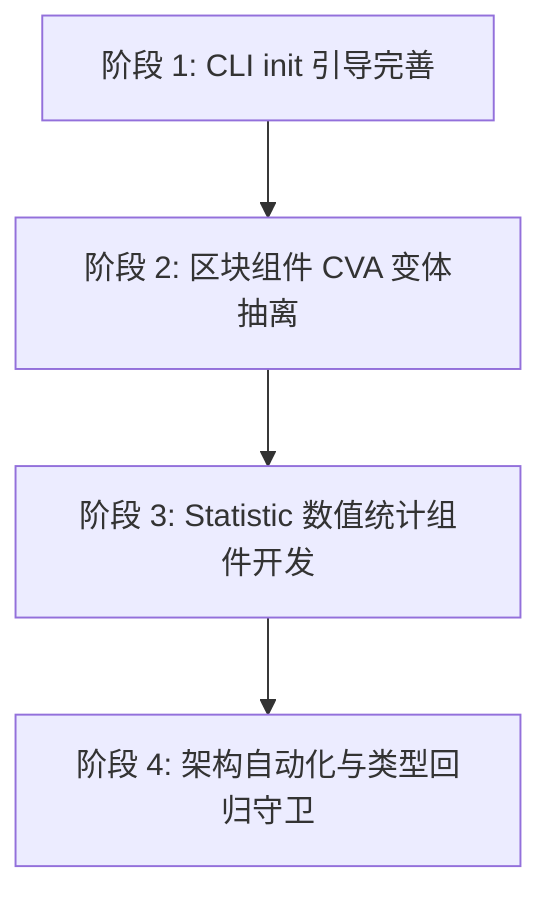

# 系统演进与存量任务收敛方案

> 本方案是 BrutxUI 工程进入成熟期后的系统性演进纲领。它全面继承并收纳了历史活跃方案中已交付主体、仅剩边缘待办的存量任务（涵盖 CLI 样式引导、复合区块 CVA 抽离、Statistic 组件开发及三大架构工程化方向），消除了跨方案多头跟踪的心智负担，作为当前唯一的活跃演进方案统一推进。

---

## 一、 背景与第一性原理

在早期的多线快速迭代中，工程并行建立了《Tailwind模块化依赖图扫描与样式解耦方案》、《组件设计规范与视觉效果优化方案》、《组件深化与拓展方案》和《架构优化方案-v3》。

经过持续的代码与测试落地审计，既有四大方案的主体与核心架构均已 **80% ~ 100% 落地**：
- **Tailwind 样式解耦**：DAG 拓扑扫描、双模式写入、深层 `@import` 穿透与 `doctor --fix` 自动清理历史 Marker 已全部完成并全绿放行；
- **视觉系统优化**：R8 排版阶梯、Subtle 浅色语义派生令牌流水线、Tabs `h-11` 尺寸收敛与 `--ease-brutal-*` 机械动效已完全合入规范与代码库；
- **组件深化拓展**：Transfer、Cascader、Rate、Menu、Image、Result、Watermark、Tour、Backtop、Tree 拖拽/懒加载、DataTable 虚拟滚动等高级能力已全量交付；
- **架构基础**：v1/v2 的 SSR 治理、性能基准、turbo 增量编排、changeset 发布流水线与依赖显式化已成为日常开发的稳固基石。

然而，多篇方案由于各残留 5% ~ 20% 的边缘长尾任务，长期处于 `active` 状态，导致方案目录与 Agent 认知产生分散。
从第一性原理出发，**“完成度极高但有长尾的方案应将主体归档，并将剩余未竟任务抽取聚合为单一事实源”**，从而实现规划的收敛与聚焦。

---

## 二、 存量未尽任务全景矩阵

收敛后的任务按领域与依赖关系划分为四个清晰的交付模块：

```text
┌────────────────────────────────────────────────────────────────────────┐
│                      系统演进与存量任务矩阵 (M1 ~ M4)                   │
├─────────────────┬──────────────────────────────────────────────────────┤
│ M1. CLI 引导    │ init.ts 交互式引导接入（Tailwind v4 tokensFile 模式）│
├─────────────────┼──────────────────────────────────────────────────────┤
│ M2. 视觉与变体  │ 复合/业务区块级组件抽离独立 CVA 变体架构             │
├─────────────────┼──────────────────────────────────────────────────────┤
│ M3. 新组件补全  │ Statistic 数值统计与倒计时组件开发                   │
├─────────────────┼──────────────────────────────────────────────────────┤
│ M4. 架构自动化  │ 主入口动态生成 / 类型回归测试门禁 / 文档 Props 自动化│
└─────────────────┴──────────────────────────────────────────────────────┘
```

---

## 三、 详细技术方案与实施规格

### 模块 1：CLI `init.ts` 交互式引导接入（继承自 Tailwind 样式解耦方案）

#### 1. 目标
在 `packages/cli/src/commands/init.ts` 初始化命令中，为用户提供友好的选择引导，支持直观配置解耦的独立设计令牌文件。

#### 2. 技术规格与交互契约
- **交互 Prompt**：
  在询问 Tailwind CSS 入口路径后，增加询问：
  `? 是否将 BrutxUI 设计令牌拆分为独立的 CSS 文件？(推荐，保持主入口干净)`
  - 若用户确认（默认推荐）：
    - 提示默认路径：`src/assets/brutx-tokens.css`（或依据检测到的目录智能建议）；
    - 将 `tokensFile` 写入 `components.json` 中的 `tailwind` 配置对象。
  - 若用户跳过：保持单文件内联注入模式。
- **服务层调用**：
  调用已就绪的 `initService.addBrutalistStyles`，严格执行 `isSafePath` 安全检查，并在主 CSS 入口注入相对导入 `@import "./brutx-tokens.css";`。

---

### 模块 2：复合区块组件 CVA 变体抽离（继承自视觉系统优化方案）

#### 1. 目标
解决复杂业务区块组件（如 `DashboardShell`、`HeaderSection`、`FooterSection`、`PricingSection`、`HeroSection` 等）内部样式散落在 template、缺少变体隔离的问题。

#### 2. 技术规格与规范契约
- **变体隔离原则**：
  在各区块组件同级目录下新建 `*-variants.ts`：
  - 例如 `packages/ui/src/components/dashboard-shell/dashboard-shell-variants.ts`；
  - 抽取 `dashboardRootVariants`（支持 layout: fluid / fixed）、`dashboardSidebarVariants`（支持 collapsed: true / false）、`dashboardHeaderVariants` 等。
- **Tailwind `@source` 字面量合规**：
  所有变体类名必须采用静态字面量，严禁动态模板字符串拼接，通过 `pnpm check:contracts` 中的 `check:class-literals` 守卫。
- **类型严苛**：显式导出 `VariantProps` 类型。

---

### 模块 3：`Statistic` 数值统计组件开发（继承自组件深化拓展方案）

#### 1. 目标
补齐常用数据展示体系中最后一块拼图——Neo-Brutalism 风格的数值统计与倒计时组件。

#### 2. 核心功能与 Props 契约
- **组件结构**：`packages/ui/src/components/statistic/`
  - `Statistic.vue`
  - `Countdown.vue`（或集成倒计时模式）
  - `statistic-variants.ts`
  - `statistic.test.ts`
- **Props 规格**：
  - `title`: 标题文本或 `#title` slot
  - `value`: 数值（number | string）
  - `precision`: 小数点保留位数
  - `decimalSeparator`: 小数点符号（默认 `.`）
  - `groupSeparator`: 千分位分隔符（默认 `,`）
  - `prefix` / `suffix`: 前缀/后缀图标或单位文本
  - `valueStyle`: 自定义数值样式
- **粗野主义视觉特征**：
  - 数值采用 `font-mono font-black text-2xl/3xl`；
  - 配合粗线边框与可选背景卡片样式（`card: true`）；
  - 支持 `trend: 'up' | 'down'` 实体指示箭头（配合状态强调色）。
- **注册表与导出**：
  - 在 `packages/shared/src/components.ts` 的 `COMPONENTS` 登记元数据；
  - 执行 `prebuild:scan` 与 `prebuild:exports` 自动更新清单。

---

### 4. 模块 4：架构工程化三大方向（继承自架构优化方案 v3）

#### 1. 主入口自动化生成（Dynamic Re-export Automation）
- **痛点**：每次新增或重构组件，都需要手动核对 `packages/ui/src/index.ts`。
- **解法**：开发 `packages/ui/scripts/generate-index.ts`，以 `registry-manifest.json` 与组件子目录为单一信源，自动生成格式规范的 `src/index.ts`；并在 `check:exports` 中校验其实际内容是否漂移。

#### 2. 类型层回归测试门禁（Type-Level Testing Guard）
- **痛点**：重构组件或推导工具函数时，TypeScript 类型的隐式退化（如退化为 `any` 或破坏复杂联合类型）在运行时单元测试中往往无法捕捉。
- **解法**：在 `packages/ui` 中引入 `tsd` 或 `expect-type`，针对复杂组件（如 `DataTable` 行数据泛型、`Select` 选项类型推导、`Form` 表单类型安全）编写 `.test-d.ts` 类型单测，并接入 `typecheck` 或契约门禁。

#### 3. 文档 Props/Emits/Slots 表格自动生成
- **痛点**：`apps/docs/` 下各组件的使用文档 API 表格依赖人工维护，极易与组件代码的最新 props 发生滞后或遗漏。
- **解法**：编写脚本通过 `vue-component-meta` 提取 SFC 真实 Props、Emits、Slots 定义，并支持一键将 Markdown 表格自动渲染/更新至组件文档中。

---

## 四、 实施路线与里程碑



1. **阶段 1 (CLI)**：接入 `init.ts` 交互式 `tokensFile` 引导，完善单测；
2. **阶段 2 (UI)**：完成 `DashboardShell` 等复合区块的 CVA 抽离与字面量验证；
3. **阶段 3 (Component)**：完整交付 `Statistic` 组件（含倒计时、单元测试、注册表登记与文档）；
4. **阶段 4 (Core)**：分步推进主入口自动生成、类型单测及文档 Props 自动化工具。

---

## 五、 验收与质量门禁

每个阶段的落地必须严格遵守现行门禁契约：
1. **代码契约门禁**：`pnpm check:contracts`（并发 6 合 1，0 违规）；
2. **文档健康度门禁**：`pnpm check:docs`（0 死链，Frontmatter 完整合规）；
3. **依赖安全门禁**：`pnpm check:deps`（0 幽灵依赖）；
4. **严格类型检查**：`pnpm typecheck`（TypeScript 严格模式 0 错误）。
