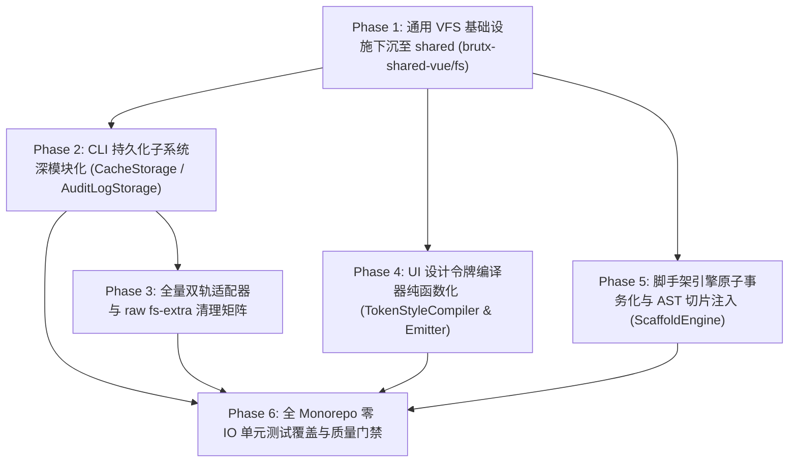

# 全工程虚拟文件系统统一与持久化深模块重构方案

> 方案类型：底层架构重构与深模块封装
> 状态：**done**
> 日期：2026-08-19
> 关联文档：[CLI项目上下文与路径解析引擎封装方案](CLI项目上下文与路径解析引擎封装方案.md)；[CLI声明式诊断巡检与自愈引擎方案](CLI声明式诊断巡检与自愈引擎方案.md)；[注册表编译与AST静态转换管线模块化方案](注册表编译与AST静态转换管线模块化方案.md)；[架构优化方案-v3](架构优化方案-v3.md)；[CONTEXT.md](../../CONTEXT.md)
> 修订记录：
> - 2026-08-19（初稿）：确立全 Monorepo 级 VFS 统一 Seam（`brutx-shared-vue/fs`）、CLI 缓存与审计持久化深模块（`CacheStorage`/`AuditLogStorage`）、全面清除双轨适配器样板代码、UI 设计令牌纯计算编译器（`TokenStyleCompiler`）与脚手架事务引擎（`ScaffoldEngine`）。
> - 2026-08-19（架构强化与审查修订）：确立必选契约、子路径隔离、上下文聚合与 AST 切片安全注入规范。
> - 2026-08-19（落地完成）：全部 7 个 Tickets (#31-#37) 与 Spec Issue #30 全部落地验收并通过全量质量门禁（4637 个测试 100% 通过，0 lint 警告，0 类型错误）。

---

## 一、 背景与第一性原理

### 1. 现状痛点分析

在 BrutxUI Vue 3 体系中，近期相继完成了 [CLI项目上下文封装](CLI项目上下文与路径解析引擎封装方案.md)、[CLI声明式诊断自愈引擎](CLI声明式诊断巡检与自愈引擎方案.md) 以及 [注册表编译管线模块化](注册表编译与AST静态转换管线模块化方案.md) 三大里程碑改造。

然而，审视整个 Monorepo（`packages/cli`、`packages/registry`、`packages/ui`、`packages/shared` 与 `scripts/`）的磁盘 I/O 与持久化现状，仍存在着深层次的**架构断层（Architectural Fracture）**与**浅层泄漏（Shallow Leakage）**：

```text
┌─────────────────────────────────────────────────────────────────────────────┐
│                          当前全工程磁盘与持久化现状痛点                      │
├─────────────────────────────────────────────────────────────────────────────┤
│ 1. 跨包 VFS 契约隔离与重复 (Missing Universal Seam)                          │
│    ├─ FileSystemAdapter 与 MemoryFS 私有定义在 packages/cli                 │
│    ├─ packages/registry 私自分叉定义完全重合的 VFS 契约与内存适配器         │
│    └─ packages/ui 脚本与 scripts/ 脚手架依然强绑定 Node 原生 node:fs          │
│                                                                             │
│ 2. 浅适配器过渡态残留 (Dual-Track Hack: fsAdapter ? ... : fs-extra)         │
│    ├─ installed-components.ts, manifest.ts, vscode-snippets.ts 等内部        │
│    │  充斥大量 `fsAdapter ? await fsAdapter.xxx : await fs.xxx` 三元分支    │
│    └─ 导致类型表面积膨胀、未强制要求 VFS 注入，无法保证 100% 内存驱动        │
│                                                                             │
│ 3. CLI 持久化子系统未深模块化 (Direct Disk Penetration)                     │
│    ├─ cache.ts (412 lines): 直调 fs-extra，依赖环境变量隔离，LRU 逻辑内联   │
│    ├─ audit.ts (282 lines): 直调 createReadStream，无法在内存沙箱中审计      │
│    └─ 单测被迫创建真实磁盘临时文件或深度 mock，速度受限且有脏数据残留风险    │
│                                                                             │
│ 4. 命令与服务层大量逃逸直接调用 fs-extra (Raw fs-extra Penetration)         │
│    ├─ commands/create.ts, commands/init.ts, commands/info.ts, registry.ts    │
│    ├─ lib/project.ts, lib/security.ts, lib/services/init-service.ts          │
│    └─ 绕过 ProjectContext 与 VFS Seam 直连物理磁盘，破坏了沙箱演练能力       │
│                                                                             │
│ 5. UI 预构建管线混杂计算与直接写盘 (Token Prebuild Monolith)                │
│    ├─ generate-styles-tokens.ts (413 lines): 令牌计算与物理写盘紧耦合        │
│    └─ --check 模式直接读物理磁盘，无法脱离 Node 磁盘环境进行微秒级纯内存断言│
│                                                                             │
│ 6. 脚手架缺乏原子事务与结构化导出注入 (Fragile Scaffolder)                  │
│    ├─ scripts/generate.ts (733 lines): 字符串粗暴拼接破坏性写 index.ts       │
│    └─ 缺乏失败回滚保护，生成中断时残留半成品文件与混乱导出                  │
└─────────────────────────────────────────────────────────────────────────────┘
```

1. **VFS 契约未下沉，多包重复分叉（Missing Universal Seam）**：
   虚拟文件系统适配器（`FileSystemAdapter`、`DiskFileSystemAdapter`、`MemoryFileSystemAdapter`）目前分别在 `packages/cli/src/lib/fs/` 和 `packages/registry/src/fs/` 私自分叉实现。`packages/ui` 与 `scripts/` 则依然直接依赖 Node 原生 `node:fs`，无法共用统一的 POSIX 路径归一化规范与零 IO 内存测试夹具。
2. **过渡期双轨代码蔓延（Dual-Track Hacks）**：
   在 CLI 辅助模块中，`fsAdapter?: FileSystemAdapter` 作为可选参数在函数间反复透传，内部四处充斥 `const exists = fsAdapter ? await fsAdapter.pathExists(p) : await fs.pathExists(p)`。这不仅增大了分支圈复杂度，而且允许隐式逃逸到底层 `fs-extra`，破坏了“通过 Seam 统一控制 I/O”的不变量。
3. **持久化子系统缺乏深模块封装（Shallow Persistence Modules）**：
   `cache.ts`（412 行）包含了 LRU 淘汰、TTL 过期、304 续期、并发 in-flight 去重、原子文件替换等复杂行为，却是一个全局过程式模块，强依赖物理磁盘与 `process.env[BRUTX_CACHE_DIR]`；`audit.ts`（282 行）直接调用 `node:fs` 流式读取。二者均无法在内存沙箱中进行微秒级并发隔离测试。
4. **命令与服务层存在非受控磁盘穿透（Raw fs-extra Leaks）**：
   除了辅助库外，`commands/create.ts`、`commands/init.ts`、`lib/project.ts`、`lib/services/init-service.ts` 等核心业务层直接 `import fs from 'fs-extra'`，导致 CLI 在执行 `init`、`create` 等流程时无法纯依托 `ProjectContext.fs` 进行 100% 内存模拟与演练。
5. **UI 预构建管线混杂纯计算与副作用（Side-Effect Coupling）**：
   `generate-styles-tokens.ts`（413 行）将核心算法（从 `design-tokens.ts` 派生 `:root`、`.dark`、主题预设和字体栈）与直接 `fs.writeFileSync` 修改 `styles.css`、`preflight.css`、`brutalist.css` 混在一起，缺乏纯数据变换层与薄发射器（Emitter）的解耦。
6. **代码生成脚手架脆弱且无事务（Imperative & Fragile Scaffolding）**：
   `scripts/generate.ts`（733 行）通过字符串末尾追加方式修改 `packages/ui/src/index.ts`，多文件生成过程中若发生异常无法自动回滚，破坏了代码库的整洁性与规范。

---

### 2. 第一性原理推导

依据 `codebase-design` 深模块设计哲学：
- **Depth 衡量的是 Leverage**：将复杂的磁盘边界行为（原子写入、LRU 双限淘汰、并发 in-flight 防击穿、JSONL 流式容错、AST 精准节点定位注入、事务回滚）封装在极小表面积的 Interface 之后。
- **Seam 的唯一性与环境隔离性**：全工程只应存在一个标准的文件系统 Seam——`brutx-shared-vue/fs`。无论是生产物理环境（`DiskFS`）还是测试/演练沙箱（`MemoryFS`），所有涉及文件读写的模块均穿过此 Seam。同时，`packages/shared` 的根入口严禁暴露 Node 原生模块，保证前端打包纯净。
- **消除双轨适配器（Replace-Don't-Layer）**：所有需要进行文件操作的模块，统一强制接收 `FileSystemAdapter` 或 `ProjectContext`，彻底废除可选 `fsAdapter?` 与内部 `fs-extra` 回退三元表达式。
- **纯计算与 IO 发射分离（Pure Calculation vs IO Emitters）**：设计令牌生成、脚手架文件树派生等逻辑必须首先是确定性纯函数，写盘仅作为薄外壳或事务执行器。

---

## 二、 架构设计与核心契约

### 1. 全工程分层架构蓝图

```text
┌──────────────────────────────────────────────────────────────────────────────────────────────────┐
│                                 Universal File System & Storage Blueprint                        │
├──────────────────────────────────────────────────────────────────────────────────────────────────┤
│                                      Application / CLI / Tooling Layer                           │
│     CLI Commands (add/init/doctor/create) │ Registry Runner / Watcher │ UI Prebuild & Generators │
└───────────────────────────────────────────┴─────────────┬─────────────┴──────────────────────────┘
                                                          │
                                                          ▼
┌──────────────────────────────────────────────────────────────────────────────────────────────────┐
│                                       Deep Modules Layer                                         │
│  ┌───────────────────────┐  ┌──────────────────────┐  ┌─────────────────┐  ┌──────────────────┐  │
│  │     ProjectContext    │  │     CacheStorage     │  │ AuditLogStorage │  │  ScaffoldEngine  │  │
│  │ (路径解析/环境嗅探根) │  │(LRU/原子写/In-Flight)│  │ (JSONL流式审计) │  │(事务/AST切片注入)│  │
│  └───────────┬───────────┘  └──────────┬───────────┘  └────────┬────────┘  └────────┬─────────┘  │
│              │ (装配)                  │                       │ (受管绑定)         │            │
│              └─────────────────────────┼───────────────────────┘                    │            │
│                                        │ (强制依赖注入)                             │            │
│                                        ▼                                            ▼            │
│                             ┌─────────────────────────────────────────────────────────┐          │
│                             │                     FileTransaction                     │          │
│                             │            (内禀安全路径/原子写入/失败自动回滚)           │          │
│                             └────────────────────────────┬────────────────────────────┘          │
└──────────────────────────────────────────────────────────┼───────────────────────────────────────┘
                                                           │
                                                           ▼ (统一跨包 Seam)
┌──────────────────────────────────────────────────────────────────────────────────────────────────┐
│                        Universal File System Adapter (brutx-shared-vue/fs)                       │
│  ┌───────────────────────────────────────────────┐  ┌──────────────────────────────────────────┐ │
│  │            DiskFileSystemAdapter              │  │          MemoryFileSystemAdapter         │ │
│  │  - Node 22+ 原生 node:fs/promises 零依赖实现  │  │  - 纯 Map 虚拟文件系统目录树 (零 IO)    │ │
│  │  - 跨平台 POSIX 路径归一化与 Windows 盘符兼容 │  │  - POSIX 归一化/符号链接/微秒级测试沙箱  │ │
│  │  - 必选 lstat / mkdtemp / realpath 完整支持   │  │  - 内置 dump() 快照与原子目录递归模拟    │ │
│  └───────────────────────────────────────────────┘  └──────────────────────────────────────────┘ │
└──────────────────────────────────────────────────────────────────────────────────────────────────┘
```

---

### 2. 跨包通用 VFS 基础设施：`brutx-shared-vue/fs`

将文件系统抽象下沉至 `packages/shared/src/fs/`，作为 Monorepo 全局通用的基础层：

```typescript
// packages/shared/src/fs/types.ts
export interface FileEntry {
    name: string;
    isDirectory(): boolean;
    isFile(): boolean;
    isSymbolicLink(): boolean;
}

export interface FileStat {
    isDirectory(): boolean;
    isFile(): boolean;
    isSymbolicLink(): boolean;
    mtimeMs: number;
    size: number;
}

export interface FsRemoveOptions {
    recursive?: boolean;
    force?: boolean;
}

export interface FileSystemAdapter {
    readFile(filePath: string, encoding?: BufferEncoding): Promise<string>;
    writeFile(filePath: string, content: string | Uint8Array, encoding?: BufferEncoding): Promise<void>;
    readJson<T = unknown>(filePath: string): Promise<T>;
    writeJson(filePath: string, data: unknown, options?: { spaces?: number }): Promise<void>;
    pathExists(filePath: string): Promise<boolean>;
    ensureDir(dirPath: string): Promise<void>;
    remove(targetPath: string, options?: FsRemoveOptions): Promise<void>;
    copy(src: string, dest: string): Promise<void>;
    stat(filePath: string): Promise<FileStat>;
    lstat(filePath: string): Promise<FileStat>;

    readdir(dirPath: string, options: { withFileTypes: true }): Promise<FileEntry[]>;
    readdir(dirPath: string, options?: { withFileTypes?: false }): Promise<string[]>;
    readdir(dirPath: string, options?: { withFileTypes?: boolean }): Promise<FileEntry[] | string[]>;

    realpath(filePath: string): Promise<string>;
    mkdtemp(prefix: string): Promise<string>;
}
```

#### 关键架构纪律：
1. **坚固的必选契约（Solid Seam）**：
   `lstat` 与 `mkdtemp` 明确作为**必选方法**，拒绝可选标记（`?`），消除 Caller 调用时的防御性类型检查与潜在运行时未定义异常。
2. **浏览器与打包隔离原则（Packaging Isolation）**：
   - `packages/shared/src/index.ts`（根入口）**绝对严禁**导出任何 `fs` 相关模块（防止 Vite / VitePress 打包时将 Node 运行时带入前端产物）；
   - 仅在 `packages/shared/package.json` 中配置子路径导出：
     ```json
     "exports": {
         ".": "./src/index.ts",
         "./scan": "./src/scan.ts",
         "./design-tokens": "./src/design-tokens.ts",
         "./fs": "./src/fs/index.ts"
     }
     ```
3. **零生产依赖原则（Zero Runtime Dependencies）**：
   - `DiskFileSystemAdapter` 直接基于 Node 22+ 原生 `node:fs/promises`（利用 `fs.mkdir(..., { recursive: true })`、`fs.rm(..., { recursive: true, force: true })`、`fs.cp(..., { recursive: true })`）实现；
   - `packages/shared` 的 `package.json` **不添加** `fs-extra` 等任何第三方生产依赖，维持纯净轻量。
4. **测试沙箱内建能力**：
   `MemoryFileSystemAdapter` 完整内置符号链接解析、递归目录虚拟节点创建、以及 `dump(): Record<string, string>` 内存文件树导出，为全 Monorepo 提供微秒级无 I/O 测试支撑。

---

### 3. CLI 缓存持久化深模块：`CacheStorage`

封装缓存的全部复杂生命周期，提供小表面积强类型 API：

```typescript
// packages/cli/src/lib/storage/cache-storage.ts
export interface CacheEntry<T> {
    data: T;
    timestamp: number;
    etag?: string;
    lastModified?: string;
    registryVersion?: string;
}

export interface CacheReadResult<T> {
    data: T;
    timestamp: number;
    etag?: string;
    lastModified?: string;
    registryVersion?: string;
    expired: boolean;
}

export interface CacheWriteInput {
    etag?: string;
    lastModified?: string;
    registryVersion?: string;
}

export interface CacheStats {
    dir: string;
    entryCount: number;
    totalBytes: number;
}

export interface CacheStorageOptions {
    fs: FileSystemAdapter;
    cacheDir?: string;
    maxEntries?: number;
    maxBytes?: number;
    defaultTtl?: number;
    disabled?: boolean;
    offline?: boolean;
}

export class CacheStorage {
    constructor(options: CacheStorageOptions);

    /** 读取缓存（自动处理 TTL 过期、损坏条目容错与离线模式降级复用） */
    public async get<T>(name: string, source: string, ttl?: number): Promise<CacheReadResult<T> | null>;

    /** 写入缓存（自动执行临时文件原子替换 + 并发 in-flight 共享 + LRU 双上限淘汰） */
    public async set<T>(name: string, source: string, data: T, meta?: CacheWriteInput): Promise<void>;

    /** 并发去重执行器：同键请求合并为单个异步任务 */
    public async dedupe<T>(name: string, source: string, fn: () => Promise<T | null>): Promise<T | null>;

    /** 304 命中续期：仅更新 timestamp，不重写包体 */
    public async touch(name: string, source: string): Promise<void>;

    /** 清空全部缓存或按天数淘汰历史旧条目 */
    public async clear(maxAgeDays?: number): Promise<void>;

    /** 统计指标：供 doctor 报告缓存健康状况与离线覆盖度 */
    public async getStats(): Promise<CacheStats>;
}
```

- **原子落盘内建**：使用 `fs.mkdtemp` 或 `${filePath}.${process.pid}.${crypto.randomUUID()}.tmp` 写入临时文件，并通过 `fs.copy` + `fs.remove` 安全替换，杜绝写入中断导致损坏残留。
- **构造工厂与兼容转发**：提供 `createDefaultCacheStorage(fs: FileSystemAdapter, flags?: CacheFlags): CacheStorage`，`packages/cli/src/lib/cache.ts` 保留轻量转发层，以最小成本平滑兼容现有调用点。

---

### 4. CLI 审计持久化深模块：`AuditLogStorage`

将 `.brutx/audit.log` 的追加、流式读取与损坏恢复收敛为独立深模块，并作为 `ProjectContext` 的受管状态域：

```typescript
// packages/cli/src/lib/storage/audit-storage.ts
export interface AuditLogStorageOptions {
    fs: FileSystemAdapter;
    cwd: string;
    relativePath?: string; // 默认 '.brutx/audit.log'
}

export class AuditLogStorage {
    constructor(options: AuditLogStorageOptions);

    /** 追加单条审计记录（自动确保目录存在，内部捕获非致命异常，支持 dry-run 过滤） */
    public async append(entry: Omit<AuditEntry, 'timestamp'>): Promise<void>;

    /** 高阶装饰器：自动捕获 action 执行成功/失败并记录审计日志 */
    public async withAudit<T>(
        entry: Omit<AuditEntry, 'timestamp' | 'success' | 'error'>,
        action: () => Promise<T>
    ): Promise<T>;

    /** 流式按行读取与过滤（按时间/命令/成功失败/条数限制，自动跳过崩溃残留的损坏行） */
    public async query(filter?: AuditReadFilter): Promise<AuditEntry[]>;

    /** 快速获取最近失败记录（供 doctor 诊断历史故障） */
    public async getRecentFailures(limit?: number): Promise<AuditEntry[]>;

    /** 快速行计数（供 doctor 统计审计总数，跳过完整 JSON 解析） */
    public async count(): Promise<number>;

    /** 检测审计日志是否存在 */
    public async exists(): Promise<boolean>;
}
```

- **统一行迭代器机制**：内部统一基于异步行分割生成器（`AsyncIterable<string>`）解析 JSONL。在内存沙箱（`MemoryFS`）中直接对内存文本切分流式吐出，在物理磁盘（`DiskFS`）中同样无缝运作，彻底消除底层差异。
- **与 `ProjectContext` 绑定**：`ProjectContext` 构造时自动挂载 `readonly auditLog: AuditLogStorage`，所有 CLI 命令通过 `context.auditLog` 直接访问。

---

### 5. 彻底清除双轨适配器与直接 `fs-extra` 依赖

建立全量清查与改造矩阵，彻底废除所有可选 `fsAdapter?` 与底层直接写盘逻辑：

| 模块类别 | 目标文件 | 改造前缺陷 | 改造后规范契约 |
| :--- | :--- | :--- | :--- |
| **持久化辅助层** | [`manifest.ts`](packages/cli/src/lib/manifest.ts) | 混杂 `fsAdapter ? ... : fs-extra` | 强制要求 `(fs: FileSystemAdapter, cwd: string)` |
| | [`installed-components.ts`](packages/cli/src/lib/installed-components.ts) | 可选 `fsAdapter?` + 内部 `fs-extra` 回退 | 统一入参 `(context: ProjectContext)` 或 `(fs, config, cwd)` |
| | [`vscode-snippets.ts`](packages/cli/src/lib/vscode-snippets.ts) | 直接依赖 `fs-extra` | 强制要求 `(fs: FileSystemAdapter, cwd: string)` |
| **CLI 命令层** | [`commands/create.ts`](packages/cli/src/commands/create.ts) | 直调 `fs.ensureDir` / `fs.writeFile` | 统一经由 `context.fs` 与 `FileTransaction` 创建项目模板 |
| | [`commands/init.ts`](packages/cli/src/commands/init.ts) | 直调 `fs-extra` 写配置与样式 | 统一由 `InitService` 经由 `context.fs` 操作 |
| | [`commands/info.ts`](packages/cli/src/commands/info.ts) | 直调 `fs-extra` 读清单 | 统一改用 `context.fs.readJson` / `manifest` API |
| | [`commands/registry.ts`](packages/cli/src/commands/registry.ts) | 直调 `fs.readJson` 读取缓存 | 统一改用 `CacheStorage` |
| **核心服务层** | [`lib/project.ts`](packages/cli/src/lib/project.ts) | 存在未通过 context 的静态路径扫描 | 统一收敛至 `ProjectContext` 方法 |
| | [`lib/security.ts`](packages/cli/src/lib/security.ts) | 直接 `import fs from 'fs-extra'` | 统一经由 `fs: FileSystemAdapter` 执行路径与符号链接检查 |
| | [`lib/services/init-service.ts`](packages/cli/src/lib/services/init-service.ts) | 直接依赖 `fs-extra` 落地文件 | 强制接收 `ProjectContext`，全部操作走 `context.fs` / 事务 |

---

### 6. UI 设计令牌纯计算编译器与样式发射器

将 `packages/ui/scripts/generate-styles-tokens.ts` 拆解为**纯数据编译器**与**薄 IO 发射器**：

```text
┌─────────────────────────────────────────────────────────────────────────────┐
│                       TokenStyleCompiler (纯计算深模块)                     │
│  • compileBlocks(tokens?: ThemeTokens): CompiledStyleBlocks                 │
│    ├─ themeTokensBlock (@theme 变量声明与 fallback)                         │
│    ├─ rootTokensBlock (:root / .dark 运行时变量)                            │
│    ├─ themePresetsBlock (.theme-pastel / .theme-mono / .theme-warm 规则)    │
│    └─ fontStackBlock (body font-family 声明)                                │
│  • patchCss(content: string, blocks: CompiledStyleBlocks, target): PatchResult│
│    └─ 精确定位 Marker 区间并安全替换，生成打补丁后的内容与差异摘要          │
└──────────────────────────────────────┬──────────────────────────────────────┘
                                       │ (纯字符串数据)
                                       ▼
┌─────────────────────────────────────────────────────────────────────────────┐
│                          TokenStyleEmitter (薄 IO 发射器)                   │
│  • apply(fs: FileSystemAdapter, paths: StylePaths, options?: { check: boolean })│
│    ├─ 读取 styles.css, preflight.css, CLI brutalist.css                     │
│    ├─ 调用 compiler.patchCss 计算变更                                       │
│    ├─ --check 模式：若有变更打印清晰 Diff 并以退出码 1 退出 (CI 门禁)       │
│    └─ 写入模式：通过 fs.writeFile 原子写回变更文件                          │
└─────────────────────────────────────────────────────────────────────────────┘
```

- **位置与职责**：编译器逻辑位于 `packages/ui/scripts/compiler/token-style-compiler.ts`，专注于纯数据变换；
- **微秒级断言**：单元测试无需任何真实磁盘 I/O，直接传入 Mock CSS 字符串断言 patch 输出，执行耗时小于 1ms。

---

### 7. 脚手架原子事务引擎与 AST 精准切片注入

重构 `scripts/generate.ts`，为组件/组合式函数/页面生成引入事务回滚与 AST 精准 Barrel 注入：

```typescript
// scripts/lib/scaffold-engine.ts
export interface ScaffoldOptions {
    type: 'component' | 'composable' | 'page';
    name: string;
    description?: string;
    dryRun?: boolean;
}

export interface ScaffoldResult {
    createdFiles: string[];
    updatedExports: string[];
    success: boolean;
}

export class ScaffoldEngine {
    constructor(
        private fs: FileSystemAdapter,
        private rootDir: string
    );

    /** 纯内存预览派生将要创建的文件清单与导出语句 */
    public async preview(options: ScaffoldOptions): Promise<GeneratedFile[]>;

    /** 执行原子脚手架生成 */
    public async execute(options: ScaffoldOptions): Promise<ScaffoldResult>;
}
```

#### AST 精准切片注入策略（`BarrelManager`）
- **核心规约**：
  1. **禁止全量 AST 重印（No `ts.createPrinter` Overwrite）**：`packages/ui/src/index.ts` 包含详细的分组说明、清理类 API 分层说明等关键注释与严格的 4 空格单引号规范。使用 `ts.createPrinter` 全量重印会导致全文件注释错位、格式重排。
  2. **语法解析 + 行切片注入**：
     - 使用 TypeScript Compiler API 解析 `src/index.ts` 得到 AST；
     - 识别组件导出区间的 `ExportDeclaration` 节点集合，找到符合字母序的插入点行号（Line/Offset）；
     - 使用精确字符串切片（或 `magic-string`）仅在目标行插入新导出语句，**其余文件内容原样保留 100% 字节不变**。
  3. **与 `prebuild:component-index` 明确分工**：
     - `generate:component` 生成组件源码骨架；
     - `ScaffoldEngine` 负责文件原子落盘与根 `packages/ui/src/index.ts` 的 AST 切片导出注入；
     - 组件私有目录 `packages/ui/src/components/<name>/index.ts` 依然遵循既有 `prebuild:component-index` 自动派生机制。
- **原子事务保证**：多文件生成过程包裹在 `FileTransaction` 中，若任何一个文件创建或 AST 注入失败，100% 自动撤销已写入文件，绝不残留半成品目录。

---

## 三、 实施阶段划分与任务拆解



### Phase 1: 通用 VFS 基础设施下沉（`brutx-shared-vue/fs`）
- [ ] 在 `packages/shared/src/fs/` 创建 `types.ts`、`disk-fs.ts`、`memory-fs.ts`、`index.ts`。
- [ ] `types.ts` 定义 `FileSystemAdapter`（`lstat` 与 `mkdtemp` 设为必选）。
- [ ] `disk-fs.ts` 基于 Node 22+ 原生 `node:fs/promises` 实现，保持 shared 零生产依赖。
- [ ] `memory-fs.ts` 移植完备的内存文件树、符号链接模拟与 `dump()` 方法。
- [ ] 在 `packages/shared/package.json` 配置 `"./fs": "./src/fs/index.ts"` 导出，确保 `src/index.ts` 零污染。
- [ ] 改造 `packages/cli` 与 `packages/registry` 统一引用 `brutx-shared-vue/fs`，删除各自私有的 `fs/` 分叉目录。
- [ ] 编写 `packages/shared/tests/fs/` 单测（跨平台 POSIX 归一化、符号链接解析、微秒级沙箱）。

### Phase 2: CLI 持久化子系统深模块化
- [ ] 创建 `packages/cli/src/lib/storage/cache-storage.ts`，实现 `CacheStorage` 类（内聚 LRU、TTL、In-Flight 去重、原子文件替换）。
- [ ] 创建 `packages/cli/src/lib/storage/audit-storage.ts`，实现 `AuditLogStorage` 类（内聚 JSONL 追加、流式读取与损坏容错）。
- [ ] 在 `ProjectContext` 中挂载 `readonly auditLog: AuditLogStorage`。
- [ ] 改造 `packages/cli/src/lib/cache.ts` 与 `audit.ts` 转发至新深模块，保持向后兼容。
- [ ] 编写 `cache-storage.test.ts` 与 `audit-storage.test.ts`，基于 `MemoryFileSystemAdapter` 验证零 IO 缓存与审计回溯。

### Phase 3: 全量双轨适配器与 raw fs-extra 清理矩阵
- [ ] 重构 `packages/cli/src/lib/manifest.ts`：强制依赖 `FileSystemAdapter`，移除所有 `fs-extra` 导入。
- [ ] 重构 `packages/cli/src/lib/installed-components.ts`：强制接收 `ProjectContext` 或 `FileSystemAdapter`，清除全部 `fsAdapter ? ... : fs-extra` 三元分支。
- [ ] 重构 `packages/cli/src/lib/vscode-snippets.ts`：全面改用 `FileSystemAdapter`。
- [ ] 重构 `commands/create.ts`、`commands/init.ts`、`commands/info.ts`、`commands/registry.ts` 改走 `context.fs` 与事务。
- [ ] 重构 `lib/project.ts`、`lib/security.ts`、`lib/services/init-service.ts` 移除 `fs-extra`。
- [ ] 适配 `commands/add.ts`、`commands/doctor.ts`、`commands/diff.ts`、`commands/remove.ts`。

### Phase 4: UI 设计令牌编译器解耦
- [ ] 创建 `packages/ui/scripts/compiler/token-style-compiler.ts`，实现纯数据变换的 `TokenStyleCompiler` 类。
- [ ] 重构 `packages/ui/scripts/generate-styles-tokens.ts` 为薄执行器，中继调用编译器并经由 `FileSystemAdapter` 写盘。
- [ ] 编写 `token-style-compiler.test.ts`，在纯内存中秒级断言所有主题预设、字体栈与 CSS 变量注入。

### Phase 5: 脚手架引擎事务化重构
- [ ] 创建 `scripts/lib/scaffold-engine.ts` 与 `scripts/lib/barrel-manager.ts`。
- [ ] 实现基于 TypeScript AST 定位与源码精准切片插入的 `index.ts` 导出注入逻辑。
- [ ] 引入 `FileTransaction` 实现脚手架失败自动回滚与 `--dry-run` 预览能力。
- [ ] 重构 `scripts/generate.ts` 接入 `ScaffoldEngine`。
- [ ] 编写脚手架内存沙箱单测（验证 AST 切片插入准确性与失败回滚）。

### Phase 6: 全量验证与质量门禁
- [ ] 运行开发自检与各子包测试套件。
- [ ] 运行全量 `pnpm typecheck` 与 `pnpm test`。
- [ ] 运行 `pnpm --filter brutx-ui-vue prebuild:tokens -- --check` 验证令牌编译器一致性。
- [ ] 运行 `node scripts/docs/check-doc-links.mjs check` 确保文档 0 死链。

---

## 四、 质量门禁与验收标准

### 1. 核心架构红线
1. **VFS 单一事实来源（Single Source of VFS）**：
   全 Monorepo 仅在 `packages/shared/src/fs/` 维护唯一的 `FileSystemAdapter` 契约及其 `Disk` / `Memory` 适配器实现，禁止在子包中私有分叉定义。
2. **打包环境纯净性（Zero Browser Pollution）**：
   `packages/shared/src/index.ts` 严禁导出 Node 原生模块，`brutx-shared-vue` 保持 0 runtime dependencies。
3. **彻底消除双轨兼容代码（Zero Dual-Track Hacks）**：
   `packages/cli/src/` 中不再存在任何 `fsAdapter ? await fsAdapter.xxx : await fs.xxx` 模式的代码，所有文件操作均严格经由注入的 `FileSystemAdapter` 或 `ProjectContext`。
4. **零 IO 内存测试覆盖（Zero-IO Testability）**：
   `CacheStorage`、`AuditLogStorage`、`TokenStyleCompiler` 与 `ScaffoldEngine` 核心测试 100% 依托 `MemoryFileSystemAdapter` 运行，无需真实磁盘临时文件，单测套件在毫秒级执行完毕。
5. **代码生成安全性（Zero AST Formatting Damage）**：
   `BarrelManager` 采用精准切片插入，更新 `packages/ui/src/index.ts` 时 100% 保留原有注释与单引号/4空格代码风格。

### 2. 校验与门禁指令清单

依据 `AGENTS.md` 规范，区分开发阶段最小化验证与提交门禁：

#### 开发阶段最小化自检（按改动范围精准执行）：
```bash
# Phase 1: 验证 shared VFS
pnpm --filter brutx-shared-vue test tests/fs/

# Phase 2 & 3: 验证 CLI 存储与双轨清理
pnpm --filter brutx-vue test tests/storage/
pnpm --filter brutx-vue test tests/manifest.test.ts

# Phase 4: 验证 UI 令牌纯计算编译器
pnpm --filter brutx-ui-vue test scripts/compiler/

# Phase 5: 验证脚手架引擎与 AST 注入
pnpm test scripts/lib/scaffold-engine.test.ts
```

#### 全量门禁校验（合并前执行）：
```bash
pnpm typecheck
pnpm test
pnpm --filter brutx-ui-vue prebuild:tokens -- --check
node scripts/docs/check-doc-links.mjs check
```

