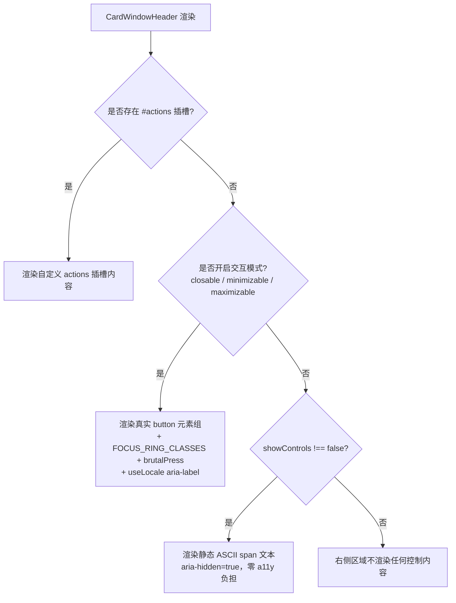

# 工控窗口交互升级与开关质感重塑方案

## 一、 背景与第一性原理推导

在实机视效检视中，发现了两个直接影响用户体验与美学质感的核心痛点：

```text
┌────────────────────────────────────────────────────────────────────────┐
│                        当前发现的核心矛盾与反思                        │
├───────────────────┬────────────────────────────────────────────────────┤
│ 1. 窗口顶栏假按钮 │ CardWindowHeader 顶部的 [ _ ] [ X ] 纯为静态文本， │
│    (Affordance 缺失)│ 用户有强烈的点击预期却无法响应，缺乏实体交互能力  │
├───────────────────┼────────────────────────────────────────────────────┤
│ 2. 开关滑块条形码 │ Switch 滑块使用密集黑白条纹渐变，观感类似条形码，  │
│    (视觉质感失真) │ 缺乏工控拨码键帽/翘板开关的厚实质感与导轨层次      │
└───────────────────┴────────────────────────────────────────────────────┘
```

### 1. CardWindowHeader：装饰与真实交互的割裂
- **第一性原理反思**：在工控界面与复古操作系统中，窗口顶栏的最小化 `[ _ ]`、最大化 `[ □ ]` 与关闭 `[ X ]` 是最高频的核心操作入口。如果仅呈现为静态 ASCII 字符，会产生“界面卡死/失灵”的认知违和。
- **核心诉求**：组件必须具备**多模自适应能力**——既能在展示型容器中作为无无障碍负担的纯装饰，又能在业务场景中开箱即用地作为带机械触感与完整 a11y 的真实操作按钮。

### 2. Switch 开关：从“生硬条形码”到“工控机械实体”
- **第一性原理反思**：
  - *当前缺陷*：滑块采用 `bg-[image:repeating-linear-gradient(...)]` 竖向黑白条纹，呈现贴纸般的条形码观感，粗糙且缺乏立体物理深度；
  - *物理实体本质*：真实工控开关（如 Rocker Switch 翘板开关、工业滑动拨码开关）的滑块是**厚实的立体键帽（Keycap/Puck）**，具有清晰的边缘分界、冲压滑槽、实体抓握凹槽，以及通断状态（`I` / `O`）刻印。
- **核心诉求**：彻底重构滑块（Thumb）与滑轨（Track）的设计语言，打造具有真实 3D 机械质感、顺畅阻尼与清脆段落感的工业级开关。

---

## 二、 方案设计与架构规范

### 1. CardWindowHeader 交互升级设计

#### 1.1 模式优先级状态机

组件渲染时遵循严格的单向判定优先级：



#### 1.2 API 契约设计

```typescript
export interface CardWindowHeaderProps {
    /** 窗口标题（等宽大写工控排版呈现） */
    title: string
    /** 是否渲染右侧静态窗口控制符（仅在无交互模式且无 actions 插槽时生效），默认 true */
    showControls?: boolean
    /** 是否开启关闭按钮（交互模式），默认 false */
    closable?: boolean
    /** 是否开启最小化/折叠按钮（交互模式），默认 false */
    minimizable?: boolean
    /** 是否开启最大化/展开按钮（交互模式），默认 false */
    maximizable?: boolean
    /** 左侧三色指示灯是否可点击触发对应动作（红=close, 黄=minimize, 绿=maximize），默认 false */
    interactiveLamps?: boolean
    /** 关闭按钮无障碍标签（未提供时使用 locale 默认值） */
    closeAriaLabel?: string
    /** 最小化按钮无障碍标签 */
    minimizeAriaLabel?: string
    /** 最大化按钮无障碍标签 */
    maximizeAriaLabel?: string
    /** 自定义 CSS 类名 */
    class?: string
}

export interface CardWindowHeaderEmits {
    (e: 'close', event: MouseEvent | KeyboardEvent): void
    (e: 'minimize', event: MouseEvent | KeyboardEvent): void
    (e: 'maximize', event: MouseEvent | KeyboardEvent): void
}
```

#### 1.3 交互样式与视觉反馈规范

1. **按钮变体与点击热区**：
   - ASCII 按钮必须具备保底触控尺寸（`min-h-[22px] px-1.5 inline-flex items-center justify-center font-mono text-xs font-bold`）；
   - 普通按钮悬浮反馈：`hover:bg-brutal-bg hover:text-brutal-fg active:translate-y-[1px]`（注：顶栏底色为 `bg-brutal-muted`，按钮悬浮切换为 `bg-brutal-bg` 形成强对比）；
   - 关闭按钮独立强调：`hover:bg-brutal-destructive hover:text-brutal-destructive-foreground`；
   - 键盘导航：全局接入 `FOCUS_RING_CLASSES`，确保 Tab 聚焦时有清晰焦点指示。
2. **三色指示灯（`interactiveLamps`）**：
   - 未开启交互时：作为纯装饰层（`<i>` 标签 + 父级 `aria-hidden="true"`）；
   - 开启交互时：升级为语义化 `<button>` 元素，挂载对应动作与独立 `aria-label`（如“关闭窗口”、“最小化窗口”、“最大化窗口”）。

---

### 2. Switch 开关视觉重塑与物理质感进阶

#### 2.1 视觉重塑对比

| 维度 | 当前实现（问题态） | 进阶重塑设计（目标态） |
| :--- | :--- | :--- |
| **滑块外观 (Thumb)** | 纯黑方块 + 密集竖向白条纹（条形码感） | **立体机械键帽 (3D Keycap)**：高对比实体色（`bg-brutal-bg`）+ `border-2 border-brutal` + 1px 机械硬阴影，中心内嵌工控双重抓握凹槽 |
| **滑轨槽位 (Track)** | 单纯黑框矩形 | **深冲压导轨**：`shadow-brutal-inset` 冲压凹槽，两端提供严格 2px 沉入留白 |
| **状态指示** | 仅依赖轨道变色 | **可选工控铭牌刻印 (I / O Marks)**：支持 `showLabels`，在轨道内嵌呈现等宽 `I`（通）与 `O`（断）物理铭牌刻线 |
| **变体维度正交** | 混淆颜色与形态 | **正交解耦**：`variant` 负责颜色族（`default`、`primary` 等），新增 `shape?: 'slider' | 'rocker'` 负责物理形态 |

#### 2.2 盒模型几何尺寸严密数学推导

`SwitchRoot` 具备 `border-3 border-brutal`（上下左右边框各 3px，共占用 6px）。
为确保滑块在未选中（`unchecked`）和选中（`checked`）状态下均与轨道边缘保持严格 **2px 内嵌间距**，尺寸公式推导如下：

1. **轨道净内腔尺寸**：$W_{inner} = W_{track} - 6\text{px}$，$H_{inner} = H_{track} - 6\text{px}$
2. **滑块键帽外径尺寸**：$H_{thumb} = H_{inner} - 4\text{px} = H_{track} - 10\text{px}$
3. **滑块位移行程**：正方形滑块（$W_{thumb} = H_{thumb}$）选中时的位移量为：
   $$\Delta X = W_{inner} - 4\text{px} - W_{thumb} + 2\text{px} - 2\text{px} = W_{track} - H_{track}$$

#### 精确标定尺寸表：

| 规格档位 | 轨道尺寸 (`SwitchRoot`) | 净内腔尺寸 ($W_{inner} \times H_{inner}$) | 滑块键帽尺寸 (`SwitchThumb`) | 选中位移行程 ($\Delta X$) |
| :--- | :--- | :--- | :--- | :--- |
| **sm** | `h-6 w-11` (24px $\times$ 44px) | 38px $\times$ 18px | `size-3.5` (14px $\times$ 14px) | `translate-x-[20px]` |
| **default** | `h-7.5 w-14` (30px $\times$ 56px) | 50px $\times$ 24px | `size-5` (20px $\times$ 20px) | `translate-x-[26px]` |
| **lg** | `h-9.5 w-18` (38px $\times$ 72px) | 66px $\times$ 32px | `size-7` (28px $\times$ 28px) | `translate-x-[34px]` |

#### 2.3 铭牌刻印层与 DOM 结构规范

为避免文本节点挤压 `SwitchThumb` 的 transform 位移流，刻印层必须采用绝对定位且屏蔽事件：

```html
<SwitchRoot :class="classes" :model-value="currentValue" ...>
    <!-- 工控通断铭牌刻印层（脱离文档流，纯视觉层） -->
    <span
        v-if="props.showLabels"
        class="pointer-events-none absolute inset-0 flex select-none items-center justify-between px-2 font-mono text-[10px] font-black"
        aria-hidden="true"
    >
        <span :class="currentValue ? 'opacity-30' : 'opacity-100 text-brutal-fg'">O</span>
        <span :class="currentValue ? 'opacity-100 text-brutal-primary-foreground' : 'opacity-30'">I</span>
    </span>

    <!-- 3D 机械滑块键帽 -->
    <SwitchThumb :class="thumbClasses">
        <!-- 滑块居中双重工控防滑凹槽 -->
        <span class="flex items-center justify-center gap-0.5" aria-hidden="true">
            <span class="h-2 w-[1.5px] bg-brutal-border-color/60" />
            <span class="h-2 w-[1.5px] bg-brutal-border-color/60" />
        </span>
    </SwitchThumb>
</SwitchRoot>
```

---

## 三、 涉及文件与修改清单

### 1. 国际化字典拓展（前置依赖）
- [MODIFY] [`packages/ui/src/locales/types.ts`](../packages/ui/src/locales/types.ts)：
  - 新增 `CardWindowHeaderLocale` 类型定义（`close`, `minimize`, `maximize`, `lampClose`, `lampMinimize`, `lampMaximize`）。
- [MODIFY] [`packages/ui/src/locales/zh-CN.ts`](../packages/ui/src/locales/zh-CN.ts) & [`en-US.ts`](../packages/ui/src/locales/en-US.ts)：
  - 同步补充对应中英文文本。

### 2. CardWindowHeader 升级
- [MODIFY] [`packages/ui/src/components/card-window-header/card-window-header-variants.ts`](../packages/ui/src/components/card-window-header/card-window-header-variants.ts)：
  - 声明 `cardWindowHeaderButtonVariants`、`cardWindowHeaderLampVariants` 等 CVA 变体；
  - 收敛悬浮高亮、关闭按键高亮与按压位移类。
- [MODIFY] [`packages/ui/src/components/card-window-header/CardWindowHeader.vue`](../packages/ui/src/components/card-window-header/CardWindowHeader.vue)：
  - 实现多模自适应渲染逻辑（插槽 $\succ$ 交互模式 $\succ$ 静态装饰 $\succ$ 空）；
  - 支持键盘交互（Enter/Space 触发）；
  - 接入 `useLocale` 获取默认 `aria-label`。
- [MODIFY] [`packages/ui/src/components/card-window-header/card-window-header.test.ts`](../packages/ui/src/components/card-window-header/card-window-header.test.ts)：
  - 增补点击触发 `@close` / `@minimize` / `@maximize` 事件测试；
  - 增补交互模式 vs 装饰模式 DOM 与 a11y 属性断言测试。

### 3. Switch 重塑与优化
- [MODIFY] [`packages/ui/src/components/switch/switch-variants.ts`](../packages/ui/src/components/switch/switch-variants.ts)：
  - 移除旧 `repeating-linear-gradient` 条形码渐变；
  - 采用 3D 机械键帽样式；
  - 写入精准标定的 `sm` / `default` / `lg` 尺寸与位移行程；
  - 增加 `shape` 独立变体维度（`slider` / `rocker`）。
- [MODIFY] [`packages/ui/src/components/switch/Switch.vue`](../packages/ui/src/components/switch/Switch.vue)：
  - 引入 `showLabels` 与 `shape` props；
  - 挂载绝对定位 I/O 铭牌刻印层与滑块防滑双槽；
  - 保证 `useBrutalHaptics` 音效触发机制稳定。
- [MODIFY] [`packages/ui/src/components/switch/switch.test.ts`](../packages/ui/src/components/switch/switch.test.ts)：
  - 清理旧条形码渐变类名断言（更新为 3D 键帽与凹槽断言）；
  - 增补 `showLabels`、`shape` 与各尺寸位移类名断言。

### 4. 文档与示例更新
- [MODIFY] [`apps/docs/components/card-window-header.md`](../../apps/docs/components/card-window-header.md) & [`apps/docs/en/components/card-window-header.md`](../../apps/docs/en/components/card-window-header.md)
- [MODIFY] [`apps/docs/components/switch.md`](../../apps/docs/components/switch.md) & [`apps/docs/en/components/switch.md`](../../apps/docs/en/components/switch.md)
- [MODIFY] [`apps/docs/.vitepress/theme/components/demos/CardWindowHeaderDemo.vue`](../../apps/docs/.vitepress/theme/components/demos/CardWindowHeaderDemo.vue)

---

## 四、 验证与验收标准

1. **视觉与几何验收**：
   - Switch 开关彻底消除条形码伪粗糙感，滑块呈现干净立体的 3D 键帽质感；
   - 滑块在 unchecked 与 checked 状态下，距轨道上下左右边距均等（完美 2px 内嵌）；
   - CardWindowHeader 按钮在悬停、按压时具备明确的工控反馈与强对比度。
2. **功能与无障碍验收**：
   - 点击 `CardWindowHeader` 交互按钮精确触发对应的事件；
   - 键盘 Tab 聚焦能够准确高亮交互按钮，Space/Enter 触发动作；
   - 在未开启交互 props 时，保持 `aria-hidden="true"` 的静态装饰，无 a11y 警告；
   - Switch 刻印文本纯视觉呈现，不干扰屏幕阅读器朗读。
3. **工程化门禁验收**：
   - 运行 `pnpm --filter brutx-ui-vue test src/components/card-window-header src/components/switch` 100% 通过；
   - 运行 `pnpm check:i18n` 100% 通过；
   - 运行 `pnpm --filter brutx-ui-vue typecheck` 0 错误；
   - 运行 `node scripts/docs/check-doc-links.mjs check` 0 死链。
