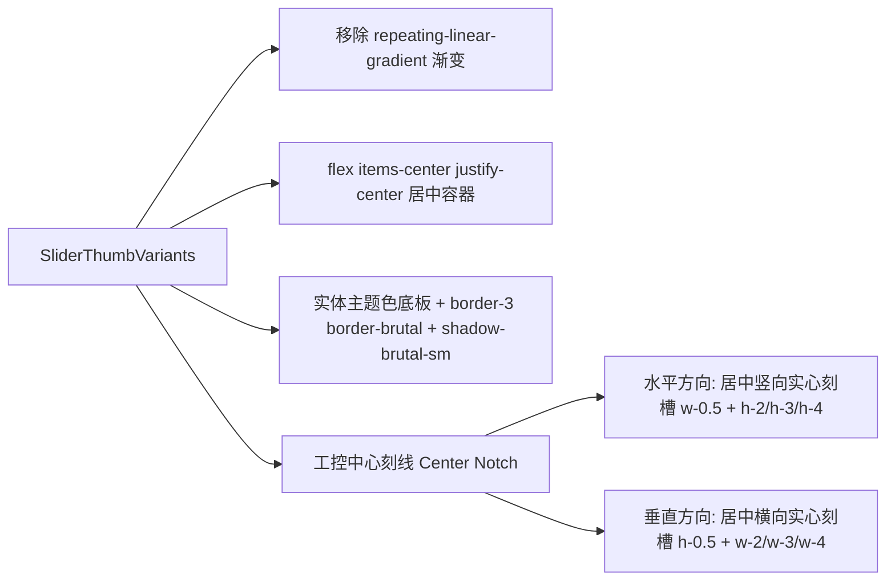

# 滑块与滚动条工控实体质感重塑方案

## 一、 背景与第一性原理推导（条纹伪材质反思）

在《工控窗口交互升级与开关质感重塑方案》成功消除 `Switch` 的“条形码伪纹理”并重塑 3D 机械键帽后，全库排查确认在 **`Slider`（滑块选择器）** 与 **`ScrollArea`（滚动区域）** 两个基础组件中，同样遗留了由 `repeating-linear-gradient` 引入的同质化质感缺陷：

```text
┌────────────────────────────────────────────────────────────────────────┐
│                        当前发现的核心矛盾与反思                        │
├───────────────────┬────────────────────────────────────────────────────┤
│ 1. Slider 横向条纹 │ 滑块（Thumb）覆盖密集横向白线，在鲜艳主题色上发灰  │
│    (色彩被污损)   │ 发脏，破坏新粗野主义高饱和度纯色冲击力             │
├───────────────────┼────────────────────────────────────────────────────┤
│ 2. ScrollArea 细线 │ 极窄滚动条（<8px）强行渲染 2px 细线，在高分屏与缩放│
│    (发虚与摩尔纹) │ 场景下产生严重的亚像素发虚与摩尔纹噪点             │
└───────────────────┴────────────────────────────────────────────────────┘
```

### 1. Slider：从“发灰条纹贴纸”到“调音台推子（Fader Puck）”
- **第一性原理反思**：
  - *当前缺陷*：`sliderThumbVariants` 强行铺设 `bg-[image:repeating-linear-gradient(0deg,...)]`。当滑块采用浅黄（`accent`）或亮粉（`primary`）时，密集的半透明白横线导致滑块表面反差混浊，犹如蒙上一层灰色栅格；且滑块为普通正方形薄片，缺乏物理推子的抓握厚重感；
  - *物理实体本质*：专业音频调音台（Audio Mixer Console）与工控操作台上的**滑动电位器推子（Fader Knob / Puck）**，其本体是一枚带有实体厚度、立体硬阴影（`shadow-brutal-sm`）的实体键帽，中心仅镌刻**一道高对比度的物理指示刻线凹槽（Center Indicator Notch）**，以供操作者快速标定读数并提供防滑指位。指示刻槽方向与滑动轴垂直（水平滑动呈竖线，垂直滑动呈横线），准确指向刻度基准。
- **核心诉求**：移除杂乱渐变条纹，将滑块重塑为**调音台立体工控推子**，中央根据 `orientation`（水平/垂直）自动呈现一道纯净深邃的物理刻线。

### 2. ScrollArea：从“窄条噪点”到“工控金属导轨与实体滑块”
- **第一性原理反思**：
  - *当前缺陷*：滚动条宽度仅 8px–12px，滑块内部有效宽度不足 6px。在如此微小的空间内用 CSS 渐变绘制 2px 间距的条纹，屏幕栅格化渲染时必然产生模糊与摩尔纹（Moiré effect）；且 1px 细边框违背了 BrutxUI 主边框规范（R1）；
  - *物理实体本质*：工控仪表箱与精密仪器的滚动导轨是极度干净、机械加工感强烈的实体滑块。
- **核心诉求**：清除伪条纹与细边框，采用高对比度的粗野主义纯色实体滑块（饱满实体底色 + `hover:opacity-80` + `active:ring-2` 内嵌黑环），垂直/水平导轨辅以清晰的 `border-l-3` / `border-t-3` 粗黑轨道线，既利落干脆又符合极端工业审美。

---

## 二、 方案设计与架构规范

### 1. Slider 调音台推子（Fader Puck）重塑

#### 1.1 变体与样式设计（`slider-variants.ts`）



- **滑块外观（Thumb）**：
  - 彻底移除 `bg-[image:repeating-linear-gradient(...)]`；
  - 显式声明 `flex items-center justify-center` 弹性居中容器；
  - 滑块采用高对比实体色（`variant` 五色联动），外包 `border-3 border-brutal`，挂载 `shadow-brutal-sm`（`2px 2px 0px 0px var(--brutal-border-color)`）立体硬投影；
  - 交互状态：保留 `cursor-grab active:cursor-grabbing`、`brutalHoverLiftSmNoX` 以及 `brutalPress`，拖拽时产生实体物理按压位移。

- **工控指示刻线（Center Indicator Notch）**：
  - 在滑块中心嵌入纯 CSS 绘制的实心工控刻槽（挂载 `aria-hidden="true"` 与 `data-slider-thumb-notch`）：
    - 颜色采用 `@theme` 合法派生类 **`bg-brutal-fg/70`**（亮色自适应为黑色 70%、暗色自适应为白色 70%，保证强对比度与 Tailwind v4 编译兼容性）；
    - 结合 `rounded-brutal` 保持圆角体系联动，`pointer-events-none` 屏蔽事件干扰。

- **CVA 变体架构定义（`sliderThumbNotchVariants`）**：
  ```typescript
  export const sliderThumbNotchVariants = cva(
      'pointer-events-none rounded-brutal bg-brutal-fg/70',
      {
          variants: {
              orientation: {
                  horizontal: 'w-0.5',
                  vertical: 'h-0.5',
              },
              size: {
                  sm: '',
                  default: '',
                  lg: '',
              },
          },
          compoundVariants: [
              { orientation: 'horizontal', size: 'sm', class: 'h-2' },
              { orientation: 'horizontal', size: 'default', class: 'h-3' },
              { orientation: 'horizontal', size: 'lg', class: 'h-4' },
              { orientation: 'vertical', size: 'sm', class: 'w-2' },
              { orientation: 'vertical', size: 'default', class: 'w-3' },
              { orientation: 'vertical', size: 'lg', class: 'w-4' },
          ],
          defaultVariants: {
              orientation: 'horizontal',
              size: 'default',
          },
      }
  )

  export type SliderThumbNotchVariantProps = VariantProps<typeof sliderThumbNotchVariants>
  ```

- **尺寸矩阵标定**：
  - `sm`: 轨道厚度 `0.75rem`（12px），滑块 `size-4.5`（18px），刻线长 8px（`h-2` / `w-2`）；
  - `default`: 轨道厚度 `1.25rem`（20px），滑块 `size-6`（24px），刻线长 12px（`h-3` / `w-3`）；
  - `lg`: 轨道厚度 `1.75rem`（28px），滑块 `size-8`（32px），刻线长 16px（`h-4` / `w-4`）。

---

### 2. ScrollArea 工控导轨实体滑块重塑

#### 2.1 样式重构（`scroll-area-variants.ts`）

- **移除伪条纹与细边框反模式**：
  - 彻底移除 `scrollAreaThumbVariants` 中的 `repeating-linear-gradient`；
  - 严禁使用 1px 细边框（如 `border border-brutal/30`，消除 R1 规则违规）。
- **实体滑块（Thumb）形态**：
  - 采用高对比粗野主义纯色实体：
    - `variant="default"`: `bg-brutal-fg hover:opacity-80`；
    - `variant="primary"`: `bg-brutal-primary hover:opacity-80`；
    - `variant="accent"`: `bg-brutal-accent hover:opacity-80`；
  - 圆角：`rounded-brutal`（与设计系统圆角令牌实时联动）；
  - 按压激活态：保留 `active:ring-2 active:ring-brutal-ring active:ring-inset` 内嵌黑环反馈，拖拽时视觉锁定感明确。
- **导轨（Scrollbar）冲压感增强**：
  - 垂直轨道：`w-[var(--scroll-thickness,0.75rem)] border-l-3 border-brutal bg-brutal-muted/20`；
  - 水平轨道：`h-[var(--scroll-thickness,0.75rem)] border-t-3 border-brutal bg-brutal-muted/20`；
  - 彻底消除屏幕缩放时的发虚与频闪问题。

---

## 三、 涉及文件与修改清单

### 1. Slider 组件改造
- [MODIFY] `packages/ui/src/components/slider/slider-variants.ts`：
  - 清理 `sliderThumbVariants` 中的 `repeating-linear-gradient`，追加 `flex items-center justify-center`；
  - 声明并导出 `sliderThumbNotchVariants` 及其 TS 类型 `SliderThumbNotchVariantProps`；
  - 调优滑块尺寸为 `sm: size-4.5`, `default: size-6`, `lg: size-8`。
- [MODIFY] `packages/ui/src/components/slider/Slider.vue`：
  - 引入 `sliderThumbNotchVariants`，计算 `notchClasses = computed(() => cn(sliderThumbNotchVariants({ orientation: props.orientation, size: props.size })))`；
  - 模板中为 `SliderThumbPrimitive` 注入 `<span :class="notchClasses" data-slider-thumb-notch aria-hidden="true" />`；
  - 为刻度 Marks `<span>` 注入专有标识 `data-slider-mark`，隔离 DOM 节点检索。
- [MODIFY] `packages/ui/src/components/slider/slider.test.ts`：
  - 隔离测试选择器：将 marks 测试中的 `findAll('[aria-hidden="true"]')` 精准化为 `findAll('[data-slider-mark]')`，杜绝 thumb notch 引起的计数断裂；
  - 移除旧条纹渐变断言，增补调音台推子居中刻槽（`data-slider-thumb-notch`）与立体投影类名断言。

### 2. ScrollArea 组件改造
- [MODIFY] `packages/ui/src/components/scroll-area/scroll-area-variants.ts`：
  - 清理 `scrollAreaThumbVariants` 中的 `repeating-linear-gradient`；
  - 升级为纯净实体滑块（`rounded-brutal` + `hover:opacity-80` + `active:ring-2 active:ring-brutal-ring active:ring-inset`）。
- [MODIFY] `packages/ui/src/components/scroll-area/scroll-area.test.ts`：
  - 更新滚动条滑块类名断言（移除渐变断言，验证纯色实体背景与按压高亮）。

### 3. 文档与演示同步
- [MODIFY] `apps/docs/components/slider.md` & `apps/docs/en/components/slider.md`：
  - 更新调音台推子视觉说明与示例。
- [MODIFY] `apps/docs/components/scroll-area.md` & `apps/docs/en/components/scroll-area.md`：
  - 更新工控实体导轨滚动条说明。

---

## 四、 验证与验收标准

1. **视觉呈现验收**：
   - `Slider` 在所有主题色下，滑块呈现干净饱满的纯色与立体硬投影（`shadow-brutal-sm`），居中刻线清晰克制，无任何发灰发脏现象；
   - `ScrollArea` 在 100%、125%、150% 屏幕缩放与高分屏下，滚动条滑块边缘锐利干净，0 摩尔纹与 0 发虚。
2. **交互与单测门禁**：
   - 运行 `pnpm --filter brutx-ui-vue test src/components/slider src/components/scroll-area` 100% 绿色通过；
   - 运行 `pnpm --filter brutx-ui-vue typecheck` 0 错误；
   - 运行 `node scripts/docs/check-doc-links.mjs check` 0 死链。
