# 组件视觉效果深化与质感进阶方案

## 一、 背景与第一性原理推导（深度反思）

BrutxUI 在前期演进中，已经通过 R1–R9 视觉规则确立了坚实的基线：统一粗边框（`border-3 border-brutal`）、硬投影（`shadow-brutal`）、盖影语义按压位移（`brutalPress`）、焦点指示环（`FOCUS_RING_CLASSES`）、Subtle 浅色衍生背景以及层级与浮层体系。

然而从**高级工业机械美学（Industrial Neo-Brutalism / Craft Brutalism）**的第一性原理审视，当前视觉体系在面对高复杂度真实业务界面时暴露出以下核心痛点：

```text
┌────────────────────────────────────────────────────────────────────────┐
│                        当前视觉体系的核心矛盾与反思                    │
├───────────────────┬────────────────────────────────────────────────────┤
│ 1. 表面塑料感     │ 大面积单色实底缺乏物理肌理，在长页面中呈现无菌塑料感│
├───────────────────┼────────────────────────────────────────────────────┤
│ 2. 光影层级扁平   │ 单向右下 4px 投影缺乏层级梯度，无法表达冲压嵌槽与突起 │
├───────────────────┼────────────────────────────────────────────────────┤
│ 3. 交互动效平庸   │ 沿用常规流体缓动，缺失工控翘板、机械键帽的清脆段落感│
├───────────────────┼────────────────────────────────────────────────────┤
│ 4. 工控叙事缺失   │ 容器排版过于规矩，缺乏技术蓝图标尺、窗口框架等极客符号│
└───────────────────┴────────────────────────────────────────────────────┘
```

1. **几何表面质感单一，缺乏物理材质感（物性缺失）**：
   - *反思*：新粗野主义的根源来自 20 世纪中叶的粗野建筑、报刊凸版印刷（Letterpress）与工控说明书。目前卡片与面板仅依赖纯色填充（`bg-brutal-bg` / `bg-brutal-muted`），缺失点阵印刷网纹、蓝图方格与警戒斜纹等物理肌理。
2. **光影层级缺乏立体纵深（内嵌与多重层级缺位）**：
   - *反思*：单一的单层投影无法区分“普通容器”、“核心高亮 CTA”以及“冲压凹槽控件（如输入框、滑轨）”的物理纵深空间。
3. **物理机械交互反馈仍有挖掘空间（动效缺乏机械张力）**：
   - *反思*：过度依赖 iOS 风格的无摩擦线性位移与平滑淡入淡出，与新粗野主义“硬朗、机械、确定、实体”的精神相悖。开关与滑块缺乏类似工控翘板开关（Rocker Switch）的超调回弹与触觉阻尼感。
4. **工控装配与版式细节表达不足（符号叙事单薄）**：
   - *反思*：容器排版过于对称中庸，缺乏复古操作系统窗口顶栏（Window Frame）、工程蓝图十字准星标尺（HUD Crosshairs）、几何爆炸星标图腾（Burst Stars）、拍立得相框（Polaroid Stubs）以及状态图章（Status Stamps）等高辨识度符号。

---

## 二、 架构演进与四大深化维度

本方案在保持 `packages/shared/src/design-tokens.ts` 单一真相源与 Tailwind v4 `@theme` 组装机制的基础上，从以下四大维度进行系统性深化：

```mermaid
graph TD
    subgraph D1["维度一：材质与纹理系统 (Tactile Surfaces)"]
        D1A["第一性原理: 印刷品物理肌理消除塑料感"] --> D1B["技术: @utility 纯 CSS Gradient + scrollbar-brutal 机械滚动条"]
        D1B --> D1C["防线: 文本对比度锁定 20% + 装饰层 aria-hidden"]
    end

    subgraph D2["维度二：光影与立体纵深 (Depth & Layering)"]
        D2A["第一性原理: 建立按压与冲压纵深"] --> D2B["技术: @theme 组装化彩虹阴影 + Inset 凹槽"]
        D2B --> D2C["防线: brutalPressStacked 等值契约 + 正交 ring 焦点环"]
    end

    subgraph D3["维度三：机械物理微交互 (Mechanical Haptics)"]
        D3A["第一性原理: 赋予工控仪表的机械段落感"] --> D3B["技术: Bounce 超调微弹 + Web Audio 纯代码合成"]
        D3B --> D3C["防线: prefers-reduced-motion 瞬时复位 + 懒加载单例默认静音"]
    end

    subgraph D4["维度四：工控装配与版式 (HUD & Editorial)"]
        D4A["第一性原理: 注入复古终端与工程蓝图隐喻"] --> D4B["技术: BrutalShape 矢量星标 + CardWindowHeader + ImageCard 相框"]
        D4B --> D4C["防线: 语义结构洁净度 + 基础 Card DOM 零冗余"]
    end
```



---

## 三、 深入研讨：技术设计、参数标准与美学克制防线

### 维度一：材质与纹理系统（Tactile & Pattern Surfaces）

#### 1. 核心材质参数与纯 CSS 实现

全库材质**100% 采用纯几何 CSS 渐变实现**，严禁引入外部位图或 Base64 资产，保证 0 网络请求与 0 运行时开销：

| 材质类型 | 视觉隐喻 | CSS 实现核心 | 亮/暗色模式联动机制 | 推荐应用场景 |
| :--- | :--- | :--- | :--- | :--- |
| **半色调点阵 (Dots)** | 报刊网点印花、胶印网屏 | `radial-gradient(var(--brutal-border-color) 1.5px, transparent 1.5px)`，尺寸 `12px 12px` | 亮色下为黑点，暗色自动翻转为白点（通过 `color-mix` 控在 18% 透明度） | Card 背景、Descriptions Label 列、Drawer 侧栏 |
| **蓝图方格 (Grid)** | 毫米坐标纸、CAD 工程图 | 双向 `linear-gradient`，线宽 1px，间距 `16px` | 亮色底为浅灰黑网格，暗色底为微白网格（`color-mix` 控在 12% 透明度） | Hero 背景、DataTable 空状态区、Upload 拖拽框 |
| **警戒斜纹 (Hazard)** | 工业警示柱、施工重型机械 | `repeating-linear-gradient(-45deg, ... 10px, ... 20px)` | 经典黄黑相间（Warning）、红白/红黑相间（Danger） | Alert 左侧警戒柱、Banner 顶栏、Modal 危险操作区 |
| **细斜线填充 (Hatch)** | 工程制图剖面线、表头底纹 | `repeating-linear-gradient(-45deg, ... 4px, ... 8px)` 细线密度 | `color-mix` 控在 12% 透明度，亮暗自适应 | DataTable 表头、Timeline 连接区、次级面板区分 |
| **扫描线 (Scanlines)** | CRT 终端扫描余辉 | `repeating-linear-gradient(0deg, ... 2px, ... 6px)` 横向细线 | `color-mix` 控在 15% 透明度 | Skeleton 骨架脉冲、Terminal 插图、故障风装饰 |
| **粗野磨砂 (Frosted)** | 工业磨砂有机玻璃控制盖板 | `backdrop-blur-md bg-brutal-bg/85 border-3 border-brutal shadow-brutal` | 半透明底板透出下层线条与色块，硬边框与硬阴影保持实体感；alpha 修饰符为 R6 第三处显式豁免（磨砂玻璃材质专属） | 悬浮顶栏（Header）、浮动工具条、DropdownMenu |
| **工控滚动条 (Scrollbar)** | 工业仪器刻度导轨 | `border-l-3 border-brutal` 轨道 + 实色滑块 | `scrollbar-color: var(--brutal-fg) var(--brutal-bg)` 亮暗自适应 | 全局页面 body、ScrollArea、CodeBlock、Drawer |

#### 2. Tailwind v4 规范声明（@utility 注册）

> **机制注意（遵循 TAILWIND_V4_MECHANISMS.md §3）**：  
> 必须使用 Tailwind v4 的 `@utility` 指令而非裸 `@layer utilities`，以确保编译器能自动派生 `hover:bg-pattern-*`、`dark:bg-pattern-*`、`md:bg-pattern-*` 等变体修饰符。

> **落位约束**：`packages/ui/src/styles.css` 的 `@theme` / `:root/.dark` / 主题预设三个区块由 `prebuild:tokens` 标记块机制自动生成（勿手动编辑）；全部 `@utility` 声明必须落位在标记块之外的**手写区**，与既有 `.animate-*` 与 keyframes 手写区同级共存。

```css
/* packages/ui/src/styles.css 手写区 */
@utility bg-pattern-dots {
    background-image: radial-gradient(
        color-mix(in srgb, var(--brutal-border-color, #000000) 18%, transparent) 1.5px,
        transparent 1.5px
    );
    background-size: 12px 12px;
}

@utility bg-pattern-grid {
    background-image: 
        linear-gradient(to right, color-mix(in srgb, var(--brutal-border-color, #000000) 12%, transparent) 1px, transparent 1px),
        linear-gradient(to bottom, color-mix(in srgb, var(--brutal-border-color, #000000) 12%, transparent) 1px, transparent 1px);
    background-size: 16px 16px;
}

@utility bg-pattern-hazard {
    background-image: repeating-linear-gradient(
        -45deg,
        var(--brutal-accent, #FFE66D),
        var(--brutal-accent, #FFE66D) 10px,
        var(--brutal-border-color, #000000) 10px,
        var(--brutal-border-color, #000000) 20px
    );
}

@utility bg-pattern-hatch {
    background-image: repeating-linear-gradient(
        -45deg,
        color-mix(in srgb, var(--brutal-border-color, #000000) 12%, transparent),
        color-mix(in srgb, var(--brutal-border-color, #000000) 12%, transparent) 1px,
        transparent 1px,
        transparent 8px
    );
}

@utility bg-pattern-scanlines {
    background-image: repeating-linear-gradient(
        0deg,
        color-mix(in srgb, var(--brutal-border-color, #000000) 15%, transparent),
        color-mix(in srgb, var(--brutal-border-color, #000000) 15%, transparent) 1px,
        transparent 1px,
        transparent 6px
    );
}

@utility scrollbar-brutal {
    scrollbar-color: var(--brutal-fg, #000000) var(--brutal-bg, #ffffff);
    &::-webkit-scrollbar {
        width: 16px;
        height: 16px;
    }
    &::-webkit-scrollbar-track {
        background: var(--brutal-bg, #ffffff);
        border-left: 3px solid var(--brutal-border-color, #000000);
    }
    &::-webkit-scrollbar-thumb {
        background: var(--brutal-fg, #000000);
        border: 2px solid var(--brutal-bg, #ffffff);
    }
}
```

#### 3. CLI 消费方同步机制（工具类直挂标记块）

`packages/cli/src/styles/brutalist.css` 现行仅同步 theme-tokens / root-tokens / theme-presets 三个标记块，手写区的 `.shadow-brutal*` 直挂规则与新增纹理类均无到达路径。本方案扩展 `generate-styles-tokens.ts`：

- 在 CLI `brutalist.css` 新增第四个标记块 `@brutx:utility-rules:start/end`，由 `prebuild:tokens` 从单一数据源自动生成：
  - **阴影直挂规则**：遍历 `SHADOW_DEFINITIONS` 输出 `.shadow-brutal-stacked { box-shadow: var(--shadow-brutal-stacked); }` 等全部档位（含既有 7 档收敛纳管）；
  - **纹理工具类规则**：从 `@utility` 清单映射输出扁平化 CSS 规则（嵌套 `&::-webkit-scrollbar` 展开为完整选择器）；
- `packages/cli/scripts/check-brutalist-tokens.ts` 同步扩展校验范围：除标记块令牌一致性外，校验直挂规则对 `SHADOW_DEFINITIONS` / `@utility` 清单的**完备性**（缺失即报错），彻底消除「ui 组装 / CLI 直挂」双实现的漂移窗口。

#### 4. 美学克制边界与反模式防线
- **反模式 1：背景噪点喧宾夺主，破坏文字可读性**
  - *防线*：严禁在密集点阵上直接排布长段正文。点阵/网格透明度上限严格锁定为 **20%**，仅用于容器装饰层、Label 侧边栏与 Empty 状态。
- **反模式 2：纯装饰图形污染无障碍可访问性**
  - *防线*：所有纹理与背景图案作为纯视觉装饰层，若使用独立 DOM 节点承载必须附加 `aria-hidden="true"`。

---

### 维度二：光影与立体纵深进阶（Depth & Surface Layering）

#### 1. 阶梯多重彩虹阴影（Stacked Pop Shadows）与物理盖影等值契约

- **阴影定义**：在 `packages/shared/src/design-tokens.ts` 中注册 `SHADOW_DEFINITIONS`。三层刻度严格沿用既有档位系数族（sm = 0.5x / base = 1x / lg = 1.5x），全部经 `--brutal-shadow-offset-x/y` 变量 calc 派生，随主题偏移覆盖自然联动：
  ```typescript
  {
      themeVar: '--shadow-brutal-stacked',
      build: l => [
          `calc(var(--brutal-shadow-offset-x, ${l.shadowOffsetX}) * 0.5) calc(var(--brutal-shadow-offset-y, ${l.shadowOffsetY}) * 0.5) 0px 0px var(--brutal-border-color, ${l.borderColor})`,
          `var(--brutal-shadow-offset-x, ${l.shadowOffsetX}) var(--brutal-shadow-offset-y, ${l.shadowOffsetY}) 0px 0px var(--brutal-primary, ${l.primary})`,
          `calc(var(--brutal-shadow-offset-x, ${l.shadowOffsetX}) * 1.5) calc(var(--brutal-shadow-offset-y, ${l.shadowOffsetY}) * 1.5) 0px 0px var(--brutal-border-color, ${l.borderColor})`,
      ].join(', '),
  }
  ```
- **盖影物理位移等值契约（深度推导）**：
  - 新粗野主义的按压反馈哲学是“**实体按压下沉，刚好落回右下角盖灭自己的影子**”。
  - 普通按钮阴影偏移 1x $\rightarrow$ 按压位移 1x（`brutalPress`）；
  - **Stacked 按钮最外层投影为 1.5x**，其按压反馈必须同源派生为 1.5x 位移与去影，严禁内联手抄字面量（延续 `brutal-interaction-variants.ts`「fallback 同源派生、勿两处硬编码脱同步」契约）；
  - 在 `packages/ui/src/lib/brutal-interaction-variants.ts` 中明确派生并导出：
    ```typescript
    const pressStackedX = 'active:translate-x-[calc(var(--brutal-shadow-offset-x,4px)*1.5)]'
    const pressStackedY = 'active:translate-y-[calc(var(--brutal-shadow-offset-y,4px)*1.5)]'
    export const brutalPressStacked = `${pressStackedX} ${pressStackedY} active:shadow-none`
    ```
  - 严禁出现“阴影 1.5x 但只移动 1x”或“移动 1.5x 但残留 0.5x 阴影”的物理错位。
- **暗色模式层次保障**：三明治结构（黑边夹主题色夹黑边）中仅中间层引用 `--brutal-primary`，亮暗预设切换时彩色层随令牌联动、两侧边框层恒为 `--brutal-border-color`，层次对比度在任何预设下保持恒定。

#### 2. 工控冲压内嵌凹槽（Chiseled Inset Deboss）

- **阴影定义**（凹槽深度取 0.5x 刻度，与 sm 档系数同源，随主题偏移联动）：
  ```typescript
  {
      themeVar: '--shadow-brutal-inset',
      build: l => `inset calc(var(--brutal-shadow-offset-x, ${l.shadowOffsetX}) * 0.5) calc(var(--brutal-shadow-offset-y, ${l.shadowOffsetY}) * 0.5) 0px 0px var(--brutal-border-color, ${l.borderColor})`,
  }
  ```
- **实体装配隐喻**：
  - `Input` / `Textarea`：在 `default` / `focused` 态应用内阴影（`variant="inset"`），呈现出“在金属外壳上冲压出安装凹槽”的坚固感；
  - `Switch` 轨道 / `Slider` 轨道 / `Progress` 底槽：内嵌阴影强化滑块深陷于导轨内部的机械物理关系；
  - `Kbd` 按键：未按下时外凸 `shadow-brutal-sm`，按下时切换为 `shadow-brutal-inset`。

#### 3. 架构协同：与 R7 焦点指示体系（Focus Ring）的完全正交
- 依托于 Tailwind v4 阴影组装化管道，`--shadow-brutal-stacked` 与 `--shadow-brutal-inset` 均通过 `--tw-shadow` 组装输出，与 `FOCUS_RING_CLASSES`（`ring-2 ring-brutal-ring ring-offset-2 ring-offset-brutal-bg focus-visible:outline-hidden`）在同一元素上完美并存，彻底根除焦点环与阴影争用历史缺陷。

---

### 维度三：机械物理微交互与微动效（Mechanical Haptics & Motion）

> **承接声明**：《组件设计规范与视觉效果优化方案.md》方向 4 已落地动效缓动令牌（`--ease-brutal-snap` / `--ease-brutal-bounce` 现存于 `styles.css`），本维度直接复用该令牌族，不重复定义；本维度增量聚焦「翘板微弹状态机、Shutter 入场、音效触觉」三层。

#### 1. 翘板开关微弹动效（Rocker Snap）
- **动效状态机推导**：
  1. `PointerDown`（按压蓄力）：滑块沿移动方向产生微小挤压形变（`scale-x-115 scale-y-90`）；
  2. `PointerUp`（释放吸合）：借由 `--ease-brutal-bounce`（`cubic-bezier(0.34, 1.56, 0.64, 1)`）超调弹至终点并归位；
  3. `Duration`：全程严格限制在 **120ms ~ 150ms**，模拟工业磁吸继电器的干脆闭合。

#### 2. 工业百叶窗与卷帘入场动效（Shutter Reveal）
- **实现原理**：针对 `Dialog`、`Sheet`、`Accordion` 弹层组件，利用 CSS `clip-path` 模拟百叶窗分段快速拉开：
  ```css
  @keyframes brutal-shutter-in {
      0% { clip-path: polygon(0 50%, 100% 50%, 100% 50%, 0 50%); }
      100% { clip-path: polygon(0 0, 100% 0, 100% 100%, 0 100%); }
  }
  ```
- **耗时设定**：严控在 **140ms ~ 180ms** 之间，拒绝冗长拖沓。

#### 3. 纯代码 Web Audio 合成音效引擎（Audio Haptics）

> **资产承接**：仓库已存在 `packages/ui/src/composables/useAudioEngine.ts`（懒加载 AudioContext 单例、SSR 安全探测、`onended` 自动释放节点、播放节流），本方案**扩展该引擎**而非另起炉灶：新增 click / snap / beep 三种声音配方，并以 `useBrutalHaptics` 作为语义化薄门面对组件暴露。

```mermaid
flowchart TD
    A[用户交互事件 click / touch] --> B{是否处于浏览器环境 & 已显式开启声音?}
    B -- 否 --> C[空操作 NOOP / SSR 降级]
    B -- 是 --> D[委托 useAudioEngine 现有懒加载单例管道]
    D --> E{state === 'suspended'?}
    E -- 是 --> F[调用 audioCtx.resume()]
    E -- 否 --> G[创建 OscillatorNode + GainNode]
    F --> G
    G --> H[实时生成方波衰减 / 白噪声脉冲]
    H --> I[播放完毕 onended 自动 disconnect 释放节点]
```

- **零外部资源依赖与技术防线**：
  - 严禁引入任何 MP3/WAV 外部音频文件；
  - **Autoplay 策略防御**：沿用现有引擎的交互时懒加载单例模式，若处于 `suspended` 状态先执行 `.resume()`；
  - **实例上限保护**：全库共享单一 `AudioContext` 实例（现有引擎已保证）；
  - **SSR / Node.js 兼容**：沿用现有 `getAudioContextCtor()` 环境探测，`typeof window === 'undefined'` 时静默降级为空操作（NOOP）；
  - **新增声音配方**（常量收敛至 `lib/defaults.ts`，延续既有 `AUDIO_*` 命名族）：
    - **Click (按键音)**：方波 800Hz 快速线性降频至 120Hz，25ms 快速衰减；
    - **Snap (开关音)**：白噪声脉冲 12ms（模拟工控继电器吸合）；
    - **Beep (提示音)**：正弦波 1200Hz，35ms（8-bit 复古蜂鸣）。
- **统一落位与默认静音**：
  - 引擎层：`useAudioEngine` 扩展配方注册表与播放节流复用；
  - 门面层：新增 `packages/ui/src/composables/useBrutalHaptics.ts`，入参 `{ sound?: boolean }`，内部委托引擎单例，对外暴露 `click()` / `snap()` / `beep()` 语义方法；
  - 组件层：涉及组件以 props 显式开启（如 `<Switch sound />`），默认值一律 `undefined` 并回落为静音——**全局默认完全静音，逐组件 opt-in**，不引入库级全局配置面。

#### 4. 减弱动效守卫（Accessibility First）
- 在 `prefers-reduced-motion: reduce` 环境下，所有 `scale` 变形、`shutter` 展开、`bounce` 弹动全部强制降级为即时状态切换（`animation: none !important; transform: none !important;`）。
- **既有机制衔接**：新增 `brutal-shutter-in` 等动画类必须纳入 `styles.css` 手写区既有的 reduced-motion 白名单选择器列表，并延续 `html[data-allow-motion="true"]` 用户显式放行语义；JS 侧逻辑分支复用现成 `useReducedMotion()` composable 判定，严禁组件内各自探测媒体查询。

---

### 维度四：工控装配与版式（HUD & Editorial Aesthetics）

```text
┌────────────────────────────────────────────────────────────────────────┐
│ [●][●][●] ── TERMINAL_SHELL // v2.4.0 ─────────────────────── [ _ ][X] │ ← 工控窗口顶栏 (CardWindowHeader)
├────────────────────────────────────────────────────────────────────────┤
│ +                                                                    + │ ← 蓝图十字准星标尺 (HUD Crosshairs)
│                                                                        │
│   ┌──────────────────────────┐                                         │
│   │ [ APPROVED ]             │ ← 倾斜状态印章 (Stamp)                  │
│   └──────────────────────────┘                                         │
│                                                                        │
│   SEC_01 // SYSTEM_METRIC                                  ★ STAR_08   │ ← 矢量粗野图腾 (BrutalShape)
│                                                                        │
│ +                                                                    + │
└────────────────────────────────────────────────────────────────────────┘
```

#### 1. 粗野主义纯矢量几何图腾库（BrutalShape 矢量星标体系）

汲取 `neobrutalism-components` 的精髓，在 `packages/ui/src/components/shape/` 下构建 **20+ 精选粗野主义纯矢量几何图腾库**：

| 图腾分类 | 典型形态 | 应用场景 |
| :--- | :--- | :--- |
| **爆炸多角星 (Burst Stars)** | 4角/8角/12角尖锐爆炸星标 | Promo 角标、Badge 装饰、New 徽章、Hero 主视觉点缀 |
| **复古工业图章 (Industrial Seals)** | 锯齿圆盘、机械齿轮、打孔花纹 | 状态图章（Status Stamp）、Watermark、Descriptions 印戳 |
| **HUD 标定十字 (Crosshairs)** | 准星、坐标系对齐标尺、测量基准 | Card 四角准星、DataTable 蓝图标尺、Tour 取景框 |
| **8-Bit 像素图腾 (Pixel Icons)** | 阶梯式锯齿图形、马赛克方块 | 404 错误页、Terminal 终端插图、Gaming 风格主题 |
| **符号图腾 (Glyphs)** | 骷髅、闪电、心形、点赞拇指 | Rate 评分图标族、反馈场景、情感化表达 |

- **组件 API 规范**（颜色一律引用 `--brutal-*` 令牌，严禁字面量色值）：
  ```html
  <BrutalShape name="star-8" size="32" color="var(--brutal-accent)" stroke="var(--brutal-fg)" stroke-width="3" />
  ```
- **技术优势**：纯 SVG 矢量路径，无外部字体或位图依赖，支持 `stroke` 与 `color` 响应主题色与暗色模式。

#### 2. 复古工控窗口顶栏（CardWindowHeader 复合组件）
- **复合组件设计原则**：
  - 为了维持基础 `Card` 的 DOM 结构洁净与无冗余，工控窗口顶栏作为独立复合组件 `<CardWindowHeader>`（或 `<CardHeader variant="window">`）提供；
  - 左侧：3 色微型实心指示方块（红 `var(--brutal-destructive)` / 黄 `var(--brutal-accent)` / 绿 `var(--brutal-status-success)`，`w-3 h-3 border-2 border-brutal`），打上 `aria-hidden="true"`——颜色全部引用语义令牌以遵循 R6 并随主题预设联动；
  - 中间：等宽居中大写标题（`font-mono font-bold text-xs uppercase tracking-widest`）；
  - 右侧：ASCII 风格语义化操作按钮（`[ _ ]`、`[ X ]`）。

#### 3. 拍立得/技术档案相框卡片（ImageCard）
- **实体设计**：
  - 上部：固定 `aspect-4/3` 或 `aspect-video` 图片展示区；
  - 中部：实体粗黑线 `border-t-3 border-brutal` 物理隔断；
  - 下部：高对比主题色（`bg-brutal-primary` / `bg-brutal-accent`）标签与描述区；
  - 赋予相册、商品展示、团队介绍强烈的拍立得（Polaroid）实体感。

#### 4. 蓝图四角十字准星（HUD Crosshairs）与状态图章（Status Stamps）
- **十字准星**：通过容器伪元素 `::before` 与 `::after` 在四角绘制 `+` 准星标记，赋予 `Card`、`DataTable`、`BrutalistHero` 工业仪器标定对齐感。
- **状态图章**：双重粗黑边框（`border-4 border-double`）、逆时针 `-6deg` 倾斜、全大写等宽字体，伴随 100ms 敲印下压微动效。

---

## 四、 全库重点组件升级实施矩阵（25+ 核心组件）

按组件功能领域划分，对全库 25+ 核心组件制定细化专项升级点与 CVA 变体规划：

### 1. 数据录入与控制类组件（Data Entry & Controls）

| 组件 | 当前视觉表现 | 专项升级内容 | 涉及文件 |
| :--- | :--- | :--- | :--- |
| **Slider** | 简单矩形轨道 + 滑块 | 1. 轨道底槽内嵌 `shadow-brutal-inset` 凹槽阴影<br>2. 滑块增加水平防滑凹凸齿纹（Grip Ridges）<br>3. 支持等宽 ASCII 刻度标尺线与 HUD 尖角气泡 | `slider-variants.ts`<br>`Slider.vue` |
| **Progress** | 纯色矩形条 | 1. 增设 `segmented`（方块分段 LED 电池格）变体<br>2. 增设 `hazard`（45° 斜向斑马条纹动画）变体<br>3. 轨道底槽内嵌 `shadow-brutal-inset` | `progress-variants.ts`<br>`Progress.vue` |
| **NumberInput** | 左右或上下堆叠按钮 | 1. 步进按键增加 3D 机械键帽（Keycap）触感与深色反差<br>2. 数字跳动引入复古滚轮翻页微动效（Drum Ticker）<br>3. 输入框应用冲压内阴影 | `number-input-variants.ts`<br>`NumberInput.vue` |
| **Upload** | 普通虚线框拖拽区 | 1. 拖拽悬停时切换为蓝图网格或警戒条纹（`bg-pattern-hazard`）<br>2. 上传文件列表卡片采用软盘/磁带（Cassette）风格卡片<br>3. 增加图章式状态印戳（`[ UPLOADED ]`） | `UploadTrigger.vue`<br>`UploadFileItem.vue` |
| **TagsInput** | 普通框内标签 | 1. 标签默认带微倾斜（`-1deg` ~ `1.5deg`）便签贴纸感<br>2. 标签左侧带彩色实体打孔圆点<br>3. 删除标签触发撕除微动效 | `tags-input-variants.ts`<br>`TagsInput.vue` |
| **Rate** | 金色小星星 | 1. 支持多元印章与 BrutalShape 图标（骷髅、闪电、心形、多角星、点赞拇指）<br>2. 评分点击时加入瞬间放大与印章震动回弹（Stamp Impact） | `Rate.vue` |
| **Switch** | 平面位移滑块 | 1. 滑轨应用 `shadow-brutal-inset` 凹槽阴影<br>2. 滑块增加防滑凸棱条纹（Grip lines）<br>3. 切换动作加入翘板超调弹簧动效（Rocker Snap） | `switch-variants.ts`<br>`Switch.vue` |
| **Input / Textarea** | 白色底框 + 粗黑边 | 1. 增设 `inset` 冲压内嵌凹槽阴影变体<br>2. 右上角集成 HUD 风格字符计数与状态指示<br>3. 聚焦状态支持扫描线脉冲反馈 | `input-variants.ts`<br>`Input.vue`<br>`Textarea.vue` |

---

### 2. 数据展示与排版类组件（Data Display & Hierarchy）

| 组件 | 当前视觉表现 | 专项升级内容 | 涉及文件 |
| :--- | :--- | :--- | :--- |
| **Kbd** | 普通高亮色块 | 1. 引入 3D 机械键帽厚度（`border-b-4` 侧面）<br>2. 按压时下沉消除侧面（`active:border-b-0 active:translate-y-1`）<br>3. 增设工控背光键盘（Backlit）色调变体 | `kbd-variants.ts`<br>`Kbd.vue` |
| **Accordion** | 简单文字折叠 | 1. 展开时 Trigger 动态生成 `data-[state=open]:border-b-3` 分隔线并削平圆角<br>2. 展开内容自动应用 `bg-brutal-muted` 或 Subtle 次级背景，层级分明 | `accordion-variants.ts`<br>`Accordion.vue` |
| **Tabs** | 简单边框标签 | 1. 激活标签应用实体主题色换色与 `border-3 border-brutal`<br>2. 增设工控打卡机插片（Tab Slots）变体 | `tabs-variants.ts`<br>`Tabs.vue` |
| **Calendar** | 基于 v-calendar 纯色色块 | 1. 顶部加入复古挂历双金属打孔环（Binder Rings）与红色粗横条<br>2. 今日日期支持红笔手绘圈选（Hand-drawn Circle）或亮黄便签高亮<br>3. 悬浮日历格带粗野上浮与盖影反馈 | `Calendar.vue` |
| **Descriptions** | 简单表格边框网格 | 1. Label 列应用点阵网格（`bg-pattern-dots`）底色<br>2. 右上角支持技术档案印章（`[ CONFIDENTIAL ]` / `[ SPECS ]`）<br>3. 字段间支持等宽点阵导线（Leader dots） | `Descriptions.vue`<br>`DescriptionsItem.vue` |
| **Skeleton** | 简单实色 `animate-pulse` | 1. 增设横向扫描线脉冲（`bg-pattern-scanlines`）<br>2. 增设 ASCII 终端块（`██████`）闪烁骨架模式 | `skeleton-variants.ts`<br>`Skeleton.vue` |
| **Timeline** | 单色小圆点 + 实线 | 1. 节点支持 3D 印章方块或工业 LED 脉冲光晕（Ping Glow）<br>2. 连接线升级为双平行电路总线（PCB Bus）与 45° 工业折角 | `timeline-variants.ts`<br>`Timeline.vue` |
| **DataTable** | 普通表格网格 | 1. 表头支持细斜线填充（`bg-pattern-hatch`）与点阵<br>2. 选中行高亮应用荧光色块与粗黑框选<br>3. 空状态展示蓝图 HUD 标尺与四角十字准星 | `table-variants.ts`<br>`DataTable.vue` |

---

### 3. 导航、弹层与引导类组件（Navigation & Overlays）

| 组件 | 当前视觉表现 | 专项升级内容 | 涉及文件 |
| :--- | :--- | :--- | :--- |
| **Tour** | Canvas 蒙层 + 普通卡片 | 1. 聚光灯周围渲染动态 HUD 取景瞄准框（`┌ ┐ └ ┘`）<br>2. 引导卡片顶栏展示等宽步骤指示（`STEP [01/05]`）<br>3. 弹层增加百叶窗式展开入场 | `Tour.vue` |
| **ScrollArea** | 纯色边框 + 黑色滑块 | 1. 轨道引入工控实线刻度标尺（`scrollbar-brutal`）<br>2. 滑块中心增加 3 条防滑凹槽抓取纹理（Grip lines）<br>3. 抓取拖拽时滑块产生高对比吸附高亮 | `scroll-area-variants.ts`<br>`ScrollBar.vue` |
| **Pagination** | 常规按钮组 | 1. 按钮升级为打卡机卡片槽（Punch Card Tabs）视觉<br>2. 激活页向上微突并带双重粗边框<br>3. 快速跳页集成等宽 HUD 翻页器 | `pagination-variants.ts`<br>`Pagination.vue` |
| **Avatar / AvatarGroup** | 方形/圆角边框头像 | 1. 头像角落增设工牌吊孔（Lanyard slot）或斜角缎带<br>2. 头像组堆叠支持负边距粗黑遮罩，悬停支持扇形展开（Fan-out） | `avatar-variants.ts`<br>`Avatar.vue` |
| **Breadcrumb** | 普通文字 + 斜杠 | 1. 增设档案标签插片（Folder Tabs / Chevron Ribbon）变体<br>2. 当前活跃路径带有实心高亮与微阴影 | `breadcrumb-variants.ts`<br>`BreadcrumbItem.vue` |
| **Watermark** | 简单平铺浅色文字 | 1. 增设复古公章钢印样式（双实心圆环 + 五角星 + 旋转角度）<br>2. 支持做旧噪点与印泥斑驳滤镜 | `Watermark.vue` |
| **Spinner / Loading** | 常规 SVG 转圈 | 1. 增设等宽 ASCII 旋转字符（`| / - \`）变体<br>2. 增设四方块翻滚（Tumbling Brutal Cubes）机械加载动效 | `spinner-variants.ts`<br>`Spinner.vue` |
| **Dialog / Sheet** | 纯色卡片居中弹出 | 1. 遮罩层支持点阵滤镜（`bg-brutal-overlay` 底色叠加 `bg-pattern-dots` 纹理，复用既有 overlay 令牌）<br>2. 弹窗顶栏支持工控窗口控制块与标题<br>3. 入场支持百叶窗（Shutter）机械展开 | `dialog-variants.ts`<br>`DialogContent.vue` |
| **Alert / Toast** | 纯色卡片 + 图标 | 1. 左侧边缘增加 45° 警戒条纹柱（Hazard bar）<br>2. 倒计时进度条增加像素点阵分段显示<br>3. 右上角支持状态图章印章（`[ DRAFT ]` / `[ ERROR ]`） | `alert-variants.ts`<br>`Alert.vue`<br>`Toast.vue` |

---

### 4. 容器与区块类组件（Containers & Sections）

| 组件 | 当前视觉表现 | 专项升级内容 | 涉及文件 |
| :--- | :--- | :--- | :--- |
| **Button** | 纯色 + 4px 硬投影 | 1. 增设 `stacked` 多层彩虹投影变体（配 `brutalPressStacked`）<br>2. 增设 `hazard` 警戒条纹变体<br>3. 增设 `ticket` 票据撕口变体 | `button-variants.ts`<br>`Button.vue` |
| **Card** | 纯白方框 + 4px 投影 | 1. 引入 `<CardWindowHeader>` 工控顶栏复合组件<br>2. 增设 `grid` / `dots` 纹理背景变体<br>3. 增设 `hud` 四角十字准星模式 | `card-variants.ts`<br>`Card.vue`<br>`CardWindowHeader.vue` |
| **ImageCard** | *(新组件)* | 1. 拍立得/档案相框卡片模式<br>2. `aspect-4/3` 图片区 + `border-t-3` 实体分隔线 + 彩色标签描述底栏 | `ImageCard.vue`<br>`image-card-variants.ts` |
| **BrutalShape** | *(新组件)* | 1. 20+ 粗野主义纯矢量几何图腾库（爆炸星、齿轮、图章、十字准星）<br>2. 纯 SVG 绘制，尺寸/颜色/描边高度可配置 | `BrutalShape.vue`<br>`shapes.ts` |
| **BrutalistHero** | 基础网格排版 | 1. 主视觉卡片融入蓝图网格与窗口顶栏<br>2. 按钮采用多重彩虹投影，四角穿插 BrutalShape 爆炸星<br>3. 标题与角标应用便签贴纸微倾斜与背景水印字符 | `BrutalistHero.vue` |
| **PricingSection** | 普通卡片对比 | 1. 推荐主打卡片采用 `stacked` 多层彩虹阴影 + 警戒顶部缎带<br>2. 功能对勾列表采用等宽 ASCII `[✓]` 复选框 | `PricingSection.vue` |

---

### 5. 粗野主义数据可视化扩展（Data Visualization - Chart System）

规划面向 Vue 3 生态的 **BrutxUI 粗野主义图表主题规范**。**交付边界收敛为「令牌映射 + 文档范式」**：库内不引入 echarts 依赖、不新增图表组件族，仅提供色彩映射法则与文档站范式资产；ECharts 集成由消费方自行引入依赖。

- **粗野主义图表色彩令牌（零新增，复用语义色五族）**：
  图表序列直接映射现有语义令牌，主题预设与暗色切换自动生效，符合 R6 单一信源契约：

  | 序列 | 映射令牌 | 默认预设值 |
  | :--- | :--- | :--- |
  | Series 1 | `--brutal-primary` | `#FF6B6B` (Coral) |
  | Series 2 | `--brutal-secondary` | `#4ECDC4` (Teal) |
  | Series 3 | `--brutal-accent` | `#FFE66D` (Yellow) |
  | Series 4 | `--brutal-status-success` | `#22c55e` (Green) |
  | Series 5 | `--brutal-info` | `#4A90D9` (Blue) |

- **视觉图表法则**：
  1. **网格背景**：采用纯黑粗实线或高对比点阵（`bg-pattern-grid` / `bg-pattern-dots`）；
  2. **Tooltip 悬浮卡片**：实体 `border-3 border-brutal` + `shadow-brutal-sm` 悬浮卡片；
  3. **柱状与折线**：取消柔和渐变与模糊，柱体带 `border-2 border-brutal` 强边框，数据关键点采用黑白实心同心圆（Active Dots）。
- **交付物清单**：
  - `apps/docs` 发布 ECharts theme JSON 模板（色值经构建期从 `design-tokens.ts` 读取生成，保证与令牌单一信源一致）；
  - 文档站配套「Neobrutalism Chart 设计范式」页面：网格/描边/数据点三法则演示与反模式示例；
  - 若未来需要开箱即用的图表能力，以独立方案立项评估（自研轻量 SVG 组件族或 registry 主题包），不在本方案范围内。

---

## 五、 全景风险评估与工程化防线矩阵

| 风险类别 | 潜在问题与失效模式 | 规避原则与工程化防护防线 |
| :--- | :--- | :--- |
| **视觉噪点超标** | 点阵网格过于密集造成视疲劳与干扰正文阅读 | 1. 纹理透明度上限锁定在 **20%** 以内；<br>2. 正文主容器默认维持干净纯色背景，仅在装饰容器与侧边栏开启。 |
| **物理位移错位** | 彩虹阴影与按压位移距离不一致产生“残留鬼影” | 1. 严格遵守“位移距离 = 最外层阴影偏移”的盖影物理等值契约（stacked 最外层 1.5x 投影必配 `brutalPressStacked` 同源 calc 派生的 1.5x 位移与去影）。 |
| **Web Audio 报错** | 页面加载立即初始化触发 Autoplay Policy 警告，或在 SSR 崩溃 | 1. 严禁顶层 `new AudioContext()`；<br>2. 复用 `useAudioEngine` 现有交互触发的懒加载单例管道；<br>3. 沿用现有环境探测，SSR 静默降级为 NOOP；<br>4. 全局默认静音（逐组件 props opt-in）。 |
| **无障碍合规性** | 装饰字符被读屏软件误读、动效造成前庭功能障碍 | 1. 所有纯装饰符号一律打上 `aria-hidden="true"`；<br>2. 新增动画纳入 styles.css reduced-motion 白名单并延续 `data-allow-motion` 放行语义；<br>3. 保证装饰层上方前景色文本满足 WCAG AA（4.5:1）。 |
| **Tailwind v4 契约** | 类名动态拼接导致 `@source` 静态扫描漏类 | 1. 所有 CVA 类名声明严格使用完整字面量常量，严禁类名内部 `${...}` 插值；<br>2. 工具类使用 `@utility` 声明，确保变体修饰符正常派生。 |
| **多包与 CLI 漂移** | `packages/ui` 新增阴影档位/工具类后 CLI 消费方缺失规则导致样式静默失效 | 1. 阴影统一在 `design-tokens.ts` 注册，由 `prebuild:tokens` 自动同步至 CLI `brutalist.css` 标记块；<br>2. CLI `brutalist.css` 新增 `@brutx:utility-rules` 标记块，直挂规则（阴影档位 + 纹理类）由生成器从单一数据源自动产出；<br>3. 门禁脚本 `check-brutalist-tokens.ts` 扩展校验直挂规则完备性，缺失即拦截。 |

---

## 六、 分阶段落地实施路线图

```text
┌─────────────────────────────────────────────────────────────────────────┐
│                          分阶段落地实施路线图                           │
├─────────────────────────────────────────────────────────────────────────┤
│ 阶段一 (P0): 设计令牌与材质工具类底座 (Tokens & Utilities)             │
│  - design-tokens.ts 扩展 stacked / inset 变量化阴影派生（calc 系数族）  │
│  - styles.css 手写区注入 @utility bg-pattern-* 与 scrollbar-brutal      │
│  - generate-styles-tokens.ts 新增 CLI utility-rules 标记块生成，        │
│    check-brutalist-tokens.ts 扩展直挂规则完备性校验                     │
│  - useAudioEngine 扩展 click/snap/beep 配方 + useBrutalHaptics 薄门面   │
│  - VISUAL_SYSTEM.md 同步: R2 新增阴影档位 / R4 brutalPressStacked /     │
│    R6 磨砂材质 alpha 豁免                                               │
│  - 运行 pnpm --filter brutx-ui-vue prebuild:tokens 重新生成            │
│  - 运行 pnpm --filter brutx-vue check:tokens 与                        │
│    pnpm --filter brutx-ui-vue check:deprecated 验证底座                │
├─────────────────────────────────────────────────────────────────────────┤
│ 阶段二 (P1): 核心交互、控制组件与图腾库 (Core Controls & Shapes)        │
│  - 新建 components/shape/ (BrutalShape 20+ 粗野主义纯矢量星标图腾)    │
│  - Button (stacked 变体与 brutalPressStacked), Kbd (3D键帽), Badge     │
│  - Switch (翘板超调与内嵌轨道), Slider (凹槽底槽与齿纹), Progress (分段)│
│  - Input / Textarea (inset 凹槽), NumberInput (机械键帽)                │
│  - 更新对应组件单元测试与 a11y 测试，确保 100% 绿色                    │
├─────────────────────────────────────────────────────────────────────────┤
│ 阶段三 (P2): 复合容器、相框与 HUD 进阶 (Complex & HUD Assemblies)       │
│  - Card (CardWindowHeader 复合组件与 HUD 准星), ImageCard (拍立得卡片) │
│  - Accordion (展开状态分层与下沉换色), Tabs (工控卡片槽)               │
│  - Dialog / Sheet (百叶窗入场与点阵遮罩), DataTable (蓝图标尺)         │
│  - 文档站 (apps/docs) 补全全新视觉变体与演示用例                       │
│  - 运行 node scripts/docs/check-doc-links.mjs check 保证 0 死链闭环    │
├─────────────────────────────────────────────────────────────────────────┤
│ 阶段四 (P3): 场景化区块与数据可视化范式 (Data Viz & Sections)           │
│  - BrutalistHero / PricingSection 融入 BrutalShape 与工控版式          │
│  - 文档站发布 Neobrutalism Chart 设计范式页与 ECharts theme JSON        │
│    模板（构建期从 design-tokens.ts 读取语义色生成）                     │
└─────────────────────────────────────────────────────────────────────────┘
```
