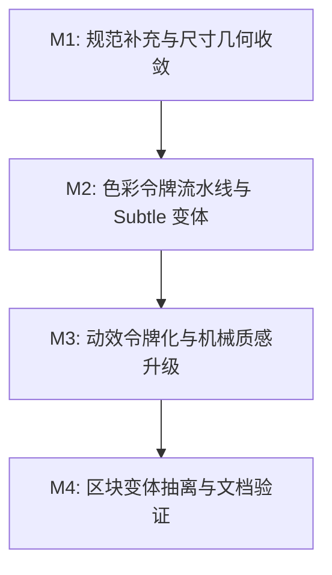

# 组件设计规范与视觉效果优化方案

## 一、 背景与第一性原理推导

BrutxUI 经过前期迭代，已经建立起以 R1-R7 规则为基础的新粗野主义（Neo-Brutalism）视觉体系，并在纯实色色块、粗边框（`border-3 border-brutal`）、实体按压反馈（`brutalPress` 盖影语义）以及无障碍焦点环上形成了强有力的规范约束。

然而，在复杂业务界面（如多表单验证、后台密集型数据管理、长列表警告信息）的使用中，当前的规范与视觉呈现面临以下核心矛盾与痛点：

1. **大面积高饱和实色造成的视觉噪点与主操作权重稀释**：
   - *第一性原理*：界面的本质是**信息层级的无摩擦传递**。当 Alert、Badge、Card、Panel 等仅支持 100% 饱和度的纯实色底色时，大面积鲜艳背景会掠夺视线，反向削弱主操作按钮（Primary CTA）的视觉引导，增加用户的认知负荷。
2. **排版阶梯（Typography）规范缺乏系统性收敛**：
   - 现行 R1-R7 规则涵盖了边框、阴影、圆角、按压、悬停、颜色、焦点，但未将排版规范抽象为 R 级规则，导致组件内部在 `font-black`、`font-bold`、`tracking-wide`、`tracking-tight` 的搭配上缺乏统一的梯度标准。
3. **核心交互控件尺寸存在隐性偏差与几何错位**：
   - 按钮与输入框遵循 `sm: h-9 (36px)`, `default: h-11 (44px)`, `lg: h-14 (56px)` 的 3 档标度，但选项卡（Tabs）等组件的 default 档为 `h-12 (48px)`，在水平工具栏混排时会出现 4px 的基线对齐断层；同时子项触发器的内边距与高度模型需做联动适配。
4. **动效缺乏新粗野主义独有的机械张力**：
   - 弹层与下拉主要采用常规的平滑渐变（`ease-out`），尚未充分体现出物理机械按键感与坚固实体的利落弹性（Snappy Motion），且存在曲线字面量硬编码风险。
5. **部分复合/区块级组件未完全落实 CVA 变体隔离**：
   - `DashboardShell` 等复合区块组件部分布局与结构样式散落在 template 中，需与原子组件的标准架构保持一致。

---

## 二、 核心优化方向

```text
┌────────────────────────────────────────────────────────────────────────┐
│                      BrutxUI 视觉与规范演进矩阵                        │
├─────────────────┬──────────────────────────────────────────────────────┤
│ 1. 规范层 (Spec) │ 增补 R8 排版体系 (Typography System)，建立 5 层字重阶梯│
├─────────────────┼──────────────────────────────────────────────────────┤
│ 2. 色彩层 (Color)│ 引入 Subtle 浅色语义衍生令牌（双发射动态派生机制）   │
├─────────────────┼──────────────────────────────────────────────────────┤
│ 3. 尺寸层 (Size) │ 交互控件全面收敛至 36px / 44px / 56px 并确保几何协同 │
├─────────────────┼──────────────────────────────────────────────────────┤
│ 4. 动效层 (Motion│ 引入机械弹性动效令牌 (--ease-brutal-*) 与无障碍降级   │
├─────────────────┼──────────────────────────────────────────────────────┤
│ 5. 架构层 (Arch) │ 复合/区块级组件补全 CVA 变体隔离与 `@source` 契约     │
└─────────────────┴──────────────────────────────────────────────────────┘
```

---

## 三、 详细设计与实现标准

### 方向 1：在 `VISUAL_SYSTEM.md` 中增补 R8 排版体系 (Typography)

确立 5 类排印语义层级，杜绝组件内部随意搭配字体粗细与字间距：

| 语义层级 | 推荐类名组合 | 典型应用场景与组件 | 设计意图与排印契约 |
| :--- | :--- | :--- | :--- |
| **Display（展示级大标题）** | `font-black tracking-tight leading-none` | Hero 标题, Section 大标题 | 极强工业重工感与版面视觉冲击力 |
| **Structural Heading（结构标题）** | `font-bold tracking-tight leading-snug` | CardTitle, AlertTitle, DialogTitle | 明确区块层级，兼顾中文与西文标题阅读流畅性 |
| **Primary Interactive（主控交互）** | `font-black tracking-wide text-sm/base` | Button, Toggle, PaginationButton | 强化核心可点击实体的按键触觉与操作确定感 |
| **Secondary Interactive（次级标签）** | `font-bold tracking-wide text-xs/sm` | Badge, TabsTrigger, Tag, Switch 标签 | 保证密集状态下的清晰辨识度，不抢夺主控按钮焦点 |
| **Technical/Data（数据与代码）** | `font-mono font-bold tracking-normal` | Kbd, CodeBlock, Counter, Metric, PinInput | 保证等宽字符在数据滚动和对比下的水平稳定性 |
| **Body/Muted（正文与辅助描述）** | `font-medium text-brutal-muted-foreground leading-relaxed` | CardDescription, FormDescription, Hint | 降低长文本视觉侵入性，保障内容长时间阅读舒适度 |

---

### 方向 2：Subtle 浅色语义令牌与组件支持

#### 1. 单一事实来源与构建流水线派生（遵守 AGENTS.md 契约）

根据库内设计令牌架构，**严禁直接手动编辑 `styles.css` 的 `@theme` 块**。Subtle 浅色令牌作为基于语义色的动态衍生属性，纳入 `packages/ui/scripts/generate-styles-tokens.ts` 的自动生成流水线：

```typescript
// packages/ui/scripts/generate-styles-tokens.ts
const SUBTLE_ENTRIES: ThemeEntry[] = [
    {
        themeVar: '--color-brutal-primary-subtle',
        build: l => `color-mix(in srgb, var(--brutal-primary, ${l.primary}) 12%, #ffffff)`,
    },
    {
        themeVar: '--color-brutal-secondary-subtle',
        build: l => `color-mix(in srgb, var(--brutal-secondary, ${l.secondary}) 12%, #ffffff)`,
    },
    {
        themeVar: '--color-brutal-accent-subtle',
        build: l => `color-mix(in srgb, var(--brutal-accent, ${l.accent}) 20%, #ffffff)`,
    },
    {
        themeVar: '--color-brutal-destructive-subtle',
        build: l => `color-mix(in srgb, var(--brutal-destructive, ${l.destructive}) 12%, #ffffff)`,
    },
    {
        themeVar: '--color-brutal-success-subtle',
        build: l => `color-mix(in srgb, var(--brutal-success, ${l.success}) 12%, #ffffff)`,
    },
    {
        themeVar: '--color-brutal-info-subtle',
        build: l => `color-mix(in srgb, var(--brutal-info, ${l.info}) 12%, #ffffff)`,
    },
]
```

- **暗色模式（`.dark`）自适应**：构建脚本在生成 `.dark` 块时，自动将混合基底替换为 `--brutal-bg`（`#141414`）并按 20% 比例叠色。
- **运行时主题联动**：当切换主题预设（如 `.theme-pastel`、`.theme-mono`）时，由于内部引用了 `var(--brutal-*)`，所有 Subtle 色彩无需重新编译即可实时同步联动。

#### 2. Subtle 变体实现规范（严格遵循 R1 纯黑粗边框）

新粗野主义的标志性特征是**粗黑边框 + 实体硬阴影**。Subtle 变体仅改变背景与文本对比度，**必须严格保持 `border-3 border-brutal` 与 `shadow-brutal`**，避免彩色边框造成的结构发虚与风格异化：

```typescript
// packages/ui/src/components/alert/alert-variants.ts
export const alertVariants = cva(
    [
        'relative w-full p-4',
        'border-3 border-brutal', // 始终保持纯黑实线粗边框 (R1)
        'rounded-brutal',
        'shadow-brutal',
        // ...
    ],
    {
        variants: {
            variant: {
                // 传统实色填充
                default: 'bg-brutal-bg text-brutal-fg',
                primary: 'bg-brutal-primary text-brutal-primary-foreground',
                danger: 'bg-brutal-destructive text-brutal-destructive-foreground',
                warning: 'bg-brutal-accent text-brutal-accent-foreground',
                success: 'bg-brutal-success text-brutal-success-foreground',
                info: 'bg-brutal-info text-brutal-info-foreground',
                // 新增 subtle 浅色系变体（文本统一走 text-brutal-fg，对比度均满足 WCAG AAA）
                'primary-subtle': 'bg-brutal-primary-subtle text-brutal-fg',
                'danger-subtle': 'bg-brutal-destructive-subtle text-brutal-fg',
                'warning-subtle': 'bg-brutal-accent-subtle text-brutal-fg',
                'success-subtle': 'bg-brutal-success-subtle text-brutal-fg',
                'info-subtle': 'bg-brutal-info-subtle text-brutal-fg',
            },
        },
    }
)
```

---

### 方向 3：核心交互控件尺寸统一与几何协同

#### 1. 全局标准高度标度（对齐 WCAG 2.5.5 触控目标）

```text
┌───────────┬──────────────┬──────────────┬────────────────────────────────────────┐
│ 档位      │ 高度类名     │ 像素高度     │ 适用组件                               │
├───────────┼──────────────┼──────────────┼────────────────────────────────────────┤
│ sm        │ h-9          │ 36px         │ Button, Input, Select, TabsList, Tag   │
│ default   │ h-11         │ 44px         │ Button, Input, Select, TabsList, Switch│
│ lg        │ h-14         │ 56px         │ Button, Input, Select, TabsList        │
│ xl        │ h-16         │ 64px         │ Button (展示型大操作)                  │
└───────────┴──────────────┴──────────────┴────────────────────────────────────────┘
```

#### 2. TabsList 与 TabsTrigger 的几何协同重构

- **问题根因**：`TabsList` 具有 `border-3`（6px）与 `p-1`（8px），当外层为 `h-11 (44px)` 时，内部可用高度仅为 $44 - 6 - 8 = 30\text{px}$。原先 `TabsTrigger` 固定的 `py-2` 加上边框会导致子项严重溢出。
- **解决方案**：重构 `TabsTrigger` 的盒模型，采用 `h-full py-0` 自适应填充高度，并通过 Flexbox 垂直居中：

```typescript
// packages/ui/src/components/tabs/tabs-variants.ts
export const tabsListVariants = cva(
    [
        'inline-flex justify-center p-1 gap-1',
        'bg-brutal-bg border-3 border-brutal shadow-brutal rounded-brutal',
    ],
    {
        variants: {
            size: { sm: '', default: '', lg: '' },
            orientation: {
                horizontal: 'items-center',
                vertical: 'flex-col items-stretch w-fit',
            },
        },
        compoundVariants: [
            { size: 'sm', orientation: 'horizontal', class: 'h-9' },
            { size: 'default', orientation: 'horizontal', class: 'h-11' }, // 从 h-12 统一收敛至 h-11
            { size: 'lg', orientation: 'horizontal', class: 'h-14' },
        ],
    }
)

export const tabsTriggerVariants = cva(
    [
        'inline-flex items-center justify-center whitespace-nowrap px-3 h-full', // 高度占满内部 30px
        'font-bold text-sm tracking-wide',
        'border-3 border-transparent',
        'rounded-brutal',
        'transition-all duration-150',
        FOCUS_RING_CLASSES,
        brutalPress,
        // ...
    ]
)
```

---

### 方向 4：机械物理弹性动效（动效令牌化与降级保护）

#### 1. 动效缓动令牌（消除魔法数字）

在设计令牌与 `@theme` 中注册机械弹性贝塞尔曲线：

```css
/* 机械弹性缓动令牌：超快加速 + 瞬时微停顿（Apple/Figma 工业机械手感） */
--ease-brutal-snap: cubic-bezier(0.16, 1, 0.3, 1);
/* 机械微回弹缓动令牌：适用于 Toggle / Switch / Checkbox 状态切换 */
--ease-brutal-bounce: cubic-bezier(0.34, 1.56, 0.64, 1);
```

#### 2. 动效类名引用与无障碍降级契约

- 浮动层与弹出层统一引用 `transition-timing-function: var(--ease-brutal-snap)`。
- 全局严格遵守无障碍保护契约，所有新增动画类与关键帧必须受 `html:not([data-allow-motion="true"])` 保护，在未授权动效或用户开启 `prefers-reduced-motion` 时平稳归零（`animation: none !important; transition: none !important;`）。

---

### 方向 5：复合/区块组件变体提取与架构一致性

将业务区块级组件从“内联样式拼装”收敛至标准 CVA 变体架构：

1. **`DashboardShell`**：
   - 新增 `dashboard-shell-variants.ts`，抽离 `dashboardRootVariants`、`dashboardSidebarVariants`（处理展开/收起/响应式断点）与 `dashboardHeaderVariants`。
2. **区块组件清单**：
   - 检查并补全 `HeaderSection`、`FooterSection`、`PricingSection`、`HeroSection` 等复合区块的 CVA 变体，将布局类名完整纳入 Tailwind `@source` 扫描契约。

---

## 四、 实施路线与里程碑



### M1：规范补充与尺寸几何收敛
- [ ] 在 `docs/guides/VISUAL_SYSTEM.md` 中增补 `R8 排版体系 (Typography)` 规范章节。
- [ ] 调整 `packages/ui/src/components/tabs/tabs-variants.ts`：将 `TabsList` 高度收敛为 `h-11`，重构 `TabsTrigger` 为 `h-full px-3` 自适应盒模型。
- [ ] 运行局部测试校验 Tabs 行为：`pnpm --filter brutx-ui-vue test src/components/tabs/`。

### M2：色彩令牌流水线与 Subtle 变体
- [ ] 在 `packages/ui/scripts/generate-styles-tokens.ts` 中登记 `SUBTLE_ENTRIES` 动态派生逻辑。
- [ ] 运行 `pnpm --filter brutx-ui-vue prebuild:tokens` 重新生成 `styles.css`，并通过 `--check` 门禁校验。
- [ ] 为 `Alert`、`Badge`、`Card` 补充 `*-subtle` 变体及对应测试用例。
- [ ] 运行局部测试：`pnpm --filter brutx-ui-vue test src/components/alert/`。

### M3：动效令牌化与机械质感升级
- [ ] 在 `styles.css` / 令牌系统注入 `--ease-brutal-snap` 与 `--ease-brutal-bounce`。
- [ ] 优化 `packages/ui/src/lib/floating-animation-classes.ts`，引入机械弹性曲线。
- [ ] 校验 `html:not([data-allow-motion="true"])` 动效降级覆盖率。

### M4：区块变体抽离与文档验证
- [ ] 为 `DashboardShell` 等复合区块组件抽离独立 `*-variants.ts`。
- [ ] 执行文档互链与规范校验：`node scripts/docs/check-doc-links.mjs check`。
- [ ] 在 `apps/docs` 组件演示中增加 Subtle 变体与排版组合示例。
