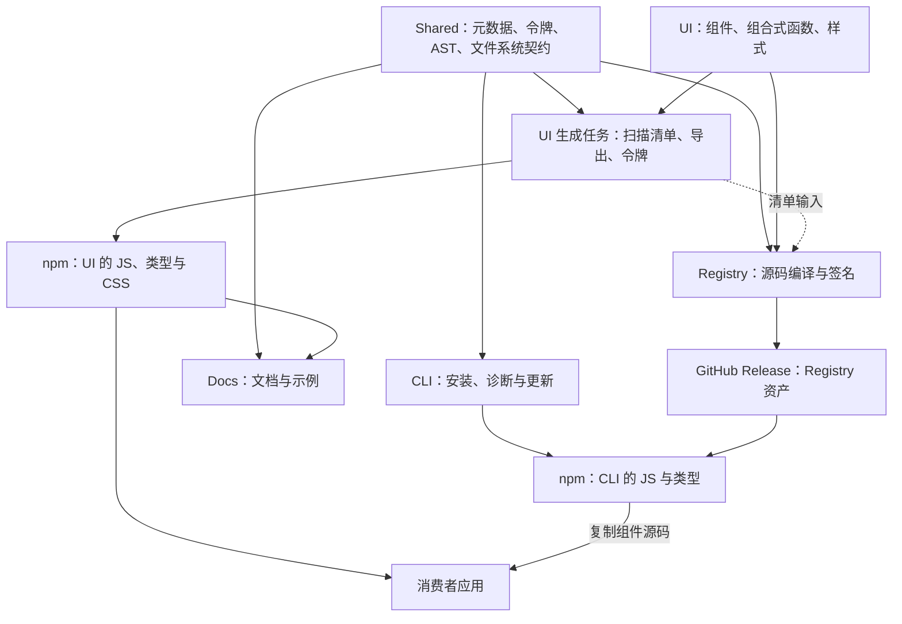

# 项目架构与工程实践审查报告

审查日期：2026-09-11。源码基线：`31d532db`。公开包版本：`brutx-ui-vue@0.11.2`、`brutx-vue@0.11.2`。

## 一、总体判断

**当前项目的技术选型、包职责和组件设计总体合理，适合继续演进。需要优先改进的是架构边界的可验证性：公开包能否独立安装、状态能否按应用隔离、构建结果是否与缓存无关、同一版本能否重复取得。**

建议下一阶段以“交付契约收敛”为主线。现有工程已经具备组件原语、设计令牌、AST 编译、文件事务、签名注册表和多类测试；继续增加基础设施之前，先让这些机制共同保证消费者实际使用的结果。

本次确认了三项应优先处理的问题：CLI 分发包含私有包依赖、SSR fallback 状态跨请求共享、构建缓存与生成任务边界不完整。另有消费者测试、版本化注册表和发布流程方面的改进空间。

本报告依据当前源码、构建配置、实际本地打包和针对性复现形成。它不是逐行全库审计，也不把已有历史审查报告当作现状证据。

## 二、架构现状与合理性

当前导出清单包含 **92 个组件目录、35 个 composable 文件、1 个 directive 文件**。这个规模已经需要包边界、自动生成和聚焦校验，采用 pnpm workspace 与 Turbo 有实际价值。

| 领域 | 当前设计 | 判断与建议 |
| --- | --- | --- |
| 仓库组织 | UI、CLI、Registry、Shared、Docs 五个包 | 职责有实际差异，保留现有拆分。Registry 是源码分发编译器，Shared 是内部契约与工具集合，独立存在合理 |
| UI 组件 | Vue SFC、Reka 原语、独立 CVA 变体、`cn()` 合并 | 符合组件库的分工方式：交互语义、视觉规则与渲染分别组织 |
| 复杂组件 | DataTable 将筛选、排序、分页、选择拆成 composable | 以变化原因拆分，优于把所有状态和算法堆在模板组件中 |
| 设计系统 | Shared 中维护语义令牌，经编译生成 UI/CLI CSS | 单一数据源方向正确，能够支撑主题和两条分发路径的一致性 |
| CLI | `ProjectContext`、RegistryClient、变更计划、文件事务、文件系统适配器 | 抽象服务于真实边界，支持 dry-run、测试替身和故障恢复，值得保留 |
| 源码分发 | 从 UI 源码扫描、重写引用、编译 Registry JSON | npm 包与源码复制共用实现，减少重复维护；代价是必须同时验证两种消费方式 |
| npm 分发 | 多入口 ESM、类型声明、CSS 子路径、peer dependencies | 基础形式合理；公开包的安装声明和类型依赖尚未完全封闭 |
| 状态管理 | provider/factory 路径与模块级 fallback 并存 | provider 路径合理；fallback 的作用域模型需要统一 |
| 工程质量 | 单测、SSR、浏览器、契约、文档与包检查 | 类别齐全；独立消费者场景和门禁接入仍有缺口 |

Reka 官方将键盘导航、焦点管理和 ARIA 作为原语职责；项目在这一层复用成熟实现是合理的，但二次封装后的交互仍需要验证。[Reka 无障碍说明](https://www.reka-ui.com/docs/overview/accessibility)

Tailwind v4 的 `@theme` 将主题变量映射为工具类，项目用共享语义令牌生成这一层的方向与其机制一致。[Tailwind 主题变量](https://tailwindcss.com/docs/theme)

Vite 的库模式支持多入口、外部依赖和 CSS 导出。当前构建形态有依据；是否真正按需消费，需要用实际消费者构建验证。[Vite 库模式](https://vite.dev/guide/build#library-mode)

主要源码依据：[UI 构建](../../../packages/ui/vite.config.ts)、[Button](../../../packages/ui/src/components/button/Button.vue)、[DataTable](../../../packages/ui/src/components/data-table/DataTable.vue)、[设计令牌](../../../packages/shared/src/design-tokens.ts)、[令牌编译器](../../../packages/shared/src/tokens/token-style-compiler.ts)、[CLI 变更引擎](../../../packages/cli/src/lib/services/component-mutation-engine.ts)。

### 现有交付关系

下图箭头表示源码、契约或产物的流向，不等同于已经声明的 Turbo 任务依赖。



另附[可编辑的架构关系图](项目架构关系图.drawio)。本机未找到可用的 draw.io CLI，图源完成 XML 结构校验，未执行原生 PNG 导出或视觉验收。

## 三、优先处理的架构问题

### 1. P1：公开 CLI 的安装与类型契约暴露私有工作区包

**证据与复现。** [CLI package.json](../../../packages/cli/package.json) 的 `dependencies` 包含 `brutx-shared-vue: workspace:*`；[Shared package.json](../../../packages/shared/package.json) 声明 `private: true`。[tsup 配置](../../../packages/cli/tsup.config.ts) 用 `noExternal` 将 Shared 的实现打入 JS，但没有移除安装依赖，也没有将所有公开类型内联。

本次重新执行 CLI 构建后，本地 tarball 的 `package/package.json` 仍包含：

```json
{
    "dependencies": {
        "brutx-shared-vue": "0.1.0"
    }
}
```

新生成的 `dist/api.d.ts` 开头仍包含：

```ts
import { RegistryItem } from 'brutx-shared-vue';
import { FileSystemAdapter, FsRemoveOptions } from 'brutx-shared-vue/fs';
```

这说明“JS 已打包”没有同时解决“安装声明可解析”和“类型声明可解析”。消费者仍需取得私有包，而当前发布工作流只交付 UI 与 CLI 两个公开包。

pnpm 会在 pack/publish 时把 `workspace:*` 转为对应工作区版本，并不会因为依赖已打入 JS 就自动移除声明；本次 tarball 结果与该机制一致。[pnpm 工作区发布机制](https://pnpm.io/workspaces#publishing-workspace-packages)

**建议。** 保留 Shared 的内部定位，将其作为 CLI 的构建依赖，并使公开 `.d.ts` 自包含。仅当 Shared 确实要成为用户直接使用的稳定 API 时，再把它作为正式公开包维护。验收以干净目录安装 tarball、运行 CLI、编译 API 消费者为准，覆盖 JS、声明文件和依赖清单三层。

**验证边界。** 本次确认了实际打包结果及新构建的声明文件；没有执行远程 registry 的独立安装，也没有将结果描述为已经发生的线上安装事故。

### 2. P1：fallback 的生命周期按模块管理，SSR 需要按请求隔离

[fallback-manager.ts](../../../packages/ui/src/lib/fallback-manager.ts) 在闭包中保存单例。`isClient` 只控制浏览器事件监听，不控制单例是否复用；清理依赖 `onUnmounted()`。[useToast.ts](../../../packages/ui/src/composables/useToast.ts) 在模块级创建该 manager，缺少 provider 时直接获取共享实例。

本次在同一 Node 进程中先后渲染两个独立 `createSSRApp()`，第一个应用写入 toast，第二个只读取：

| 场景 | 请求 A 输出 | 请求 B 输出 |
| --- | --- | --- |
| 未提供 `provideToast()` | `<div>request-A</div>` | `<div>request-A</div>` |
| 每个应用独立提供 `provideToast()` | `<div>request-A</div>` | `<div></div>` |

**跨请求复用已经复现。** 是否泄露真实用户信息取决于业务写入的内容，但状态隔离缺陷本身成立。

Vue 官方明确说明，服务端模块单例会跨请求复用，SSR 不执行卸载钩子；建议每个请求建立应用与状态实例，通过应用上下文提供。[Vue SSR 状态隔离与生命周期](https://vuejs.org/guide/scaling-up/ssr.html#cross-request-state-pollution)

**建议。** 将主题、通知和命令式弹层的状态所有权统一到 App/请求实例。服务端缺省路径也必须保证隔离；客户端便利入口可以保留，但需要明确关联的应用。[plugin.ts](../../../packages/ui/src/plugin.ts) 的全局 `globalApp` 同样体现了单应用假设，应纳入这一轮范围。

现有 provider 路径在复现中表现正确，说明 factory/provider 的基础可以继续使用。验收应包含连续请求、并发请求以及同页双应用，而不只检查 SSR 是否抛出浏览器全局变量异常。

### 3. P1：构建缓存输入和生成任务依赖没有完整表达真实执行关系

**缓存输入已确认缺漏。** [turbo.json](../../../turbo.json) 为 `build` 自定义了输入清单，包含 `vite.config.ts`，没有包含 CLI 使用的 `tsup.config.ts`。实际 Turbo dry-run 中，`brutx-vue#build.inputs` 也没有该文件。只调整 CLI 打包配置时，构建缓存不能据此失效。

Turborepo 官方说明，显式设置 `inputs` 会替换默认行为，可以用 `$TURBO_DEFAULT$` 保留默认输入，再追加跨包输入。这是当前配置应对照的机制。[Turborepo 配置参考源码](https://github.com/vercel/turborepo/blob/main/apps/docs/content/docs/reference/configuration.mdx)

**生成任务存在多个执行入口。** UI 的 build、lint、typecheck 都调用扫描及导出生成器，并可能写相同的清单、组件 index 和 package exports；CI 又同时运行这些任务。[UI 脚本配置](../../../packages/ui/package.json)、[扫描生成器](../../../packages/ui/scripts/prebuild-scan.ts)、[CI](../../../.github/workflows/ci.yml)

**Registry 对生成清单的依赖没有成为任务边。** [RegistryCompiler.loadMergedRegistry](../../../packages/registry/src/compiler/registry-compiler.ts) 读取 UI 的 `registry-manifest.json`；[实际构建入口](../../../packages/registry/src/runner/build-runner.ts) 调用编译器，而 dry-run 显示 `brutx-registry-vue#build.dependencies` 为空。生成清单发生变化时，Registry 与 UI 生成任务缺少执行顺序保证。这里确认的是任务图缺口，本次没有制造并发文件竞争来声称已经复现随机失败。

**建议。** 将生成过程设为独立任务，并明确唯一写入者。UI 构建、类型检查、导出验证以及 Registry 编译依赖所需的生成任务；lint 和检查阶段尽量只验证。按包补全输入与输出，避免由一份过窄的通用清单承担所有包的缓存规则。

验收应包含：修改 tsup 配置后哈希变化；缓存命中与禁用缓存的产物一致；新增组件后的并行构建顺序正确；生成任务第二次执行不改变内容。Registry 的 `cache: false` 目前应保持，等任务图和产物等价性有证据后再评估缓存。

## 四、消费者质量与发布能力

### 4. P2：质量门禁需要增加真实消费者层

测试类别多是优点，但“仓库内部成功”与“用户能够消费”是不同契约：

| 当前检查 | 实际覆盖 | 仍需补充 |
| --- | --- | --- |
| UI package smoke | 把工作区包软链接到临时目录并解析、导入 | 安装实际 tarball，避免工作区依赖替消费者兜底 |
| CLI integration | 执行本地 CLI dist，用替身包管理器记录安装指令 | 真实安装依赖，并构建生成的 Vite/Nuxt 应用 |
| SSR smoke | 大量组件和 composable 可执行 SSR setup/render | 请求隔离、渲染内容与 hydration 行为 |
| consumer type tests | 已有独立命令，且本次执行通过 | 纳入固定 CI 门禁，并扩展到 CLI 公开 API |
| 浏览器测试 | 当前匹配的两个文件覆盖 reduced motion 与 glitch text | 优先覆盖弹层焦点、键盘导航和虚拟滚动等真实布局/浏览器行为 |

源码依据：[UI 消费者 smoke](../../../packages/ui/scripts/smoke-package.mjs)、[CLI 测试替身](../../../packages/cli/tests/integration/helpers.ts)、[SSR smoke](../../../packages/ui/src/ssr/ssr-smoke.test.ts)、[UI consumer 类型测试](../../../packages/ui/test-d/consumer/consumer.test-d.ts)、[浏览器配置](../../../packages/ui/vitest.browser.config.ts)。项目另有广泛的键盘和无障碍单测，例如 [accessibility.test.ts](../../../packages/ui/src/components/accessibility.test.ts)，不应据浏览器文件数量推断“没有无障碍测试”。

现有 `.github/workflows` 没有接入 `test:types`、`check:isolation`、`test:coverage`。覆盖率阈值虽已配置，普通 `vitest run` 并不会开启 coverage。完整 CLI 矩阵由 `BRUTX_RUN_FULL_INTEGRATION_MATRIX` 控制，当前 CI 没有设置该开关。[完整矩阵](../../../packages/cli/tests/integration/matrix-runner.test.ts)、[CI](../../../.github/workflows/ci.yml)、[Vitest 配置](../../../packages/ui/vitest.config.ts)

**建议。** 保留快速替身测试，在发布门禁增加少量真实消费场景。先补能捕获前三项问题的检查，再按风险增加浏览器用例；不必在每次开发时运行全部矩阵。

### 5. P2：源码分发需要明确、可重复的版本契约

[RegistryClient.resolveVersionedSource](../../../packages/cli/src/lib/registry-client.ts) 对默认 Release 源会警告并忽略用户指定的版本，继续拉取 latest；版本替换仅实现于 GitHub raw URL。这是当前代码明确实现的限制，本报告将其归为能力边界。

对于支持更新、差异比较、三方合并的 CLI，用户不仅需要“取得新代码”，也需要“重新取得同一版本代码”。内容 integrity 和签名验证来源及内容，不能单独替代可重复的版本寻址。

**建议。** 默认源支持确定的 Release tag，在一次安装中固定同一份 manifest/版本快照，依赖闭包沿用该快照；本地记录能重建来源的 tag、schema 版本与完整性信息。GitHub Release 本身提供带 tag 的资产下载地址，这一能力可以在现有分发机制上实现。[GitHub Release API](https://docs.github.com/en/rest/releases/releases)

验收应明确：固定版本重复安装结果一致；同一安装中不会混用不同 Release 的组件；不支持的版本请求明确失败；现有本地修改在更新时继续受到三方合并策略保护。

### 6. P2：发布应只有一条完整流程，并在资产就绪后对外可见

[发布工作流](../../../.github/workflows/publish.yml) 在校验、上传 Registry 资产之前创建公开 Release。由于 CLI 默认源使用 `releases/latest/download`，新 Release 可见而资产尚未完整时，已有用户也可能取得不完整版本。上传失败会延长这一窗口。签名校验可以拒绝不一致内容，但无法保证该窗口内的可用性。

同时，[根 package.json](../../../package.json) 的 `release` 命令直接运行 `changeset publish`，没有工作流中的 Registry 资产校验与上传步骤。它与 tag 发布不是同一条完整交付流程。

**建议。** 统一发布入口：本地准备版本与提交，完整交付由同一流程负责；先创建 draft、上传并校验全部资产，再发布 Release，随后发布与之匹配的 npm 包。为失败重试定义幂等状态，不通过覆盖已交付的版本改变其含义。

GitHub 官方在不可变 Release 的场景下建议先建 draft、附齐资产、再发布；这里将“发布前准备完整资产”作为本项目的可靠性建议。本次没有查询仓库是否已经启用不可变 Release。[GitHub Release 管理](https://docs.github.com/en/repositories/releasing-projects-on-github/managing-releases-in-a-repository)

## 五、下一阶段的设计取舍

### 保留现有五包结构，收紧 Shared 的公开边界

Shared 同时包含设计令牌、元数据、Node 文件系统和 AST 工具。它已有 `/tokens`、`/ast`、`/fs` 等子入口，当前可以先依靠入口和依赖规则隔离职责。公开 UI 运行时与 CLI 声明文件不能泄露内部工具依赖，应由分发检查强制验证。只有这些领域出现独立发布或独立复用需求时，才值得继续拆包。

### 将公开 API 清单与目录扫描区分开

[prebuild-scan.ts](../../../packages/ui/scripts/prebuild-scan.ts) 会把 composables 目录下符合文件条件的内容自动纳入导出。自动生成能保证路径一致，但“文件存在”不完全等价于“承诺给用户使用的 API”。

建议在 1.0 之前明确公开组件、公开 composable 和内部 helper 的分界，使用内部目录或显式公开元数据。生成器继续负责机械一致性，API 所有权由明确的产品契约决定。

### 基础组件、复合组件与视觉特效建立成本边界

Button 同时承担基础交互、加载状态和 glitch 特效；当前普通按钮也会创建特效 composable，并在 mounted/updated 中同步 DOM 文本。[Button](../../../packages/ui/src/components/button/Button.vue)

这是需要度量的设计取舍，本次没有据此判定性能不达标。建议先测基础 Button 的实际依赖闭包、默认渲染成本和 CSS 体积，再决定是否将特效移到组合层。DataTable、页面区块等也可在同一包内形成明确层次，基础组件避免依赖上层组合。

现有 size-limit 已覆盖完整入口、Button 和 CSS，可继续使用；补充真实消费者构建能更准确反映分块和可选依赖的效果。Vue 官方也建议以实际构建环境的测量结果为准。[Vue 性能指南](https://vuejs.org/guide/best-practices/performance#bundle-size-and-tree-shaking)

### 工程规则围绕结果维护

已有文档和契约自动化能够减少多人或 Agent 协作的偏差。后续应优先让少量高价值门禁覆盖包安装、状态隔离、缓存等价和版本重放等结果，减少多个入口重复生成、修复、校验同一产物。

这轮不需要更换 Vue、Reka、Tailwind 或 Turbo，也没有充分证据支持重写组件库。优先解决现有技术栈之上的责任与交付边界。

## 六、建议实施顺序与验收

| 顺序 | 工作主题 | 完成判据 |
| --- | --- | --- |
| 第一批 | CLI 公开包闭合、SSR 实例隔离、构建缓存及生成任务图 | tarball 独立安装和类型编译成功；双请求隔离；构建配置变化使缓存失效；生成任务执行有明确顺序 |
| 第二批 | 消费者测试、版本化 Registry、统一发布流程 | 两种分发方式都能构建消费者；固定版本重复取得一致；公开 Release 资产完整；发布重试保持版本含义 |
| 第三批 | API 分层、基础组件成本与规则精简 | 明确公开 API；使用度量决定特效拆分；删除重复职责前证明替代门禁覆盖等价 |

## 七、本次验证记录与限制

| 验证 | 结果 |
| --- | --- |
| `pnpm check:contracts` | 通过 |
| `pnpm --filter brutx-vue build` | 当前源码的 JS 与 DTS 构建通过；新 DTS 仍引用私有 Shared |
| 本地 CLI pack，读取 tarball 清单 | 确认 `brutx-shared-vue: 0.1.0` 仍在运行时依赖中 |
| 两个独立 SSR 应用的最小复现 | fallback 复用请求 A 状态；独立 provider 路径正确隔离 |
| `turbo run build test typecheck lint --dry=json` | 确认 CLI 构建输入缺少 tsup 配置；Registry build 没有上游任务依赖 |
| `pnpm --filter brutx-ui-vue test:types` | 通过；使用当前本地 UI dist，本次未重建 UI |
| `pnpm check:docs` | 新增报告与图源后通过 |
| draw.io XML 结构校验 | 25 个单元、12 条边；ID 唯一、边端点与 geometry 完整 |

未执行全库测试、生产发布、真实远程安装、浏览器性能基准或线上事故调查。因此报告区分了实测结果、静态机制分析和设计建议，不把未验证的后果表述为已发生事实。

OCR 外部扫描被自动审批拒绝，原因是可能将私有源码发送到外部服务；本报告使用本地源码审查和官方公开资料完成。
