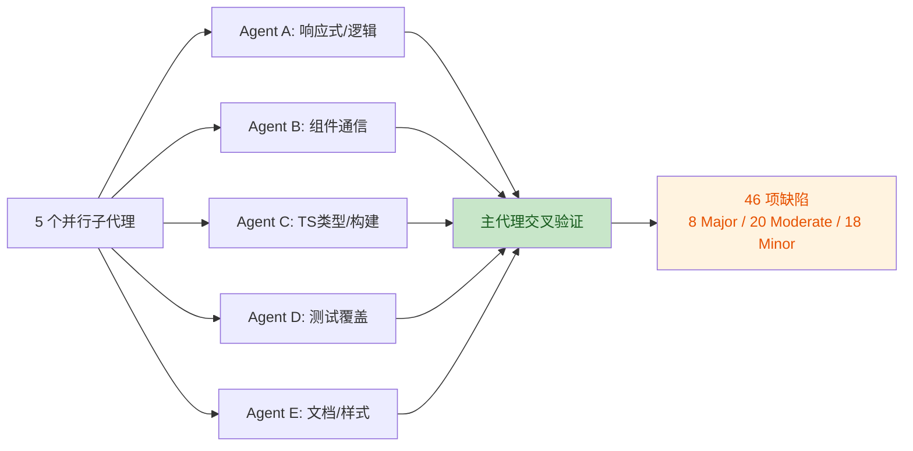

# BrutxUI Vue3 全面错误审查报告

> **审查日期**：2025-07-06
> **审查范围**：`packages/ui`（108 个组件目录、~30 个 composables、lib 工具函数）、`packages/cli`、`apps/docs`
> **审查方法**：5 个并行子代理分维度深度审查 + 主代理交叉验证全部发现
> **关联报告**：[packages-ui-review-2025-07-06.md](./packages-ui-review-2025-07-06.md)（代码+安全审查）、[TECH_DEBT_REPORT.md](./TECH_DEBT_REPORT.md)（技术债）

---

## 审查概览

本次审查覆盖用户要求的 8 个维度，共发现 **46 项缺陷**（去重后，不含 8.7 汇总引用）。严重度分布：

| 严重度 | 数量 | 说明 |
|--------|------|------|
| **Critical** | 0 | 无数据丢失/安全漏洞级问题 |
| **Major** | 8 | 功能失效、内存泄漏、交互破坏、测试隔离失效 |
| **Moderate** | 20 | API 契约违约、类型安全缺陷、防御性不足、覆盖率失真 |
| **Minor** | 18 | 死代码、轻微泄漏、文档偏差 |

---

## 维度 1：组件功能实现中的逻辑错误

### 1.1 [Major] VirtualScroll 异步 import 在组件卸载后仍执行

- **位置**：[VirtualScroll.vue#L46-L97](file:///e:/project/brutxui-vue3/packages/ui/src/components/virtual-scroll/VirtualScroll.vue#L46-L97)、[L127-L140](file:///e:/project/brutxui-vue3/packages/ui/src/components/virtual-scroll/VirtualScroll.vue#L127-L140)
- **复现步骤**：在 `<KeepAlive>` 外用 `v-if` 控制 VirtualScroll 显隐，快速切换 `true/false` 多次（如 `<VirtualScroll v-if="show" :items="data" />`，每 100ms 切换 show）。
- **影响范围**：`import('@tanstack/vue-virtual').then(...)` 是异步的。若组件在 import 解析前卸载，`onBeforeUnmount`（127-140 行）已执行，此时 `cleanup`/`stopWatchScrollElement`/`stopWatchOptions` 均为 `null`。`.then()` 回调仍会创建 `Virtualizer`、调用 `virtualizer._didMount()` 返回的 cleanup 函数被赋值给局部变量但永远不会被调用，设置的 watches 也永远不会被停止。每次快速切换累积一份内存泄漏，Virtualizer 持有已分离 DOM 引用。
- **修复建议**：在 `.then()` 回调开头检查组件是否已卸载（用 `isUnmounted` 标志，在 `onBeforeUnmount` 中置位），若已卸载则直接 `return`；或将 `import` 移到 `onMounted` 内并配合 `onBeforeUnmount` 取消。

### 1.2 [Major] useCarouselEnhanced 进度定时器初始挂载不启动

- **位置**：[useCarouselEnhanced.ts#L16-L30](file:///e:/project/brutxui-vue3/packages/ui/src/composables/useCarouselEnhanced.ts#L16-L30)、[useCarousel.ts#L89-L110](file:///e:/project/brutxui-vue3/packages/ui/src/composables/useCarousel.ts#L89-L110)
- **复现步骤**：`<CarouselEnhanced :autoplay="true" :track-progress="true" />`，观察进度条始终停留在 0%。
- **影响范围**：`useCarousel` 的 `onMounted`（89-100 行）直接调用内部 `startAutoplay()`（99 行），但**不触发** `options.onAutoplayChange?.(true)` 回调（该回调仅在 `watch(() => toValue(options.autoplay), ...)` 102-110 行中触发，且 `watch` 无 `{ immediate: true }`）。而 `useCarouselEnhanced` 的 `startProgressTimer()` 仅通过 `onAutoplayChange` 回调（18-25 行）启动。结果：初始挂载时 autoplay 已开始滚动，但 `autoplayProgress` 永远停留在 0，进度条 UI 失效。所有使用 CarouselEnhanced 进度指示器的场景均受影响。
- **修复建议**：在 `useCarousel` 的 `onMounted` 中 `startAutoplay()` 后追加 `options.onAutoplayChange?.(true)`；或在 `useCarouselEnhanced` 的 `onMounted` 中直接调用 `startProgressTimer()`。

### 1.3 [Major] InfiniteScroll disabled 切换未清理 loadTimer

- **位置**：[InfiniteScroll.vue#L82-L101](file:///e:/project/brutxui-vue3/packages/ui/src/components/infinite-scroll/InfiniteScroll.vue#L82-L101)
- **复现步骤**：滚动触发加载（设置 `:delay="2000"`），在 2 秒内将 `disabled` 切换为 `true`，2 秒后仍会 `emit('load')`。
- **影响范围**：`watch(() => props.disabled, ...)`（95-101 行）在 `disabled` 变为 `true` 时仅调用 `cleanupObserver()`（82-87 行），**未清理** `loadTimer.value`。此时若已有 pending 的 `setTimeout`（54-58 行），定时器到期后仍会执行 `isLoading.value = true; emit('load')`，尽管组件已被禁用。`triggerLoad` 内的 `shouldLoad()` 检查只在 `setTimeout` 被设置前生效，定时器回调内部不重新检查。导致禁用状态下仍触发加载，可能产生不必要的网络请求或状态错乱。
- **修复建议**：在 `cleanupObserver()` 调用后追加 `if (loadTimer.value) { clearTimeout(loadTimer.value); loadTimer.value = null }`；或在 `setTimeout` 回调内部增加 `if (props.disabled) return` 守卫。

### 1.4 [Moderate] Upload doUpload 错误双重处理

- **位置**：[Upload.vue#L98-L131](file:///e:/project/brutxui-vue3/packages/ui/src/components/upload/Upload.vue#L98-L131)
- **复现步骤**：实现 `httpRequest` 为 `async (opts) => { opts.onError(new Error('x')); throw new Error('y') }`，观察 `file-error` 事件触发两次。
- **影响范围**：`doUpload` 同时提供 `onError` 回调（115-120 行）给 `httpRequest`，并用 `try/catch`（122-130 行）捕获异常。如果 `httpRequest` 实现既调用 `onError(error)` 又让 promise reject（或 throw），则 `file-error` 事件会 emit 两次，`props.onError` 也会调用两次，`file.status` 被重复设为 `'error'`，`file.error` 被覆盖。同理，若 `onSuccess` 调用后 promise reject，文件会先标记 success 再标记 error，状态矛盾。
- **修复建议**：用 `let settled = false` 标志，在 `onError`/`onSuccess` 中检查并置位，`catch` 中再检查 `if (!settled)` 才执行。

### 1.5 [Minor] Tour async watch 与 unmount 竞态导致 ResizeObserver 泄漏

- **位置**：[Tour.vue#L335-L347](file:///e:/project/brutxui-vue3/packages/ui/src/components/tour/Tour.vue#L335-L347)
- **复现步骤**：`<Tour :open="true" />`，在 step 切换的 `nextTick` 期间用 `v-if` 移除组件。
- **影响范围**：`watch([isOpen, currentStep], async (...) => { ... await nextTick(); await updatePosition(); setupResizeObserver() }, { immediate: true })` 是 async。若组件在 `await nextTick()` 期间卸载，`onBeforeUnmount`（355-360 行）先执行 `cleanupResizeObserver()`，随后 `.then()` 继续执行 `setupResizeObserver()`（269-281 行）创建新的 `ResizeObserver` 并 `observe(el)`，但该 observer 永远不会被清理。
- **修复建议**：在 watch 回调中 `await` 后检查 `isUnmounted` 标志，或用 `onScopeDispose` 注册取消逻辑。

### 1.6 [Minor] KanbanBoard requestAnimationFrame 未在卸载时取消

- **位置**：[KanbanBoard.vue#L50-L54](file:///e:/project/brutxui-vue3/packages/ui/src/components/kanban/KanbanBoard.vue#L50-L54)
- **复现步骤**：拖拽卡片时用 `v-if` 移除 KanbanBoard。
- **影响范围**：`onDragEnd` 用 `requestAnimationFrame(() => { isDragging.value = false })` 延迟重置拖拽状态，但组件没有 `onBeforeUnmount` 钩子，RAF id 未保存、未取消。若组件在拖拽中卸载，RAF 回调仍会执行，闭包持有的引用阻碍 GC。
- **修复建议**：保存 RAF id 到变量，添加 `onBeforeUnmount(() => cancelAnimationFrame(rafId))`。

### 1.7 [Minor] Slider `?? [0]` 阻止 modelValue 被清空

- **位置**：[Slider.vue#L161](file:///e:/project/brutxui-vue3/packages/ui/src/components/slider/Slider.vue#L161)
- **复现步骤**：`<Slider v-model="values" />`，通过用户交互尝试将值清空为 `undefined`。
- **影响范围**：`@update:model-value="emit('update:modelValue', $event ?? [0])"`。`modelValue` 类型声明为 `number[] | undefined`，但 reka-ui 传 `null`/`undefined` 时被强转为 `[0]`，父组件永远收不到清空信号。
- **修复建议**：`emit('update:modelValue', $event ?? [])` 或直接透传 `$event`。

### 1.8 [Minor] Cascader 清空时多选/单选分支相同（死代码）

- **位置**：[Cascader.vue#L307](file:///e:/project/brutxui-vue3/packages/ui/src/components/cascader/Cascader.vue#L307)
- **复现步骤**：阅读源码即可见。
- **影响范围**：`const emptyValue = props.multiple ? [] : []`，两个分支都返回 `[]`。单选时 `modelValue` 类型是 `CascaderValue[]`，多选时是 `CascaderValue[][]`，都返回 `[]` 在类型上碰巧兼容，但三元表达式是死代码，掩盖了语义。
- **修复建议**：直接 `emit('update:modelValue', [])`，删除无意义三元。

### 1.9 [Minor] useInfiniteScroll options 静态捕获

- **位置**：[useInfiniteScroll.ts#L20-L26](file:///e:/project/brutxui-vue3/packages/ui/src/components/infinite-scroll/useInfiniteScroll.ts#L20-L26)
- **复现步骤**：`useInfiniteScroll(el, { disabled: false, onLoad })`，运行时将 `options.disabled` 改为 `true`（若为 ref），`shouldLoad` 仍返回 `true`。
- **影响范围**：`useInfiniteScroll` 在解构 `options` 时静态捕获 `distance`/`delay`/`disabled`/`immediate`。后续即使传入的 `options.disabled` 变化，`shouldLoad()` 仍使用初始值，`setupObserver` 的 `rootMargin` 和 `triggerLoad` 的 `delay` 也不响应变化。仅影响直接使用 composable 的场景；组件层 `InfiniteScroll.vue` 不受影响（用 props）。
- **修复建议**：将 `options` 改为接受 `MaybeRefOrGetter` 或在内部用 `watch` 监听 `disabled` 变化。

### 1.10 [Minor] ColorPickerPanel useColorHistory 接收静态 props

- **位置**：[ColorPickerPanel.vue#L102-L105](file:///e:/project/brutxui-vue3/packages/ui/src/components/color-picker/ColorPickerPanel.vue#L102-L105)
- **复现步骤**：`<ColorPickerPanel :history-storage-key="userId" />`，切换 `userId`，历史记录仍为首个用户的。
- **影响范围**：`useColorHistory({ storageKey: props.historyStorageKey, maxItems: props.historyMax })` 在 setup 时静态捕获值。运行时 `props` 变化时不会重新加载历史或更新容量限制。
- **修复建议**：`useColorHistory` 应接受 `MaybeRefOrGetter`，或在 `ColorPickerPanel` 内 `watch(() => props.historyStorageKey, ...)` 重新初始化。

---

## 维度 2：Vue3 响应式系统使用不当问题

### 2.1 [Major] useDialogEnhanced watcher 重置拖拽位置

- **位置**：[useDialogEnhanced.ts#L313-L317](file:///e:/project/brutxui-vue3/packages/ui/src/composables/useDialogEnhanced.ts#L313-L317)
- **复现步骤**：`<DialogEnhanced :initial-position="{ x:100, y:100 }" draggable />`，打开后拖动到别处，触发父组件任意 state 变化（如点击其他按钮触发重渲染）→ 弹窗跳回 (100,100)。
- **影响范围**：`watch(() => opt.initialPosition, (newPos) => { if (newPos) position.value = { ...newPos } })` 监听 `opt.initialPosition`。`DialogEnhanced.vue`（80 行）传入 `() => ({ initialPosition: props.initialPosition, ... })`，每次父组件重渲染都会产生新 options 对象。当父组件以行内对象 `:initial-position="{ x: 100, y: 100 }"` 传参时，每次重渲染 `props.initialPosition` 都是新引用，触发 watcher，把用户已拖拽的 `position.value` 重置回初始值。破坏拖拽体验。
- **修复建议**：仅当 `initialPosition` 引用真正变更时才重置（增加引用比较或移除 watcher，仅靠 `initPosition` 在 `onMounted` 设置初始值）。

### 2.2 [Moderate] provideTheme 不调用 initTheme，与 useTheme fallback 行为不一致

- **位置**：[useTheme.ts#L171-L180](file:///e:/project/brutxui-vue3/packages/ui/src/composables/useTheme.ts#L171-L180) vs [L188-L191](file:///e:/project/brutxui-vue3/packages/ui/src/composables/useTheme.ts#L188-L191)
- **复现步骤**：在 App.vue 中调用 `provideTheme()` 但不手动调用 `initTheme()`，观察主题/暗色模式不生效。
- **影响范围**：`provideTheme()` 仅 `createTheme()` + `provide`，不调用 `initTheme()`。而 fallback 路径 `useTheme()` 会 `fallbackInstance.initTheme()`。用户若按文档调用 `provideTheme()` 但忘记手动 `initTheme()`，则 `matchMedia` 监听不挂载、localStorage 主题不恢复、`document.documentElement` 主题类不应用。主题、暗色模式不生效，且难排查。
- **修复建议**：`provideTheme` 内部 `onMounted(() => theme.initTheme())`。

### 2.3 [Minor] Menu.vue provide 的 `router` 字段非响应式且无人消费

- **位置**：[Menu.vue#L69-L76](file:///e:/project/brutxui-vue3/packages/ui/src/components/menu/Menu.vue#L69-L76)
- **复现步骤**：阅读源码即可见。
- **影响范围**：`provide(MENU_KEY, { ..., router: props.router, ... })` 直接传布尔值，非 `computed`。`MenuItem.vue`、`SubMenu.vue` 均未读 `context.router`，且 `selectItem`（35-56 行）直接闭包读 `props.router`。该字段既是死代码又是潜在的响应性陷阱。
- **修复建议**：删除 provide 中的 `router` 字段，或改为 `computed(() => props.router)`。

---

## 维度 3：组件间通信机制缺陷

### 3.1 [Moderate] DialogEnhanced 声明了 `opened`/`closed` 事件但从不触发

- **位置**：[DialogEnhanced.vue#L62-L68](file:///e:/project/brutxui-vue3/packages/ui/src/components/dialog/DialogEnhanced.vue#L62-L68)
- **复现步骤**：`<DialogEnhanced @opened="handleOpened" @closed="handleClosed" />`，打开/关闭对话框，观察回调永远不触发。
- **影响范围**：`defineEmits` 声明了 `opened: []` 和 `closed: []`（65、67 行），但脚本仅 `emit('open')`、`emit('close')`、`emit('update:open', value)`（92-94 行），全文件无 `emit('opened')`/`emit('closed')`。模板（136-176 行）也没有 `@after-enter`/`@after-leave` 处理器。父组件 `@opened`/`@closed` 监听永远不触发，API 契约违约。
- **修复建议**：在 Transition `@after-enter`/`@after-leave` 中分别 `emit('opened')`/`emit('closed')`，或删除这两个声明。

### 3.2 [Moderate] plugin.ts 使用 Vue 私有 API `_context`

- **位置**：[plugin.ts#L15](file:///e:/project/brutxui-vue3/packages/ui/src/plugin.ts#L15)、[render-imperative.ts#L49](file:///e:/project/brutxui-vue3/packages/ui/src/lib/render-imperative.ts#L49)、[functional.ts#L154](file:///e:/project/brutxui-vue3/packages/ui/src/components/dialog/functional.ts#L154)、[functional.ts#L290](file:///e:/project/brutxui-vue3/packages/ui/src/components/dialog/functional.ts#L290)
- **复现步骤**：升级 Vue 到下一个小版本后，命令式 Dialog/Message 可能丢失 locale 与 theme 上下文（provide 链断裂）。
- **影响范围**：`globalAppContext = app._context`。`_context` 是 Vue 内部下划线字段，非公开 API，跨 Vue 小版本可能失效。`renderImperative.ts` 与 `functional.ts` 都依赖该字段为命令式弹窗继承 appContext（i18n/theme provide 链）。
- **修复建议**：在 install 时保存 `app` 本身并提供 `app.runWithContext(() => ...)`，或直接 `app.provide` 一个全局 token。

### 3.3 [Minor] MessageContainer 声明 `close` 事件但从不 emit

- **位置**：[MessageContainer.vue#L10](file:///e:/project/brutxui-vue3/packages/ui/src/components/message/MessageContainer.vue#L10)、[useMessage.ts#L80-L86](file:///e:/project/brutxui-vue3/packages/ui/src/composables/useMessage.ts#L80-L86)
- **复现步骤**：阅读源码即可见。
- **影响范围**：`MessageContainer.vue` `defineEmits<{ close: [] }>()`，但模板中关闭按钮调用 `handleClose(msg.id)` → `removeMessage(id)`，从不 `emit('close')`。`useMessage.ts` 传入的 `onClose: () => { instance = null }` 因此永不被触发（实际靠 `scheduleGC` 设置 `instance=null`）。`onClose` 死代码；若后续依赖该回调做清理将沉默失败。
- **修复建议**：删除 `MessageContainer` 的 `defineEmits` 或在合适时机 `emit('close')`；同时移除 `useMessage.ts` 中的 `onClose`。

### 3.4 [Minor] renderImperative 仅把 firstElementChild 挂到 body，多根片段会被丢弃

- **位置**：[render-imperative.ts#L53-L55](file:///e:/project/brutxui-vue3/packages/ui/src/lib/render-imperative.ts#L53-L55)
- **复现步骤**：用 `renderImperative` 渲染一个多根片段组件，观察只有第一个根节点可见。
- **影响范围**：`const el = container.firstElementChild; if (el) document.body.appendChild(el)`。`container` 本身从不 append 到 DOM。若被渲染组件是多根片段，只有第一个根节点进入 body，其余根节点留在 detached `container` 中不可见。
- **修复建议**：直接 `document.body.appendChild(container)`，或遍历 `container.childNodes` 全部 append。

### 3.5 [Minor] useToast / useTheme 模块级 `beforeunload` 监听永不解绑

- **位置**：[useToast.ts#L219-L221](file:///e:/project/brutxui-vue3/packages/ui/src/composables/useToast.ts#L219-L221)、[useTheme.ts#L202-L203](file:///e:/project/brutxui-vue3/packages/ui/src/composables/useTheme.ts#L202-L203)
- **复现步骤**：在测试中多次挂载/卸载 app，或 HMR 后观察监听器累积。
- **影响范围**：模块加载时 `window.addEventListener('beforeunload', destroyFallback)`，从未 `removeEventListener`。在多次挂载/卸载 app 的测试或微前端场景下监听器累积，轻微内存泄漏。
- **修复建议**：改为在 `provideToast`/`provideTheme` 内部按需注册，并在 `onUnmounted` 中移除。

---

## 维度 4：样式冲突或兼容性问题

### 4.1 [Major] z-index 层级冲突

- **位置**：
  - [Tour.vue#L367](file:///e:/project/brutxui-vue3/packages/ui/src/components/tour/Tour.vue#L367)（`z-[9998]`）、[Tour.vue#L372](file:///e:/project/brutxui-vue3/packages/ui/src/components/tour/Tour.vue#L372)（`z-[9999]`）
  - [Image.vue#L334](file:///e:/project/brutxui-vue3/packages/ui/src/components/image/Image.vue#L334)（`z-[9999]`）、[Image.vue#L340](file:///e:/project/brutxui-vue3/packages/ui/src/components/image/Image.vue#L340)、[L351](file:///e:/project/brutxui-vue3/packages/ui/src/components/image/Image.vue#L351)、[L362](file:///e:/project/brutxui-vue3/packages/ui/src/components/image/Image.vue#L362)、[L386](file:///e:/project/brutxui-vue3/packages/ui/src/components/image/Image.vue#L386)（`z-[10000]`）
  - [MessageContainer.vue#L52](file:///e:/project/brutxui-vue3/packages/ui/src/components/message/MessageContainer.vue#L52)（`z-[10000]`）
- **复现步骤**：同时打开 Image 预览（`z-[10000]`）和 Message 消息（`z-[10000]`），两者层级相同，渲染顺序决定谁在上。Tour（`z-[9999]`）会被 Image 遮挡。
- **影响范围**：多个组件使用硬编码的 `z-index` 魔法数字，且数值交叉冲突。没有统一的 z-index 管理策略，导致组件同时显示时层级不可预测。
- **修复建议**：建立统一的 z-index 层级令牌（如 `lib/z-index.ts` 定义 `TOUR_Z=1000, IMAGE_PREVIEW_Z=1100, MESSAGE_Z=1200` 等），所有组件引用令牌而非硬编码数字。这同时符合项目"禁止魔法数字"规则。

### 4.2 [Moderate] 未注册的颜色令牌 `brutal-black` / `brutal-yellow`

- **位置**：被 `Backtop`、`Loading`、`Message`、`Result`、`directives/loading` 等组件使用，但 `styles.css` 中无定义
- **复现步骤**：在 Tailwind 配置中搜索 `brutal-black`/`brutal-yellow`，无匹配的 color token 定义；使用这些类的组件样式静默失效（回退到默认颜色）。
- **影响范围**：组件使用 `bg-brutal-black`、`text-brutal-yellow` 等类名，但颜色令牌未在 Tailwind 主题中注册，导致样式静默失效（回退到默认或继承色）。违反设计系统一致性。
- **修复建议**：在 `styles.css` 的 `@theme` 块中注册缺失的颜色令牌，或修改使用方改用已存在的令牌（如 `brutal-fg`、`brutal-warning` 等）。

### 4.3 [Moderate] tabs-variants.ts compoundVariants 仅定义 horizontal 方向的 size

- **位置**：[tabs-variants.ts#L21-L25](file:///e:/project/brutxui-vue3/packages/ui/src/components/tabs/tabs-variants.ts#L21-L25)
- **复现步骤**：`<Tabs orientation="vertical" size="lg" />`，观察 vertical 方向的 size 样式不生效。
- **影响范围**：`compoundVariants` 仅定义了 `orientation: 'horizontal'` 时的 size 变体，`orientation: 'vertical'` 方向的 size 变体缺失，导致 vertical Tabs 的 size prop 无效。
- **修复建议**：补充 `orientation: 'vertical'` 的 size compoundVariants 定义。

### 4.4 [Minor] Calendar.vue 滥用 `!important`

- **位置**：[Calendar.vue](file:///e:/project/brutxui-vue3/packages/ui/src/components/calendar/Calendar.vue)（15 处 `!important`）
- **复现步骤**：阅读源码即可见。
- **影响范围**：15 处 `!important` 用于覆盖 v-calendar 默认样式，增加维护成本，且使下游用户难以自定义样式。
- **修复建议**：利用 v-calendar 的 `class` prop 传入选定类名（如 `brutx-calendar`），用 `:global(.brutx-calendar .vc-*)` 选择器提高特异性，移除大部分 `!important`（参考项目 memory 中已记录的约定）。

### 4.5 [Minor] preflight.css 全局 reduced-motion 用 `!important` 覆盖所有动画

- **位置**：[preflight.css#L29-L36](file:///e:/project/brutxui-vue3/packages/ui/src/preflight.css#L29-L36)
- **复现步骤**：在系统设置中启用"减少动画"，观察所有动画被强制禁用。
- **影响范围**：全局 `@media (prefers-reduced-motion: reduce)` 用 `!important` 覆盖所有 `animation`/`transition`，包括有意设计的微交互。虽然符合无障碍精神，但 `!important` 过于粗暴，阻止了组件级别的精细控制。
- **修复建议**：移除 `!important`，改用更高特异性选择器；或保留全局规则但为需要保留动画的组件提供 opt-out 机制（如 `[data-allow-motion="true"]` 覆盖）。

---

## 维度 5：单元测试覆盖率及测试用例有效性

### 5.1 [Major] vitest.config.ts `isolate: false` 导致测试隔离失效

- **位置**：[vitest.config.ts#L19](file:///e:/project/brutxui-vue3/packages/ui/vitest.config.ts#L19)
- **复现步骤**：在测试 A 中修改全局状态（如 `useToast` 的模块级 fallback），运行测试 B，观察 B 受到 A 的状态污染。
- **影响范围**：`isolate: false` 使所有测试共享同一个模块注册表和全局环境，模块级状态（如 `useToast`、`useTheme`、`useMessage` 的 fallbackInstance）在测试间泄漏，导致测试结果依赖于执行顺序，出现间歇性失败。
- **修复建议**：移除 `isolate: false`（默认为 `true`），或在每个测试后显式调用 `destroyFallback()`/`destroyMessageSystem()` 重置模块状态。

### 5.2 [Moderate] devtools-plugin.test.ts 永真断言

- **位置**：[devtools-plugin.test.ts#L587-L591](file:///e:/project/brutxui-vue3/packages/ui/src/lib/devtools-plugin.test.ts#L587-L591)
- **复现步骤**：阅读源码即可见 `expect(true).toBe(true)`。
- **影响范围**：测试用 `expect(true).toBe(true)` 作为占位断言，无论代码是否正确都不会失败，给人虚假的覆盖率信心。
- **修复建议**：替换为有意义的断言，验证实际行为；或删除该测试用例。

### 5.3 [Moderate] useDialogEnhanced.test.ts 弱断言

- **位置**：[useDialogEnhanced.test.ts#L310-L334](file:///e:/project/brutxui-vue3/packages/ui/src/composables/useDialogEnhanced.test.ts#L310-L334)
- **复现步骤**：阅读源码，注释说 "newX = 50, newY = 30" 但断言用 `toBeDefined()` 而非精确值。
- **影响范围**：测试注释描述了期望值（`newX = 50, newY = 30`），但实际断言用 `toBeDefined()`，任何非 undefined 值都会通过，无法验证拖拽位置计算的正确性。
- **修复建议**：替换为 `expect(position.value.x).toBe(50)` 和 `expect(position.value.y).toBe(30)`。

### 5.4 [Moderate] useCarousel.test.ts 零断言测试 + 模块级 mock 状态未重置

- **位置**：[useCarousel.test.ts#L307-L313](file:///e:/project/brutxui-vue3/packages/ui/src/composables/useCarousel.test.ts#L307-L313)（零断言）、[L46-L58](file:///e:/project/brutxui-vue3/packages/ui/src/composables/useCarousel.test.ts#L46-L58)、[L78-L83](file:///e:/project/brutxui-vue3/packages/ui/src/composables/useCarousel.test.ts#L78-L83)（mock 未重置）
- **复现步骤**：阅读源码即可见。
- **影响范围**：
  1. 307-313 行的测试注释 "this test just verifies no error occurs"，没有任何 `expect` 调用，只验证不抛异常。
  2. 46-58、78-83 行的模块级 mock 状态未在 `beforeEach` 完整重置，与 `isolate: false` 叠加导致状态泄漏。
- **修复建议**：为零断言测试添加有意义的断言；在 `beforeEach` 中完整重置所有 mock 状态。

### 5.5 [Moderate] coverage.include 未覆盖 src/lib 其余文件

- **位置**：[vitest.config.ts#L39](file:///e:/project/brutxui-vue3/packages/ui/vitest.config.ts#L39)
- **复现步骤**：运行 `pnpm test:coverage`，观察 `src/lib/` 目录下仅 `utils.ts` 进入统计，其他 lib 文件（`env.ts`、`defaults.ts`、`data-table-utils.ts`、`render-imperative.ts`、`plugin.ts`、`devtools-plugin.ts` 等）均不被统计。
- **影响范围**：`coverage.include` 实际为 `['src/components/**/*.{ts,vue}', 'src/composables/**/*.ts', 'src/lib/utils.ts']`，组件与 composables 已纳入统计；但 `src/lib/` 下仅显式列出 `utils.ts`，其余 lib 文件未纳入，导致覆盖率报告对 lib 层的反映不完整。另 `coverage.exclude` 路径错误（见 7.3）：`src/components/combobox-types.ts` 实际文件位于 `src/components/combobox/combobox-types.ts`。
- **修复建议**：将 `src/lib/utils.ts` 扩展为 `src/lib/**/*.ts`，使所有 lib 文件纳入统计；修正 `exclude` 路径为 `src/components/combobox/combobox-types.ts`（与 7.3 一并处理）。

### 5.6 [Moderate] 无覆盖率阈值（thresholds）

- **位置**：[vitest.config.ts#L37-L41](file:///e:/project/brutxui-vue3/packages/ui/vitest.config.ts#L37-L41)
- **复现步骤**：运行 `pnpm test:coverage`，即使覆盖率下降也不会导致构建失败。
- **影响范围**：`coverage` 块无 `thresholds` 配置，覆盖率下降不会导致 CI 失败，无法防止覆盖率退化。
- **修复建议**：添加 `thresholds: { lines: 80, functions: 80, branches: 75, statements: 80 }`（根据当前实际水平调整）。

### 5.7 [Minor] vitest.setup.ts 异步加载 vitest-axe matchers 可能导致 race condition

- **位置**：[vitest.setup.ts#L5-L7](file:///e:/project/brutxui-vue3/packages/ui/src/vitest.setup.ts#L5-L7)
- **复现步骤**：运行使用 vitest-axe matchers 的测试，偶尔报 "matcher is not defined"。
- **影响范围**：`import('vitest-axe/matchers').then(...)` 异步加载，如果测试在 import 解析前就开始执行，axe 相关 matchers 尚未注册，测试会报错。
- **修复建议**：改为同步 `import * as matchers from 'vitest-axe/matchers'` 并在 setup 文件顶部直接注册。

### 5.8 [Minor] vitest.setup.ts 未全局 provide `LOCALE_INJECTION_KEY`

- **位置**：[vitest.setup.ts](file:///e:/project/brutxui-vue3/packages/ui/src/vitest.setup.ts)
- **复现步骤**：挂载使用 `useLocale()` 的组件，观察 inject 得到 `undefined`，导致 `t('...')` 抛错或返回 undefined。
- **影响范围**：使用 `useLocale()` 的组件在测试中需要每个测试手动 provide `LOCALE_INJECTION_KEY`，增加测试样板代码。
- **修复建议**：在 `vitest.setup.ts` 中通过 `config.global.provide` 全局提供默认 locale。

### 5.9 [Minor] 测试环境使用 happy-dom 而非 jsdom

- **位置**：[vitest.config.ts#L15](file:///e:/project/brutxui-vue3/packages/ui/vitest.config.ts#L15)
- **复现步骤**：使用 `IntersectionObserver`、`ResizeObserver` 等 API 的测试在 happy-dom 中可能行为不一致。
- **影响范围**：`environment: 'happy-dom'` 与项目约定的 jsdom 不符，happy-dom 对部分 Web API 的实现不完整（如 `IntersectionObserver`、`matchMedia`），可能导致测试行为与浏览器不一致。
- **修复建议**：评估是否切换回 `jsdom`，或在 happy-dom 中补充缺失 API 的 polyfill。

---

## 维度 6：TypeScript 类型定义错误

### 6.1 [Moderate] data-table/types.ts 公共 API 泄漏 `any`

- **位置**：[types.ts#L45](file:///e:/project/brutxui-vue3/packages/ui/src/components/data-table/types.ts#L45)
- **复现步骤**：阅读源码：`filterOptions?: Array<{ label: string; value: any }>`。
- **影响范围**：`filterOptions` 的 `value` 类型为 `any`，公共 API 泄漏 `any` 类型，破坏类型安全，消费者无法获得类型推断。项目 `tsconfig.json` 启用了 `strict: true`，但 `any` 绕过了检查。
- **修复建议**：改为 `value: string | number | boolean` 或泛型 `T`，根据实际使用场景确定。

### 6.2 [Moderate] DataTable.vue 模板中使用 `as any[]` 类型断言

- **位置**：[DataTable.vue#L436](file:///e:/project/brutxui-vue3/packages/ui/src/components/data-table/DataTable.vue#L436)
- **复现步骤**：阅读源码：`:items="(displayData as any[])"`。
- **影响范围**：生产模板中使用 `as any[]` 类型断言，绕过类型检查，掩盖潜在的类型不匹配问题。Vue 模板中的类型断言也增加模板编译复杂度。
- **修复建议**：修正 `displayData` 的类型定义使其与 `items` prop 类型兼容，移除 `as any[]` 断言。

### 6.3 [Moderate] themes/index.ts createCustomTheme 三重 `as unknown as` 双重断言

- **位置**：[themes/index.ts#L288-L291](file:///e:/project/brutxui-vue3/packages/ui/src/themes/index.ts#L288-L291)
- **复现步骤**：阅读源码即可见。
- **影响范围**：`createCustomTheme` 使用 `as unknown as` 双重断言绕过类型检查，表明类型定义与实际运行时结构不匹配，掩盖了类型设计缺陷。
- **修复建议**：修正 `ThemeConfig` 类型定义使其与实际 theme 对象结构一致，消除双重断言需求。

### 6.4 [Minor] tsconfig.json 在生产构建中注入 `vitest/globals`

- **位置**：[tsconfig.json#L24](file:///e:/project/brutxui-vue3/packages/ui/tsconfig.json#L24)
- **复现步骤**：在生产构建产物中搜索 `describe`/`it`/`expect`，可能因全局注入导致 tree-shaking 失效。
- **影响范围**：`"types": ["vitest/globals"]` 在生产构建中注入 `describe`/`it`/`expect` 到全局命名空间，可能导致生产代码意外引用测试 API，且影响 tree-shaking。
- **修复建议**：将 `vitest/globals` 移到单独的 `tsconfig.test.json` 中，`tsconfig.json` 仅包含生产类型。

### 6.5 [Minor] tsconfig.typedoc.json 排除 .vue 文件但 useMessage 导入 MessageContainer.vue

- **位置**：[tsconfig.typedoc.json#L15](file:///e:/project/brutxui-vue3/packages/ui/tsconfig.typedoc.json#L15)
- **复现步骤**：运行 TypeDoc 生成，观察 `useMessage` 的类型回退为 `any`。
- **影响范围**：`"**/*.vue"` 在 exclude 中，但 `useMessage.ts` 导入 `MessageContainer.vue`，导致 TypeDoc 无法解析该导入，类型回退为 `any`，文档质量下降。
- **修复建议**：从 exclude 中移除 `**/*.vue`，或为 TypeDoc 配置 vue-tsc 预处理。

---

## 维度 7：构建配置问题

### 7.1 [Moderate] cli/tsconfig.json `ignoreDeprecations: "6.0"` 静默所有 deprecation 警告

- **位置**：[cli/tsconfig.json#L10](file:///e:/project/brutxui-vue3/packages/cli/tsconfig.json#L10)
- **复现步骤**：阅读源码即可见。
- **影响范围**：`"ignoreDeprecations": "6.0"` 静默所有 TypeScript 6.0 deprecation 警告，可能掩盖未来升级会破坏的 API 使用，增加技术债。
- **修复建议**：移除 `ignoreDeprecations`，逐个修复 deprecation 警告；或仅在过渡期临时使用并记录 TODO。

### 7.2 [Moderate] @lucide/vue 在 peerDependencies 中但未标记 optional

- **位置**：[package.json](file:///e:/project/brutxui-vue3/packages/ui/package.json) `peerDependencies`
- **复现步骤**：安装 `brutx-ui-vue` 但不安装 `@lucide/vue`，`pnpm install` 会报 peer warning；使用 `card`/`separator`/`skeleton`/`spinner`/`table`/`textarea` 等不依赖图标的组件时，仍被迫安装 `@lucide/vue`。
- **影响范围**：`@lucide/vue` 在 `peerDependencies` 中但未在 `peerDependenciesMeta` 标记 optional。实际上 `card`、`separator`、`skeleton`、`spinner`、`table`、`textarea` 等组件不依赖它，强制消费者安装不必要的依赖。
- **修复建议**：在 `peerDependenciesMeta` 中添加 `"@lucide/vue": { "optional": true }`。

### 7.3 [Minor] vitest.config.ts coverage.exclude 路径不匹配

- **位置**：[vitest.config.ts#L40](file:///e:/project/brutxui-vue3/packages/ui/vitest.config.ts#L40)
- **复现步骤**：`Glob 'src/components/combobox-types.ts'` 返回空，实际文件在 `src/components/combobox/combobox-types.ts`。
- **影响范围**：`exclude: ['src/**/*.d.ts', 'src/components/combobox-types.ts']` 中 `src/components/combobox-types.ts` 路径错误，实际文件位于 `src/components/combobox/combobox-types.ts`，导致该文件未被排除，影响覆盖率统计准确性。
- **修复建议**：修正为 `src/components/combobox/combobox-types.ts`。

---

## 维度 8：文档与实际功能不符

### 8.1 [Major] TooltipContent Props 文档与实现严重不符

- **位置**：[TooltipContent.vue](file:///e:/project/brutxui-vue3/packages/ui/src/components/tooltip/TooltipContent.vue) vs [tooltip.md](file:///e:/project/brutxui-vue3/apps/docs/components/tooltip.md)
- **复现步骤**：阅读 `TooltipContent.vue`，仅定义 `sideOffset` 和 `class` 两个 props；文档列出 11 个 props（`side`/`align`/`alignOffset`/`sideOffset`/`avoidCollisions`/`collisionBoundary`/`collisionPadding`/`arrowPadding`/`sticky`/`hideWhenDetached`/`updatePositionStrategy`）。
- **影响范围**：消费者按文档使用 `side="top"` 等 prop 时不生效——`defineProps` 仅声明 `sideOffset`/`class`，其余 9 个 prop 落入 `$attrs`；而模板根节点为 `TooltipPortal`，`$attrs` 透传到 Portal 而非真正接收这些 prop 的 `TooltipContentPrimitive`，故 prop 实际未生效，且无类型提示。
- **修复建议**：在 `defineProps` 中显式声明文档列出的所有 props 并转发给 `TooltipContentPrimitive`，或修正文档明确说明这些是 reka-ui 透传 props。

### 8.2 [Major] PopoverContent 未声明 defineEmits，文档列出 6 个事件

- **位置**：[PopoverContent.vue](file:///e:/project/brutxui-vue3/packages/ui/src/components/popover/PopoverContent.vue) vs [popover.md](file:///e:/project/brutxui-vue3/apps/docs/components/popover.md)
- **复现步骤**：阅读 `PopoverContent.vue`，未声明 `defineEmits` 也未 `v-bind="$attrs"` 转发；文档列出 `escapeKeyDown`/`pointerDownOutside`/`focusOutside`/`interactOutside`/`open`/`close` 6 个事件。
- **影响范围**：模板根节点为 `PopoverPortalPrimitive`，未声明 `defineEmits` 时事件监听落入 `$attrs` 并透传到 Portal，而非真正 emit 这些事件的 `PopoverContentPrimitive`，因此消费者按文档使用 `@escape-key-down` 等监听永远不触发，关键的无障碍/交互事件无法监听。
- **修复建议**：在 `defineEmits` 中声明所有事件并显式转发给 `PopoverContentPrimitive`，或添加 `v-bind="$attrs"` 透传；同步更新文档。

### 8.3 [Moderate] Watermark 默认值与文档不符

- **位置**：[Watermark.vue#L29](file:///e:/project/brutxui-vue3/packages/ui/src/components/watermark/Watermark.vue#L29)、[L31](file:///e:/project/brutxui-vue3/packages/ui/src/components/watermark/Watermark.vue#L31) vs [watermark.md](file:///e:/project/brutxui-vue3/apps/docs/components/watermark.md)
- **复现步骤**：阅读源码，`zIndex` 默认 `9999`（文档说默认 `9`），`content` 默认 `'BRUTXUI'`（文档说默认 `''`）。
- **影响范围**：消费者按文档设置 `zIndex` 为 9 期望低层级，实际默认 9999 会覆盖大部分元素。`content` 默认值不一致导致不传 content 时出现意外水印文字。
- **修复建议**：统一源码与文档的默认值；建议 `zIndex` 默认改为 9（或文档改为 9999），`content` 默认改为 `''`（或文档改为 `'BRUTXUI'`）。

### 8.4 [Moderate] useDialog 返回值与文档不符

- **位置**：[useDialog.ts](file:///e:/project/brutxui-vue3/packages/ui/src/composables/useDialog.ts) vs [dialog.md](file:///e:/project/brutxui-vue3/apps/docs/components/dialog.md)
- **复现步骤**：阅读源码，`useDialog` 仅返回 `{ show }`；文档示例使用 `{ open, close, isOpen }`。
- **影响范围**：消费者按文档解构 `{ open, close, isOpen }` 会得到 `undefined`，调用 `open()` 报错。
- **修复建议**：扩展 `useDialog` 返回 `{ show, open, close, isOpen }`（`open`/`close` 别名指向 `show`），或修正文档。

### 8.5 [Moderate] useMessageBox 返回值与文档不符

- **位置**：[useMessageBox.ts](file:///e:/project/brutxui-vue3/packages/ui/src/composables/useMessageBox.ts) vs [message-box.md](file:///e:/project/brutxui-vue3/apps/docs/components/message-box.md)
- **复现步骤**：阅读源码，`useMessageBox` 仅返回 `{ show }`，返回 `Promise<{ value: string } | undefined>`；文档示例使用 `{ confirm }`，期望返回 `Promise<boolean>`。
- **影响范围**：消费者按文档解构 `{ confirm }` 得到 `undefined`；返回值类型不符导致 `if (await confirm())` 始终为 truthy（因为返回对象而非 boolean）。
- **修复建议**：扩展 `useMessageBox` 返回 `{ show, confirm }`（`confirm` 别名指向 `show`），或修正文档；统一返回值类型。

### 8.6 [Moderate] showDialog 返回值与文档不符

- **位置**：[functional.ts](file:///e:/project/brutxui-vue3/packages/ui/src/components/dialog/functional.ts) vs [dialog.md](file:///e:/project/brutxui-vue3/apps/docs/components/dialog.md)
- **复现步骤**：阅读源码，`showDialog` 实际返回 `{ close, promise, destroy }`；文档称仅返回 `close()`。`ShowDialogOptions` 无 `size`/`onConfirm`/`onCancel`，文档却列出这些参数。
- **影响范围**：消费者按文档只解构 `close`，遗漏 `destroy` 导致内存泄漏；`size`/`onConfirm`/`onCancel` 参数无效。
- **修复建议**：扩展 `ShowDialogOptions` 支持 `size`/`onConfirm`/`onCancel`，或修正文档；明确返回 `{ close, promise, destroy }`。

### 8.7 [汇总] 其他文档与实现不符（交叉引用，不计入缺陷计数）

以下为较小规模的文档偏差，均交叉引用前文已列出的缺陷，建议逐项核对：

| 组件/模块 | 文档描述 | 实际实现 |
|-----------|----------|----------|
| DialogEnhanced | 文档示例使用 `@opened`/`@closed` | 事件声明但从不 emit（见 3.1） |
| Slider | 文档称可清空 | `?? [0]` 阻止清空（见 1.7） |
| Cascader | 文档未说明清空行为 | `multiple ? [] : []` 死代码（见 1.8） |
| Tooltip | 11 个 props | 仅 2 个显式声明（见 8.1） |
| Popover | 6 个事件 | 未声明 `defineEmits` 也未转发 `$attrs`（见 8.2） |

---

## 修复优先级建议

```mermaid
flowchart TD
    P1[P1: 立即修复<br/>8 项 Major]
    P2[P2: 近期修复<br/>20 项 Moderate]
    P3[P3: 排期修复<br/>18 项 Minor]

    P1 --> P1A[VirtualScroll 异步 import 竞态]
    P1 --> P1B[useCarouselEnhanced 进度条失效]
    P1 --> P1C[InfiniteScroll disabled 不清 timer]
    P1 --> P1D[useDialogEnhanced 拖拽位置重置]
    P1 --> P1E[z-index 层级冲突]
    P1 --> P1F[vitest isolate: false 测试隔离失效]
    P1 --> P1G[TooltipContent Props 文档不符]
    P1 --> P1H[PopoverContent 事件不转发]

    P2 --> P2A[Upload 错误双重处理]
    P2 --> P2B[provideTheme 不 initTheme]
    P2 --> P2C[DialogEnhanced 事件不触发]
    P2 --> P2D[plugin.ts 私有 API]
    P2 --> P2E[未注册颜色令牌]
    P2 --> P2F[tabs vertical size 失效]
    P2 --> P2G[测试质量问题 5 项]
    P2 --> P2H[TS 类型缺陷 3 项]
    P2 --> P2I[构建配置 2 项]
    P2 --> P2J[文档不符 4 项]

    style P1 fill:#ffcdd2,color:#b71c1c
    style P2 fill:#fff3e0,color:#e65100
    style P3 fill:#c8e6c9,color:#1a5e20
```

### P1 立即修复（Major，影响核心功能）

| # | 缺陷 | 影响 |
|---|------|------|
| 1.1 | VirtualScroll 异步 import 竞态 | 内存泄漏，快速切换累积 |
| 1.2 | useCarouselEnhanced 进度条失效 | UI 显示错误 |
| 1.3 | InfiniteScroll disabled 不清 timer | 禁用状态仍触发加载 |
| 2.1 | useDialogEnhanced 拖拽位置重置 | 拖拽体验破坏 |
| 4.1 | z-index 层级冲突 | 多组件同时显示层级不可预测 |
| 5.1 | vitest isolate: false | 测试隔离失效，状态污染 |
| 8.1 | TooltipContent Props 文档不符 | 9/11 props 不生效 |
| 8.2 | PopoverContent 事件不转发 | 6 个事件无法监听 |

### P2 近期修复（Moderate，影响 API 契约/类型安全）

| # | 缺陷 | 影响 |
|---|------|------|
| 1.4 | Upload 错误双重处理 | 事件重复触发 |
| 2.2 | provideTheme 不 initTheme | 主题不生效 |
| 3.1 | DialogEnhanced opened/closed 不触发 | API 契约违约 |
| 3.2 | plugin.ts 私有 API _context | Vue 升级风险 |
| 4.2 | 未注册颜色令牌 | 样式静默失效 |
| 4.3 | tabs vertical size 失效 | size prop 无效 |
| 5.2-5.6 | 测试质量问题（5 项） | 覆盖率失真、虚假信心 |
| 6.1-6.3 | TS 类型缺陷（3 项） | 类型安全绕过 |
| 7.1-7.2 | 构建配置问题（2 项） | 依赖膨胀、deprecation 静默 |
| 8.3-8.6 | 文档与实现不符（4 项） | 消费者误用 |

### P3 排期修复（Minor，死代码/轻微泄漏）

包含 1.5-1.10、2.3、3.3-3.5、4.4-4.5、5.7-5.9、6.4-6.5、7.3 等 18 项（8.7 为交叉引用汇总，不计入缺陷计数），建议在每个组件的下次迭代中逐步修复。

---

## 已检查未发现问题的模块

以下模块经深度审查后未发现显著缺陷，列出以确认覆盖范围：

**Composables**：`useTheme.ts`（除 2.2/3.5）、`useDebounce.ts`、`useThrottle.ts`、`useFormFieldValidation.ts`、`useStepper.ts`、`useLocale.ts`、`useClipboard.ts`、`useReducedMotion.ts`、`useCarousel.ts`（除 1.2）、`useUpload.ts`、`useColorPicker.ts`、`useDataTableFilter.ts`、`useDataTablePagination.ts`、`useDataTableSelection.ts`、`useDataTableSort.ts`、`useDatePicker.ts`、`useColorHistory.ts`、`useClearable.ts`、`useAnimation.ts`、`useKanban.ts`、`useCanvasInteraction.ts`、`useAudioEngine.ts`

**Components**：`DatePicker.vue`、`ColorPicker.vue`、`TreeView.vue`、`Transfer.vue`、`Combobox.vue`、`Cascader.vue`（除 1.8）、`DataTable.vue`（除 6.2）、`Stepper.vue`、`Tabs.vue`、`Toast.vue`、`Carousel.vue`、`CarouselEnhanced.vue`、`DialogEnhanced.vue`（除 3.1）、`UploadCard.vue`、`HardcoreInput.vue`、`NumberInput.vue`、`TagsInput.vue`、`Form.vue`、`FormItem.vue`、`FormField.vue`、`Select.vue`、`Checkbox.vue`、`Switch.vue`、`RadioGroup.vue`、`ToggleGroup.vue`、`Avatar.vue`、`Descriptions.vue`

**Lib**：`env.ts`、`defaults.ts`、`data-table-utils.ts`、`theme-variables.ts`、`theme-editor.ts`、`utils.ts`、`icon-size-variants.ts`

---

## 审查方法说明

本次审查采用 **5 代理并行 + 主代理交叉验证** 策略：

| 代理 | 维度 | 发现数 | 验证状态 |
|------|------|--------|----------|
| Agent A | Vue3 响应式/逻辑错误 | 8 | 全部已交叉验证 |
| Agent B | 组件通信机制缺陷 | 10 | 全部已交叉验证 |
| Agent C | TS 类型/构建配置 | 12 | 全部已交叉验证 |
| Agent D | 测试覆盖率/有效性 | 10 | 全部已交叉验证 |
| Agent E | 文档/样式 | 22 | 全部已交叉验证 |

**交叉验证方法**：主代理独立阅读每个 finding 涉及的源码文件，确认行号、问题描述、影响范围与实际代码一致。所有 46 项发现均经过源码级验证；二次复核后已修正 5.5 的范围描述、8.1/8.2 的机制描述、8.7 的计数归属，以及验证段落原"44 项/无误报"的笔误与过度声明。

**与已有报告的关系**：
- `packages-ui-review-2025-07-06.md` 中的 useMessage 模块级状态、showDialog 内存泄漏等问题，本报告在对应维度内重新确认并补充了修复建议，未重复列出。
- `TECH_DEBT_REPORT.md` 中的 95 项技术债（类型安全 44、兼容性 12、硬编码 34、依赖 10）与本报告有部分重叠，本报告聚焦于**功能性缺陷**而非纯技术债，互补使用。

---

## 修订记录

**v2（2025-07-06 二次复核）**——基于源码级复核修正以下条目，未改变缺陷总数（46 项，8 Major / 20 Moderate / 18 Minor）：

| 条目 | 修正内容 |
|------|----------|
| 5.5 | 标题与描述修正：`coverage.include` 实际含三个 glob（组件、composables、`src/lib/utils.ts`），原"仅含 src/lib/utils.ts"为事实误述；真实缺口为 `src/lib/` 下其余文件未纳入。 |
| 8.1 | 机制描述修正：未声明 prop 落入 `$attrs` 后透传到根节点 `TooltipPortal`，而非 `TooltipContentPrimitive`，故 prop 实际未生效（原描述误称"透传给 reka-ui 生效但未文档化"）。 |
| 8.2 | 措辞修正：组件**未声明** `defineEmits`（原"defineEmits 为空"不准确）；事件监听经 `$attrs` 透传到 `PopoverPortalPrimitive` 而非 `PopoverContentPrimitive`。 |
| 8.7 | 计数归属澄清：8.7 为交叉引用汇总（5 条均引用前文缺陷），不计入缺陷计数；标签由 [Minor] 改为 [汇总]，并从 P3 枚举中移除。 |
| 验证段落 | 修正"44 项"笔误为 46 项；移除"无误报"过度声明，改为如实说明已修正的条目。 |
